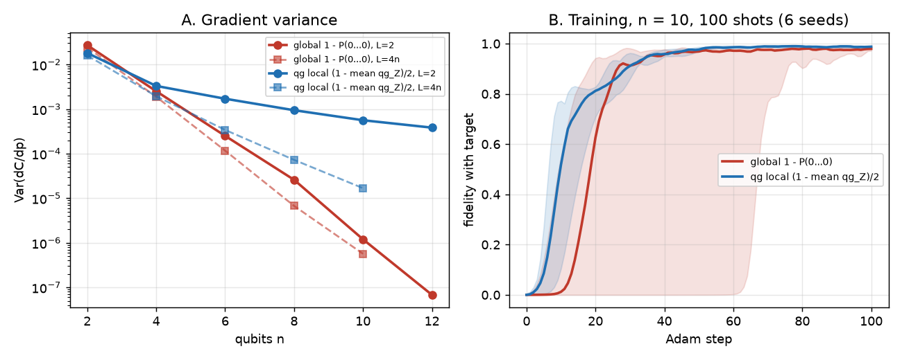
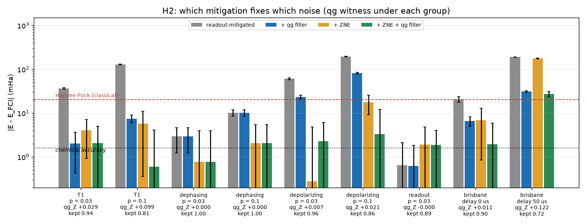
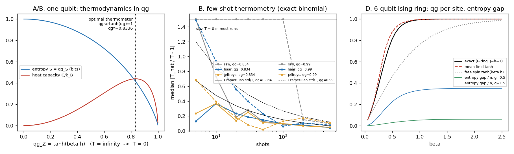
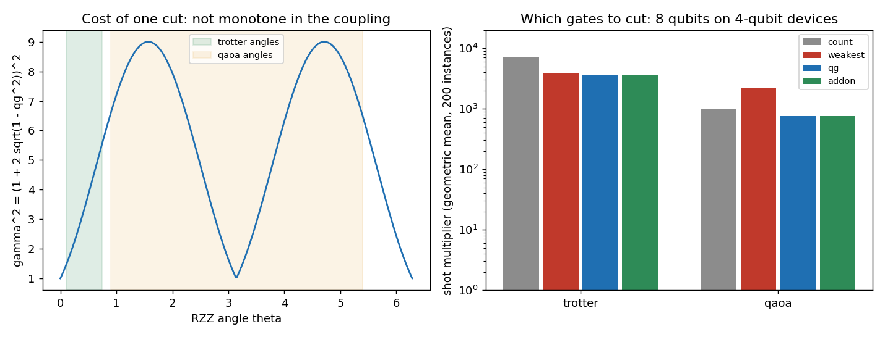
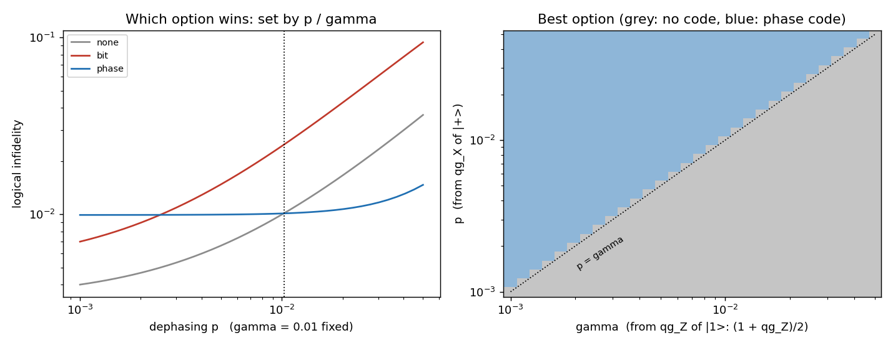
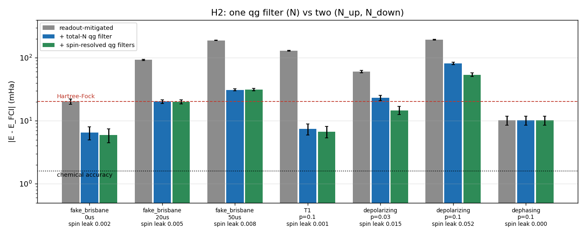
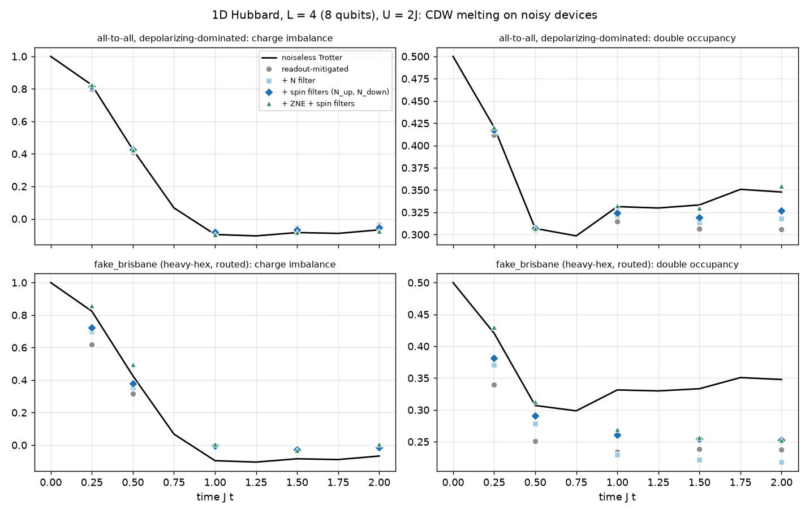
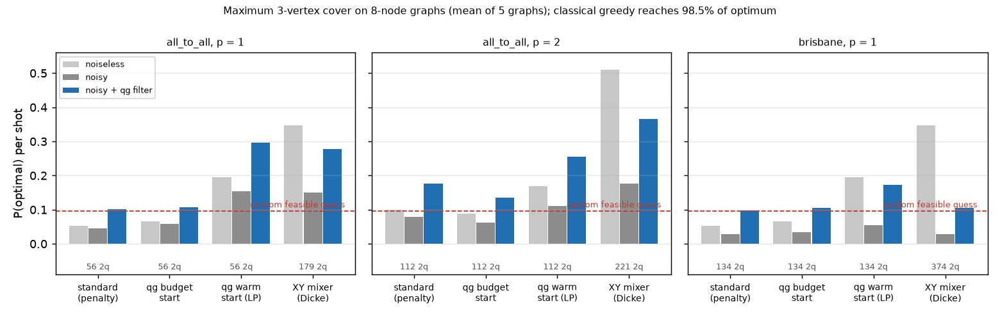
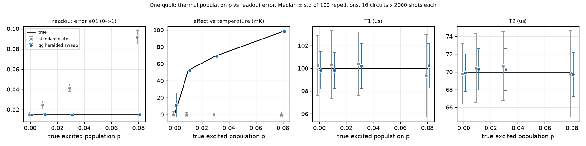
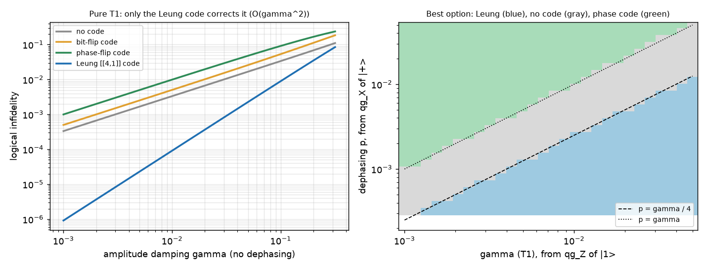

# Research notes: extending the Qang beyond the paper

These notes document the extensions built on top of the paper's Section 6
("Future Research Directions") roadmap, with derivations and concrete
results, so they can be folded into a future revision of the paper or a
companion technical report. All four directions listed in Section 6 are now
covered: gradient regularization (§1), error-propagation bounds (§5),
mixed states / POVMs (§3), multi-qubit generalization (§4), and native-SDK
integration for Qiskit, Cirq and PennyLane (§6).

Part II (§7–§13) goes beyond the original roadmap: new exact identities
(§7), the structural blind spots of Z-basis metrics (§8), a pole-damped
optimizer validated on H2 and LiH (§9), qg_S as a benchmarking signal
compared against Heavy Output Probability, linear XEB and realistic T1/T2
noise (§10), qg_Z reformulations of randomized benchmarking and
zero-noise extrapolation (§11), barren plateaus (§12), and qg_Phi / QPE /
QEC (§13). Appendix A records the functional-analysis foundation
(Riesz–Fréchet) for the paper's conceptual section. §14 lists every known
limitation in one place. §15 adds three results checked against
independent references: the natural gradient in qg coordinates, the
cost of circuit cutting in qg units, and few-shot estimation under the
Haar prior. §16 compares qg data encoding with angle encoding in
quantum machine learning. §17 and §18 compare qg against standard
practice in finite-precision control and in identifying the type of
noise. §19 takes the QML result of §16 to two qubits, two input
features and finite-shot training. §20 runs the qg metrics on IonQ's
trapped-ion noise models. §21 compares classical chemistry with a noisy
quantum energy, with and without a qg-based correction. §22 solves
differential equations with a quantum model.

Every number quoted below is produced by a script in `examples/` and is
pinned by a regression test in `tests/` (818 tests at the time of
writing); re-running the named script reproduces it.

| § | Topic | Code | Tests |
|---|---|---|---|
| 7 | qg_Z ↔ qg_S identity, `qg_correlation` | `qang.core`, `qang.multiqubit` | `test_core.py`, `test_multiqubit.py` |
| 8 | Blind spots (graph states, arccos range) | `qang.circuits`, `examples/vqe_h2_qg_vs_theta.py` | `test_circuits.py`, `test_vqe_h2.py` |
| 9 | Pole-damped gradient descent | `qang.gradients`, 5 examples | `test_gradients.py` + 5 example tests |
| 10 | qg_S vs HOP / XEB / finite shots / T1–T2, `mean_qg_z`, device-calibrated run | `examples/quantum_volume_qg_s*.py`, `examples/nisq_hardware_validation.py` | `test_quantum_volume_qg_s*.py`, `test_nisq_hardware_validation.py` |
| 11 | RB and ZNE | `examples/randomized_benchmarking_qg_z.py`, `examples/zne_qg_vs_theta_space.py` | matching tests |
| 12 | Barren plateaus | `qang.ansatze`, `examples/barren_plateaus_qg_vs_theta.py` | `test_barren_plateaus_qg_vs_theta.py` |
| 13 | qg_Phi, QPE, QEC, algorithms | `qang.phase`, `qang.qec`, `qang.algorithms` | `test_phase.py`, `test_qec*.py`, `test_algorithms.py`, `test_quantum_phase_estimation_qg_phi.py` |
| 15 | Natural gradient in qg, cutting cost, Haar-prior estimation | `qang.gradients`, `qang.knitting`, `qang.statistics`, `notebooks/qang_verificado.ipynb` | `test_gradients.py`, `test_knitting.py`, `test_statistics.py` |
| 16 | QML data encoding: qg (arccos) vs angle | `examples/qml_encoding_qg_vs_angle.py` | `test_qml_encoding_qg_vs_angle.py` |
| 17 | Finite-precision control: θ grid vs qg grid, distribution loading | `examples/control_quantization_qg_vs_theta.py` | `test_control_quantization_qg_vs_theta.py` |
| 18 | Noise-type detection: mean qg_Z vs XEB / HOP | `examples/noise_type_detection_qg_vs_xeb.py` | `test_noise_type_detection_qg_vs_xeb.py` |
| 19 | QML beyond one qubit: 2 qubits, 2D input, shot-noise training, classical control | `examples/qml_multiqubit_and_shots.py` | `test_qml_multiqubit_and_shots.py` |
| 20 | IonQ trapped-ion noise models: QV benchmark and the qg of an RZZ coupling | `examples/ionq_validation.py` | `test_ionq_validation.py` (local mode) |
| 21 | Chemistry: classical HF/FCI vs noisy quantum energy with and without the qg electron-number filter (H2 curve, LiH limit) | `examples/chemistry_qg_symmetry_witness.py`, `examples/chemistry_lih_deep_circuit.py` | `test_chemistry_qg_symmetry_witness.py`, `test_chemistry_lih_deep_circuit.py` |
| 22 | Differential equations: DQC solver with qg vs angle encoding, classical spectral control | `examples/ode_qg_vs_angle.py` | `test_ode_qg_vs_angle.py` |

## 1. Regularizing the Section 4.1 gradient singularity

The paper defines the qg-space gradient as

```
dE/d(qg) = (dE/d(theta)) * (d(theta)/d(qg)) = -(1/sin(theta)) * (dE/d(theta))
```

and states, correctly, that this diverges at theta = 0, pi. Two bounded
alternatives to the exact inverse Jacobian `-1/sin(theta)`:

* **Clipped**: `-1 / sign(sin(theta)) * max(|sin(theta)|, eps)`. Bounded by
  `1/eps` in magnitude; identical to the exact value away from the poles
  (error `-> 0` as `theta` moves away from `{0, pi}` for any fixed `eps`).
* **Tikhonov**: `-sin(theta) / (sin(theta)^2 + eps^2)`. Smooth everywhere,
  including exactly at `theta = 0, pi` (where it evaluates to 0, rather than
  saturating at `1/eps`) — it *suppresses* the update at a pole instead of
  clamping it to a large-but-finite value.

Both are implemented in `qang.gradients` alongside the exact
`inverse_jacobian_raw`, and `tests/test_gradients.py` checks that (a) the
raw version is genuinely unbounded near the poles (`>1000` at `theta =
0.001`, matching the paper's own worked example), and (b) both
regularizations stay finite there.

### Benchmark: theta-space vs raw qg-space vs regularized qg-space

`examples/benchmark_qg_vs_theta.py` optimizes the toy loss `E(theta) =
-sin(theta)` (a clean, single interior minimum at `theta* = pi/2`, chosen
specifically so the minimum is *not* at a domain boundary — see the
module's docstring) starting **at** a pole, `theta0 = 0.01` rad (`qg_Z ~
0.9999`), for 150 iterations:

| space | final theta | final E | \|grad\| at end | max \|step\| | behaviour |
|---|---|---|---|---|---|
| theta-space (lr=0.05) | 1.5698 | -1.0000 | 0.001 | 0.05 | converges cleanly to `pi/2` |
| **raw qg-space** (lr=0.05) | 3.1416 | -0.0000 | 1.000 | 3.14 | **never settles** — jumps straight past the target to the opposite pole and oscillates between `theta ~ 0` and `theta ~ pi` for the entire run |
| qg-space, clipped (lr=0.01, eps=0.05) | 1.4184 | -0.9884 | 0.152 | 0.63 | converges, more slowly (smaller lr needed for stability) |
| qg-space, Tikhonov (lr=0.01, eps=0.05) | 1.4043 | -0.9862 | 0.166 | 0.27 | converges, more slowly, smallest step sizes |

This is a sharper empirical statement than the paper's own qualitative
"should be used away from that region": started exactly at a pole with the
*same* learning rate as theta-space, raw qg-space parameterization does not
merely have "a coordinate singularity of its own" — in this run it never
recovers, oscillating indefinitely between the two poles because each
oversized step overshoots into the mirror-image high-gradient region on the
other side. Both regularizations recover, at the cost of needing a smaller
learning rate roughly proportional to `eps` (empirically, keeping
`lr <= eps` avoided the single-step-across-the-domain failure mode seen in
the raw case — a good starting rule of thumb, though not a proof of a tight
bound).

**Practical takeaway**: if a qg-space parameterization is used for VQE/QAOA
optimization near `|qg_Z| -> 1` (i.e. near a computational basis state),
either regularized inverse Jacobian removes the divergence; the clipped
version is simpler to reason about (a hard cap at `1/eps`), the Tikhonov
version degrades more gracefully (it goes to *zero* push right at the pole
rather than a large one), which is usually the safer default when the
optimizer might land exactly on a pole rather than just near one.

## 2. Formalizing qg_S's invertibility domain

Section 2.2 states `qg_S(theta) = qg_S(pi - theta)` and that inversion
requires restricting to a half-domain, without giving the restriction
explicitly. Proof sketch: `p0(theta) = cos^2(theta/2)` is strictly
monotonically *decreasing* on the full domain `theta in [0, pi]`, from 1 to
0. The binary entropy `H(p)` is strictly increasing on `p in [0, 0.5]` and
strictly decreasing on `p in [0.5, 1]`. Composing:

* On `theta in [0, pi/2]`, `p0` decreases monotonically from 1 to 0.5, so
  `H(p0(theta))` is the decreasing-`H`-on-increasing-domain composed with a
  decreasing `p0`, i.e. **strictly increasing** in `theta`, from 0 to 1 —
  invertible.
* On `theta in [pi/2, pi]`, `p0` continues decreasing from 0.5 to 0, so
  `H(p0(theta))` is now the increasing-`H` branch composed with decreasing
  `p0`, i.e. **strictly decreasing** in `theta`, from 1 to 0 — invertible.

`Qang.theta_from_entropic(qg_s, branch="lower" | "upper")` implements the
inverse on each half exactly this way (bisection on the monotonic branch of
`H`, then closed-form `theta = 2*arccos(sqrt(p0))`), and
`tests/test_core.py` round-trips both branches to `1e-4` rad.

## 3. Mixed states and POVMs (`qang.mixed`)

`qg_Z = <sigma_z>` generalizes to any state, pure or mixed, as
`Tr(rho @ sigma_z)` — `qg_z_density` reduces exactly to `qg_Z(theta)` for
`rho = |psi><psi|` (tested for every Table-1 anchor angle). The paper's own
Section 2.3 note that "for any pure state, `S(rho) = -Tr(rho log rho)` is
identically zero" is exactly the fact that makes `von_neumann_entropy`
*not* redundant with `qg_S`: two states can share the same `qg_Z` (e.g. the
pure equatorial state `|+>` and the classical 50/50 mixture of `|0>` and
`|1>` both have `qg_Z = 0`) while having very different entropy (`qg_S(|+>)
= 1` by the paper's own Table 2, vs. `von_neumann_entropy` of the classical
mixture, which is *also* 1 in this particular case — but for a mixture with
unequal weights, e.g. `mix(rho0, rho1, p=0.2)`, `qg_Z = -0.6` while
`von_neumann_entropy ~= 0.72`, a combination the pure-state theory in the
paper cannot represent at all, since it has no `theta` that produces it).

`qg_s_povm` generalizes the *measurement* side: given any POVM `{E_i}`
(not just the two-outcome Z-basis projection), it returns the Shannon
entropy of the resulting outcome distribution, normalized to `[0, 1]` by
`log2(n_outcomes)` so it stays comparable to the original `qg_S` scale
regardless of how many outcomes the POVM has. `qg_s_povm(rho,
standard_z_povm())` reduces exactly to `qg_S(theta)` (tested for every
Table-2 anchor angle); `trine_povm()` is included as a worked 3-outcome
example.

## 4. Multi-qubit tensor-product profiles (`qang.multiqubit`)

Two complementary generalizations, both reducing exactly to the
single-qubit definitions at `n_qubits = 1` (tested):

* **Per-qubit local qang** (`per_qubit_qg_z`, `marginal_qg_s`): partial-trace
  each qubit out of the full register and report its own `qg_Z` / `qg_S` —
  a "projection profile" across the register.
* **Joint qang** (`joint_qg_s`): the Shannon entropy of the full `2^n`
  computational-basis outcome distribution from measuring every qubit,
  normalized by `n_qubits` to stay in `[0, 1]`.

The Bell state is the concrete demonstration
(`tests/test_multiqubit.py::test_bell_state_is_globally_pure_but_locally_maximally_mixed`):
`per_qubit_qg_z` reports `0.0` for *both* qubits (each looks maximally
mixed on its own), `marginal_von_neumann_entropy` reports `1.0` bit for
*both* qubits individually, and yet `joint_qg_s(..., normalize=False)`
reports exactly `1.0` bit total for the *whole* 2-qubit state, which is
also exactly pure (`von_neumann_entropy` of the full `4x4` density matrix is
`0`). That combination — every part maximally mixed, the whole exactly pure
— is impossible for any unentangled (product) state, which is exactly why
it is the standard textbook entanglement witness; `marginal_von_neumann_entropy`
is the piece of this package that can detect it, while `per_qubit_qg_z`
alone cannot.

## 5. Error propagation between probability-space and theta/qg-space (`qang.statistics`)

This is the other half of Future Research Direction #2 (the half not
covered by §2 above, which handled the *domain of invertibility*; this
handles what happens to that inversion under *finite-shot measurement
noise*).

**Setup.** You never observe `P(|0>)` directly on real or simulated
hardware — you estimate it from `N` measurement shots as
`p0_hat = counts0 / N`, a `Binomial(N, p0) / N` estimator with
`Var(p0_hat) = p0*(1-p0) / N`. Since `qg_Z_hat = 2*p0_hat - 1`, that shot
noise propagates directly into `qg_Z_hat`, and then — through the *same*
singular Jacobian studied in §1 for optimization steps — into
`theta_hat = arccos(qg_Z_hat)`.

**Result (delta method, first order).**

```
Var(qg_Z_hat)  = 4*p0*(1-p0)/N = sin^2(theta)/N        (exact identity)

Var(theta_hat) ~= Var(qg_Z_hat) * (d(theta)/d(qg))^2
               = [sin^2(theta)/N] * [1/sin^2(theta)]
               = 1/N
```

The `sin^2(theta)` factors cancel **exactly**: to first order, the
propagated angular uncertainty is *constant* (`std ~= 1/sqrt(N)` rad)
across the whole Bloch sphere, independent of `theta`. The shrinking
shot-noise variance near a pole (fewer "wrong-outcome" events to measure)
exactly offsets the growing sensitivity of `arccos` there (the §1 / Section
4.1 singularity).

This is a genuinely different statement from the *optimization*-step story
in §1: there, the (non-vanishing) energy gradient `dE/d(theta)` does *not*
shrink near the poles the way `sqrt(Var(qg_Z_hat))` does here — so a
qg-space *gradient step* still blows up near a pole even though qg-space
*measurement* uncertainty does not. Regularizing the gradient (§1) and
propagating measurement error (this section) are two separate problems
with the same singular Jacobian at their core, and only the first needs a
fix; the second self-regularizes.

**Caveat.** The cancellation is only a first-order (delta-method /
Gaussian) result: it requires `N` large enough that the binomial count of
the minority outcome is itself well approximated by a Gaussian (rule of
thumb: `N * min(p0, p1) >> 1`). Very close to a pole, for fixed `N`, that
condition fails — the minority outcome becomes a rare event, `theta_hat`
is usually exactly the pole itself (zero error) with an occasional large
jump when the rare outcome does appear. `qang.statistics.empirical_theta_std`
makes this breakdown directly visible: it bootstraps `theta_hat` across many
simulated trials on Qiskit's `AerSimulator` and reports how many of them
landed exactly on a domain boundary (`n_at_pole_boundary`), rather than
just assuming the asymptotic formula holds everywhere. Away from the poles
(e.g. `theta = pi/2`), the empirical std matches the analytical `1/sqrt(N)`
prediction to within simulator/bootstrap noise; `tests/test_statistics.py`
checks both regimes.

`confidence_interval_theta(theta_hat, n_shots, confidence)` packages the
result into a practical normal-approximation CI (`theta_hat +/- z/sqrt(N)`,
clipped to `[0, pi]`) — e.g. "10,000 shots pins down theta to about
`+/- 0.02` rad (95% CI), for any state that isn't extremely close to a
computational basis state."

## 6. qg as a native gate for Qiskit, Cirq and PennyLane (`qang.qiskit_gate`, `qang.cirq_gate`, `qang.pennylane_gate`)

Future Research Direction #1 asked for qg as a native unit/type across
multiple SDKs. `qang.qiskit_gate` (`RQangGate`, `FullRQangGate`) was
already there; `qang.cirq_gate` completes the Cirq side with the same two
constructors:

* `rqang_gate(qang)` — qg_Z-only preparation, built directly on Cirq's own
  native `cirq.ry(theta)` (no custom `Gate` subclass needed — this is the
  idiomatic Cirq primitive for exactly this job).
* `full_rqang_gate(qang)` — full `(qg_Z, phi)` Bloch-sphere preparation,
  built as an explicit `U(theta, phi, lambda=0)` unitary wrapped in
  `cirq.MatrixGate`, using the *same* convention as Qiskit's `UGate`, so a
  `Qang` produces bit-for-bit the same prepared state whichever SDK backend
  is used. `tests/test_cirq_gate.py` checks this both via measured Z-basis
  probabilities and via direct statevector fidelity against
  `Qang.to_statevector()`.

`qang.pennylane_gate` adds the PennyLane side with the same pair,
`rqang` (`qml.RY(arccos qg_Z)`) and `full_rqang` (`qml.U3(theta, phi, 0)`,
whose matrix equals Qiskit's `UGate(theta, phi, 0)`). What PennyLane adds
is autodiff: both accept a raw, trainable qg_Z, and the arccos is taken
with `qml.math`, so a circuit can be optimized directly in qg coordinates.
`tests/test_pennylane_gate.py` pins that `d<Z>/d(qg_Z) = 1` exactly in the
interior (the two singular factors `-sin θ` and `-1/sin θ` cancel), the
analytic `d<X>/d(qg_Z) = -qg_Z cos φ / sqrt(1 - qg_Z²)`, and a gradient
descent run in qg_Z. At `|qg_Z| = 1` autodiff returns nan: the §4.1
singularity survives the cancellation numerically, so trainable qg_Z
values must stay strictly inside (-1, 1).

# Part II — Results beyond the original roadmap

Citation keys such as `[@cross2019]` refer to entries in `paper.bib`.

## 7. Exact identities: qg_Z ↔ qg_S, and `qg_correlation`

### 7.1 The branch-free qg_Z ↔ qg_S identity (`qang.core.qg_s_from_qg_z`)

Both metrics are functions of one quantity, the Z-basis population
`p0 = P(0) = cos^2(theta/2)`: `qg_Z = 2*p0 - 1` and `qg_S = H(p0)`.
Eliminating `p0` gives

```
qg_S = H((1 + qg_Z) / 2)            valid on all of qg_Z in [-1, 1]
```

§2 needed two branches to invert `qg_S -> theta`. This direction needs
none: it is a single-valued function of `qg_Z`. The derivation uses only
`qg_Z = Tr(rho sigma_z)` and `qg_S = H(<0|rho|0>)`, never a specific gate.
So it holds for **every single-qubit state, pure or mixed, however it was
prepared** (Ry, Rx, U, a noisy channel, or a partial trace of a larger
register). Its derivative,

```
d(qg_S)/d(qg_Z) = (1/2) * log2((1 - qg_Z) / (1 + qg_Z))
```

(checked numerically by finite differences), diverges at `qg_Z = ±1`. That
is the entropy-side counterpart of the §1 Jacobian singularity: near a
pole, a tiny change in bias produces an unboundedly large relative change
in entropy.

Consequence for multi-qubit registers: applied to each reduced
single-qubit density matrix, the identity makes `per_qubit_qg_z` and
`marginal_qg_s` two encodings of the **same** per-qubit information.
`tests/test_multiqubit.py` checks this on random Haar states, not only on
Bell/GHZ/product states.

### 7.2 `qg_correlation`: the Z-basis total correlation

Since the per-qubit profile carries no information beyond `qg_Z`, anything
new must come from the joint distribution. Define

```
qg_correlation(state) = sum_i H(X_i) - H(X_1, ..., X_n)
                      = sum_i marginal_qg_s[i] - joint_qg_s(normalize=False)
```

where `X_i` is qubit i's Z-basis outcome. This is Watanabe's *total
correlation* [@watanabe1960] of the measurement outcomes. For n = 2 it is
exactly the classical mutual information `I(X_1; X_2)`. Properties
(proved by subadditivity of Shannon entropy; checked in the test suite):

* `0 <= qg_correlation <= n - 1` bits, and it is 0 **iff** the Z-basis
  outcomes are independent.
* Product states: exactly 0.
* Bell: 1 bit. GHZ_n: exactly `n - 1` bits (attains the upper bound;
  verified for n = 3, 4, 5).
* Never negative on random Haar states (tested).

**Scope, stated plainly.** `qg_correlation` measures *classical*
correlation in the Z basis. It is not an entanglement measure in either
direction:

* It is **positive without entanglement**: the classical mixture
  `(|00><00| + |11><11|)/2` has `qg_correlation = 1` bit, the same as a
  Bell state.
* It is **zero despite entanglement**: every graph state (e.g. the 4-qubit
  linear cluster state) has `qg_correlation = 0`, because its outcome
  distribution is exactly uniform (see §8.1).

Combining it with `marginal_von_neumann_entropy` (§4) separates the cases
that matter: the Bell state has both quantities positive, the classical
mixture has correlation 1 but global von Neumann entropy 1, and the graph
state needs a measurement outside the Z basis.

## 8. Structural blind spots of Z-basis metrics

These are exact results, not numerical accidents. They belong in the paper
next to the Section 4.1 singularity, as limits of what the unit can detect.

### 8.1 Graph states are invisible (`qang.circuits`)

A graph state is `H^{⊗n}` followed by CZ gates on the graph's edges. `H^{⊗n}`
makes every `|amplitude|^2` equal to `2^-n`. CZ is diagonal, so it only
changes phases. Therefore, **for every graph**:
`qg_Z = 0` on every qubit, `joint_qg_s = 1` (maximal), and
`qg_correlation = 0`. All of the entanglement (certified independently in
`tests/test_circuits.py` through the stabilizers `X_i prod_{j∈N(i)} Z_j = +1`)
lives in phases that no Z-diagonal statistic can see. Readout-only
dephasing (§10.4, Finding A) is the same blind spot, showing up for a
class of noise instead of a class of states.

### 8.2 The arccos range trap (`examples/vqe_h2_qg_vs_theta.py`)

Every qg-space update goes through `theta = arccos(qg)`, which only
returns values in `[0, pi]`. On the H2 Hamiltonian (0.735 Å, STO-3G, 2-qubit
parity mapping, independently derived with PySCF [@sun2018pyscf]), the
optimum lies at `theta ≈ -0.22`, in the half that arccos cannot reach.
Starting from Hartree-Fock (lr = 0.3):

| space | final E (Ha) | error vs FCI | steps to chem. accuracy |
|---|---|---|---|
| theta | -1.1373060348 | 9.1e-10 | 5 |
| qg raw / clipped / Tikhonov | -1.1169989956 (= HF) | 2.0e-2 | never |
| theta_pole_damped | -1.1373060348 | 9.1e-10 | 61 |

All three qg-space variants stop exactly at the Hartree-Fock energy and
recover **zero** correlation energy. This is a hard limit of the range,
separate from the Jacobian singularity, and regularization cannot fix it.
It motivates keeping updates in theta-space (§9).

## 9. Pole-damped gradient descent (`theta_pole_damped`)

### 9.1 Definition and honest framing

```
pole_damping_factor(theta, eps) = max(|sin(theta)|, eps)      in (0, 1]
theta_new = theta - lr * pole_damping_factor(theta, eps) * dE/d(theta)
```

The update stays in theta-space, so the §8.2 trap cannot occur, and the
step shrinks near the poles. This is a position-dependent trust-region
damping in the tradition of Levenberg–Marquardt
[@levenberg1944; @marquardt1963]. **It is not a new optimizer class.**
The framework-specific part is that the damping schedule is not tuned:
it is `|d qg_Z / d theta|`, the same pole geometry as §1. Robustness is
insensitive to `eps` (tested). For vectors of parameters the factor is
applied per coordinate and depends only on that coordinate's own value
(`qang.gradients.multi_param_gradient_descent`). A parameter already
at its optimum is therefore left untouched by damping on the others
(`examples/multi_parameter_pole_damped_vqe.py`).

### 9.2 Statistical robustness (300 random one-qubit landscapes per lr)

`E = h_z cos(theta) + h_x sin(theta)`, started near a pole
(`examples/pole_damped_gradient_descent_robustness.py`):

| lr | plain success | damped success | damped trapped |
|---|---|---|---|
| 0.3 | 0.997 | 0.963 | 0.017 |
| 1.0 | 0.773 | 1.000 | 0.000 |
| 2.0 | 0.187 | 0.477 | 0.030 |
| 3.0 | 0.087 | 0.357 | 0.023 |
| 5.0 | 0.057 | 0.253 | 0.040 |
| 10.0 | 0.027 | 0.130 | 0.067 |

At a safe lr, damping costs a few percent. At lr = 1 it succeeds 100%
of the time vs 77%. From lr = 2 on, it wins by 2.5–5×. The trapped rate (the optimizer oscillating at its starting pole)
grows with lr, up to 6.7% at lr = 10. That is higher than the "2–5%"
figure in `qang.gradients`' docstring, which covers only lr ≤ 5.

### 9.3 H2 with two coupled parameters (`examples/h2_vqe_multi_parameter_ansatz.py`)

Ansatz `Ry(θ0)⊗Ry(θ1)` then `CX(1→0)`. The optimum is at `θ0 = π` exactly
(a pole) and `θ1 ≈ -0.2235`. Start: `(1.0, 1e-6)`.

* **Finding A (cost).** At safe lr, damping needs ~3× more steps to reach
  chemical accuracy (1.6 mHa): 603 vs 196 at lr = 0.05, 29 vs 9 at lr = 1.0.
  The reason is that `θ0`'s own target is a pole, and the step keeps
  shrinking as it gets there.
* **Finding B (benefit).** At lr = 2.5, 3.0 and 4.0, plain gradient descent
  never reaches chemical accuracy (final errors 0.048, 0.43 and 0.93 Ha).
  The damped optimizer reaches the FCI energy (error 9e-10) in 10, 8 and 6
  steps. At lr = 5.0, plain gradient descent touches chemical accuracy
  once (step 90) and then leaves it, ending 0.45 Ha away. Damped
  converges in 5 steps.

(A start near `θ0 = 0` was rejected on purpose: the landscape has a
spurious stationary point at `(0, -π/2)` where both partial derivatives
vanish. That is a bad local minimum, not a pole effect, and damping is
not designed to fix it.)

### 9.4 LiH with a mixed Ry/Rx ansatz (`examples/lih_vqe_ry_rx_ansatz.py`)

**Hamiltonian.** LiH at 1.5459 Å, STO-3G, active space (2 electrons, 3
spatial orbitals), ParityMapper, giving 4 qubits and 52 Pauli terms. This
is the scale of early hardware VQE work [@omalley2016; @kandala2017]. The
coefficients were derived once with PySCF + qiskit-nature and hard-coded,
so neither library is a runtime or test dependency.

**Ansatz.** `Ry(θ0), Ry(θ1)` on the two occupied spin-orbitals, `Ry(θ2),
Rx(θ3)` on the two virtual ones, then `CX(2→0), CX(3→1)`. At `(π, π, 0, 0)`
the statevector overlap with qiskit-nature's official `HartreeFock`
circuit is 1.0 to machine precision, and the energy equals
`HF = -0.0437813056 Ha` (electronic energy of the active space).

| energy (active space) | Ha |
|---|---|
| Hartree-Fock | -0.0437813056 |
| best attainable with this ansatz | -0.0440152421 |
| exact (FCI) | -0.0448309020 |

The HF–FCI gap (1.05 mHa) is the genuine correlation energy, not a bug.
It happens to be smaller than chemical accuracy, so convergence is
measured against the ansatz's own optimum instead.

**Generalization beyond Ry, settled mathematically.** From `|0>`,
`Rx(θ)|0> = cos(θ/2)|0> - i sin(θ/2)|1>` has exactly the same populations
as `Ry(θ)|0>`. They differ only by a relative phase. So `qg_Z(θ) = cos θ`
and `pole_damping_factor(θ)` are the same function for both axes. The
factor was never axis-specific, only population-specific, and needs no
generalization. The phase is still physically real: after `CX(3→1)` it
changes the joint state and the energy. The test suite checks both halves
(equal single-qubit populations, different register energies).

* **Finding A (cost, larger than for H2).** All four optimal parameters
  sit at or within ~0.04 rad of a pole (`θ1* = π` and `θ3* = 0` exactly).
  At lr = 0.3 damping needs 355 steps vs 17; at lr = 1.0, 106 vs 5 (~20×).
* **Finding B (benefit).** For lr from 2 to 10, plain gradient descent never
  converges (final errors 0.14–0.40 Ha). Damped always does, to
  errors ≤ 1.1e-7, and in **fewer** steps as lr grows: 53, 42, 26, 15 and 10
  at lr = 2, 2.5, 4, 7 and 10.

**Take-away across §9.** Damping trades iterations at a well-tuned lr for
robustness to a badly tuned one. The cost grows with the number of
parameters whose optimum sits on a pole, which is typical of
Hartree-Fock-referenced chemistry ansätze.

## 10. qg_S as a benchmarking signal

### 10.1 Versus Heavy Output Probability (`examples/quantum_volume_qg_s.py`)

Across 10 random 4-qubit Quantum Volume circuits [@cross2019] × 11 levels
of global depolarizing noise (110 points), Pearson r(HOP, qg_S) = **-0.926**.
qg_S needs no heavy set and no ideal simulation. Caveat: the noise model
is depolarizing on the output distribution, whose fixed point is uniform.
§10.4 shows what happens when it is not.

### 10.2 Finite shots: plug-in bias and Miller–Madow (`quantum_volume_qg_s_finite_shots.py`)

The plug-in entropy estimator is biased low. The Miller–Madow correction
[@miller1955], implemented as `joint_qg_s_from_counts`, removes most of that
bias:

| shots (4 qubits) | plug-in bias | Miller–Madow bias |
|---|---|---|
| 50 | -0.0535 | -0.0097 |
| 100 | -0.0292 | -0.0055 |
| 500 | -0.0055 | -0.0003 |
| 1,000 | -0.0027 | ~0 |

At a fixed 1,000 shots, the plug-in bias grows about 6× from 3 to 6 qubits
(-0.0012 → -0.0075). Miller–Madow stays at or below 5e-4 in magnitude.

### 10.3 Versus linear XEB (`quantum_volume_qg_s_vs_xeb.py`)

* **Finding A.** Linear XEB [@arute2019] has noiseless value `A - 1`, where
  `A = 2^n Σ p_ideal^2`. This equals 1 only for Porter–Thomas statistics. On
  QV circuits `A` = 1.23, 1.37, 2.33 and 2.02 for n = 3–6. So raw XEB needs
  a circuit-specific calibration. qg_S does not.
* **Finding B.** Linear XEB is **unbiased** at any shot count (tested down
  to 10 shots, always within 5 SE). It is a sample mean of a bounded
  per-shot quantity. qg_S is a strictly concave functional, so its plug-in
  estimator is biased by Jensen's inequality. Appendix A gives the
  structural reason: XEB is linear in the outcome distribution, and
  entropy is not.

Neither metric dominates. qg_S is calibration-free; XEB is unbiased.

### 10.4 Realistic gate-level noise: T1 and T2 (`quantum_volume_qg_s_realistic_noise.py`)

Qiskit Aer density-matrix simulation, 4-qubit depth-4 QV circuit (seed 0),
ideal `qg_S = 0.9193`.

* **Finding A — readout-only dephasing is exactly invisible.** `qg_S` =
  0.919303 for λ = 0, 0.3, 0.7 and 1.0. Dephasing preserves the diagonal,
  and qg_S depends only on the diagonal.
* **Finding B — mid-circuit dephasing is visible.** After every 2-qubit
  block, qg_S rises monotonically: 0.9193 → 0.9615 → 0.9952 → 0.9991 →
  0.9999 (λ = 0 → 1). Later entangling gates turn lost coherence into
  randomized populations.
* **Finding C — amplitude damping makes qg_S non-monotonic.** Mid-circuit
  T1 with γ = 0, 0.05, 0.1, 0.2, 0.4, 0.7, 1.0 gives qg_S = 0.919, 0.972,
  **0.983**, 0.974, 0.918, 0.713, **0.000**. The fixed point of amplitude
  damping is `|0…0>`, which has zero entropy, not the maximally mixed
  state.

**Consequence for the benchmark.** "More noise → higher qg_S" is a
property of noise channels whose fixed point is maximally mixed. It is
not a property of qg_S. At γ = 0.4 the register gives almost the ideal
value (0.918 vs 0.919) while being badly damaged. qg_S alone therefore
cannot certify a T1-dominated device.

* **Finding D — the fix: pair qg_S with the register's mean qg_Z.**
  `qang.multiqubit.mean_qg_z`, the average of every qubit's own qg_Z,
  measures the relaxation bias. Unital noise pulls it towards 0, and T1
  pulls it towards +1, the value at the fixed point of amplitude damping.
  At γ = 0 and γ = 0.4 the pair is (0.9193, -0.029) vs (0.9176, +0.310),
  so qg_S alone confuses the two operating points and the pair does not.
  Under mid-circuit dephasing, mean qg_Z stays within 0.03 of 0.
  Along a 21-point γ grid it rises monotonically in **23 of 24** QV
  circuits (n = 3, 4, 5; seeds 0–7). The exception (n = 3, seed 1) dips by
  about 0.015 before rising, and that counterexample is pinned in the
  tests. Monotonicity is therefore a strong empirical regularity, not a
  theorem.

  The population of `|0…0>` was also considered. It was monotone less
  often (22 of 24). Purity was rejected because it is non-monotone under
  T1 as well and cannot be estimated from Z-basis counts. mean qg_Z has two
  further advantages: it needs only counts (`mean_qg_z_from_counts`), and
  because it is linear in ρ its estimator is exactly unbiased at any shot
  count (Appendix A).

### 10.5 Device-calibrated validation (`examples/nisq_hardware_validation.py`)

The same QV circuit is run on the `fake_brisbane` backend from
`qiskit-ibm-runtime`, simulated locally with `AerSimulator.from_backend`.
That backend uses a real IBM Eagle device's published calibration data:
per-qubit T1/T2, gate and readout errors, and the device's native gates
and coupling map. An idle delay before readout serves as a controlled T1
knob. The qubits are chosen by `choose_layout`: a connected line with
valid calibration data (T2 ≤ 2·T1) whose worst T1 is maximal (on
fake_brisbane: physical qubits 112–126–125–124). 4,000 shots, seed 42:

| delay | qg_S | mean qg_Z | HOP | linear XEB |
|---|---|---|---|---|
| ideal | 0.9193 | -0.0289 | 0.7722 | +0.3662 |
| 0 µs | 0.9732 | -0.0234 | 0.6680 | +0.2266 |
| 25 µs | 0.9761 | +0.0321 | 0.6478 | +0.2096 |
| 50 µs | 0.9793 | +0.0805 | 0.6082 | +0.1605 |
| 100 µs | 0.9608 | +0.2013 | 0.5437 | +0.0769 |
| 200 µs | **0.8863** | +0.3814 | 0.4358 | -0.0436 |

HOP and XEB fall at every step, and mean qg_Z rises at every step. qg_S
rises and then falls. At 200 µs it is **below the noiseless value**, so
qg_S alone would rank the most broken operating point as the least noisy.
Findings C and D thus survive the move from one idealized channel to
full device-level noise (all channels at once, per-qubit rates, a
transpiled circuit). Seeds 1 and 7 give the same pattern (qg_S at
200 µs: 0.8883 and 0.8847).

The same script evaluates the LiH ansatz (§9.4) from Z/X/Y-basis counts
(qubit-wise commuting groups of the 52 Pauli terms), with no error
mitigation. At 8,000 shots per group, seed 42, the raw error is 47.5 mHa
at the HF point and 44.0 mHa at the ansatz optimum (seeds 1 and 7:
42–45 mHa). That is about 25–30× chemical accuracy and about 200× the
0.23 mHa the optimizer is trying to resolve. Without mitigation, a device
at this noise level cannot see the correlation energy that the noiseless
pole-damped optimizer recovers.

With `--mode ibm` the same script runs on a real device through
`QiskitRuntimeService` and `SamplerV2`. That run needs an IBM Quantum account and has not
been done yet.

## 11. Randomized benchmarking and ZNE in qg units

### 11.1 RB (`examples/randomized_benchmarking_qg_z.py`)

With per-gate depolarizing noise, the survival signal after m random
single-qubit Cliffords plus the recovery gate is exactly

```
qg_Z(m) = (1 - p)^(m + 1)
```

independent of which Cliffords were drawn: across 4 seeds, identical to 10
digits at m = 0, 5 and 10. Depolarizing noise shrinks the Bloch vector
isotropically, and Cliffords are rotations. Fitting `log qg_Z` against
`m + 1` recovers `f = 1 - p = 0.95` and `F_avg = (1 + f)/2 = 0.975` to
machine precision [@magesan2011]. The general RB result is statistical
(it comes from averaging); in this idealized case it holds exactly.

### 11.2 ZNE: which space to extrapolate in (`examples/zne_qg_vs_theta_space.py`)

Ground truth `θ0 = π/3`, `qg_Z = 0.5`:

| noise model | ZNE in qg_Z-space | ZNE in theta-space |
|---|---|---|
| Bloch shrinkage (depolarizing-like) | exact (4e-16) | biased (1.4e-3) |
| coherent angle drift (miscalibration) | biased (1.8e-3) | exact (4e-16) |

Guideline: extrapolate in whichever space makes the noise linear
[@temme2017]. The `θ ↔ qg_Z` round trip makes checking both cheap.

## 12. Barren plateaus in qg-space (`examples/barren_plateaus_qg_vs_theta.py`)

Hardware-efficient ansatz with a global `Z^{⊗n}` cost
[@mcclean2018; @cerezo2021]. In theta-space, Var(∂E/∂θ) falls from 7.2e-2
(n = 4) to 2.0e-3 (n = 10), a log-linear slope of -0.59 per qubit. After
the clipped qg conversion, the exponential decay survives: 3.7 → 0.054.
Regularization only rescales the variance by an O(1) factor. At a pole
(θ[0] = 1e-4, n = 6) the single-sample gradient is -0.072 in theta and
+721 in raw qg, versus 1.44 clipped and 0.0029 Tikhonov. **The Section 4.1
singularity and the barren plateau are independent and compound.** A
qg-space landscape can be exponentially flat almost everywhere and
divergent at isolated points.

## 13. qg_Phi, QPE, QEC and textbook algorithms

* **qg_Phi** (`qang.phase`): `qg_Phi(φ) = e^{i2πφ}`, φ ∈ [0, 1), is invertible
  on its **whole** domain, unlike qg_Z and qg_S. QPE on the T, S and Z phase
  gates (`examples/quantum_phase_estimation_qg_phi.py`) recovers φ =
  1/8, 1/4, 1/2 with probability 1 once the counting register is wide
  enough. QPE computes on a circuit what `QangPhi.from_complex` computes in
  closed form.
* **QEC** (`qang.qec`): in the 3-qubit bit-flip code, the syndrome ancillas
  always end at an exact qg_Z pole (±1). Syndrome extraction is therefore
  a qg_Z readout, and the full encode–error–correct–decode cycle has
  fidelity 1.0 for any logical amplitude.
* **Algorithms** (`qang.algorithms`): teleportation (in deferred-measurement
  form, verified by exact fidelity), superdense coding (note: with this
  gate ordering, qubit 0 decodes the Z bit and qubit 1 the X bit), and
  Grover at the optimal iteration count.

## 14. Consolidated list of known limitations

Stated together so the paper can cite them in one place:

1. **Jacobian singularity** at θ ∈ {0, π} (§1). Regularizing it costs
   exactness near the poles.
2. **arccos range trap** (§8.2). qg-space updates cannot reach θ < 0. On H2
   they lose 100% of the correlation energy.
3. **Z-basis blindness** (§8.1, §10.4 A). Graph-state entanglement and
   readout dephasing are exactly invisible to qg_Z, qg_S and
   `qg_correlation`.
4. **`qg_correlation` is not an entanglement measure** (§7.2). It is
   positive for classical mixtures and zero for graph states.
5. **qg_S is not monotonic under T1** (§10.4 C, §10.5). It cannot
   certify a device dominated by amplitude damping on its own. Pair it
   with `mean_qg_z` (§10.4 D). That pair is monotone in 23/24 circuits
   tested, not in all of them.
6. **Finite-shot bias** of qg_S (§10.2). Use Miller–Madow. XEB does not
   have this problem.
7. **Pole damping** costs 3–20× more iterations at a safe lr when optimal
   parameters sit on poles, and has a trapping rate of up to 6.7% at
   lr = 10 (§9).
8. **§5's `1/N` result is first-order only**. It breaks down when
   `N·min(p0, p1)` is O(1).
9. **No speed or energy advantage.** Closed-form qg expressions are only
   faster than trigonometric ones when the data are already stored as
   qg (1.3× on 10⁶ fidelities; 5.6× *slower* when stored as θ), and
   either way the difference is negligible next to one circuit
   simulation (~0.5 s for 20 qubits). qg does not change how many shots
   a given precision needs (§15.3).

## 15. Three results checked against independent references

All three are also worked through, with generated outputs, in
`notebooks/qang_verificado.ipynb`.

### 15.1 The natural gradient in qg coordinates is plain descent in θ

For `|ψ(θ)⟩ = Ry(θ)|0⟩` the quantum Fisher information is `F_θ = 1`. In
the coordinate `q = qg_Z = cos θ` it becomes

```
F_q = F_θ (dθ/dq)² = 1 / (1 - q²)        (qang.gradients.qfi_qg)
```

so the §1 Jacobian singularity is the Fubini–Study metric written in qg
coordinates. The natural-gradient step (Stokes et al. 2020) is

```
Δq = -η F_q⁻¹ dE/dq = η sin θ dE/dθ   ⇒   Δθ = -η dE/dθ + O(η²)
```

i.e. **the natural gradient in qg is plain gradient descent in θ**
(`natural_gradient_step_qg`; the two trajectories agree to O(η²) and
reach the same minimum, `test_gradients.py`). This is the expected
reparametrization invariance of natural gradients, and it clarifies §1
and §9:

* raw qg-space descent applies the reciprocal of the right metric,
  hence its divergence near the poles;
* the pole-damped θ step is the natural step multiplied by
  `|sin θ| = √(1 - q²)`, which for these real states is also the
  l1-norm of coherence `2|ρ₀₁|`. Pole damping slows the optimizer in
  proportion to the coherence the qubit has left. It is a
  position-dependent step size, closer to a trust region than to a
  Levenberg–Marquardt `λI` shift.

Claims that "QNG in qg converges where θ-descent does not" come from
clipping θ to `[0, π]`, which hides minima at θ < 0 (the §8.2 trap):
without the clip plain θ-descent converges exactly.

### 15.2 The cost of circuit cutting in qg units (`qang.knitting`)

Cutting a two-qubit gate multiplies the shots needed for a fixed
precision by γ² (Mitarai & Fujii 2021). With `qg = cos θ` of the gate
angle:

| Gate family | γ | in qg |
|---|---|---|
| Pauli rotations RXX, RYY, RZZ, RZX | 1 + 2 \|sin θ\| | 1 + 2√(1 − qg²) |
| Controlled rotations CRX/CRY/CRZ, CPhase | 1 + 2 \|sin(θ/2)\| | 1 + 2√((1 − qg)/2) = 1 + 2√P(1) |

Both rows are pinned against `qiskit-addon-cutting`'s own
decompositions (`QPDBasis.from_instruction(gate).overhead`) for eight
angles each, and an end-to-end cut of an RZZ(π/4) circuit reconstructs
`⟨X₀⟩`, `⟨X₁⟩`, `⟨X₀X₁⟩` within 0.03 at 20,000 shots
(`test_knitting.py`). In qg units the cost of a Pauli-rotation cut
depends only on the transverse part `√(1 - qg²)`: free at `qg = ±1`,
maximal (γ² = 9) at `qg = 0`. For RZZ(θ) acting on `|+⟩|+⟩`,
`⟨X₀⟩ = cos θ = qg` exactly, so a single-qubit X measurement reads off
the qg of an unknown ZZ coupling, and with it the cost of cutting it.

A frequently repeated shortcut, `γ² = 1 + √(1 - qg²)`, is wrong: it
underestimates the cost by up to 4.5× (2 instead of 9 at `qg = 0`).
A cut demo that checks `⟨ZZ⟩` after RZZ tests nothing, because `ZZ`
commutes with the gate.

### 15.3 Few-shot estimation: the Haar prior is uniform in qg_Z

Under the Haar measure, `qg_Z` is uniform on `[-1, 1]` (Archimedes'
hat-box theorem; checked on 200,000 Haar states). A uniform prior on
`qg_Z` is therefore the rotation-invariant one, equivalent to
`p₀ ~ Beta(1, 1)`, with posterior `Beta(k₀ + 1, N - k₀ + 1)`
(`bayes_qg_estimate`, implemented without SciPy and checked against
`scipy.stats.beta`). At `N = 50` shots:

| Truth | Delta method | Wilson | Bayes–Haar |
|---|---|---|---|
| near a pole (θ = 0.08): coverage of the 95% interval | 7.6% | 92.4% | 92.4% |
| Haar-random states: coverage | 89.8% | 95.1% | 94.9% |

On Haar-random states the posterior mean has about 4% lower mean squared
error in `qg_Z` than the raw frequency. The honest reading: the Haar
prior repairs the delta method's collapse near the poles and has a clean
geometric justification, but the standard Wilson interval achieves the
same coverage; the gain over good frequentist practice is in the point
estimate, and it is modest. qg does not reduce the number of shots a
given precision requires.

## 16. QML data encoding: qg (arccos) vs angle (`examples/qml_encoding_qg_vs_angle.py`)

A single-qubit data re-uploading regressor (Pérez-Salinas et al. 2020):
the feature `x ∈ [-1, 1]` is loaded L times with `Ry(θ(x))`, with a
trainable `Rz Ry Rz` rotation between loads, so every encoding has the
same `3(L + 1)` parameters, and the output is `⟨Z⟩`.

* **Angle encoding** `θ = αx`: the model is a truncated Fourier series in
  x with frequencies `kα` (Schuld, Sweke & Meyer 2021); α must be chosen.
* **qg encoding** `θ = arccos x`, i.e. the encoded state's `qg_Z` equals
  the feature: since `cos kθ = T_k(x)` and `sin kθ = √(1 - x²) U_{k-1}(x)`,
  the model is a Chebyshev polynomial of degree L (plus `√(1 - x²)` times
  a polynomial of degree L - 1). With identity processing it is exactly
  `T_L(x)` (checked to 1e-15). This is the single-qubit case of quantum
  signal processing (Low & Chuang 2017; Martyn et al. 2021) and of the
  Chebyshev feature maps of Kyriienko et al. (2021); the contribution
  here is the qg reading and a controlled comparison.

80 training points, 201 test points, best of 8 L-BFGS restarts, test MSE:

| Target | L | qg | best fixed α | trainable α, offset (+2L params) |
|---|---|---|---|---|
| x³ − 0.5x | 3 | **2e-15** | 1.5e-4 | 3e-5 |
| random bounded polynomial, degree d | d | ≤ 1e-10 | — | — |
| same | d − 1 | 3e-4 to 3e-3 | — | — |
| sin(πx) | 1 | 0.20 | **3e-16** (α = π) | 6e-15 |
| tanh(4x) | 4 | 7.6e-3 | 3.2e-4 | **2e-7** |
| Runge 1/(1+25x²) | 4 | 7.1e-2 | 2.2e-3 | **7e-6** |
| \|x\| | 4 | 4.9e-3 | 8.4e-4 | **1.7e-4** |

* **Finding A (the qg advantage).** L qg layers fit any bounded
  polynomial of degree L to machine precision, and L − 1 layers do not:
  the layer count is the polynomial degree. That gives a direct sizing
  rule when the target is (close to) a low-degree polynomial of a bounded
  feature — expectation values, smooth physical responses, solutions of
  differential equations — and there is no scale hyperparameter.
* **Finding B (no universal winner).** For periodic or
  non-polynomial targets the Fourier bias of angle encoding wins, by 1.5
  to 4.5 orders of magnitude with a trainable scale. The price of angle
  encoding is the scale: with the wrong one (α = 1 on cos 2πx) it fails
  completely (MSE 0.34 at L = 4).

qg encoding swaps the Fourier inductive bias for a polynomial one; it is
the better choice only when the target is polynomial-like. Open: whether
the polynomial bias survives multi-qubit, entangling re-uploading models
and shot noise, and how it compares with the Chebyshev-tower maps of
Kyriienko et al.

## 17. Finite-precision control: θ grid vs qg grid (`examples/control_quantization_qg_vs_theta.py`)

Control electronics set each angle from a grid of 2^b values. A grid
uniform in θ is the usual choice; a grid uniform in `qg = cos θ` is
uniform in the Born probability and, on the Bloch sphere, is made of
equal-area bands. Each is minimax-optimal for a different error:

| b bits | worst \|ΔP(0)\|, θ grid | worst \|ΔP(0)\|, qg grid | worst infidelity, θ grid | worst infidelity, qg grid |
|---|---|---|---|---|
| 4 | 5.2e-2 | 3.3e-2 | 2.7e-3 | 1.7e-2 |
| 8 | 3.1e-3 | 2.0e-3 | 9.5e-6 | 9.8e-4 |
| 10 | 7.7e-4 | 4.9e-4 | 5.9e-7 | 2.4e-4 |

The qg grid's worst probability error is exactly π/2 times smaller (it
saves log₂(π/2) ≈ 0.65 bits), and its mean error on Haar-random targets
is about 1.23 times smaller. Its worst infidelity is worse by a factor
that grows like 2^b, because it is coarse near the poles.

**Application: loading a distribution** with a Grover–Rudolph tree of Ry
rotations, the state-preparation step of quantum Monte Carlo. In qg
units each rotation is set directly by a conditional probability,
`qg = 2p − 1`. Over 45 cases (n = 4, 6, 8 qubits; b = 4, 6, 8 bits; five
distributions):

* the total variation distance of the loaded distribution is lower with
  the qg grid in 43 of 45 cases (median 1.56×, up to 2.9×);
* for smooth distributions (normal, log-normal, Dirichlet(1)) the
  infidelity is also lower with the qg grid in 25 of 27 cases (median
  2.0×): their conditional probabilities cluster near ½, where the qg
  grid is denser;
* for sparse or sharply peaked distributions (Dirichlet(0.1), a narrow
  normal) the θ grid gives lower infidelity in 15 of 18 cases (median
  3.3×, up to 56×): their conditional probabilities sit near 0 or 1.

**Design rule:** a qg-uniform grid when the task is to reproduce
probabilities (sampling, Monte Carlo, smooth distributions); a θ-uniform
grid when state fidelity matters and targets sit near the poles.

## 18. Which kind of noise? mean qg_Z vs XEB / HOP (`examples/noise_type_detection_qg_vs_xeb.py`)

Task: from N shots of a 4-qubit QV circuit, decide whether the noise is
dissipative (T1) or unital (dephasing, depolarizing). 24 circuits, three
channels applied after every two-qubit block, 10 strengths; every feature
is turned into a classifier by a single threshold fitted on 16 circuits
and scored on the 8 held-out ones, so the comparison is between features,
not models. XEB and HOP need the ideal distribution (a classical
simulation); mean qg_Z and qg_S need only counts. Held-out accuracy
(0.67 = always answering "unital"):

| Noise per gate | N | mean qg_Z | qg_S | XEB | HOP |
|---|---|---|---|---|---|
| strong, 2–50% | 100 | **0.88** | 0.72 | 0.70 | 0.71 |
| strong, 2–50% | 10,000 | **0.90** | 0.73 | 0.76 | 0.75 |
| weak, 0.5–5% | 100,000 | 0.67 | 0.67 | 0.67 | 0.67 |

* **Finding A.** With strong damping, mean qg_Z identifies T1 far better
  than the standard benchmarks, from only 100 shots and without the ideal
  distribution. Its accuracy rises with the strength (0.75 below 10% per
  gate, 0.98 above 25%). XEB and HOP measure how much noise there is,
  not which kind.
* **Finding B.** At realistic per-gate strengths every feature is at
  chance, even with 100,000 shots. The limit is not shot noise: the ideal
  mean qg_Z of a random 4-qubit QV circuit already varies from circuit to
  circuit (standard deviation 0.14, range −0.33 to +0.33), more than the
  T1 shift.

**Practical consequence:** mean qg_Z is a T1 detector on circuits whose
ideal value is known, such as the idle-delay probe of §10.5, not a
passive detector on arbitrary payload circuits. Subtracting the ideal
value and correcting with the XEB-estimated fidelity lifts weak-noise
accuracy only to ~0.8 in exploratory runs (not pinned).

## 19. QML beyond one qubit (`examples/qml_multiqubit_and_shots.py`)

The model of §16 extended to n qubits: in each of L layers every qubit
loads a feature with Ry(θ(x)), then a CZ ring and a trainable Rz Ry Rz on
every qubit; output ⟨Z₀⟩. Best of 6 L-BFGS restarts, test MSE.

| Setting | Target | qg | angle π/2 | angle π |
|---|---|---|---|---|
| 1D input, 2 qubits, L = 2 | x³ − 0.5x | **1e-13** | 5e-5 | 1e-2 |
| | random degree-4 polynomial | **2.7e-3** | 5.8e-3 | 8.9e-3 |
| | sin(πx) | 3e-3 | 6e-13 | **2e-14** |
| | tanh(4x) | 1.6e-2 | **1.2e-3** | 6.2e-2 |
| 2D input, 2 qubits, L = 2 | x₁x₂ | **2e-16** | 2.4e-4 | 8.3e-2 |
| | 0.5 T₂(x₁) + 0.5 x₁x₂² | **2.1e-3** | 6.4e-3 | 4.7e-2 |
| | sin(πx₁) cos(πx₂) | 9.1e-2 | 3.0e-2 | **9e-18** |
| | tanh(2(x₁ + x₂)) | 4.4e-2 | **1.9e-2** | 0.29 |

* **The polynomial bias survives more qubits and more features:** qg is
  best on every polynomial target and angle encoding on every periodic or
  saturating one.
* **n·L is a bound, not a guarantee.** The random degree-4 polynomial is
  inside the n·L = 4 budget but is not fitted exactly by this shallow
  CZ-ring architecture (the mixed 2D polynomial neither). The single-qubit
  statement of §16 — L layers reach every degree-L polynomial — does not
  carry over to every multi-qubit architecture.

**Finite shots.** x³ − 0.5x on one qubit, L = 3, trained with Adam and
parameter-shift gradients estimated from N shots per circuit (1500 steps,
lr 0.02, median of 5 seeds):

| N | qg | angle π/2 |
|---|---|---|
| exact | 1.8e-5 | 4.2e-4 |
| 10,000 | 4.5e-5 | 4.2e-4 |
| 1,000 | 6.2e-5 | 5.5e-4 |

The advantage survives shot noise but shrinks from exact (noiseless
L-BFGS) to about 10×; a gradient optimizer does not reach
machine-precision fits in 1500 steps either way.

**Classical control.** Least-squares Chebyshev regression of degree 3 on
the same 80 points reaches 6e-33 with NumPy alone. These models are
classically simulable: the result says which inductive bias to give a
quantum model — qg encoding for polynomial-like targets — not that the
quantum model beats classical regression. A claim of quantum advantage
would need models that are hard to simulate, which this study does not
test.

## 20. IonQ trapped-ion noise models (`examples/ionq_validation.py`)

Trapped ions have T1 of seconds, so the idle-delay T1 probe of §10.5 does
not apply. The same script runs locally (Aer), on IonQ's cloud simulator
with a device noise model (free), or on IonQ hardware (only with an
explicit cost flag). Runs on 24 Sep 2026, IonQ cloud simulator:

**Experiment 1: 4-qubit QV circuit (seed 0).**

| | qg_S | mean qg_Z | HOP | XEB |
|---|---|---|---|---|
| ideal | 0.9193 | −0.0289 | 0.7722 | +0.3662 |
| noise model aria-1, 1000 shots | 0.9615 | −0.0250 | 0.6980 | +0.2669 |
| noise model forte-1, 2000 shots | 0.9657 | −0.0217 | 0.6690 | +0.2454 |

qg_S rises and HOP / XEB fall, as for any noise, but mean qg_Z does not
move: the shifts (+0.004 ± 0.014 and +0.007 ± 0.010, standard errors
from the per-shot register average) are consistent with zero. That is
the signature of unital noise predicted for trapped ions (§10.4 D, §18),
and the opposite of the T1-dominated IBM device model, where mean qg_Z
rises by +0.40 over a 200 µs idle delay (§10.5). Caveat: at zero delay
the IBM model's shift is also small (+0.005), so the contrast appears
only when relaxation is given time; running the same delay sweep on
IonQ hardware would make it a direct test.

**Experiment 2: the qg of an RZZ coupling from one qubit.** For RZZ(θ) on
`|+⟩|+⟩`, `⟨X₀⟩ = cos θ = qg` (§15.2):

| θ | qg ideal | ⟨X₀⟩ aria-1 | ⟨X₀⟩ forte-1 | cut γ ideal | γ from forte-1 |
|---|---|---|---|---|---|
| 0 | +1.000 | +1.000 | +1.000 | 1.000 | 1.000 |
| π/4 | +0.707 | +0.748 | +0.731 | 2.414 | 2.365 |
| π/2 | 0.000 | −0.020 | +0.030 | 3.000 | 2.999 |
| 2π/3 | −0.500 | −0.446 | −0.449 | 2.732 | 2.787 |

The measured ⟨X₀⟩ tracks qg within 0.05 under device noise, and the
cutting cost estimated from it is within 3% of the true γ. The largest
deviations exceed the shot noise (±0.02), so they include gate errors of
the noise model, not only sampling.

**Experiment 3: H2 chemistry on trapped-ion noise** (§21's method, 2000
shots per circuit, three runs per noise model; energy error vs FCI in
mHa):

| noise model | witness mean qg_Z (ideal 0) | shots kept | raw | + readout | + readout + qg filter |
|---|---|---|---|---|---|
| aria-1 | +0.004 | 98% | 29.6 | 29.2 | **12.2** |
| forte-1 | +0.005 | 97% | 33.1 | 33.1 | **12.7** |
| IBM model (§21, for comparison) | +0.011 | 91% | 74 | 18 | 5.5 |

(run-to-run spread about ±8 mHa, from shot noise). As predicted for ions,
the witness barely moves (+0.004, about 3× less than the IBM model at zero
delay and 30× less than with a 50 µs idle time) and only 2–3% of the shots
violate the electron number. Yet dropping those few shots still lowers
the error by 14–23 mHa in every paired run, because number-violating
outcomes sit at very high energy. Readout mitigation does nothing on
these noise models. The mean result with the filter (~12 mHa) is below
classical Hartree–Fock (20.3 mHa), with the caveat of the ±8 mHa spread.

Not yet done: the same runs on IonQ hardware (the script prints circuit
sizes — QV: 132 one-qubit and 24 two-qubit gates — and refuses to submit
without `--yes-i-accept-qpu-cost`).

## 21. Chemistry: classical vs quantum, with and without qg (`examples/chemistry_qg_symmetry_witness.py`)

H2 (STO-3G, 0.735 Å) in the Jordan–Wigner encoding: 4 qubits, one per
spin-orbital, 2 electrons (Hamiltonian derived with PySCF + OpenFermion,
hard-coded). There the occupation of spin-orbital i is `(1 − Zᵢ)/2`, so

```
N = Σᵢ (1 − Zᵢ)/2      and      mean qg_Z = 1 − 2N/n.
```

For any number-conserving circuit the ideal mean qg_Z is known in advance
(0 for N = 2, n = 4), which removes the obstacle of §18 Finding B: a
deviation of mean qg_Z from `1 − 2N/n` is a reference-free witness that
the hardware added or removed electrons (T1 decay pushes it towards +1).
Taken shot by shot, the same quantity is a filter: keep only the Z-basis
shots whose register qg_Z equals `1 − 2N/n`. That filter is the standard
symmetry verification of the error-mitigation literature (Bonet-Monroig
et al. 2018; McArdle et al. 2019); the qg contribution is the witness and
the reading, not the filter itself.

The ansatz `cos(t/2)|0011⟩ + sin(t/2)|1100⟩` conserves N and reaches the
FCI energy without noise (error 5e-11 mHa). Energy error vs FCI, mHa, on
the fake_brisbane noise model, 20,000 shots per circuit, mean of 3 seeds
(an idle delay before measurement amplifies T1):

| Method | 0 µs | 20 µs | 50 µs |
|---|---|---|---|
| classical Hartree–Fock | 20.3 | 20.3 | 20.3 |
| classical FCI (reference) | 0 | 0 | 0 |
| quantum, raw | 74 | 140 | 231 |
| quantum + standard readout mitigation | 18 | 90 | 188 |
| **quantum + readout + qg filter** | **5.5** | **20** | **30** |
| witness: mean qg_Z (ideal 0) | +0.011 | +0.057 | +0.122 |
| shots kept by the filter | 91% | 83% | 72% |

* The witness tracks the loss of electrons, rising from its known ideal
  0 as the fraction of valid shots falls.
* With the filter the quantum energy is 3.2× better than with readout
  mitigation alone at 0 µs (4.5× at 20 µs, 6× at 50 µs) and, at 0 µs,
  3.7× better than classical Hartree–Fock.
* It remains 3.4× above chemical accuracy. The residual comes from the
  four XXYY-type terms, which a Z-basis filter cannot reach, and from gate
  errors that preserve N.
* FCI is exact and cheap at this size. The table measures what the qg
  correction buys a noisy quantum computation, not a quantum advantage
  over classical chemistry.

**Dissociation curve.** Stretching the bond is where mean-field theory
fails. Error vs FCI in mHa, no delay, mean of 3 seeds:

| R (Å) | classical HF | quantum raw | + readout | **+ readout + qg filter** |
|---|---|---|---|---|
| 0.50 | 12.2 | 92 | 19 | **5.9** |
| 0.735 | 20.3 | 74 | 18 | **5.5** |
| 1.00 | 35.0 | 63 | 17 | **6.4** |
| 1.50 | 87.3 | 60 | 20 | **11.4** |
| 2.00 | 164.8 | 67 | 22 | **16.3** |
| 2.50 | 233.1 | 72 | 24 | **20.1** |

The quantum estimate with the qg filter beats classical Hartree–Fock at
every geometry, by 11× at 2.5 Å. The filter's gain over readout
mitigation alone shrinks as the bond stretches (3.2× → 1.2×).

**Where it stops helping: LiH at 3.0 Å, 6 qubits**
(`examples/chemistry_lih_deep_circuit.py`). Frozen Li 1s, 2 electrons
in 3 orbitals; ideal mean qg_Z = 1/3. The ansatz alternates XX+YY
rotations with controlled phases (pure Givens rotations cannot leave the
mean-field manifold); noiseless it is 0.66 mHa above FCI, classical HF
16.3 mHa. Transpiled it needs 60 ECR gates, and on fake_brisbane every
quantum estimate is ~9× worse than HF: raw ~153, readout ~137, readout +
qg filter ~150 mHa. The filter does not help, and the witness says why:
mean qg_Z falls from +0.333 to +0.18 — towards 0, not +1. The dominant
error is unital scrambling from 60 noisy two-qubit gates, not T1 loss of
electrons; only 53% of shots survive the filter and those are still
scrambled. So the witness diagnoses the regime correctly, and the filter
pays off only when number-violating T1 errors dominate (shallow circuits
or long idle times).

## 22. Differential equations (`examples/ode_qg_vs_angle.py`)

Differentiable-quantum-circuit solver (Kyriienko, Paine & Elfving 2021)
with the single-qubit re-uploading model of §16: `u(x) = u0 + s·(f(x) −
f(0))`, `f = ⟨Z⟩`, exact derivatives by parameter shift through the
encoding gates, trained on the ODE residual at 40 collocation points
(x ∈ [0, 1] mapped to z ∈ [−0.9, 0.9], away from the arccos poles). Max
error against the exact solution:

| Problem | L | qg | angle π/2 | angle π | classical, same degree | classical, same #params |
|---|---|---|---|---|---|---|
| u′ = −2u | 2 | **4.4e-3** | 1.0e-2 | 0.72 | 2.7e-2 | 2e-11 |
| | 3 | **9.7e-5** | 1.7e-3 | 0.63 | 3.6e-3 | 1e-15 |
| | 4 | **3.8e-5** | 2.5e-4 | 0.53 | 3.9e-4 | 2e-16 |
| u′ = 4u(1 − u) (logistic) | 3 | 1.2e-3 | **6.6e-4** | 0.76 | 1.6e-2 | 8e-8 |
| damped oscillation (Kyriienko) | 3 | **3.3e-3** | 6.5e-3 | 2.0 | 0.18 | 1e-11 |
| u′ = π cos πx | 3 | 1.4e-3 | **5.4e-5** | 2.9e-2 | 5.8e-2 | 2e-12 |

* **qg wins clearly on exponential decay** (2.3×, 17× and 6.6× better
  than the best angle scale at L = 2, 3, 4; 4× for u′ = −4u), the same
  with another seed.
* **It does not win in general:** angle π/2 is ~2× better on the logistic
  equation and 25× on the sine; on the damped oscillation the two
  alternate (angle at L = 2 and 4, qg at L = 3). The angle scale matters
  (α = π fails everywhere); qg has no scale to tune.
* **Classical control:** Chebyshev spectral collocation with as many
  coefficients as the quantum model has parameters solves every problem
  to 1e-7 or better, usually to machine precision. With the same degree
  (fewer parameters) the quantum models do better, which only reflects
  their extra parameters. At this size classical spectral methods win
  outright; the result tells a quantum DE solver which encoding to use,
  not that it beats classical solvers.

## 23. Barren plateaus: global cost vs qg local cost, and the light-cone control (`examples/barren_plateau_qg_local_cost.py`)

Motivated by the "QML hype" discussion (barren plateaus, dequantization).
Task: train a hardware-efficient ansatz (L layers of Ry Rz + CZ chain) so
that V(p)|0…0⟩ reaches a random product target; after the known inverse
of the target, measure Z. Two costs, both zero only at the target:
global `C_G = 1 − P(0…0)` (1 − fidelity) and qg local
`C_L = (1 − mean qg_Z)/2`, the local cost of Cerezo et al. (2021)
written as the register's mean qg_Z (the same witness as §21).

**A. Gradient variance** (200 random initialisations, derivative w.r.t.
the first parameter, n = 2…12):

| | n = 2 | n = 8 | n = 12 | scaling |
|---|---|---|---|---|
| global, L = 2 | 2.7e-2 | 2.6e-5 | 6.8e-8 | ≈ 2^−1.8 per qubit |
| **qg local, L = 2** | 1.8e-2 | 9.4e-4 | **3.8e-4** | ≈ 1/n² |
| global, L = 4n | 2.4e-2 | 6.7e-6 | 3.1e-8 | exponential |
| qg local, L = 4n | 1.6e-2 | 7.3e-5 | 4.4e-6 | exponential |

At n = 12 and L = 2 the qg local gradient has 5,600× the variance of
the global one (≈ 5,600× fewer shots for the same signal-to-noise). With
deep circuits the qg local cost does **not** cure the barren plateau.

**B. Finite shots (L = 2).** Fraction of random initialisations whose
whole shot-estimated gradient is exactly zero, 100 shots per circuit:
global 0 / 0.06 / 0.22 / 0.35 at n = 6 / 8 / 10 / 12; qg local 0 at
every n. Training at n = 10 with 100 shots (Adam, parameter shift, 6
seeds): median steps to fidelity 0.5 is 11 (qg local, range 7–16) vs 20
(global, range 10–68, one seed stuck at fidelity 0 for 50 steps); final
fidelity 0.987–0.990 vs 0.972–0.983. At n ≤ 8 both train equally well:
the training advantage is modest at simulable sizes and grows with n.

**C. Classical control.** With depth L each ⟨Z_i⟩ depends only on the
2L + 1 qubits in its light cone, so mean qg_Z and its exact gradient
cost O(n·2^(2L+1)) classically (matches the statevector to 1e-16 at
n = 12). L-BFGS on the light-cone cost trains n = 50 and n = 100 qubits
(300 / 600 parameters) to C_L < 1e-13, fidelity ≥ 1 − n·C_L > 0.99999999999,
in ~30 s and ~100 s on one CPU core, without shots.

* **Measurable qg advantage:** over the global cost, for the same
  quantum model (A, B).
* **Not a quantum advantage:** the regime where the qg local cost is
  trainable (shallow circuit, local cost) is the regime the classical
  light cone simulates efficiently (C), in line with Cerezo et al.,
  "Does provable absence of barren plateaus imply classical
  simulability?" (arXiv:2312.09121).



## 24. Decoherence and error mitigation: qg filter vs ZNE (`examples/error_mitigation_qg_vs_zne.py`)

Same H2 state as §21 (ideal mean qg_Z = 1 − 2N/n = 0). Methods, all on
top of readout mitigation: the qg filter (§21), zero-noise extrapolation
(every CX folded to CX³ and CX⁵, Richardson to zero noise) and both
combined. Controlled noise acts on every CX (so folding scales it
exactly) or on readout only; the realistic case is fake_brisbane, with
an optional idle delay. Error vs FCI in mHa, mean ± std over 10 seeds,
20,000 shots per circuit:

| noise | mean qg_Z | kept | raw | qg filter | ZNE | ZNE + qg |
|---|---|---|---|---|---|---|
| T1 p = 0.03 | +0.029 | 0.94 | 36.6 | **2.0 ± 1.6** | −4.0 ± 3.1 | −2.0 ± 2.9 |
| T1 p = 0.10 | +0.099 | 0.81 | 128.9 | 7.4 ± 1.5 | −5.7 ± 5.3 | **−0.6 ± 3.5** |
| dephasing p = 0.03 | 0.000 | 1.00 | 2.9 | 2.9 ± 1.7 | **−0.8 ± 3.2** | −0.8 ± 3.2 |
| dephasing p = 0.10 | 0.000 | 1.00 | 10.2 | 10.2 ± 1.7 | **2.1 ± 3.3** | 2.1 ± 3.3 |
| depolarizing p = 0.03 | +0.007 | 0.96 | 60.8 | 23.2 ± 2.3 | **0.3 ± 4.5** | −2.3 ± 3.8 |
| depolarizing p = 0.10 | +0.021 | 0.86 | 193.5 | 81.3 ± 3.8 | 17.5 ± 8.2 | **−3.3 ± 8.8** |
| readout p = 0.03 | 0.000 | 0.89 | −0.6 | −0.6 ± 1.2 | −1.9 ± 2.9 | −1.9 ± 2.1 |
| fake_brisbane | +0.011 | 0.90 | 20.6 | 6.5 ± 1.6 | 6.8 ± 5.9 | **2.0 ± 3.9** |
| fake_brisbane, 50 µs idle | +0.122 | 0.72 | 189.3 | 31.1 ± 1.3 | 176.6 ± 4.1 | **27.2 ± 4.1** |

* **The qg witness predicts whether the filter will work.** Dephasing
  preserves the electron number: mean qg_Z stays at 0, every shot is
  kept, and the filter changes nothing, so only ZNE helps. T1 moves
  mean qg_Z up by ≈ p, and the filter removes 94–95 % of the error with
  no extra circuits and less spread than ZNE.
* **The two methods are complementary.** ZNE overshoots under T1 (−4 to
  −6 mHa) and doubles or triples the spread; the filter cannot touch
  errors that preserve the symmetry. With strong depolarizing noise only
  the combination is within a few mHa.
* **Idle decoherence defeats ZNE.** Gate folding does not scale the
  50 µs idle T1 (189 → 177 mHa), while mean qg_Z flags it (+0.122) and
  the filter removes 84 % of the error. No method reaches chemical
  accuracy there.
* **Realistic noise:** ZNE + qg gives 2.0 ± 3.9 mHa on fake_brisbane,
  10× better than raw and better than Hartree-Fock (20.3), at 3× the
  circuits of the filter alone (6.5 ± 1.6).
* **Decision rule:** if mean qg_Z moves away from 1 − 2N/n or the kept
  fraction drops, apply the filter (free); if the residual stays large
  with the kept fraction ≈ 1, the remaining noise preserves the symmetry
  and needs ZNE. FCI is exact at this size: this ranks mitigation
  strategies for a quantum computation, not quantum vs classical.



## 25. Thermal states: qg_Z = tanh(βh) (`examples/thermal_states_qg_tanh.py`)

A qubit with H = −hZ in equilibrium at temperature T (k_B = 1) is the
Gibbs state ρ = e^(−βH)/Z, and its polar qang is **qg_Z = tanh(βh)**.
This was listed as conceptual only, with no advantage expected; the
results confirm it. Everything below is an exact rewriting of textbook
thermodynamics in qg, or a comparison between ways of estimating the
same qg.

**A. One qubit, every quantity a function of qg alone** (checked
against e^(−βH) to 5·10⁻¹² for βh ∈ [0.01, 8]):

| quantity | in qg |
|---|---|
| energy | U = −h·qg |
| entropy (bits) | S = qg_S(qg), exact because ρ is diagonal in Z |
| free energy | F = −T ln(2/√(1 − qg²)) |
| heat capacity | C/k_B = artanh(qg)²·(1 − qg²) |
| preparation angle | θ = arccos(qg) = π/2 − gd(βh) (Gudermannian) |

Nernst: as T → 0, qg → 1 and both qg_S and C go to 0.

**B. Thermometry.** A Z measurement is an energy measurement, so it is
the optimal measurement on a Gibbs qubit, and the Fisher information on
T per shot is C/T². The best relative precision is at maximal C:

    qg · artanh(qg) = 1   →   qg* = 0.8336,  βh = 1.1997,  β·gap = 2.3994

That is the peak of the Schottky anomaly, the known optimal operating
point of a two-level thermometer [Correa et al., PRL 114, 220405
(2015)], here as a one-line condition on qg.

Few shots: the plug-in T = h/artanh(2k₀/N − 1) gives T = 0 when every
shot is 0 and T = ∞ when qg_hat ≤ 0. The posterior median of qg under
the Haar prior (uniform in qg, §15.3), restricted to qg > 0 (positive
temperature), maps exactly to the posterior median of T, because T(qg)
is monotone. Control: Jeffreys' prior with the same restriction. Exact
enumeration over the binomial; error = median |T̂/T − 1| (failures
count as infinite):

| true qg | shots | failures: raw | Haar>0 | Jeffreys>0 | error: raw | Haar>0 | Jeffreys>0 | Cramér–Rao std/T |
|---|---|---|---|---|---|---|---|---|
| 0.8336 (optimal) | 10 | 0.42 | 0 | 0 | 0.73 | 0.37 | 0.37 | 0.48 |
| | 30 | 0.07 | 0 | 0 | 0.28 | 0.19 | 0.25 | 0.28 |
| | 100 | 0 | 0 | 0 | 0.09 | 0.10 | 0.10 | 0.15 |
| 0.99 | 10 | 0.95 | 0 | 0 | ∞ | 0.94 | 0.39 | 0.85 |
| | 30 | 0.86 | 0 | 0 | ∞ | 0.40 | 0.08 | 0.49 |
| | 100 | 0.61 | 0 | 0 | ∞ | 0.06 | 0.13 | 0.27 |

* Near the ground state the plug-in estimate says T = 0 in 61 % of runs
  even with 100 shots; the restricted posteriors never fail.
* Neither prior wins everywhere (Jeffreys at 10–30 shots near qg = 1,
  Haar at 30 shots near qg*). The prior and the positivity restriction
  do the work, not qg: the same conclusion as §15.3.
* By 100 shots at qg* the three estimators agree. (A median absolute
  error can sit below the Cramér–Rao bound, which bounds the standard
  deviation; the curves are jagged because k₀ is discrete.)

**C. Circuits and hardware.** A Gibbs qubit is half of a 2-qubit pure
state: Ry(θ) on q0 and CX q0→q1 with cos θ = tanh(βh). On Aer (20,000
shots) it gives 0.2022 / 0.7642 / 0.9958 against tanh = 0.1974 /
0.7616 / 0.9951. The idle qg_Z of a real qubit is a temperature: with
residual excited population p₁, qg = 1 − 2p₁ and
T_eff = hf / (2k_B artanh(qg)); a 5 GHz qubit with p₁ = 1 % sits at
52 mK. Separating that from asymmetric readout error is item 7 of the
roadmap (hardware characterization).

**D. Where the tanh law stops being exact: a 6-qubit Ising ring**
(H = −J ΣZᵢZᵢ₊₁ − h ΣZᵢ − g ΣXᵢ, J = h = 1).

* Classical Ising (g = 0, ρ diagonal in Z): the thermodynamic entropy is
  exactly **Σᵢ qg_S,ᵢ − qg_correlation** (§7.2), to 10⁻¹³ at every
  temperature. The Z-basis qg quantities are the full thermodynamics.
* The mean-field law qg = tanh(β(h + 2J·qg)) overshoots the exact
  per-site qg by up to 0.095 (β = 0.38); the free-spin tanh(βh) is far
  below both. Correlations, measured by qg_correlation, are what the
  single-site tanh misses.
* A transverse field (coherence) breaks the decomposition: the Z-basis
  entropy only bounds the true one from above, and the gap grows with g
  and as T falls. At β = 1.5 it is 0.36 bits (g = 0.5) and 2.1 bits
  (g = 1.5) while the true entropy is ~0.01 bits: the ground state is
  pure but not a Z product state.

**Honest summary.** qg = tanh(βh) is a clean coordinate for a thermal
qubit: all thermodynamic quantities and the optimal-thermometer
condition are one-line functions of it, and for diagonal Gibbs states
the qg entropy decomposition is exact. It is not a quantum advantage,
and the few-shot gain comes from the prior, not from qg.



## 26. Circuit knitting in practice: which gates to cut (`examples/circuit_knitting_qg_cut_selection.py`)

§15.2 prices one cut in closed form, γ² = (1 + 2√(1 − qg²))² with
qg = cos θ. Here that price decides where to split a circuit too large
for one device. An 8-qubit circuit of RZZ couplings on a sparse graph
(ring plus 4 chords, 12 couplings) must run on devices of at most 4
qubits. Two angle regimes: **trotter** (2 steps of a disordered Ising
model, θ = 2J·dt ∈ [0.1, 0.75]) and **qaoa** (one weighted-MaxCut layer,
θ = 2γw ∈ [0.9, 5.4]). Rules, each scored by the true shot multiplier
(product of γ² over the cut gates):

* **count**: fewest cut gates (angle-blind; ties averaged);
* **weakest**: smallest total |θ| cut ("cut the weakest bonds");
* **qg**: smallest Σ log γ²(qg), the exact optimum over all 3,795
  partitions into blocks of ≤ 4 qubits;
* **addon**: `qiskit-addon-cutting`'s `find_cuts`, gate cuts only.

Geometric-mean shot multiplier over 200 random instances per regime:

| regime | count | weakest | qg | addon | qg strictly cheaper than count / weakest |
|---|---|---|---|---|---|
| trotter | 7,254 | 3,838 | **3,642** | 3,642 | 60 % / 12 % |
| qaoa | 976 | 2,174 | **753** | 753 | 52 % / 62 % |

* **Small angles:** γ grows with |θ|, so "cut the weakest bonds" is
  nearly the qg rule (5 % more shots). Counting gates costs 2.0×.
* **Large angles:** the cost is not monotone in the coupling, because
  RZZ(θ ≈ π) is almost a local Z⊗Z and nearly free to cut. "Cut the
  weakest bonds" becomes the worst rule (2.9× the optimum, worse than
  counting); qg is 1.3× cheaper than counting.
* **The reference tool already does this.** `find_cuts` reaches the
  qg optimum in all 400 instances, because it prices each gate by its
  own QPD 1-norm. What qg adds is the closed form: exhaustive scoring of
  all 3,795 partitions takes 1–3 ms, against 17–170 ms for the addon's
  search. The enumeration grows exponentially and the search does not,
  so this timing only holds at small sizes.

**End to end** (6 qubits on two 3-qubit devices, 60,000 shots, 10
seeds, RMSE of the six ⟨Xᵢ⟩). The count rule's unique choice cuts 2
gates at θ = π/2 (overhead 81); the qg choice cuts 3 gates at θ = 0.2
(overhead 7.4):

| shot allocation | count cut | qg cut | ratio |
|---|---|---|---|
| ∝ \|cᵢ\| per QPD term | 0.037 | **0.013** | 2.9× (predicted √(81/7.4) = 3.3) |
| equal per subexperiment | **0.037** | 0.083 | 0.44× |

The γ² law assumes importance sampling of the QPD terms. With equal
shots per subexperiment, the cost grows with the number of
subexperiments (6ᵏ for k cuts), and cutting fewer gates wins. The qg
price is the right criterion only with proportional allocation, which
the addon uses when `num_samples` is finite.

**Honest summary.** This is a cost saving, not a physical advantage,
and the leading tool already makes the angle-aware choice. The
measurable gain is against angle-blind and magnitude-based rules. It is
largest when gate angles pass π/2, and it only appears with shots
allocated in proportion to the QPD weights.



## 27. QEC under T1-biased noise: choosing a repetition code with the qg witness (`examples/qec_repetition_code_choice_qg.py`)

Code-capacity setting: one round of amplitude damping γ (T1) and then
dephasing p (T_φ) on every data qubit, followed by perfect syndrome
extraction and correction. There are three ways to store one logical
qubit: a bare qubit, the 3-qubit bit-flip code (corrects one X) and the
3-qubit phase-flip code (corrects one Z). The score is the logical
average infidelity, computed exactly from the Kraus operators. A Qiskit
density-matrix circuit, which reads the syndrome as the qg_Z of two
ancillas and corrects coherently, reproduces it to 10⁻⁶.

| noise | no code | bit-flip | phase-flip |
|---|---|---|---|
| T1 only, γ = 0.02 | **0.0067** | 0.0101 | 0.0197 |
| dephasing only, p = 0.02 | 0.0133 | 0.0384 | **0.0008** |
| γ = p = 0.02 | **0.0199** | 0.0474 | 0.0204 |

* **Neither repetition code corrects T1.** Amplitude damping has an
  X + iY jump and a no-jump part that shrinks |1⟩ on every qubit, and a
  3-qubit repetition code fixes neither at first order. The bit-flip
  code is worse than a bare qubit everywhere. The real choice is
  "phase code or no code".
* **The boundary is p = γ** (crossover p/γ = 1.00, 1.02 and 1.10 at
  γ = 0.002, 0.01 and 0.04).

**Witness.** Two idle experiments read in qg: prepare |1⟩ and measure Z,
which gives qg_Z = −1 + 2γ; prepare |+⟩ and measure X, which gives
qg_X = √(1 − γ)(1 − 2p). Inverting them gives γ̂ and p̂, and the policy
picks the option with the lowest predicted infidelity. In qg terms, use
the phase code when qg_X < √(1 − γ̂)(1 − 2γ̂). Results over 400 random
instances (γ and p log-uniform in [10⁻³, 5·10⁻²], 1,000 shots per
witness experiment):

| policy | mean infidelity | regret vs oracle | right choice |
|---|---|---|---|
| oracle | 0.00844 | – | 100 % |
| **qg witness (qg_Z and qg_X)** | 0.00867 | +2.7 % | 85 % |
| always phase code | 0.01231 | +46 % | 53 % |
| always no code | 0.01258 | +49 % | 48 % |
| always bit-flip code | 0.03023 | +258 % | 0 % |
| qg_Z only (the §24 witness) | 0.01258 | +49 % | 48 % |

* **qg_Z alone is blind here.** It sees T1 but not dephasing, so it
  always recommends no code. The witness needs both Bloch components,
  which makes it T1/T2 characterization written in qg.
* **Its mistakes come from shot noise near the boundary**, where the
  options cost almost the same. Regret is 16 %, 2.7 %, 0.3 % and 0.06 %
  (right choice 70 %, 85 %, 95 % and 97 %) at 100, 1,000, 10,000 and
  100,000 shots per experiment.
* **The syndrome ancillas are a running witness.** In the phase code the
  nontrivial-syndrome rate (1 − qg_Z)/2 of each ancilla is 0.044 at
  γ = 0.01, p = 0.02, close to the dephasing-only value 2p(1 − p) = 0.039.

**Honest summary.** This is neither a new code nor an advantage over
standard characterization. It is a correct, cheap decision rule, and it
confirms the known result that repetition codes do not correct
amplitude damping. A T1-tailored code (for example the 4-qubit Leung
code) is the natural next test.



## 28. Chemistry with spin-resolved qg filters (`examples/chemistry_spin_resolved_qg_filter.py`)

H2 as in §21. With interleaved spin-orbitals in the Jordan–Wigner
encoding, qubits 0 and 2 hold spin up and qubits 1 and 3 spin down. The
Hamiltonian conserves N↑ and N↓ separately (checked in the tests), so
each spin register has a known ideal mean qg_Z (0 here, one electron
per register). Two filters on the Z-basis shots, both applied after
readout mitigation:

* **total**: Hamming weight 2 (§21), which keeps 6 of 16 bit strings.
* **spin**: one up and one down electron, which keeps 4 of 16. It also
  removes |0101⟩ and |1010⟩, where both electrons have the same spin.

New witness: the **spin leak**, the fraction of weight-2 shots that sit
in the wrong spin sector. Error vs FCI in mHa, mean ± std over 10
seeds, 20,000 shots per circuit:

| noise | qg↑ | qg↓ | spin leak | readout | total filter | spin filters |
|---|---|---|---|---|---|---|
| fake_brisbane, 0 µs | +0.012 | +0.010 | 0.002 | 20.2 | 6.5 ± 1.5 | 5.9 ± 1.5 |
| fake_brisbane, 20 µs | +0.060 | +0.056 | 0.005 | 92.4 | 20.2 ± 1.4 | 20.0 ± 1.4 |
| fake_brisbane, 50 µs | +0.124 | +0.121 | 0.008 | 189.0 | 31.0 ± 1.3 | 31.4 ± 1.5 |
| T1 p = 0.10 | +0.101 | +0.098 | 0.001 | 128.9 | 7.4 ± 1.5 | 6.7 ± 1.4 |
| depolarizing p = 0.03 | −0.013 | +0.028 | 0.015 | 60.8 | 23.2 ± 2.3 | **14.7 ± 2.2** |
| depolarizing p = 0.10 | −0.040 | +0.082 | 0.052 | 193.5 | 81.3 ± 3.8 | **53.9 ± 3.6** |
| dephasing p = 0.10 | 0.000 | 0.000 | 0.000 | 10.2 | 10.2 ± 1.7 | 10.2 ± 1.7 |

* **The second filter helps only when the spin leak is clearly
  nonzero.** Depolarizing noise on the CXs flips pairs of qubits into
  the wrong spin sector. There the spin filters remove a further 37 %
  (p = 0.03) and 34 % (p = 0.10) of the error left by the total filter.
* **On fake_brisbane the gain is within the seed spread** (6.5 → 5.9
  mHa, and nothing with an idle delay), because the spin leak is below
  1 %. The expectation that a second filter would cut the §21 residual
  does not hold: that residual sits in the XXYY terms and in errors that
  preserve both N and spin.
* **The spin witnesses separate where the total one does not.** Under
  depolarizing noise qg↑ = −0.040 and qg↓ = +0.082 (p = 0.10), while
  their average, the §21 witness, reads +0.021. The asymmetry follows
  the circuit, whose CXs fan out of an up qubit.

**Honest summary.** A second, free filter from a second conserved
quantity, using the same shots and no extra circuits. It pays off only
when the spin-leak witness says so, and on the realistic noise model it
does not. FCI is exact at this size, so this is not a classical-vs-quantum
comparison.



## 29. Materials simulation: 1D Hubbard dynamics with N and spin qg filters (`examples/hubbard_trotter_qg_filters.py`)

1D Fermi–Hubbard, L = 4 sites (8 qubits, spin-up and spin-down blocks in
Jordan–Wigner), J = 1, U = 2, first-order Trotter with dt = 0.25, from a
charge-density wave (sites 0 and 2 doubly occupied). H conserves N↑ and
N↓, so each spin register has ideal mean qg_Z = 0 at every time. Unlike
H2, **every observable is in the Z basis** (charge imbalance I, double
occupancy D), so the filters act on all of them. Reference: the
noiseless output of the same Trotter circuit. Methods on top of readout
mitigation: N filter (§21), spin filters (§28), ZNE (every two-qubit gate
of the routed circuit folded ×3, ×5; §24), ZNE + spin filters. 20,000
shots per circuit, 5 seeds.

**All-to-all, depolarizing-dominated device** (0.6 % per CX, no
routing, 20 CX per step), |error| of D:

| steps (t) | 1 (0.25) | 2 | 4 | 6 | 8 (2.0) | time average |
|---|---|---|---|---|---|---|
| readout-mitigated | .008 | .002 | .017 | .027 | .042 | .019 |
| + N filter | .003 | .001 | .010 | .020 | .030 | .013 |
| + spin filters | .003 | .001 | .007 | .014 | .021 | .009 |
| + ZNE | .001 | .002 | .002 | .009 | .017 | .006 |
| **+ ZNE + spin filters** | .001 | .001 | .002 | .004 | .007 | **.003** |

Mean qg_Z of both registers stays at 0 (unital noise), but the kept
fraction falls from 0.88 to 0.50 and the spin leak grows from 0 to 0.08.
For I the time averages are .026 raw, .013 N, .011 spin, .006 ZNE and
.008 ZNE + spin.

**fake_brisbane** (heavy-hex: routing the hop/interaction ladder costs 56
ECR per step), |error| at 1 and 2 steps:

| | D, 1 step | D, 2 steps | I, 1 step | I, 2 steps |
|---|---|---|---|---|
| readout-mitigated | .081 | .056 | .206 | .111 |
| + N filter | .050 | .029 | .124 | .070 |
| + spin filters | .039 | .016 | .100 | .047 |
| + ZNE | .031 | .031 | .036 | **.010** |
| + ZNE + spin filters | **.009** | **.006** | **.035** | .071 |

* **Filters on every observable.** The qg filters roughly halve the
  error on the all-to-all device, and ZNE + spin filters gives the best
  double occupancy on both devices (6–9× below raw).
* **Routing creates spin leak, and then the second filter pays.** On
  fake_brisbane 8 %, 16 %, 41 %, 45 % and 47 % of the right-N shots sit in the
  wrong spin sector (1, 2, 4, 6 and 8 steps; H2 in §28: < 1 %), so the
  spin filters clearly beat the N filter.
* **The per-register witnesses localize T1.** With the current
  fake_brisbane snapshot mostly the spin-down register drifts to +1; with
  an older snapshot both do. That is a property of the calibration, not
  of the method.
* **Limit.** From 4 steps on fake_brisbane (≥ 188 ECR, 18 % of shots
  kept) every method sits on the noise floor: D → 1/4, the value of the
  maximally mixed state inside the spin sector, and I → 0. This is the
  same wall as LiH (§21).
* **Honest scope.** On the all-to-all device the mitigated error is
  already comparable to the Trotter error itself (0.01–0.02 vs exact
  evolution). The 1D Hubbard model at this size, and up to ~20 sites by
  exact diagonalization (much further with tensor networks), is
  classically easy. This ranks error mitigation for quantum simulation,
  not quantum vs classical.



## 30. Constrained optimization: QAOA with "exactly K" and qg (`examples/qaoa_k_constraint_qg.py`)

Maximum K-vertex cover (choose exactly K = 3 of n = 8 vertices to cover
the most edges) on 5 random graphs G(8, ½). The constraint Σx_i = K is
**mean qg_Z = 1 − 2K/n = 0.25**, the same identity as the electron number
(§21). qg ingredients: the per-shot **filter** (Hamming weight K), a
**budget start** (every qubit at qg = 0.25, mixer rotated about it, no
classical pre-solve), and a **warm start** (qg_i = 1 − 2c_i from the LP
relaxation, clipped to |qg| ≤ 0.5, i.e. Egger's ε = 0.25 as pole
damping). Baselines: standard penalty QAOA, the constraint-preserving
XY-mixer QAOA from a Dicke state, brute force, greedy and a random
feasible guess (P(opt) 0.096, approximation ratio 0.772). 4000 shots.

P(optimal) per shot, noiseless / noisy / noisy + qg filter, all-to-all
device (0.6 % depolarizing per CX):

| variant | p = 1 | p = 2 |
|---|---|---|
| standard (penalty) | 0.053 / 0.046 / 0.101 | 0.099 / 0.079 / 0.176 |
| qg budget start | 0.066 / 0.058 / 0.108 | 0.087 / 0.062 / 0.136 |
| qg warm start (LP) | 0.195 / 0.155 / 0.297 | 0.169 / 0.110 / 0.256 |
| XY mixer (Dicke) | 0.346 / 0.150 / **0.278** | 0.511 / 0.177 / **0.366** |

On fake_brisbane (heavy-hex routing, 134–497 ECR) every variant ends at
the random-feasible level after filtering (P(opt) 0.09–0.12, ratio
0.77–0.79); the only exception is the warm start at p = 1 (0.173, 0.813).

* **The qg filter is free and never hurts.** With the XY mixer the ideal
  output is 100 % feasible, so the kept fraction is a pure error witness
  (0.54). The filter doubles P(opt) under noise (0.150 → 0.278 at p = 1,
  0.177 → 0.366 at p = 2).
* **Penalty QAOA at p ≤ 2 does no better than guessing.** After filtering it
  sits at the random-feasible level. The budget start raises the raw
  feasibility (kept 0.46 → 0.54) but not the quality of the feasible
  shots.
* **The warm start's value is classical.** It is the best penalty variant
  (3× the random guess), but its LP relaxation is already integral (the
  answer) on 3 of 5 graphs.
* **The witness says when nothing is left.** On fake_brisbane the kept
  fraction falls to 0.24–0.33, close to 56/256 = 0.22 for a fully mixed
  register, and the filtered samples are then random feasible sets.
* **Classical wins.** Greedy reaches 98.5 % of the optimum (optimal on 4 of
  5 graphs) and brute force is instant. The qg ingredients improve QAOA
  relative to QAOA, not relative to classical optimization.



## 31. Hardware characterization in qg: T1, T2, effective temperature and readout from one sweep (`examples/hardware_characterization_qg.py`)

A real qubit idles with residual excited population p, so qg_eq = 1 − 2p
= tanh(hf/2k_BT_eff) (§25). Its readout flips 0→1 with probability e01
and 1→0 with e10. In qg the readout is affine: **measured qg = a + b·qg**,
with a = e10 − e01 and b = 1 − e01 − e10. The standard suite calibrates
readout on "|0⟩" and "|1⟩", which are really the thermal state and X on
it. Z-basis data alone see only a + b·qg_eq and b·qg_eq, so thermal
population is counted as readout error.

**qg protocol.** Herald (measure), apply I, X or Ry(π/2), wait t, rotate
back, measure again. The t = 0 pairs give, in closed form,

    m = E[r1] = a + b·qg_eq
    V = E[r1 r2 | I] − m² = b²(1 − qg_eq²)        (readout covariance)
    C_X = E[r1 r2 | X] = a² − b²
    u = b·qg_eq = (m² − V − C_X)/(2m),  b = √(V + u²),  a = m − u

The delays add T1 (after X) and T2 (the decay of qg_X, after Ry(π/2)). A
joint maximum-likelihood fit of all joint counts returns (a, b, qg_eq,
T1, T2). Both protocols use 16 circuits × 2000 shots; the exact
single-qubit model is cross-checked against a Qiskit Aer circuit
(thermal start by purification, §25).

Truth: T1 = 100 µs, T2 = 70 µs, e01 = 0.015, e10 = 0.04, 5 GHz. Median ±
std over 100 repetitions:

| true p (T_eff) | e01 standard | e01 qg | T_eff standard | T_eff qg |
|---|---|---|---|---|
| 0 (0 mK) | 0.0150 | 0.0149 | 0 | 11 ± 14 mK |
| 0.01 (52 mK) | 0.0245 | **0.0151** | 0 | **52.3 ± 1.0** |
| 0.03 (69 mK) | 0.0415 | **0.0148** | 0 | **69.0 ± 0.8** |
| 0.08 (98 mK) | 0.0915 | **0.0152** | 0 | **98.2 ± 0.9** |

* **The standard suite reads temperature as readout error.** e01 is
  overestimated by exactly p·b (e10 similarly), and the qubit looks
  perfectly cold at every temperature.
* **The qg sweep is unbiased** for e01, e10, p and T_eff, and resolves
  T_eff to ~1 mK from 52 mK up (at p = 0 it only gives an upper bound).
* **T1 and T2 are unbiased in both.** The qg joint fit is ~1.5× more
  precise (T1 ± 1.6–2.0 vs ± 2.6–3.6 µs, T2 ± 2.1–2.5 vs ± 3.4–4.9 µs,
  T_φ ± 5–6 vs ± 8–12 µs), partly because of the joint maximum-likelihood
  fit itself.
* **Robust to a non-QND herald:** with 5 % relaxation of |1⟩ during the
  herald, the estimates move by ~0.001.
* **Scope.** Perfect gates and a QND herald are assumed. The protocol
  needs mid-circuit measurement (available on IBM, not on every
  platform). Repeated-measurement separation of thermal population is
  known practice; what qg adds is the closed form (m, V, C_X) and T_eff
  read directly from qg_eq. This is the protocol to run first on real
  hardware.



## 32. A code built for T1: the Leung [[4,1]] code and a T2/T1 rule (`examples/qec_leung_code_t1_qg.py`)

§27 found that neither repetition code corrects amplitude damping. The
4-qubit code of Leung, Nielsen, Chuang and Yamamoto (PRA 56, 2567, 1997),
|0_L⟩ = (|0000⟩ + |1111⟩)/√2 and |1_L⟩ = (|0011⟩ + |1100⟩)/√2, corrects
the no-jump distortion and any single jump to first order. It cannot
correct single phase flips (Z₁ and Z₃ act identically on the code up to
a logical Z). The setting is the same as §27: one round of damping γ,
then dephasing p on each data qubit, perfect recovery, exact logical
average infidelity. The recovery is channel-adapted: each image E_j V of
{no jump, jump on qubit j} is mapped back by its polar isometry. The Petz
recovery is a cross-check, and a Qiskit Aer density-matrix circuit
matches to 10⁻¹⁵.

**Pure T1** (logical infidelity):

| γ | no code | bit-flip | phase-flip | **Leung** |
|---|---|---|---|---|
| 0.001 | 3.3e-4 | 5.0e-4 | 1.0e-3 | **9.2e-7** |
| 0.01 | 3.3e-3 | 5.0e-3 | 9.9e-3 | **9.2e-5** |
| 0.03 | 1.0e-2 | 1.5e-2 | 2.9e-2 | **8.2e-4** |

* **The Leung code corrects T1.** Its infidelity is ≈ 0.92 γ², which is 36×
  below no code at γ = 0.01 and 360× at 0.001. It beats no code up to
  γ = 0.44. The Petz recovery is ~1.3× worse.
* **It is fragile to dephasing.** It beats no code only for **p < γ/4**
  (boundary p/γ = 0.249, 0.247, 0.237 at γ = 0.002, 0.01, 0.04). At
  γ = 0.02 its gain falls from 18× (p = 0) to 1.9× (p = 0.002) and to none
  at p = 0.005.
* **In device terms it is a rule on T2/T1 alone.** One idle round gives
  γ = t/T1 and p = t/2T_φ, so p = γ/4 ⇔ T_φ = 2T1 ⇔ **T2 = T1**, and p = γ
  ⇔ **T2 = 0.4 T1**. The best option is the **Leung code if T2 > T1**, **no
  code if 0.4 T1 < T2 < T1**, and the **phase-flip code if T2 < 0.4 T1**
  (checked at t/T1 = 0.002, 0.01, 0.03). A transmon with T1 = 100 µs and
  T2 = 70 µs (§31) sits in the "no code" band. Since T2 ≤ 2T1, the
  Leung code suits qubits close to the T1 limit.

**Policy** (300 instances, γ and p log-uniform in [10⁻³, 5·10⁻²], the
§27 witness qg_Z of |1⟩ and qg_X of |+⟩ with 1000 shots each):

| policy | regret vs oracle | right choice |
|---|---|---|
| **qg witness, options none / phase / Leung** | **+6.4 %** | 79 % |
| §27 policy (none / phase) | +14.7 % | 65 % |
| always phase | +66 % | 51 % |
| always none | +64 % | 28 % |
| always Leung | +220 % | 21 % |

The oracle picks Leung in 21 % of instances. The regret is +30.7 %,
+0.7 % and +0.1 % at 100, 10,000 and 100,000 shots.

**Honest summary.** The code and its recovery are known, and the
setting is code capacity: noiseless encoding and recovery, one round.
What is new here is the decision rule, in qg and equivalently T2 > T1,
together with its cost against the simpler options. It closes the §27
gap. It also links to §31, which measures exactly the T1 and T2 the rule
needs.



## Suggested next steps

* **Real-device run.** Run `examples/nisq_hardware_validation.py
  --mode ibm` and compare with §10.5. Everything except the account is in
  place.
* **Mitigated LiH on hardware.** Add readout correction and ZNE (§11.2)
  to the §10.5 energy evaluation. Then run the pole-damped optimizer
  itself with shot-based parameter-shift gradients.
* **Multi-qubit error propagation.** Extend §5 to the mixed-state and
  multi-qubit settings of §3–4, where the Jacobian is no longer the scalar
  `-1/sin θ`.

## Appendix A. Functional-analysis foundation: Riesz–Fréchet

This appendix is conceptual. It adds no new result. It records why qg_Z
is the canonical linear readout of a quantum state, and why qg_S cannot
be one.

**Setting.** For n qubits, operators on `C^{2^n}` form a finite-dimensional
Hilbert space under the Hilbert–Schmidt inner product
`<A, B> = Tr(A† B)`. Density matrices live in it.

**Riesz–Fréchet representation** [@riesz1907; @frechet1907]. Every
continuous linear functional `f` on a Hilbert space `H` has the form
`f(x) = <y_f, x>` for a unique `y_f ∈ H`. In finite dimension continuity
is automatic, and the theorem reduces to basic linear algebra. That is why
this is a foundation, not a result.

**Application.** The map `ρ ↦ qg_Z(ρ) = Tr(ρ σ_z)` is linear in ρ, so it
has a unique Hilbert–Schmidt representative, `σ_z` (on one qubit; on
qubit i of a register, `σ_z^{(i)} ⊗ I`). Every linear readout of a state
(an expectation value, a population, a per-shot average such as linear
XEB) is of this form. qg_Z is the one whose representative is the
Z observable.

**What does not have a representative.** `qg_S(ρ) = H(<0|ρ|0>)` is
strictly concave in ρ, not linear, so no operator represents it. This is
the same structural fact behind:

* §10.3 B: linear functionals have unbiased sample-mean estimators, and
  entropy does not (Jensen's inequality).
* §7.1: the identity `qg_S = H((1 + qg_Z)/2)` expresses the non-linear
  metric as a fixed scalar function of the linear one. qg_S carries no
  information about the state beyond what qg_Z's representative already
  extracts.

**On Riesz's lemma (1918), for the record.** The almost-orthogonal-vector
lemma is used to show that the closed unit ball of an infinite-dimensional
normed space is not compact. In the finite dimensions used here it is
trivial, since an exactly orthogonal vector always exists. It plays no
role in qang and should not be cited as if it did.
