# Research notes: extending the Qang beyond the paper

These notes document the extensions built on top of the paper's Section 6
("Future Research Directions") roadmap, with derivations and concrete
results, so they can be folded into a future revision of the paper or a
companion technical report. All four directions listed in Section 6 are now
covered: gradient regularization (§1), error-propagation bounds (§5),
mixed states / POVMs (§3), multi-qubit generalization (§4), and native-SDK
integration for Qiskit, Cirq and PennyLane (§6).

Part II (§7–§13) goes beyond the original roadmap: new exact identities
(§7), the structural blind spots of Z-basis metrics (§8), a pole-damped
optimizer validated on H2 and LiH (§9), qg_S as a benchmarking signal
compared against Heavy Output Probability, linear XEB and realistic T1/T2
noise (§10), qg_Z reformulations of randomized benchmarking and
zero-noise extrapolation (§11), barren plateaus (§12), and qg_Phi / QPE /
QEC (§13). Appendix A records the functional-analysis foundation
(Riesz–Fréchet) for the paper's conceptual section. §14 lists every known
limitation in one place. §15 adds three results checked against
independent references: the natural gradient in qg coordinates, the
cost of circuit cutting in qg units, and few-shot estimation under the
Haar prior. §16 compares qg data encoding with angle encoding in
quantum machine learning. §17 and §18 compare qg against standard
practice in finite-precision control and in identifying the type of
noise. §19 takes the QML result of §16 to two qubits, two input
features and finite-shot training. §20 runs the qg metrics on IonQ's
trapped-ion noise models. §21 compares classical chemistry with a noisy
quantum energy, with and without a qg-based correction. §22 solves
differential equations with a quantum model.

Every number quoted below is produced by a script in `examples/` and is
pinned by a regression test in `tests/` (871 tests at the time of
writing); re-running the named script reproduces it.

| § | Topic | Code | Tests |
|---|---|---|---|
| 7 | qg_Z ↔ qg_S identity, `qg_correlation` | `qang.core`, `qang.multiqubit` | `test_core.py`, `test_multiqubit.py` |
| 8 | Blind spots (graph states, arccos range) | `qang.circuits`, `examples/vqe_h2_qg_vs_theta.py` | `test_circuits.py`, `test_vqe_h2.py` |
| 9 | Pole-damped gradient descent | `qang.gradients`, 5 examples | `test_gradients.py` + 5 example tests |
| 10 | qg_S vs HOP / XEB / finite shots / T1–T2, `mean_qg_z`, device-calibrated run | `examples/quantum_volume_qg_s*.py`, `examples/nisq_hardware_validation.py` | `test_quantum_volume_qg_s*.py`, `test_nisq_hardware_validation.py` |
| 11 | RB and ZNE | `examples/randomized_benchmarking_qg_z.py`, `examples/zne_qg_vs_theta_space.py` | matching tests |
| 12 | Barren plateaus | `qang.ansatze`, `examples/barren_plateaus_qg_vs_theta.py` | `test_barren_plateaus_qg_vs_theta.py` |
| 13 | qg_Phi, QPE, QEC, algorithms | `qang.phase`, `qang.qec`, `qang.algorithms` | `test_phase.py`, `test_qec*.py`, `test_algorithms.py`, `test_quantum_phase_estimation_qg_phi.py` |
| 15 | Natural gradient in qg, cutting cost, Haar-prior estimation | `qang.gradients`, `qang.knitting`, `qang.statistics`, `notebooks/qang_verificado.ipynb` | `test_gradients.py`, `test_knitting.py`, `test_statistics.py` |
| 16 | QML data encoding: qg (arccos) vs angle | `examples/qml_encoding_qg_vs_angle.py` | `test_qml_encoding_qg_vs_angle.py` |
| 17 | Finite-precision control: θ grid vs qg grid, distribution loading | `examples/control_quantization_qg_vs_theta.py` | `test_control_quantization_qg_vs_theta.py` |
| 18 | Noise-type detection: mean qg_Z vs XEB / HOP | `examples/noise_type_detection_qg_vs_xeb.py` | `test_noise_type_detection_qg_vs_xeb.py` |
| 19 | QML beyond one qubit: 2 qubits, 2D input, shot-noise training, classical control | `examples/qml_multiqubit_and_shots.py` | `test_qml_multiqubit_and_shots.py` |
| 20 | IonQ trapped-ion noise models: QV benchmark and the qg of an RZZ coupling | `examples/ionq_validation.py` | `test_ionq_validation.py` (local mode) |
| 21 | Chemistry: classical HF/FCI vs noisy quantum energy with and without the qg electron-number filter (H2 curve, LiH limit) | `examples/chemistry_qg_symmetry_witness.py`, `examples/chemistry_lih_deep_circuit.py` | `test_chemistry_qg_symmetry_witness.py`, `test_chemistry_lih_deep_circuit.py` |
| 22 | Differential equations: DQC solver with qg vs angle encoding, classical spectral control | `examples/ode_qg_vs_angle.py` | `test_ode_qg_vs_angle.py` |

## 1. Regularizing the Section 4.1 gradient singularity

The paper defines the qg-space gradient as

```
dE/d(qg) = (dE/d(theta)) * (d(theta)/d(qg)) = -(1/sin(theta)) * (dE/d(theta))
```

and states, correctly, that this diverges at theta = 0, pi. Two bounded
alternatives to the exact inverse Jacobian `-1/sin(theta)`:

* **Clipped**: `-1 / sign(sin(theta)) * max(|sin(theta)|, eps)`. Bounded by
  `1/eps` in magnitude; identical to the exact value away from the poles
  (error `-> 0` as `theta` moves away from `{0, pi}` for any fixed `eps`).
* **Tikhonov**: `-sin(theta) / (sin(theta)^2 + eps^2)`. Smooth everywhere,
  including exactly at `theta = 0, pi` (where it evaluates to 0, rather than
  saturating at `1/eps`) — it *suppresses* the update at a pole instead of
  clamping it to a large-but-finite value.

Both are implemented in `qang.gradients` alongside the exact
`inverse_jacobian_raw`, and `tests/test_gradients.py` checks that (a) the
raw version is genuinely unbounded near the poles (`>1000` at `theta =
0.001`, matching the paper's own worked example), and (b) both
regularizations stay finite there.

### Benchmark: theta-space vs raw qg-space vs regularized qg-space

`examples/benchmark_qg_vs_theta.py` optimizes the toy loss `E(theta) =
-sin(theta)` (a clean, single interior minimum at `theta* = pi/2`, chosen
specifically so the minimum is *not* at a domain boundary — see the
module's docstring) starting **at** a pole, `theta0 = 0.01` rad (`qg_Z ~
0.9999`), for 150 iterations:

| space | final theta | final E | \|grad\| at end | max \|step\| | behaviour |
|---|---|---|---|---|---|
| theta-space (lr=0.05) | 1.5698 | -1.0000 | 0.001 | 0.05 | converges cleanly to `pi/2` |
| **raw qg-space** (lr=0.05) | 3.1416 | -0.0000 | 1.000 | 3.14 | **never settles** — jumps straight past the target to the opposite pole and oscillates between `theta ~ 0` and `theta ~ pi` for the entire run |
| qg-space, clipped (lr=0.01, eps=0.05) | 1.4184 | -0.9884 | 0.152 | 0.63 | converges, more slowly (smaller lr needed for stability) |
| qg-space, Tikhonov (lr=0.01, eps=0.05) | 1.4043 | -0.9862 | 0.166 | 0.27 | converges, more slowly, smallest step sizes |

This is a sharper empirical statement than the paper's own qualitative
"should be used away from that region": started exactly at a pole with the
*same* learning rate as theta-space, raw qg-space parameterization does not
merely have "a coordinate singularity of its own" — in this run it never
recovers, oscillating indefinitely between the two poles because each
oversized step overshoots into the mirror-image high-gradient region on the
other side. Both regularizations recover, at the cost of needing a smaller
learning rate roughly proportional to `eps` (empirically, keeping
`lr <= eps` avoided the single-step-across-the-domain failure mode seen in
the raw case — a good starting rule of thumb, though not a proof of a tight
bound).

**Practical takeaway**: if a qg-space parameterization is used for VQE/QAOA
optimization near `|qg_Z| -> 1` (i.e. near a computational basis state),
either regularized inverse Jacobian removes the divergence; the clipped
version is simpler to reason about (a hard cap at `1/eps`), the Tikhonov
version degrades more gracefully (it goes to *zero* push right at the pole
rather than a large one), which is usually the safer default when the
optimizer might land exactly on a pole rather than just near one.

## 2. Formalizing qg_S's invertibility domain

Section 2.2 states `qg_S(theta) = qg_S(pi - theta)` and that inversion
requires restricting to a half-domain, without giving the restriction
explicitly. Proof sketch: `p0(theta) = cos^2(theta/2)` is strictly
monotonically *decreasing* on the full domain `theta in [0, pi]`, from 1 to
0. The binary entropy `H(p)` is strictly increasing on `p in [0, 0.5]` and
strictly decreasing on `p in [0.5, 1]`. Composing:

* On `theta in [0, pi/2]`, `p0` decreases monotonically from 1 to 0.5, so
  `H(p0(theta))` is the decreasing-`H`-on-increasing-domain composed with a
  decreasing `p0`, i.e. **strictly increasing** in `theta`, from 0 to 1 —
  invertible.
* On `theta in [pi/2, pi]`, `p0` continues decreasing from 0.5 to 0, so
  `H(p0(theta))` is now the increasing-`H` branch composed with decreasing
  `p0`, i.e. **strictly decreasing** in `theta`, from 1 to 0 — invertible.

`Qang.theta_from_entropic(qg_s, branch="lower" | "upper")` implements the
inverse on each half exactly this way (bisection on the monotonic branch of
`H`, then closed-form `theta = 2*arccos(sqrt(p0))`), and
`tests/test_core.py` round-trips both branches to `1e-4` rad.

## 3. Mixed states and POVMs (`qang.mixed`)

`qg_Z = <sigma_z>` generalizes to any state, pure or mixed, as
`Tr(rho @ sigma_z)` — `qg_z_density` reduces exactly to `qg_Z(theta)` for
`rho = |psi><psi|` (tested for every Table-1 anchor angle). The paper's own
Section 2.3 note that "for any pure state, `S(rho) = -Tr(rho log rho)` is
identically zero" is exactly the fact that makes `von_neumann_entropy`
*not* redundant with `qg_S`: two states can share the same `qg_Z` (e.g. the
pure equatorial state `|+>` and the classical 50/50 mixture of `|0>` and
`|1>` both have `qg_Z = 0`) while having very different entropy (`qg_S(|+>)
= 1` by the paper's own Table 2, vs. `von_neumann_entropy` of the classical
mixture, which is *also* 1 in this particular case — but for a mixture with
unequal weights, e.g. `mix(rho0, rho1, p=0.2)`, `qg_Z = -0.6` while
`von_neumann_entropy ~= 0.72`, a combination the pure-state theory in the
paper cannot represent at all, since it has no `theta` that produces it).

`qg_s_povm` generalizes the *measurement* side: given any POVM `{E_i}`
(not just the two-outcome Z-basis projection), it returns the Shannon
entropy of the resulting outcome distribution, normalized to `[0, 1]` by
`log2(n_outcomes)` so it stays comparable to the original `qg_S` scale
regardless of how many outcomes the POVM has. `qg_s_povm(rho,
standard_z_povm())` reduces exactly to `qg_S(theta)` (tested for every
Table-2 anchor angle); `trine_povm()` is included as a worked 3-outcome
example.

## 4. Multi-qubit tensor-product profiles (`qang.multiqubit`)

Two complementary generalizations, both reducing exactly to the
single-qubit definitions at `n_qubits = 1` (tested):

* **Per-qubit local qang** (`per_qubit_qg_z`, `marginal_qg_s`): partial-trace
  each qubit out of the full register and report its own `qg_Z` / `qg_S` —
  a "projection profile" across the register.
* **Joint qang** (`joint_qg_s`): the Shannon entropy of the full `2^n`
  computational-basis outcome distribution from measuring every qubit,
  normalized by `n_qubits` to stay in `[0, 1]`.

The Bell state is the concrete demonstration
(`tests/test_multiqubit.py::test_bell_state_is_globally_pure_but_locally_maximally_mixed`):
`per_qubit_qg_z` reports `0.0` for *both* qubits (each looks maximally
mixed on its own), `marginal_von_neumann_entropy` reports `1.0` bit for
*both* qubits individually, and yet `joint_qg_s(..., normalize=False)`
reports exactly `1.0` bit total for the *whole* 2-qubit state, which is
also exactly pure (`von_neumann_entropy` of the full `4x4` density matrix is
`0`). That combination — every part maximally mixed, the whole exactly pure
— is impossible for any unentangled (product) state, which is exactly why
it is the standard textbook entanglement witness; `marginal_von_neumann_entropy`
is the piece of this package that can detect it, while `per_qubit_qg_z`
alone cannot.

## 5. Error propagation between probability-space and theta/qg-space (`qang.statistics`)

This is the other half of Future Research Direction #2 (the half not
covered by §2 above, which handled the *domain of invertibility*; this
handles what happens to that inversion under *finite-shot measurement
noise*).

**Setup.** You never observe `P(|0>)` directly on real or simulated
hardware — you estimate it from `N` measurement shots as
`p0_hat = counts0 / N`, a `Binomial(N, p0) / N` estimator with
`Var(p0_hat) = p0*(1-p0) / N`. Since `qg_Z_hat = 2*p0_hat - 1`, that shot
noise propagates directly into `qg_Z_hat`, and then — through the *same*
singular Jacobian studied in §1 for optimization steps — into
`theta_hat = arccos(qg_Z_hat)`.

**Result (delta method, first order).**

```
Var(qg_Z_hat)  = 4*p0*(1-p0)/N = sin^2(theta)/N        (exact identity)

Var(theta_hat) ~= Var(qg_Z_hat) * (d(theta)/d(qg))^2
               = [sin^2(theta)/N] * [1/sin^2(theta)]
               = 1/N
```

The `sin^2(theta)` factors cancel **exactly**: to first order, the
propagated angular uncertainty is *constant* (`std ~= 1/sqrt(N)` rad)
across the whole Bloch sphere, independent of `theta`. The shrinking
shot-noise variance near a pole (fewer "wrong-outcome" events to measure)
exactly offsets the growing sensitivity of `arccos` there (the §1 / Section
4.1 singularity).

This is a genuinely different statement from the *optimization*-step story
in §1: there, the (non-vanishing) energy gradient `dE/d(theta)` does *not*
shrink near the poles the way `sqrt(Var(qg_Z_hat))` does here — so a
qg-space *gradient step* still blows up near a pole even though qg-space
*measurement* uncertainty does not. Regularizing the gradient (§1) and
propagating measurement error (this section) are two separate problems
with the same singular Jacobian at their core, and only the first needs a
fix; the second self-regularizes.

**Caveat.** The cancellation is only a first-order (delta-method /
Gaussian) result: it requires `N` large enough that the binomial count of
the minority outcome is itself well approximated by a Gaussian (rule of
thumb: `N * min(p0, p1) >> 1`). Very close to a pole, for fixed `N`, that
condition fails — the minority outcome becomes a rare event, `theta_hat`
is usually exactly the pole itself (zero error) with an occasional large
jump when the rare outcome does appear. `qang.statistics.empirical_theta_std`
makes this breakdown directly visible: it bootstraps `theta_hat` across many
simulated trials on Qiskit's `AerSimulator` and reports how many of them
landed exactly on a domain boundary (`n_at_pole_boundary`), rather than
just assuming the asymptotic formula holds everywhere. Away from the poles
(e.g. `theta = pi/2`), the empirical std matches the analytical `1/sqrt(N)`
prediction to within simulator/bootstrap noise; `tests/test_statistics.py`
checks both regimes.

`confidence_interval_theta(theta_hat, n_shots, confidence)` packages the
result into a practical normal-approximation CI (`theta_hat +/- z/sqrt(N)`,
clipped to `[0, pi]`) — e.g. "10,000 shots pins down theta to about
`+/- 0.02` rad (95% CI), for any state that isn't extremely close to a
computational basis state." (Pure states only: for mixed states and
registers see §45.)

## 6. qg as a native gate for Qiskit, Cirq and PennyLane (`qang.qiskit_gate`, `qang.cirq_gate`, `qang.pennylane_gate`)

Future Research Direction #1 asked for qg as a native unit/type across
multiple SDKs. `qang.qiskit_gate` (`RQangGate`, `FullRQangGate`) was
already there; `qang.cirq_gate` completes the Cirq side with the same two
constructors:

* `rqang_gate(qang)` — qg_Z-only preparation, built directly on Cirq's own
  native `cirq.ry(theta)` (no custom `Gate` subclass needed — this is the
  idiomatic Cirq primitive for exactly this job).
* `full_rqang_gate(qang)` — full `(qg_Z, phi)` Bloch-sphere preparation,
  built as an explicit `U(theta, phi, lambda=0)` unitary wrapped in
  `cirq.MatrixGate`, using the *same* convention as Qiskit's `UGate`, so a
  `Qang` produces bit-for-bit the same prepared state whichever SDK backend
  is used. `tests/test_cirq_gate.py` checks this both via measured Z-basis
  probabilities and via direct statevector fidelity against
  `Qang.to_statevector()`.

`qang.pennylane_gate` adds the PennyLane side with the same pair,
`rqang` (`qml.RY(arccos qg_Z)`) and `full_rqang` (`qml.U3(theta, phi, 0)`,
whose matrix equals Qiskit's `UGate(theta, phi, 0)`). What PennyLane adds
is autodiff: both accept a raw, trainable qg_Z, and the arccos is taken
with `qml.math`, so a circuit can be optimized directly in qg coordinates.
`tests/test_pennylane_gate.py` pins that `d<Z>/d(qg_Z) = 1` exactly in the
interior (the two singular factors `-sin θ` and `-1/sin θ` cancel), the
analytic `d<X>/d(qg_Z) = -qg_Z cos φ / sqrt(1 - qg_Z²)`, and a gradient
descent run in qg_Z. At `|qg_Z| = 1` autodiff returns nan: the §4.1
singularity survives the cancellation numerically, so trainable qg_Z
values must stay strictly inside (-1, 1).

# Part II — Results beyond the original roadmap

Citation keys such as `[@cross2019]` refer to entries in `paper.bib`.

## 7. Exact identities: qg_Z ↔ qg_S, and `qg_correlation`

### 7.1 The branch-free qg_Z ↔ qg_S identity (`qang.core.qg_s_from_qg_z`)

Both metrics are functions of one quantity, the Z-basis population
`p0 = P(0) = cos^2(theta/2)`: `qg_Z = 2*p0 - 1` and `qg_S = H(p0)`.
Eliminating `p0` gives

```
qg_S = H((1 + qg_Z) / 2)            valid on all of qg_Z in [-1, 1]
```

§2 needed two branches to invert `qg_S -> theta`. This direction needs
none: it is a single-valued function of `qg_Z`. The derivation uses only
`qg_Z = Tr(rho sigma_z)` and `qg_S = H(<0|rho|0>)`, never a specific gate.
So it holds for **every single-qubit state, pure or mixed, however it was
prepared** (Ry, Rx, U, a noisy channel, or a partial trace of a larger
register). Its derivative,

```
d(qg_S)/d(qg_Z) = (1/2) * log2((1 - qg_Z) / (1 + qg_Z))
```

(checked numerically by finite differences), diverges at `qg_Z = ±1`. That
is the entropy-side counterpart of the §1 Jacobian singularity: near a
pole, a tiny change in bias produces an unboundedly large relative change
in entropy.

Consequence for multi-qubit registers: applied to each reduced
single-qubit density matrix, the identity makes `per_qubit_qg_z` and
`marginal_qg_s` two encodings of the **same** per-qubit information.
`tests/test_multiqubit.py` checks this on random Haar states, not only on
Bell/GHZ/product states.

### 7.2 `qg_correlation`: the Z-basis total correlation

Since the per-qubit profile carries no information beyond `qg_Z`, anything
new must come from the joint distribution. Define

```
qg_correlation(state) = sum_i H(X_i) - H(X_1, ..., X_n)
                      = sum_i marginal_qg_s[i] - joint_qg_s(normalize=False)
```

where `X_i` is qubit i's Z-basis outcome. This is Watanabe's *total
correlation* [@watanabe1960] of the measurement outcomes. For n = 2 it is
exactly the classical mutual information `I(X_1; X_2)`. Properties
(proved by subadditivity of Shannon entropy; checked in the test suite):

* `0 <= qg_correlation <= n - 1` bits, and it is 0 **iff** the Z-basis
  outcomes are independent.
* Product states: exactly 0.
* Bell: 1 bit. GHZ_n: exactly `n - 1` bits (attains the upper bound;
  verified for n = 3, 4, 5).
* Never negative on random Haar states (tested).

**Scope, stated plainly.** `qg_correlation` measures *classical*
correlation in the Z basis. It is not an entanglement measure in either
direction:

* It is **positive without entanglement**: the classical mixture
  `(|00><00| + |11><11|)/2` has `qg_correlation = 1` bit, the same as a
  Bell state.
* It is **zero despite entanglement**: every graph state (e.g. the 4-qubit
  linear cluster state) has `qg_correlation = 0`, because its outcome
  distribution is exactly uniform (see §8.1).

Combining it with `marginal_von_neumann_entropy` (§4) separates the cases
that matter: the Bell state has both quantities positive, the classical
mixture has correlation 1 but global von Neumann entropy 1, and the graph
state needs a measurement outside the Z basis.

## 8. Structural blind spots of Z-basis metrics

These are exact results, not numerical accidents. They belong in the paper
next to the Section 4.1 singularity, as limits of what the unit can detect.

### 8.1 Graph states are invisible (`qang.circuits`)

A graph state is `H^{⊗n}` followed by CZ gates on the graph's edges. `H^{⊗n}`
makes every `|amplitude|^2` equal to `2^-n`. CZ is diagonal, so it only
changes phases. Therefore, **for every graph**:
`qg_Z = 0` on every qubit, `joint_qg_s = 1` (maximal), and
`qg_correlation = 0`. All of the entanglement (certified independently in
`tests/test_circuits.py` through the stabilizers `X_i prod_{j∈N(i)} Z_j = +1`)
lives in phases that no Z-diagonal statistic can see. Readout-only
dephasing (§10.4, Finding A) is the same blind spot, showing up for a
class of noise instead of a class of states.

### 8.2 The arccos range trap (`examples/vqe_h2_qg_vs_theta.py`)

Every qg-space update goes through `theta = arccos(qg)`, which only
returns values in `[0, pi]`. On the H2 Hamiltonian (0.735 Å, STO-3G, 2-qubit
parity mapping, independently derived with PySCF [@sun2018pyscf]), the
optimum lies at `theta ≈ -0.22`, in the half that arccos cannot reach.
Starting from Hartree-Fock (lr = 0.3):

| space | final E (Ha) | error vs FCI | steps to chem. accuracy |
|---|---|---|---|
| theta | -1.1373060348 | 9.1e-10 | 5 |
| qg raw / clipped / Tikhonov | -1.1169989956 (= HF) | 2.0e-2 | never |
| theta_pole_damped | -1.1373060348 | 9.1e-10 | 61 |

All three qg-space variants stop exactly at the Hartree-Fock energy and
recover **zero** correlation energy. This is a hard limit of the range,
separate from the Jacobian singularity, and regularization cannot fix it.
It motivates keeping updates in theta-space (§9).

## 9. Pole-damped gradient descent (`theta_pole_damped`)

### 9.1 Definition and honest framing

```
pole_damping_factor(theta, eps) = max(|sin(theta)|, eps)      in (0, 1]
theta_new = theta - lr * pole_damping_factor(theta, eps) * dE/d(theta)
```

The update stays in theta-space, so the §8.2 trap cannot occur, and the
step shrinks near the poles. This is a position-dependent trust-region
damping in the tradition of Levenberg–Marquardt
[@levenberg1944; @marquardt1963]. **It is not a new optimizer class.**
The framework-specific part is that the damping schedule is not tuned:
it is `|d qg_Z / d theta|`, the same pole geometry as §1. Robustness is
insensitive to `eps` (tested). For vectors of parameters the factor is
applied per coordinate and depends only on that coordinate's own value
(`qang.gradients.multi_param_gradient_descent`). A parameter already
at its optimum is therefore left untouched by damping on the others
(`examples/multi_parameter_pole_damped_vqe.py`).

### 9.2 Statistical robustness (300 random one-qubit landscapes per lr)

`E = h_z cos(theta) + h_x sin(theta)`, started near a pole
(`examples/pole_damped_gradient_descent_robustness.py`):

| lr | plain success | damped success | damped trapped |
|---|---|---|---|
| 0.3 | 0.997 | 0.963 | 0.017 |
| 1.0 | 0.773 | 1.000 | 0.000 |
| 2.0 | 0.187 | 0.477 | 0.030 |
| 3.0 | 0.087 | 0.357 | 0.023 |
| 5.0 | 0.057 | 0.253 | 0.040 |
| 10.0 | 0.027 | 0.130 | 0.067 |

At a safe lr, damping costs a few percent. At lr = 1 it succeeds 100%
of the time vs 77%. From lr = 2 on, it wins by 2.5–5×. The trapped rate (the optimizer oscillating at its starting pole)
grows with lr, up to 6.7% at lr = 10. That is higher than the "2–5%"
figure in `qang.gradients`' docstring, which covers only lr ≤ 5.

### 9.3 H2 with two coupled parameters (`examples/h2_vqe_multi_parameter_ansatz.py`)

Ansatz `Ry(θ0)⊗Ry(θ1)` then `CX(1→0)`. The optimum is at `θ0 = π` exactly
(a pole) and `θ1 ≈ -0.2235`. Start: `(1.0, 1e-6)`.

* **Finding A (cost).** At safe lr, damping needs ~3× more steps to reach
  chemical accuracy (1.6 mHa): 603 vs 196 at lr = 0.05, 29 vs 9 at lr = 1.0.
  The reason is that `θ0`'s own target is a pole, and the step keeps
  shrinking as it gets there.
* **Finding B (benefit).** At lr = 2.5, 3.0 and 4.0, plain gradient descent
  never reaches chemical accuracy (final errors 0.048, 0.43 and 0.93 Ha).
  The damped optimizer reaches the FCI energy (error 9e-10) in 10, 8 and 6
  steps. At lr = 5.0, plain gradient descent touches chemical accuracy
  once (step 90) and then leaves it, ending 0.45 Ha away. Damped
  converges in 5 steps.

(A start near `θ0 = 0` was rejected on purpose: the landscape has a
spurious stationary point at `(0, -π/2)` where both partial derivatives
vanish. That is a bad local minimum, not a pole effect, and damping is
not designed to fix it.)

### 9.4 LiH with a mixed Ry/Rx ansatz (`examples/lih_vqe_ry_rx_ansatz.py`)

**Hamiltonian.** LiH at 1.5459 Å, STO-3G, active space (2 electrons, 3
spatial orbitals), ParityMapper, giving 4 qubits and 52 Pauli terms. This
is the scale of early hardware VQE work [@omalley2016; @kandala2017]. The
coefficients were derived once with PySCF + qiskit-nature and hard-coded,
so neither library is a runtime or test dependency.

**Ansatz.** `Ry(θ0), Ry(θ1)` on the two occupied spin-orbitals, `Ry(θ2),
Rx(θ3)` on the two virtual ones, then `CX(2→0), CX(3→1)`. At `(π, π, 0, 0)`
the statevector overlap with qiskit-nature's official `HartreeFock`
circuit is 1.0 to machine precision, and the energy equals
`HF = -0.0437813056 Ha` (electronic energy of the active space).

| energy (active space) | Ha |
|---|---|
| Hartree-Fock | -0.0437813056 |
| best attainable with this ansatz | -0.0440152421 |
| exact (FCI) | -0.0448309020 |

The HF–FCI gap (1.05 mHa) is the genuine correlation energy, not a bug.
It happens to be smaller than chemical accuracy, so convergence is
measured against the ansatz's own optimum instead.

**Generalization beyond Ry, settled mathematically.** From `|0>`,
`Rx(θ)|0> = cos(θ/2)|0> - i sin(θ/2)|1>` has exactly the same populations
as `Ry(θ)|0>`. They differ only by a relative phase. So `qg_Z(θ) = cos θ`
and `pole_damping_factor(θ)` are the same function for both axes. The
factor was never axis-specific, only population-specific, and needs no
generalization. The phase is still physically real: after `CX(3→1)` it
changes the joint state and the energy. The test suite checks both halves
(equal single-qubit populations, different register energies).

* **Finding A (cost, larger than for H2).** All four optimal parameters
  sit at or within ~0.04 rad of a pole (`θ1* = π` and `θ3* = 0` exactly).
  At lr = 0.3 damping needs 355 steps vs 17; at lr = 1.0, 106 vs 5 (~20×).
* **Finding B (benefit).** For lr from 2 to 10, plain gradient descent never
  converges (final errors 0.14–0.40 Ha). Damped always does, to
  errors ≤ 1.1e-7, and in **fewer** steps as lr grows: 53, 42, 26, 15 and 10
  at lr = 2, 2.5, 4, 7 and 10.

**Take-away across §9.** Damping trades iterations at a well-tuned lr for
robustness to a badly tuned one. The cost grows with the number of
parameters whose optimum sits on a pole, which is typical of
Hartree-Fock-referenced chemistry ansätze.

## 10. qg_S as a benchmarking signal

### 10.1 Versus Heavy Output Probability (`examples/quantum_volume_qg_s.py`)

Across 10 random 4-qubit Quantum Volume circuits [@cross2019] × 11 levels
of global depolarizing noise (110 points), Pearson r(HOP, qg_S) = **-0.926**.
qg_S needs no heavy set and no ideal simulation. Caveat: the noise model
is depolarizing on the output distribution, whose fixed point is uniform.
§10.4 shows what happens when it is not.

### 10.2 Finite shots: plug-in bias and Miller–Madow (`quantum_volume_qg_s_finite_shots.py`)

The plug-in entropy estimator is biased low. The Miller–Madow correction
[@miller1955], implemented as `joint_qg_s_from_counts`, removes most of that
bias:

| shots (4 qubits) | plug-in bias | Miller–Madow bias |
|---|---|---|
| 50 | -0.0535 | -0.0097 |
| 100 | -0.0292 | -0.0055 |
| 500 | -0.0055 | -0.0003 |
| 1,000 | -0.0027 | ~0 |

At a fixed 1,000 shots, the plug-in bias grows about 6× from 3 to 6 qubits
(-0.0012 → -0.0075). Miller–Madow stays at or below 5e-4 in magnitude.

### 10.3 Versus linear XEB (`quantum_volume_qg_s_vs_xeb.py`)

* **Finding A.** Linear XEB [@arute2019] has noiseless value `A - 1`, where
  `A = 2^n Σ p_ideal^2`. This equals 1 only for Porter–Thomas statistics. On
  QV circuits `A` = 1.23, 1.37, 2.33 and 2.02 for n = 3–6. So raw XEB needs
  a circuit-specific calibration. qg_S does not.
* **Finding B.** Linear XEB is **unbiased** at any shot count (tested down
  to 10 shots, always within 5 SE). It is a sample mean of a bounded
  per-shot quantity. qg_S is a strictly concave functional, so its plug-in
  estimator is biased by Jensen's inequality. Appendix A gives the
  structural reason: XEB is linear in the outcome distribution, and
  entropy is not.

Neither metric dominates. qg_S is calibration-free; XEB is unbiased.

### 10.4 Realistic gate-level noise: T1 and T2 (`quantum_volume_qg_s_realistic_noise.py`)

Qiskit Aer density-matrix simulation, 4-qubit depth-4 QV circuit (seed 0),
ideal `qg_S = 0.9193`.

* **Finding A — readout-only dephasing is exactly invisible.** `qg_S` =
  0.919303 for λ = 0, 0.3, 0.7 and 1.0. Dephasing preserves the diagonal,
  and qg_S depends only on the diagonal.
* **Finding B — mid-circuit dephasing is visible.** After every 2-qubit
  block, qg_S rises monotonically: 0.9193 → 0.9615 → 0.9952 → 0.9991 →
  0.9999 (λ = 0 → 1). Later entangling gates turn lost coherence into
  randomized populations.
* **Finding C — amplitude damping makes qg_S non-monotonic.** Mid-circuit
  T1 with γ = 0, 0.05, 0.1, 0.2, 0.4, 0.7, 1.0 gives qg_S = 0.919, 0.972,
  **0.983**, 0.974, 0.918, 0.713, **0.000**. The fixed point of amplitude
  damping is `|0…0>`, which has zero entropy, not the maximally mixed
  state.

**Consequence for the benchmark.** "More noise → higher qg_S" is a
property of noise channels whose fixed point is maximally mixed. It is
not a property of qg_S. At γ = 0.4 the register gives almost the ideal
value (0.918 vs 0.919) while being badly damaged. qg_S alone therefore
cannot certify a T1-dominated device.

* **Finding D — the fix: pair qg_S with the register's mean qg_Z.**
  `qang.multiqubit.mean_qg_z`, the average of every qubit's own qg_Z,
  measures the relaxation bias. Unital noise pulls it towards 0, and T1
  pulls it towards +1, the value at the fixed point of amplitude damping.
  At γ = 0 and γ = 0.4 the pair is (0.9193, -0.029) vs (0.9176, +0.310),
  so qg_S alone confuses the two operating points and the pair does not.
  Under mid-circuit dephasing, mean qg_Z stays within 0.03 of 0.
  Along a 21-point γ grid it rises monotonically in **23 of 24** QV
  circuits (n = 3, 4, 5; seeds 0–7). The exception (n = 3, seed 1) dips by
  about 0.015 before rising, and that counterexample is pinned in the
  tests. Monotonicity is therefore a strong empirical regularity, not a
  theorem.

  The population of `|0…0>` was also considered. It was monotone less
  often (22 of 24). Purity was rejected because it is non-monotone under
  T1 as well and cannot be estimated from Z-basis counts. mean qg_Z has two
  further advantages: it needs only counts (`mean_qg_z_from_counts`), and
  because it is linear in ρ its estimator is exactly unbiased at any shot
  count (Appendix A).

### 10.5 Device-calibrated validation (`examples/nisq_hardware_validation.py`)

The same QV circuit is run on the `fake_brisbane` backend from
`qiskit-ibm-runtime`, simulated locally with `AerSimulator.from_backend`.
That backend uses a real IBM Eagle device's published calibration data:
per-qubit T1/T2, gate and readout errors, and the device's native gates
and coupling map. An idle delay before readout serves as a controlled T1
knob. The qubits are chosen by `choose_layout`: a connected line with
valid calibration data (T2 ≤ 2·T1) whose worst T1 is maximal (on
fake_brisbane: physical qubits 112–126–125–124). 4,000 shots, seed 42:

| delay | qg_S | mean qg_Z | HOP | linear XEB |
|---|---|---|---|---|
| ideal | 0.9193 | -0.0289 | 0.7722 | +0.3662 |
| 0 µs | 0.9732 | -0.0234 | 0.6680 | +0.2266 |
| 25 µs | 0.9761 | +0.0321 | 0.6478 | +0.2096 |
| 50 µs | 0.9793 | +0.0805 | 0.6082 | +0.1605 |
| 100 µs | 0.9608 | +0.2013 | 0.5437 | +0.0769 |
| 200 µs | **0.8863** | +0.3814 | 0.4358 | -0.0436 |

HOP and XEB fall at every step, and mean qg_Z rises at every step. qg_S
rises and then falls. At 200 µs it is **below the noiseless value**, so
qg_S alone would rank the most broken operating point as the least noisy.
Findings C and D thus survive the move from one idealized channel to
full device-level noise (all channels at once, per-qubit rates, a
transpiled circuit). Seeds 1 and 7 give the same pattern (qg_S at
200 µs: 0.8883 and 0.8847).

The same script evaluates the LiH ansatz (§9.4) from Z/X/Y-basis counts
(qubit-wise commuting groups of the 52 Pauli terms), with no error
mitigation. At 8,000 shots per group, seed 42, the raw error is 47.5 mHa
at the HF point and 44.0 mHa at the ansatz optimum (seeds 1 and 7:
42–45 mHa). That is about 25–30× chemical accuracy and about 200× the
0.23 mHa the optimizer is trying to resolve. Without mitigation, a device
at this noise level cannot see the correlation energy that the noiseless
pole-damped optimizer recovers.

With `--mode ibm` the same script runs on a real device through
`QiskitRuntimeService` and `SamplerV2`. That run needs an IBM Quantum account and has not
been done yet.

## 11. Randomized benchmarking and ZNE in qg units

### 11.1 RB (`examples/randomized_benchmarking_qg_z.py`)

With per-gate depolarizing noise, the survival signal after m random
single-qubit Cliffords plus the recovery gate is exactly

```
qg_Z(m) = (1 - p)^(m + 1)
```

independent of which Cliffords were drawn: across 4 seeds, identical to 10
digits at m = 0, 5 and 10. Depolarizing noise shrinks the Bloch vector
isotropically, and Cliffords are rotations. Fitting `log qg_Z` against
`m + 1` recovers `f = 1 - p = 0.95` and `F_avg = (1 + f)/2 = 0.975` to
machine precision [@magesan2011]. The general RB result is statistical
(it comes from averaging); in this idealized case it holds exactly.

### 11.2 ZNE: which space to extrapolate in (`examples/zne_qg_vs_theta_space.py`)

Ground truth `θ0 = π/3`, `qg_Z = 0.5`:

| noise model | ZNE in qg_Z-space | ZNE in theta-space |
|---|---|---|
| Bloch shrinkage (depolarizing-like) | exact (4e-16) | biased (1.4e-3) |
| coherent angle drift (miscalibration) | biased (1.8e-3) | exact (4e-16) |

Guideline: extrapolate in whichever space makes the noise linear
[@temme2017]. The `θ ↔ qg_Z` round trip makes checking both cheap.

## 12. Barren plateaus in qg-space (`examples/barren_plateaus_qg_vs_theta.py`)

Hardware-efficient ansatz with a global `Z^{⊗n}` cost
[@mcclean2018; @cerezo2021]. In theta-space, Var(∂E/∂θ) falls from 7.2e-2
(n = 4) to 2.0e-3 (n = 10), a log-linear slope of -0.59 per qubit. After
the clipped qg conversion, the exponential decay survives: 3.7 → 0.054.
Regularization only rescales the variance by an O(1) factor. At a pole
(θ[0] = 1e-4, n = 6) the single-sample gradient is -0.072 in theta and
+721 in raw qg, versus 1.44 clipped and 0.0029 Tikhonov. **The Section 4.1
singularity and the barren plateau are independent and compound.** A
qg-space landscape can be exponentially flat almost everywhere and
divergent at isolated points.

## 13. qg_Phi, QPE, QEC and textbook algorithms

* **qg_Phi** (`qang.phase`): `qg_Phi(φ) = e^{i2πφ}`, φ ∈ [0, 1), is invertible
  on its **whole** domain, unlike qg_Z and qg_S. QPE on the T, S and Z phase
  gates (`examples/quantum_phase_estimation_qg_phi.py`) recovers φ =
  1/8, 1/4, 1/2 with probability 1 once the counting register is wide
  enough. QPE computes on a circuit what `QangPhi.from_complex` computes in
  closed form.
* **QEC** (`qang.qec`): in the 3-qubit bit-flip code, the syndrome ancillas
  always end at an exact qg_Z pole (±1). Syndrome extraction is therefore
  a qg_Z readout, and the full encode–error–correct–decode cycle has
  fidelity 1.0 for any logical amplitude.
* **Algorithms** (`qang.algorithms`): teleportation (in deferred-measurement
  form, verified by exact fidelity), superdense coding (note: with this
  gate ordering, qubit 0 decodes the Z bit and qubit 1 the X bit), and
  Grover at the optimal iteration count.

## 14. Consolidated list of known limitations

Stated together so the paper can cite them in one place:

1. **Jacobian singularity** at θ ∈ {0, π} (§1). Regularizing it costs
   exactness near the poles.
2. **arccos range trap** (§8.2). qg-space updates cannot reach θ < 0. On H2
   they lose 100% of the correlation energy.
3. **Z-basis blindness** (§8.1, §10.4 A). Graph-state entanglement and
   readout dephasing are exactly invisible to qg_Z, qg_S and
   `qg_correlation`.
4. **`qg_correlation` is not an entanglement measure** (§7.2). It is
   positive for classical mixtures and zero for graph states.
5. **qg_S is not monotonic under T1** (§10.4 C, §10.5). It cannot
   certify a device dominated by amplitude damping on its own. Pair it
   with `mean_qg_z` (§10.4 D). That pair is monotone in 23/24 circuits
   tested, not in all of them.
6. **Finite-shot bias** of qg_S (§10.2). Use Miller–Madow. XEB does not
   have this problem.
7. **Pole damping** costs 3–20× more iterations at a safe lr when optimal
   parameters sit on poles, and has a trapping rate of up to 6.7% at
   lr = 10 (§9).
8. **§5's `1/N` result is first-order only**. It breaks down when
   `N·min(p0, p1)` is O(1).
9. **No speed or energy advantage.** Closed-form qg expressions are only
   faster than trigonometric ones when the data are already stored as
   qg (1.3× on 10⁶ fidelities; 5.6× *slower* when stored as θ), and
   either way the difference is negligible next to one circuit
   simulation (~0.5 s for 20 qubits). qg does not change how many shots
   a given precision needs (§15.3).

## 15. Three results checked against independent references

All three are also worked through, with generated outputs, in
`notebooks/qang_verificado.ipynb`.

### 15.1 The natural gradient in qg coordinates is plain descent in θ

For `|ψ(θ)⟩ = Ry(θ)|0⟩` the quantum Fisher information is `F_θ = 1`. In
the coordinate `q = qg_Z = cos θ` it becomes

```
F_q = F_θ (dθ/dq)² = 1 / (1 - q²)        (qang.gradients.qfi_qg)
```

so the §1 Jacobian singularity is the Fubini–Study metric written in qg
coordinates. The natural-gradient step (Stokes et al. 2020) is

```
Δq = -η F_q⁻¹ dE/dq = η sin θ dE/dθ   ⇒   Δθ = -η dE/dθ + O(η²)
```

i.e. **the natural gradient in qg is plain gradient descent in θ**
(`natural_gradient_step_qg`; the two trajectories agree to O(η²) and
reach the same minimum, `test_gradients.py`). This is the expected
reparametrization invariance of natural gradients, and it clarifies §1
and §9:

* raw qg-space descent applies the reciprocal of the right metric,
  hence its divergence near the poles;
* the pole-damped θ step is the natural step multiplied by
  `|sin θ| = √(1 - q²)`, which for these real states is also the
  l1-norm of coherence `2|ρ₀₁|`. Pole damping slows the optimizer in
  proportion to the coherence the qubit has left. It is a
  position-dependent step size, closer to a trust region than to a
  Levenberg–Marquardt `λI` shift.

Claims that "QNG in qg converges where θ-descent does not" come from
clipping θ to `[0, π]`, which hides minima at θ < 0 (the §8.2 trap):
without the clip plain θ-descent converges exactly.

### 15.2 The cost of circuit cutting in qg units (`qang.knitting`)

Cutting a two-qubit gate multiplies the shots needed for a fixed
precision by γ² (Mitarai & Fujii 2021). With `qg = cos θ` of the gate
angle:

| Gate family | γ | in qg |
|---|---|---|
| Pauli rotations RXX, RYY, RZZ, RZX | 1 + 2 \|sin θ\| | 1 + 2√(1 − qg²) |
| Controlled rotations CRX/CRY/CRZ, CPhase | 1 + 2 \|sin(θ/2)\| | 1 + 2√((1 − qg)/2) = 1 + 2√P(1) |

Both rows are pinned against `qiskit-addon-cutting`'s own
decompositions (`QPDBasis.from_instruction(gate).overhead`) for eight
angles each, and an end-to-end cut of an RZZ(π/4) circuit reconstructs
`⟨X₀⟩`, `⟨X₁⟩`, `⟨X₀X₁⟩` within 0.03 at 20,000 shots
(`test_knitting.py`). In qg units the cost of a Pauli-rotation cut
depends only on the transverse part `√(1 - qg²)`: free at `qg = ±1`,
maximal (γ² = 9) at `qg = 0`. For RZZ(θ) acting on `|+⟩|+⟩`,
`⟨X₀⟩ = cos θ = qg` exactly, so a single-qubit X measurement reads off
the qg of an unknown ZZ coupling, and with it the cost of cutting it.

A frequently repeated shortcut, `γ² = 1 + √(1 - qg²)`, is wrong: it
underestimates the cost by up to 4.5× (2 instead of 9 at `qg = 0`).
A cut demo that checks `⟨ZZ⟩` after RZZ tests nothing, because `ZZ`
commutes with the gate.

### 15.3 Few-shot estimation: the Haar prior is uniform in qg_Z

Under the Haar measure, `qg_Z` is uniform on `[-1, 1]` (Archimedes'
hat-box theorem; checked on 200,000 Haar states). A uniform prior on
`qg_Z` is therefore the rotation-invariant one, equivalent to
`p₀ ~ Beta(1, 1)`, with posterior `Beta(k₀ + 1, N - k₀ + 1)`
(`bayes_qg_estimate`, implemented without SciPy and checked against
`scipy.stats.beta`). At `N = 50` shots:

| Truth | Delta method | Wilson | Bayes–Haar |
|---|---|---|---|
| near a pole (θ = 0.08): coverage of the 95% interval | 7.6% | 92.4% | 92.4% |
| Haar-random states: coverage | 89.8% | 95.1% | 94.9% |

On Haar-random states the posterior mean has about 4% lower mean squared
error in `qg_Z` than the raw frequency. The honest reading: the Haar
prior repairs the delta method's collapse near the poles and has a clean
geometric justification, but the standard Wilson interval achieves the
same coverage; the gain over good frequentist practice is in the point
estimate, and it is modest. qg does not reduce the number of shots a
given precision requires.

## 16. QML data encoding: qg (arccos) vs angle (`examples/qml_encoding_qg_vs_angle.py`)

A single-qubit data re-uploading regressor (Pérez-Salinas et al. 2020):
the feature `x ∈ [-1, 1]` is loaded L times with `Ry(θ(x))`, with a
trainable `Rz Ry Rz` rotation between loads, so every encoding has the
same `3(L + 1)` parameters, and the output is `⟨Z⟩`.

* **Angle encoding** `θ = αx`: the model is a truncated Fourier series in
  x with frequencies `kα` (Schuld, Sweke & Meyer 2021); α must be chosen.
* **qg encoding** `θ = arccos x`, i.e. the encoded state's `qg_Z` equals
  the feature: since `cos kθ = T_k(x)` and `sin kθ = √(1 - x²) U_{k-1}(x)`,
  the model is a Chebyshev polynomial of degree L (plus `√(1 - x²)` times
  a polynomial of degree L - 1). With identity processing it is exactly
  `T_L(x)` (checked to 1e-15). This is the single-qubit case of quantum
  signal processing (Low & Chuang 2017; Martyn et al. 2021) and of the
  Chebyshev feature maps of Kyriienko et al. (2021); the contribution
  here is the qg reading and a controlled comparison.

80 training points, 201 test points, best of 8 L-BFGS restarts, test MSE:

| Target | L | qg | best fixed α | trainable α, offset (+2L params) |
|---|---|---|---|---|
| x³ − 0.5x | 3 | **2e-15** | 1.5e-4 | 3e-5 |
| random bounded polynomial, degree d | d | ≤ 1e-10 | — | — |
| same | d − 1 | 3e-4 to 3e-3 | — | — |
| sin(πx) | 1 | 0.20 | **3e-16** (α = π) | 6e-15 |
| tanh(4x) | 4 | 7.6e-3 | 3.2e-4 | **2e-7** |
| Runge 1/(1+25x²) | 4 | 7.1e-2 | 2.2e-3 | **7e-6** |
| \|x\| | 4 | 4.9e-3 | 8.4e-4 | **1.7e-4** |

* **Finding A (the qg advantage).** L qg layers fit any bounded
  polynomial of degree L to machine precision, and L − 1 layers do not:
  the layer count is the polynomial degree. That gives a direct sizing
  rule when the target is (close to) a low-degree polynomial of a bounded
  feature — expectation values, smooth physical responses, solutions of
  differential equations — and there is no scale hyperparameter.
* **Finding B (no universal winner).** For periodic or
  non-polynomial targets the Fourier bias of angle encoding wins, by 1.5
  to 4.5 orders of magnitude with a trainable scale. The price of angle
  encoding is the scale: with the wrong one (α = 1 on cos 2πx) it fails
  completely (MSE 0.34 at L = 4).

qg encoding swaps the Fourier inductive bias for a polynomial one; it is
the better choice only when the target is polynomial-like. Open: whether
the polynomial bias survives multi-qubit, entangling re-uploading models
and shot noise, and how it compares with the Chebyshev-tower maps of
Kyriienko et al.

## 17. Finite-precision control: θ grid vs qg grid (`examples/control_quantization_qg_vs_theta.py`)

Control electronics set each angle from a grid of 2^b values. A grid
uniform in θ is the usual choice; a grid uniform in `qg = cos θ` is
uniform in the Born probability and, on the Bloch sphere, is made of
equal-area bands. Each is minimax-optimal for a different error:

| b bits | worst \|ΔP(0)\|, θ grid | worst \|ΔP(0)\|, qg grid | worst infidelity, θ grid | worst infidelity, qg grid |
|---|---|---|---|---|
| 4 | 5.2e-2 | 3.3e-2 | 2.7e-3 | 1.7e-2 |
| 8 | 3.1e-3 | 2.0e-3 | 9.5e-6 | 9.8e-4 |
| 10 | 7.7e-4 | 4.9e-4 | 5.9e-7 | 2.4e-4 |

The qg grid's worst probability error is exactly π/2 times smaller (it
saves log₂(π/2) ≈ 0.65 bits), and its mean error on Haar-random targets
is about 1.23 times smaller. Its worst infidelity is worse by a factor
that grows like 2^b, because it is coarse near the poles.

**Application: loading a distribution** with a Grover–Rudolph tree of Ry
rotations, the state-preparation step of quantum Monte Carlo. In qg
units each rotation is set directly by a conditional probability,
`qg = 2p − 1`. Over 45 cases (n = 4, 6, 8 qubits; b = 4, 6, 8 bits; five
distributions):

* the total variation distance of the loaded distribution is lower with
  the qg grid in 43 of 45 cases (median 1.56×, up to 2.9×);
* for smooth distributions (normal, log-normal, Dirichlet(1)) the
  infidelity is also lower with the qg grid in 25 of 27 cases (median
  2.0×): their conditional probabilities cluster near ½, where the qg
  grid is denser;
* for sparse or sharply peaked distributions (Dirichlet(0.1), a narrow
  normal) the θ grid gives lower infidelity in 15 of 18 cases (median
  3.3×, up to 56×): their conditional probabilities sit near 0 or 1.

**Design rule:** a qg-uniform grid when the task is to reproduce
probabilities (sampling, Monte Carlo, smooth distributions); a θ-uniform
grid when state fidelity matters and targets sit near the poles.

## 18. Which kind of noise? mean qg_Z vs XEB / HOP (`examples/noise_type_detection_qg_vs_xeb.py`)

Task: from N shots of a 4-qubit QV circuit, decide whether the noise is
dissipative (T1) or unital (dephasing, depolarizing). 24 circuits, three
channels applied after every two-qubit block, 10 strengths; every feature
is turned into a classifier by a single threshold fitted on 16 circuits
and scored on the 8 held-out ones, so the comparison is between features,
not models. XEB and HOP need the ideal distribution (a classical
simulation); mean qg_Z and qg_S need only counts. Held-out accuracy
(0.67 = always answering "unital"):

| Noise per gate | N | mean qg_Z | qg_S | XEB | HOP |
|---|---|---|---|---|---|
| strong, 2–50% | 100 | **0.88** | 0.72 | 0.70 | 0.71 |
| strong, 2–50% | 10,000 | **0.90** | 0.73 | 0.76 | 0.75 |
| weak, 0.5–5% | 100,000 | 0.67 | 0.67 | 0.67 | 0.67 |

* **Finding A.** With strong damping, mean qg_Z identifies T1 far better
  than the standard benchmarks, from only 100 shots and without the ideal
  distribution. Its accuracy rises with the strength (0.75 below 10% per
  gate, 0.98 above 25%). XEB and HOP measure how much noise there is,
  not which kind.
* **Finding B.** At realistic per-gate strengths every feature is at
  chance, even with 100,000 shots. The limit is not shot noise: the ideal
  mean qg_Z of a random 4-qubit QV circuit already varies from circuit to
  circuit (standard deviation 0.14, range −0.33 to +0.33), more than the
  T1 shift.

**Practical consequence:** mean qg_Z is a T1 detector on circuits whose
ideal value is known, such as the idle-delay probe of §10.5, not a
passive detector on arbitrary payload circuits. Subtracting the ideal
value and correcting with the XEB-estimated fidelity lifts weak-noise
accuracy only to ~0.8 in exploratory runs (not pinned).

## 19. QML beyond one qubit (`examples/qml_multiqubit_and_shots.py`)

The model of §16 extended to n qubits: in each of L layers every qubit
loads a feature with Ry(θ(x)), then a CZ ring and a trainable Rz Ry Rz on
every qubit; output ⟨Z₀⟩. Best of 6 L-BFGS restarts, test MSE.

| Setting | Target | qg | angle π/2 | angle π |
|---|---|---|---|---|
| 1D input, 2 qubits, L = 2 | x³ − 0.5x | **1e-13** | 5e-5 | 1e-2 |
| | random degree-4 polynomial | **2.7e-3** | 5.8e-3 | 8.9e-3 |
| | sin(πx) | 3e-3 | 6e-13 | **2e-14** |
| | tanh(4x) | 1.6e-2 | **1.2e-3** | 6.2e-2 |
| 2D input, 2 qubits, L = 2 | x₁x₂ | **2e-16** | 2.4e-4 | 8.3e-2 |
| | 0.5 T₂(x₁) + 0.5 x₁x₂² | **2.1e-3** | 6.4e-3 | 4.7e-2 |
| | sin(πx₁) cos(πx₂) | 9.1e-2 | 3.0e-2 | **9e-18** |
| | tanh(2(x₁ + x₂)) | 4.4e-2 | **1.9e-2** | 0.29 |

* **The polynomial bias survives more qubits and more features:** qg is
  best on every polynomial target and angle encoding on every periodic or
  saturating one.
* **n·L is a bound, not a guarantee.** The random degree-4 polynomial is
  inside the n·L = 4 budget but is not fitted exactly by this shallow
  CZ-ring architecture (the mixed 2D polynomial neither). The single-qubit
  statement of §16 — L layers reach every degree-L polynomial — does not
  carry over to every multi-qubit architecture.

**Finite shots.** x³ − 0.5x on one qubit, L = 3, trained with Adam and
parameter-shift gradients estimated from N shots per circuit (1500 steps,
lr 0.02, median of 5 seeds):

| N | qg | angle π/2 |
|---|---|---|
| exact | 1.8e-5 | 4.2e-4 |
| 10,000 | 4.5e-5 | 4.2e-4 |
| 1,000 | 6.2e-5 | 5.5e-4 |

The advantage survives shot noise but shrinks from exact (noiseless
L-BFGS) to about 10×; a gradient optimizer does not reach
machine-precision fits in 1500 steps either way.

**Classical control.** Least-squares Chebyshev regression of degree 3 on
the same 80 points reaches 6e-33 with NumPy alone. These models are
classically simulable: the result says which inductive bias to give a
quantum model — qg encoding for polynomial-like targets — not that the
quantum model beats classical regression. A claim of quantum advantage
would need models that are hard to simulate, which this study does not
test.

## 20. IonQ trapped-ion noise models (`examples/ionq_validation.py`)

Trapped ions have T1 of seconds, so the idle-delay T1 probe of §10.5 does
not apply. The same script runs locally (Aer), on IonQ's cloud simulator
with a device noise model (free), or on IonQ hardware (only with an
explicit cost flag). Runs on 24 Sep 2026, IonQ cloud simulator:

**Experiment 1: 4-qubit QV circuit (seed 0).**

| | qg_S | mean qg_Z | HOP | XEB |
|---|---|---|---|---|
| ideal | 0.9193 | −0.0289 | 0.7722 | +0.3662 |
| noise model aria-1, 1000 shots | 0.9615 | −0.0250 | 0.6980 | +0.2669 |
| noise model forte-1, 2000 shots | 0.9657 | −0.0217 | 0.6690 | +0.2454 |

qg_S rises and HOP / XEB fall, as for any noise, but mean qg_Z does not
move: the shifts (+0.004 ± 0.014 and +0.007 ± 0.010, standard errors
from the per-shot register average) are consistent with zero. That is
the signature of unital noise predicted for trapped ions (§10.4 D, §18),
and the opposite of the T1-dominated IBM device model, where mean qg_Z
rises by +0.40 over a 200 µs idle delay (§10.5). Caveat: at zero delay
the IBM model's shift is also small (+0.005), so the contrast appears
only when relaxation is given time; running the same delay sweep on
IonQ hardware would make it a direct test.

**Experiment 2: the qg of an RZZ coupling from one qubit.** For RZZ(θ) on
`|+⟩|+⟩`, `⟨X₀⟩ = cos θ = qg` (§15.2):

| θ | qg ideal | ⟨X₀⟩ aria-1 | ⟨X₀⟩ forte-1 | cut γ ideal | γ from forte-1 |
|---|---|---|---|---|---|
| 0 | +1.000 | +1.000 | +1.000 | 1.000 | 1.000 |
| π/4 | +0.707 | +0.748 | +0.731 | 2.414 | 2.365 |
| π/2 | 0.000 | −0.020 | +0.030 | 3.000 | 2.999 |
| 2π/3 | −0.500 | −0.446 | −0.449 | 2.732 | 2.787 |

The measured ⟨X₀⟩ tracks qg within 0.05 under device noise, and the
cutting cost estimated from it is within 3% of the true γ. The largest
deviations exceed the shot noise (±0.02), so they include gate errors of
the noise model, not only sampling.

**Experiment 3: H2 chemistry on trapped-ion noise** (§21's method, 2000
shots per circuit, three runs per noise model; energy error vs FCI in
mHa):

| noise model | witness mean qg_Z (ideal 0) | shots kept | raw | + readout | + readout + qg filter |
|---|---|---|---|---|---|
| aria-1 | +0.004 | 98% | 29.6 | 29.2 | **12.2** |
| forte-1 | +0.005 | 97% | 33.1 | 33.1 | **12.7** |
| IBM model (§21, for comparison) | +0.011 | 91% | 74 | 18 | 5.5 |

(run-to-run spread about ±8 mHa, from shot noise). As predicted for ions,
the witness barely moves (+0.004, about 3× less than the IBM model at zero
delay and 30× less than with a 50 µs idle time) and only 2–3% of the shots
violate the electron number. Yet dropping those few shots still lowers
the error by 14–23 mHa in every paired run, because number-violating
outcomes sit at very high energy. Readout mitigation does nothing on
these noise models. The mean result with the filter (~12 mHa) is below
classical Hartree–Fock (20.3 mHa), with the caveat of the ±8 mHa spread.

Not yet done: the same runs on IonQ hardware (the script prints circuit
sizes — QV: 132 one-qubit and 24 two-qubit gates — and refuses to submit
without `--yes-i-accept-qpu-cost`).

## 21. Chemistry: classical vs quantum, with and without qg (`examples/chemistry_qg_symmetry_witness.py`)

H2 (STO-3G, 0.735 Å) in the Jordan–Wigner encoding: 4 qubits, one per
spin-orbital, 2 electrons (Hamiltonian derived with PySCF + OpenFermion,
hard-coded). There the occupation of spin-orbital i is `(1 − Zᵢ)/2`, so

```
N = Σᵢ (1 − Zᵢ)/2      and      mean qg_Z = 1 − 2N/n.
```

For any number-conserving circuit the ideal mean qg_Z is known in advance
(0 for N = 2, n = 4), which removes the obstacle of §18 Finding B: a
deviation of mean qg_Z from `1 − 2N/n` is a reference-free witness that
the hardware added or removed electrons (T1 decay pushes it towards +1).
Taken shot by shot, the same quantity is a filter: keep only the Z-basis
shots whose register qg_Z equals `1 − 2N/n`. That filter is the standard
symmetry verification of the error-mitigation literature (Bonet-Monroig
et al. 2018; McArdle et al. 2019); the qg contribution is the witness and
the reading, not the filter itself.

The ansatz `cos(t/2)|0011⟩ + sin(t/2)|1100⟩` conserves N and reaches the
FCI energy without noise (error 5e-11 mHa). Energy error vs FCI, mHa, on
the fake_brisbane noise model, 20,000 shots per circuit, mean of 3 seeds
(an idle delay before measurement amplifies T1):

| Method | 0 µs | 20 µs | 50 µs |
|---|---|---|---|
| classical Hartree–Fock | 20.3 | 20.3 | 20.3 |
| classical FCI (reference) | 0 | 0 | 0 |
| quantum, raw | 74 | 140 | 231 |
| quantum + standard readout mitigation | 18 | 90 | 188 |
| **quantum + readout + qg filter** | **5.5** | **20** | **30** |
| witness: mean qg_Z (ideal 0) | +0.011 | +0.057 | +0.122 |
| shots kept by the filter | 91% | 83% | 72% |

* The witness tracks the loss of electrons, rising from its known ideal
  0 as the fraction of valid shots falls.
* With the filter the quantum energy is 3.2× better than with readout
  mitigation alone at 0 µs (4.5× at 20 µs, 6× at 50 µs) and, at 0 µs,
  3.7× better than classical Hartree–Fock.
* It remains 3.4× above chemical accuracy. The residual comes from the
  four XXYY-type terms, which a Z-basis filter cannot reach, and from gate
  errors that preserve N.
* FCI is exact and cheap at this size. The table measures what the qg
  correction buys a noisy quantum computation, not a quantum advantage
  over classical chemistry.

**Dissociation curve.** Stretching the bond is where mean-field theory
fails. Error vs FCI in mHa, no delay, mean of 3 seeds:

| R (Å) | classical HF | quantum raw | + readout | **+ readout + qg filter** |
|---|---|---|---|---|
| 0.50 | 12.2 | 92 | 19 | **5.9** |
| 0.735 | 20.3 | 74 | 18 | **5.5** |
| 1.00 | 35.0 | 63 | 17 | **6.4** |
| 1.50 | 87.3 | 60 | 20 | **11.4** |
| 2.00 | 164.8 | 67 | 22 | **16.3** |
| 2.50 | 233.1 | 72 | 24 | **20.1** |

The quantum estimate with the qg filter beats classical Hartree–Fock at
every geometry, by 11× at 2.5 Å. The filter's gain over readout
mitigation alone shrinks as the bond stretches (3.2× → 1.2×).

**Where it stops helping: LiH at 3.0 Å, 6 qubits**
(`examples/chemistry_lih_deep_circuit.py`). Frozen Li 1s, 2 electrons
in 3 orbitals; ideal mean qg_Z = 1/3. The ansatz alternates XX+YY
rotations with controlled phases (pure Givens rotations cannot leave the
mean-field manifold); noiseless it is 0.66 mHa above FCI, classical HF
16.3 mHa. Transpiled it needs 60 ECR gates, and on fake_brisbane every
quantum estimate is ~9× worse than HF: raw ~153, readout ~137, readout +
qg filter ~150 mHa. The filter does not help, and the witness says why:
mean qg_Z falls from +0.333 to +0.18 — towards 0, not +1. The dominant
error is unital scrambling from 60 noisy two-qubit gates, not T1 loss of
electrons; only 53% of shots survive the filter and those are still
scrambled. So the witness diagnoses the regime correctly, and the filter
pays off only when number-violating T1 errors dominate (shallow circuits
or long idle times). §50 revises this: the LiH error sits mainly in the
X/Y measurement groups, which a Z-basis filter cannot reach, and the 60
gates are intrinsic to the ansatz, not routing.

## 22. Differential equations (`examples/ode_qg_vs_angle.py`)

Differentiable-quantum-circuit solver (Kyriienko, Paine & Elfving 2021)
with the single-qubit re-uploading model of §16: `u(x) = u0 + s·(f(x) −
f(0))`, `f = ⟨Z⟩`, exact derivatives by parameter shift through the
encoding gates, trained on the ODE residual at 40 collocation points
(x ∈ [0, 1] mapped to z ∈ [−0.9, 0.9], away from the arccos poles). Max
error against the exact solution:

| Problem | L | qg | angle π/2 | angle π | classical, same degree | classical, same #params |
|---|---|---|---|---|---|---|
| u′ = −2u | 2 | **4.4e-3** | 1.0e-2 | 0.72 | 2.7e-2 | 2e-11 |
| | 3 | **9.7e-5** | 1.7e-3 | 0.63 | 3.6e-3 | 1e-15 |
| | 4 | **3.8e-5** | 2.5e-4 | 0.53 | 3.9e-4 | 2e-16 |
| u′ = 4u(1 − u) (logistic) | 3 | 1.2e-3 | **6.6e-4** | 0.76 | 1.6e-2 | 8e-8 |
| damped oscillation (Kyriienko) | 3 | **3.3e-3** | 6.5e-3 | 2.0 | 0.18 | 1e-11 |
| u′ = π cos πx | 3 | 1.4e-3 | **5.4e-5** | 2.9e-2 | 5.8e-2 | 2e-12 |

* **qg wins clearly on exponential decay** (2.3×, 17× and 6.6× better
  than the best angle scale at L = 2, 3, 4; 4× for u′ = −4u), the same
  with another seed.
* **It does not win in general:** angle π/2 is ~2× better on the logistic
  equation and 25× on the sine; on the damped oscillation the two
  alternate (angle at L = 2 and 4, qg at L = 3). The angle scale matters
  (α = π fails everywhere); qg has no scale to tune.
* **Classical control:** Chebyshev spectral collocation with as many
  coefficients as the quantum model has parameters solves every problem
  to 1e-7 or better, usually to machine precision. With the same degree
  (fewer parameters) the quantum models do better, which only reflects
  their extra parameters. At this size classical spectral methods win
  outright; the result tells a quantum DE solver which encoding to use,
  not that it beats classical solvers.

## 23. Barren plateaus: global cost vs qg local cost, and the light-cone control (`examples/barren_plateau_qg_local_cost.py`)

Motivated by the "QML hype" discussion (barren plateaus, dequantization).
Task: train a hardware-efficient ansatz (L layers of Ry Rz + CZ chain) so
that V(p)|0…0⟩ reaches a random product target; after the known inverse
of the target, measure Z. Two costs, both zero only at the target:
global `C_G = 1 − P(0…0)` (1 − fidelity) and qg local
`C_L = (1 − mean qg_Z)/2`, the local cost of Cerezo et al. (2021)
written as the register's mean qg_Z (the same witness as §21).

**A. Gradient variance** (200 random initialisations, derivative w.r.t.
the first parameter, n = 2…12):

| | n = 2 | n = 8 | n = 12 | scaling |
|---|---|---|---|---|
| global, L = 2 | 2.7e-2 | 2.6e-5 | 6.8e-8 | ≈ 2^−1.8 per qubit |
| **qg local, L = 2** | 1.8e-2 | 9.4e-4 | **3.8e-4** | ≈ 1/n² |
| global, L = 4n | 2.4e-2 | 6.7e-6 | 3.1e-8 | exponential |
| qg local, L = 4n | 1.6e-2 | 7.3e-5 | 4.4e-6 | exponential |

At n = 12 and L = 2 the qg local gradient has 5,600× the variance of
the global one (≈ 5,600× fewer shots for the same signal-to-noise). With
deep circuits the qg local cost does **not** cure the barren plateau.

**B. Finite shots (L = 2).** Fraction of random initialisations whose
whole shot-estimated gradient is exactly zero, 100 shots per circuit:
global 0 / 0.06 / 0.22 / 0.35 at n = 6 / 8 / 10 / 12; qg local 0 at
every n. Training at n = 10 with 100 shots (Adam, parameter shift, 6
seeds): median steps to fidelity 0.5 is 11 (qg local, range 7–16) vs 20
(global, range 10–68, one seed stuck at fidelity 0 for 50 steps); final
fidelity 0.987–0.990 vs 0.972–0.983. At n ≤ 8 both train equally well:
the training advantage is modest at simulable sizes and grows with n.

**C. Classical control.** With depth L each ⟨Z_i⟩ depends only on the
2L + 1 qubits in its light cone, so mean qg_Z and its exact gradient
cost O(n·2^(2L+1)) classically (matches the statevector to 1e-16 at
n = 12). L-BFGS on the light-cone cost trains n = 50 and n = 100 qubits
(300 / 600 parameters) to C_L < 1e-13, fidelity ≥ 1 − n·C_L > 0.99999999999,
in ~30 s and ~100 s on one CPU core, without shots.

* **Measurable qg advantage:** over the global cost, for the same
  quantum model (A, B).
* **Not a quantum advantage:** the regime where the qg local cost is
  trainable (shallow circuit, local cost) is the regime the classical
  light cone simulates efficiently (C), in line with Cerezo et al.,
  "Does provable absence of barren plateaus imply classical
  simulability?" (arXiv:2312.09121).

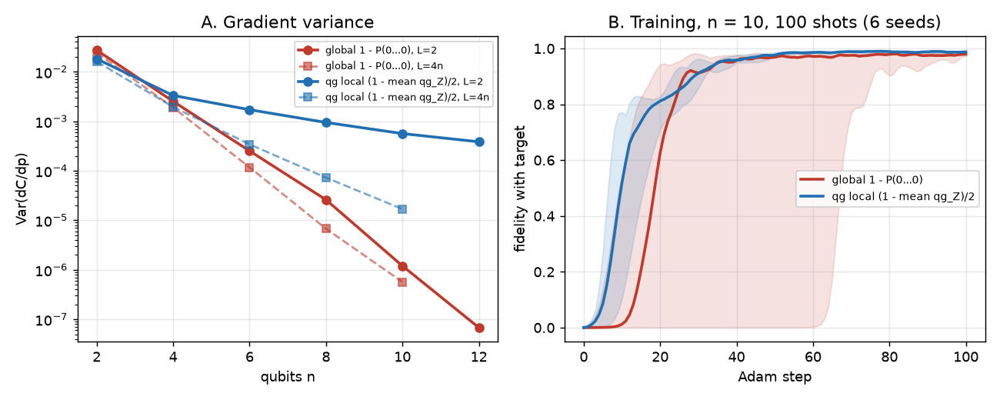

## 24. Decoherence and error mitigation: qg filter vs ZNE (`examples/error_mitigation_qg_vs_zne.py`)

Same H2 state as §21 (ideal mean qg_Z = 1 − 2N/n = 0). Methods, all on
top of readout mitigation: the qg filter (§21), zero-noise extrapolation
(every CX folded to CX³ and CX⁵, Richardson to zero noise) and both
combined. Controlled noise acts on every CX (so folding scales it
exactly) or on readout only; the realistic case is fake_brisbane, with
an optional idle delay. Error vs FCI in mHa, mean ± std over 10 seeds,
20,000 shots per circuit:

| noise | mean qg_Z | kept | raw | qg filter | ZNE | ZNE + qg |
|---|---|---|---|---|---|---|
| T1 p = 0.03 | +0.029 | 0.94 | 36.6 | **2.0 ± 1.6** | −4.0 ± 3.1 | −2.0 ± 2.9 |
| T1 p = 0.10 | +0.099 | 0.81 | 128.9 | 7.4 ± 1.5 | −5.7 ± 5.3 | **−0.6 ± 3.5** |
| dephasing p = 0.03 | 0.000 | 1.00 | 2.9 | 2.9 ± 1.7 | **−0.8 ± 3.2** | −0.8 ± 3.2 |
| dephasing p = 0.10 | 0.000 | 1.00 | 10.2 | 10.2 ± 1.7 | **2.1 ± 3.3** | 2.1 ± 3.3 |
| depolarizing p = 0.03 | +0.007 | 0.96 | 60.8 | 23.2 ± 2.3 | **0.3 ± 4.5** | −2.3 ± 3.8 |
| depolarizing p = 0.10 | +0.021 | 0.86 | 193.5 | 81.3 ± 3.8 | 17.5 ± 8.2 | **−3.3 ± 8.8** |
| readout p = 0.03 | 0.000 | 0.89 | −0.6 | −0.6 ± 1.2 | −1.9 ± 2.9 | −1.9 ± 2.1 |
| fake_brisbane | +0.011 | 0.90 | 20.6 | 6.5 ± 1.6 | 6.8 ± 5.9 | **2.0 ± 3.9** |
| fake_brisbane, 50 µs idle | +0.122 | 0.72 | 189.3 | 31.1 ± 1.3 | 176.6 ± 4.1 | **27.2 ± 4.1** |

* **The qg witness predicts whether the filter will work.** Dephasing
  preserves the electron number: mean qg_Z stays at 0, every shot is
  kept, and the filter changes nothing, so only ZNE helps. T1 moves
  mean qg_Z up by ≈ p, and the filter removes 94–95 % of the error with
  no extra circuits and less spread than ZNE.
* **The two methods are complementary.** ZNE overshoots under T1 (−4 to
  −6 mHa) and doubles or triples the spread; the filter cannot touch
  errors that preserve the symmetry. With strong depolarizing noise only
  the combination is within a few mHa.
* **Idle decoherence defeats ZNE.** Gate folding does not scale the
  50 µs idle T1 (189 → 177 mHa), while mean qg_Z flags it (+0.122) and
  the filter removes 84 % of the error. No method reaches chemical
  accuracy there.
* **Realistic noise:** ZNE + qg gives 2.0 ± 3.9 mHa on fake_brisbane,
  10× better than raw and better than Hartree-Fock (20.3), at 3× the
  circuits of the filter alone (6.5 ± 1.6).
* **Decision rule:** if mean qg_Z moves away from 1 − 2N/n or the kept
  fraction drops, apply the filter (free); if the residual stays large
  with the kept fraction ≈ 1, the remaining noise preserves the symmetry
  and needs ZNE. FCI is exact at this size: this ranks mitigation
  strategies for a quantum computation, not quantum vs classical.

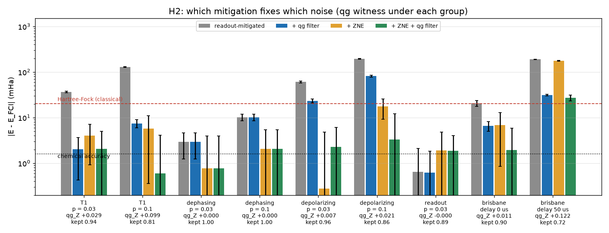

## 25. Thermal states: qg_Z = tanh(βh) (`examples/thermal_states_qg_tanh.py`)

A qubit with H = −hZ in equilibrium at temperature T (k_B = 1) is the
Gibbs state ρ = e^(−βH)/Z, and its polar qang is **qg_Z = tanh(βh)**.
This was listed as conceptual only, with no advantage expected; the
results confirm it. Everything below is an exact rewriting of textbook
thermodynamics in qg, or a comparison between ways of estimating the
same qg.

**A. One qubit, every quantity a function of qg alone** (checked
against e^(−βH) to 5·10⁻¹² for βh ∈ [0.01, 8]):

| quantity | in qg |
|---|---|
| energy | U = −h·qg |
| entropy (bits) | S = qg_S(qg), exact because ρ is diagonal in Z |
| free energy | F = −T ln(2/√(1 − qg²)) |
| heat capacity | C/k_B = artanh(qg)²·(1 − qg²) |
| preparation angle | θ = arccos(qg) = π/2 − gd(βh) (Gudermannian) |

Nernst: as T → 0, qg → 1 and both qg_S and C go to 0.

**B. Thermometry.** A Z measurement is an energy measurement, so it is
the optimal measurement on a Gibbs qubit, and the Fisher information on
T per shot is C/T². The best relative precision is at maximal C:

    qg · artanh(qg) = 1   →   qg* = 0.8336,  βh = 1.1997,  β·gap = 2.3994

That is the peak of the Schottky anomaly, the known optimal operating
point of a two-level thermometer [Correa et al., PRL 114, 220405
(2015)], here as a one-line condition on qg.

Few shots: the plug-in T = h/artanh(2k₀/N − 1) gives T = 0 when every
shot is 0 and T = ∞ when qg_hat ≤ 0. The posterior median of qg under
the Haar prior (uniform in qg, §15.3), restricted to qg > 0 (positive
temperature), maps exactly to the posterior median of T, because T(qg)
is monotone. Control: Jeffreys' prior with the same restriction. Exact
enumeration over the binomial; error = median |T̂/T − 1| (failures
count as infinite):

| true qg | shots | failures: raw | Haar>0 | Jeffreys>0 | error: raw | Haar>0 | Jeffreys>0 | Cramér–Rao std/T |
|---|---|---|---|---|---|---|---|---|
| 0.8336 (optimal) | 10 | 0.42 | 0 | 0 | 0.73 | 0.37 | 0.37 | 0.48 |
| | 30 | 0.07 | 0 | 0 | 0.28 | 0.19 | 0.25 | 0.28 |
| | 100 | 0 | 0 | 0 | 0.09 | 0.10 | 0.10 | 0.15 |
| 0.99 | 10 | 0.95 | 0 | 0 | ∞ | 0.94 | 0.39 | 0.85 |
| | 30 | 0.86 | 0 | 0 | ∞ | 0.40 | 0.08 | 0.49 |
| | 100 | 0.61 | 0 | 0 | ∞ | 0.06 | 0.13 | 0.27 |

* Near the ground state the plug-in estimate says T = 0 in 61 % of runs
  even with 100 shots; the restricted posteriors never fail.
* Neither prior wins everywhere (Jeffreys at 10–30 shots near qg = 1,
  Haar at 30 shots near qg*). The prior and the positivity restriction
  do the work, not qg: the same conclusion as §15.3.
* By 100 shots at qg* the three estimators agree. (A median absolute
  error can sit below the Cramér–Rao bound, which bounds the standard
  deviation; the curves are jagged because k₀ is discrete.)

**C. Circuits and hardware.** A Gibbs qubit is half of a 2-qubit pure
state: Ry(θ) on q0 and CX q0→q1 with cos θ = tanh(βh). On Aer (20,000
shots) it gives 0.2022 / 0.7642 / 0.9958 against tanh = 0.1974 /
0.7616 / 0.9951. The idle qg_Z of a real qubit is a temperature: with
residual excited population p₁, qg = 1 − 2p₁ and
T_eff = hf / (2k_B artanh(qg)); a 5 GHz qubit with p₁ = 1 % sits at
52 mK. Separating that from asymmetric readout error is item 7 of the
roadmap (hardware characterization).

**D. Where the tanh law stops being exact: a 6-qubit Ising ring**
(H = −J ΣZᵢZᵢ₊₁ − h ΣZᵢ − g ΣXᵢ, J = h = 1).

* Classical Ising (g = 0, ρ diagonal in Z): the thermodynamic entropy is
  exactly **Σᵢ qg_S,ᵢ − qg_correlation** (§7.2), to 10⁻¹³ at every
  temperature. The Z-basis qg quantities are the full thermodynamics.
* The mean-field law qg = tanh(β(h + 2J·qg)) overshoots the exact
  per-site qg by up to 0.095 (β = 0.38); the free-spin tanh(βh) is far
  below both. Correlations, measured by qg_correlation, are what the
  single-site tanh misses.
* A transverse field (coherence) breaks the decomposition: the Z-basis
  entropy only bounds the true one from above, and the gap grows with g
  and as T falls. At β = 1.5 it is 0.36 bits (g = 0.5) and 2.1 bits
  (g = 1.5) while the true entropy is ~0.01 bits: the ground state is
  pure but not a Z product state.

**Honest summary.** qg = tanh(βh) is a clean coordinate for a thermal
qubit: all thermodynamic quantities and the optimal-thermometer
condition are one-line functions of it, and for diagonal Gibbs states
the qg entropy decomposition is exact. It is not a quantum advantage,
and the few-shot gain comes from the prior, not from qg.

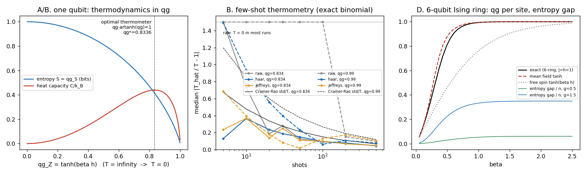

## 26. Circuit knitting in practice: which gates to cut (`examples/circuit_knitting_qg_cut_selection.py`)

§15.2 prices one cut in closed form, γ² = (1 + 2√(1 − qg²))² with
qg = cos θ. Here that price decides where to split a circuit too large
for one device. An 8-qubit circuit of RZZ couplings on a sparse graph
(ring plus 4 chords, 12 couplings) must run on devices of at most 4
qubits. Two angle regimes: **trotter** (2 steps of a disordered Ising
model, θ = 2J·dt ∈ [0.1, 0.75]) and **qaoa** (one weighted-MaxCut layer,
θ = 2γw ∈ [0.9, 5.4]). Rules, each scored by the true shot multiplier
(product of γ² over the cut gates):

* **count**: fewest cut gates (angle-blind; ties averaged);
* **weakest**: smallest total |θ| cut ("cut the weakest bonds");
* **qg**: smallest Σ log γ²(qg), the exact optimum over all 3,795
  partitions into blocks of ≤ 4 qubits;
* **addon**: `qiskit-addon-cutting`'s `find_cuts`, gate cuts only.

Geometric-mean shot multiplier over 200 random instances per regime:

| regime | count | weakest | qg | addon | qg strictly cheaper than count / weakest |
|---|---|---|---|---|---|
| trotter | 7,254 | 3,838 | **3,642** | 3,642 | 60 % / 12 % |
| qaoa | 976 | 2,174 | **753** | 753 | 52 % / 62 % |

* **Small angles:** γ grows with |θ|, so "cut the weakest bonds" is
  nearly the qg rule (5 % more shots). Counting gates costs 2.0×.
* **Large angles:** the cost is not monotone in the coupling, because
  RZZ(θ ≈ π) is almost a local Z⊗Z and nearly free to cut. "Cut the
  weakest bonds" becomes the worst rule (2.9× the optimum, worse than
  counting); qg is 1.3× cheaper than counting.
* **The reference tool already does this.** `find_cuts` reaches the
  qg optimum in all 400 instances, because it prices each gate by its
  own QPD 1-norm. What qg adds is the closed form: exhaustive scoring of
  all 3,795 partitions takes 1–3 ms, against 17–170 ms for the addon's
  search. The enumeration grows exponentially and the search does not,
  so this timing only holds at small sizes.

**End to end** (6 qubits on two 3-qubit devices, 60,000 shots, 10
seeds, RMSE of the six ⟨Xᵢ⟩). The count rule's unique choice cuts 2
gates at θ = π/2 (overhead 81); the qg choice cuts 3 gates at θ = 0.2
(overhead 7.4):

| shot allocation | count cut | qg cut | ratio |
|---|---|---|---|
| ∝ \|cᵢ\| per QPD term | 0.037 | **0.013** | 2.9× (predicted √(81/7.4) = 3.3) |
| equal per subexperiment | **0.037** | 0.083 | 0.44× |

The γ² law assumes importance sampling of the QPD terms. With equal
shots per subexperiment, the cost grows with the number of
subexperiments (6ᵏ for k cuts), and cutting fewer gates wins. The qg
price is the right criterion only with proportional allocation, which
the addon uses when `num_samples` is finite.

**Honest summary.** This is a cost saving, not a physical advantage,
and the leading tool already makes the angle-aware choice. The
measurable gain is against angle-blind and magnitude-based rules. It is
largest when gate angles pass π/2, and it only appears with shots
allocated in proportion to the QPD weights.

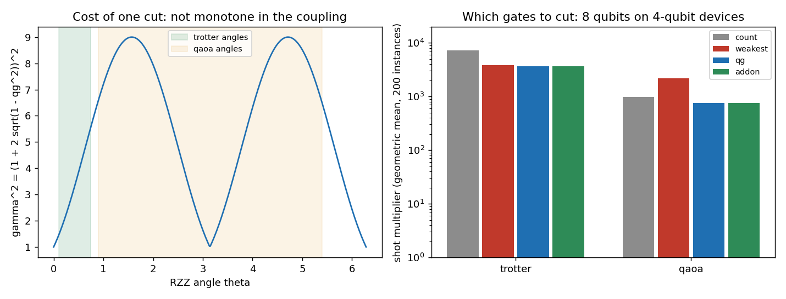

## 27. QEC under T1-biased noise: choosing a repetition code with the qg witness (`examples/qec_repetition_code_choice_qg.py`)

Code-capacity setting: one round of amplitude damping γ (T1) and then
dephasing p (T_φ) on every data qubit, followed by perfect syndrome
extraction and correction. There are three ways to store one logical
qubit: a bare qubit, the 3-qubit bit-flip code (corrects one X) and the
3-qubit phase-flip code (corrects one Z). The score is the logical
average infidelity, computed exactly from the Kraus operators. A Qiskit
density-matrix circuit, which reads the syndrome as the qg_Z of two
ancillas and corrects coherently, reproduces it to 10⁻⁶.

| noise | no code | bit-flip | phase-flip |
|---|---|---|---|
| T1 only, γ = 0.02 | **0.0067** | 0.0101 | 0.0197 |
| dephasing only, p = 0.02 | 0.0133 | 0.0384 | **0.0008** |
| γ = p = 0.02 | **0.0199** | 0.0474 | 0.0204 |

* **Neither repetition code corrects T1.** Amplitude damping has an
  X + iY jump and a no-jump part that shrinks |1⟩ on every qubit, and a
  3-qubit repetition code fixes neither at first order. The bit-flip
  code is worse than a bare qubit everywhere. The real choice is
  "phase code or no code".
* **The boundary is p = γ** (crossover p/γ = 1.00, 1.02 and 1.10 at
  γ = 0.002, 0.01 and 0.04).

**Witness.** Two idle experiments read in qg: prepare |1⟩ and measure Z,
which gives qg_Z = −1 + 2γ; prepare |+⟩ and measure X, which gives
qg_X = √(1 − γ)(1 − 2p). Inverting them gives γ̂ and p̂, and the policy
picks the option with the lowest predicted infidelity. In qg terms, use
the phase code when qg_X < √(1 − γ̂)(1 − 2γ̂). Results over 400 random
instances (γ and p log-uniform in [10⁻³, 5·10⁻²], 1,000 shots per
witness experiment):

| policy | mean infidelity | regret vs oracle | right choice |
|---|---|---|---|
| oracle | 0.00844 | – | 100 % |
| **qg witness (qg_Z and qg_X)** | 0.00867 | +2.7 % | 85 % |
| always phase code | 0.01231 | +46 % | 53 % |
| always no code | 0.01258 | +49 % | 48 % |
| always bit-flip code | 0.03023 | +258 % | 0 % |
| qg_Z only (the §24 witness) | 0.01258 | +49 % | 48 % |

* **qg_Z alone is blind here.** It sees T1 but not dephasing, so it
  always recommends no code. The witness needs both Bloch components,
  which makes it T1/T2 characterization written in qg.
* **Its mistakes come from shot noise near the boundary**, where the
  options cost almost the same. Regret is 16 %, 2.7 %, 0.3 % and 0.06 %
  (right choice 70 %, 85 %, 95 % and 97 %) at 100, 1,000, 10,000 and
  100,000 shots per experiment.
* **The syndrome ancillas are a running witness.** In the phase code the
  nontrivial-syndrome rate (1 − qg_Z)/2 of each ancilla is 0.044 at
  γ = 0.01, p = 0.02, close to the dephasing-only value 2p(1 − p) = 0.039.

**Honest summary.** This is neither a new code nor an advantage over
standard characterization. It is a correct, cheap decision rule, and it
confirms the known result that repetition codes do not correct
amplitude damping. A T1-tailored code (for example the 4-qubit Leung
code) is the natural next test.

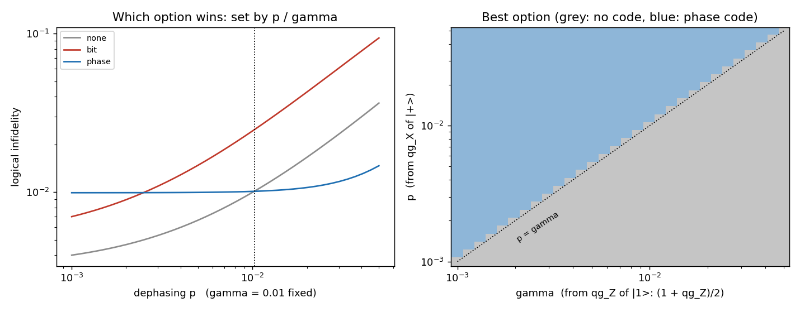

## 28. Chemistry with spin-resolved qg filters (`examples/chemistry_spin_resolved_qg_filter.py`)

H2 as in §21. With interleaved spin-orbitals in the Jordan–Wigner
encoding, qubits 0 and 2 hold spin up and qubits 1 and 3 spin down. The
Hamiltonian conserves N↑ and N↓ separately (checked in the tests), so
each spin register has a known ideal mean qg_Z (0 here, one electron
per register). Two filters on the Z-basis shots, both applied after
readout mitigation:

* **total**: Hamming weight 2 (§21), which keeps 6 of 16 bit strings.
* **spin**: one up and one down electron, which keeps 4 of 16. It also
  removes |0101⟩ and |1010⟩, where both electrons have the same spin.

New witness: the **spin leak**, the fraction of weight-2 shots that sit
in the wrong spin sector. Error vs FCI in mHa, mean ± std over 10
seeds, 20,000 shots per circuit:

| noise | qg↑ | qg↓ | spin leak | readout | total filter | spin filters |
|---|---|---|---|---|---|---|
| fake_brisbane, 0 µs | +0.012 | +0.010 | 0.002 | 20.2 | 6.5 ± 1.5 | 5.9 ± 1.5 |
| fake_brisbane, 20 µs | +0.060 | +0.056 | 0.005 | 92.4 | 20.2 ± 1.4 | 20.0 ± 1.4 |
| fake_brisbane, 50 µs | +0.124 | +0.121 | 0.008 | 189.0 | 31.0 ± 1.3 | 31.4 ± 1.5 |
| T1 p = 0.10 | +0.101 | +0.098 | 0.001 | 128.9 | 7.4 ± 1.5 | 6.7 ± 1.4 |
| depolarizing p = 0.03 | −0.013 | +0.028 | 0.015 | 60.8 | 23.2 ± 2.3 | **14.7 ± 2.2** |
| depolarizing p = 0.10 | −0.040 | +0.082 | 0.052 | 193.5 | 81.3 ± 3.8 | **53.9 ± 3.6** |
| dephasing p = 0.10 | 0.000 | 0.000 | 0.000 | 10.2 | 10.2 ± 1.7 | 10.2 ± 1.7 |

* **The second filter helps only when the spin leak is clearly
  nonzero.** Depolarizing noise on the CXs flips pairs of qubits into
  the wrong spin sector. There the spin filters remove a further 37 %
  (p = 0.03) and 34 % (p = 0.10) of the error left by the total filter.
* **On fake_brisbane the gain is within the seed spread** (6.5 → 5.9
  mHa, and nothing with an idle delay), because the spin leak is below
  1 %. The expectation that a second filter would cut the §21 residual
  does not hold: that residual sits in the XXYY terms and in errors that
  preserve both N and spin.
* **The spin witnesses separate where the total one does not.** Under
  depolarizing noise qg↑ = −0.040 and qg↓ = +0.082 (p = 0.10), while
  their average, the §21 witness, reads +0.021. The asymmetry follows
  the circuit, whose CXs fan out of an up qubit.

**Honest summary.** A second, free filter from a second conserved
quantity, using the same shots and no extra circuits. It pays off only
when the spin-leak witness says so, and on the realistic noise model it
does not. FCI is exact at this size, so this is not a classical-vs-quantum
comparison.

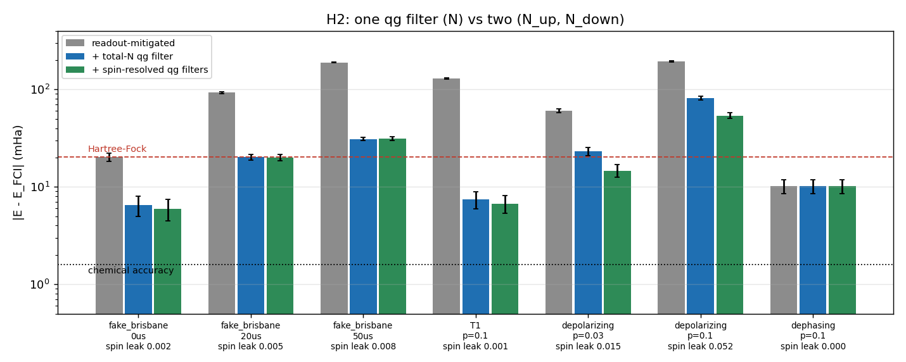

## 29. Materials simulation: 1D Hubbard dynamics with N and spin qg filters (`examples/hubbard_trotter_qg_filters.py`)

1D Fermi–Hubbard, L = 4 sites (8 qubits, spin-up and spin-down blocks in
Jordan–Wigner), J = 1, U = 2, first-order Trotter with dt = 0.25, from a
charge-density wave (sites 0 and 2 doubly occupied). H conserves N↑ and
N↓, so each spin register has ideal mean qg_Z = 0 at every time. Unlike
H2, **every observable is in the Z basis** (charge imbalance I, double
occupancy D), so the filters act on all of them. Reference: the
noiseless output of the same Trotter circuit. Methods on top of readout
mitigation: N filter (§21), spin filters (§28), ZNE (every two-qubit gate
of the routed circuit folded ×3, ×5; §24), ZNE + spin filters. 20,000
shots per circuit, 5 seeds.

**All-to-all, depolarizing-dominated device** (0.6 % per CX, no
routing, 20 CX per step), |error| of D:

| steps (t) | 1 (0.25) | 2 | 4 | 6 | 8 (2.0) | time average |
|---|---|---|---|---|---|---|
| readout-mitigated | .008 | .002 | .017 | .027 | .042 | .019 |
| + N filter | .003 | .001 | .010 | .020 | .030 | .013 |
| + spin filters | .003 | .001 | .007 | .014 | .021 | .009 |
| + ZNE | .001 | .002 | .002 | .009 | .017 | .006 |
| **+ ZNE + spin filters** | .001 | .001 | .002 | .004 | .007 | **.003** |

Mean qg_Z of both registers stays at 0 (unital noise), but the kept
fraction falls from 0.88 to 0.50 and the spin leak grows from 0 to 0.08.
For I the time averages are .026 raw, .013 N, .011 spin, .006 ZNE and
.008 ZNE + spin.

**fake_brisbane** (heavy-hex: routing the hop/interaction ladder costs 56
ECR per step), |error| at 1 and 2 steps:

| | D, 1 step | D, 2 steps | I, 1 step | I, 2 steps |
|---|---|---|---|---|
| readout-mitigated | .081 | .056 | .206 | .111 |
| + N filter | .050 | .029 | .124 | .070 |
| + spin filters | .039 | .016 | .100 | .047 |
| + ZNE | .031 | .031 | .036 | **.010** |
| + ZNE + spin filters | **.009** | **.006** | **.035** | .071 |

* **Filters on every observable.** The qg filters roughly halve the
  error on the all-to-all device, and ZNE + spin filters gives the best
  double occupancy on both devices (6–9× below raw).
* **Routing creates spin leak, and then the second filter pays.** On
  fake_brisbane 8 %, 16 %, 41 %, 45 % and 47 % of the right-N shots sit in the
  wrong spin sector (1, 2, 4, 6 and 8 steps; H2 in §28: < 1 %), so the
  spin filters clearly beat the N filter.
* **The per-register witnesses localize T1.** With the current
  fake_brisbane snapshot mostly the spin-down register drifts to +1; with
  an older snapshot both do. That is a property of the calibration, not
  of the method.
* **Limit.** From 4 steps on fake_brisbane (≥ 188 ECR, 18 % of shots
  kept) every method sits on the noise floor: D → 1/4, the value of the
  maximally mixed state inside the spin sector, and I → 0. This is the
  same wall as LiH (§21).
* **Honest scope.** On the all-to-all device the mitigated error is
  already comparable to the Trotter error itself (0.01–0.02 vs exact
  evolution). The 1D Hubbard model at this size, and up to ~20 sites by
  exact diagonalization (much further with tensor networks), is
  classically easy. This ranks error mitigation for quantum simulation,
  not quantum vs classical.

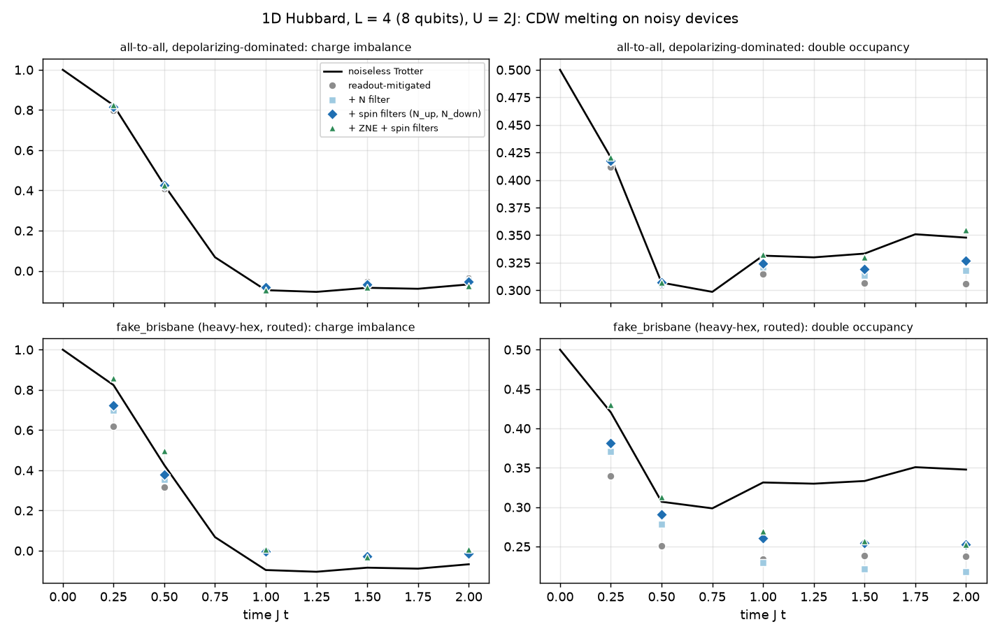

## 30. Constrained optimization: QAOA with "exactly K" and qg (`examples/qaoa_k_constraint_qg.py`)

Maximum K-vertex cover (choose exactly K = 3 of n = 8 vertices to cover
the most edges) on 5 random graphs G(8, ½). The constraint Σx_i = K is
**mean qg_Z = 1 − 2K/n = 0.25**, the same identity as the electron number
(§21). qg ingredients: the per-shot **filter** (Hamming weight K), a
**budget start** (every qubit at qg = 0.25, mixer rotated about it, no
classical pre-solve), and a **warm start** (qg_i = 1 − 2c_i from the LP
relaxation, clipped to |qg| ≤ 0.5, i.e. Egger's ε = 0.25 as pole
damping). Baselines: standard penalty QAOA, the constraint-preserving
XY-mixer QAOA from a Dicke state, brute force, greedy and a random
feasible guess (P(opt) 0.096, approximation ratio 0.772). 4000 shots.

P(optimal) per shot, noiseless / noisy / noisy + qg filter, all-to-all
device (0.6 % depolarizing per CX):

| variant | p = 1 | p = 2 |
|---|---|---|
| standard (penalty) | 0.053 / 0.046 / 0.101 | 0.099 / 0.079 / 0.176 |
| qg budget start | 0.066 / 0.058 / 0.108 | 0.087 / 0.062 / 0.136 |
| qg warm start (LP) | 0.195 / 0.155 / 0.297 | 0.169 / 0.110 / 0.256 |
| XY mixer (Dicke) | 0.346 / 0.150 / **0.278** | 0.511 / 0.177 / **0.366** |

On fake_brisbane (heavy-hex routing, 134–497 ECR) every variant ends at
the random-feasible level after filtering (P(opt) 0.09–0.12, ratio
0.77–0.79); the only exception is the warm start at p = 1 (0.173, 0.813).

* **The qg filter is free and never hurts.** With the XY mixer the ideal
  output is 100 % feasible, so the kept fraction is a pure error witness
  (0.54). The filter doubles P(opt) under noise (0.150 → 0.278 at p = 1,
  0.177 → 0.366 at p = 2).
* **Penalty QAOA at p ≤ 2 does no better than guessing.** After filtering it
  sits at the random-feasible level. The budget start raises the raw
  feasibility (kept 0.46 → 0.54) but not the quality of the feasible
  shots.
* **The warm start's value is classical.** It is the best penalty variant
  (3× the random guess), but its LP relaxation is already integral (the
  answer) on 3 of 5 graphs.
* **The witness says when nothing is left.** On fake_brisbane the kept
  fraction falls to 0.24–0.33, close to 56/256 = 0.22 for a fully mixed
  register, and the filtered samples are then random feasible sets.
* **Classical wins.** Greedy reaches 98.5 % of the optimum (optimal on 4 of
  5 graphs) and brute force is instant. The qg ingredients improve QAOA
  relative to QAOA, not relative to classical optimization.

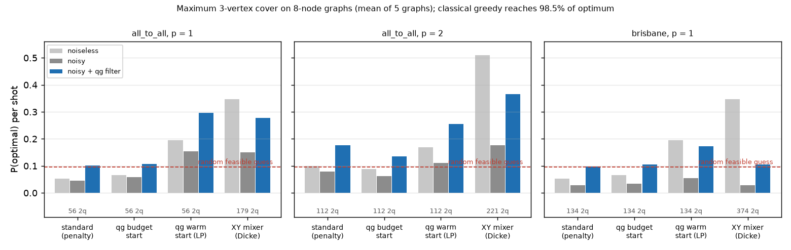

## 31. Hardware characterization in qg: T1, T2, effective temperature and readout from one sweep (`examples/hardware_characterization_qg.py`)

A real qubit idles with residual excited population p, so qg_eq = 1 − 2p
= tanh(hf/2k_BT_eff) (§25). Its readout flips 0→1 with probability e01
and 1→0 with e10. In qg the readout is affine: **measured qg = a + b·qg**,
with a = e10 − e01 and b = 1 − e01 − e10. The standard suite calibrates
readout on "|0⟩" and "|1⟩", which are really the thermal state and X on
it. Z-basis data alone see only a + b·qg_eq and b·qg_eq, so thermal
population is counted as readout error.

**qg protocol.** Herald (measure), apply I, X or Ry(π/2), wait t, rotate
back, measure again. The t = 0 pairs give, in closed form,

    m = E[r1] = a + b·qg_eq
    V = E[r1 r2 | I] − m² = b²(1 − qg_eq²)        (readout covariance)
    C_X = E[r1 r2 | X] = a² − b²
    u = b·qg_eq = (m² − V − C_X)/(2m),  b = √(V + u²),  a = m − u

The delays add T1 (after X) and T2 (the decay of qg_X, after Ry(π/2)). A
joint maximum-likelihood fit of all joint counts returns (a, b, qg_eq,
T1, T2). Both protocols use 16 circuits × 2000 shots; the exact
single-qubit model is cross-checked against a Qiskit Aer circuit
(thermal start by purification, §25).

Truth: T1 = 100 µs, T2 = 70 µs, e01 = 0.015, e10 = 0.04, 5 GHz. Median ±
std over 100 repetitions:

| true p (T_eff) | e01 standard | e01 qg | T_eff standard | T_eff qg |
|---|---|---|---|---|
| 0 (0 mK) | 0.0150 | 0.0149 | 0 | 11 ± 14 mK |
| 0.01 (52 mK) | 0.0245 | **0.0151** | 0 | **52.3 ± 1.0** |
| 0.03 (69 mK) | 0.0415 | **0.0148** | 0 | **69.0 ± 0.8** |
| 0.08 (98 mK) | 0.0915 | **0.0152** | 0 | **98.2 ± 0.9** |

* **The standard suite reads temperature as readout error.** e01 is
  overestimated by exactly p·b (e10 similarly), and the qubit looks
  perfectly cold at every temperature.
* **The qg sweep is unbiased** for e01, e10, p and T_eff, and resolves
  T_eff to ~1 mK from 52 mK up (at p = 0 it only gives an upper bound).
* **T1 and T2 are unbiased in both.** The qg joint fit is ~1.5× more
  precise (T1 ± 1.6–2.0 vs ± 2.6–3.6 µs, T2 ± 2.1–2.5 vs ± 3.4–4.9 µs,
  T_φ ± 5–6 vs ± 8–12 µs), partly because of the joint maximum-likelihood
  fit itself.
* **Robust to a non-QND herald:** with 5 % relaxation of |1⟩ during the
  herald, the estimates move by ~0.001.
* **Scope.** Perfect gates and a QND herald are assumed. The protocol
  needs mid-circuit measurement (available on IBM, not on every
  platform). Repeated-measurement separation of thermal population is
  known practice; what qg adds is the closed form (m, V, C_X) and T_eff
  read directly from qg_eq. This is the protocol to run first on real
  hardware.

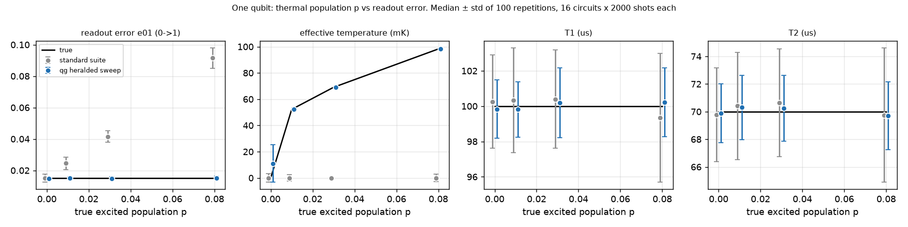

## 32. A code built for T1: the Leung [[4,1]] code and a T2/T1 rule (`examples/qec_leung_code_t1_qg.py`)

§27 found that neither repetition code corrects amplitude damping. The
4-qubit code of Leung, Nielsen, Chuang and Yamamoto (PRA 56, 2567, 1997),
|0_L⟩ = (|0000⟩ + |1111⟩)/√2 and |1_L⟩ = (|0011⟩ + |1100⟩)/√2, corrects
the no-jump distortion and any single jump to first order. It cannot
correct single phase flips (Z₁ and Z₃ act identically on the code up to
a logical Z). The setting is the same as §27: one round of damping γ,
then dephasing p on each data qubit, perfect recovery, exact logical
average infidelity. The recovery is channel-adapted: each image E_j V of
{no jump, jump on qubit j} is mapped back by its polar isometry. The Petz
recovery is a cross-check, and a Qiskit Aer density-matrix circuit
matches to 10⁻¹⁵.

**Pure T1** (logical infidelity):

| γ | no code | bit-flip | phase-flip | **Leung** |
|---|---|---|---|---|
| 0.001 | 3.3e-4 | 5.0e-4 | 1.0e-3 | **9.2e-7** |
| 0.01 | 3.3e-3 | 5.0e-3 | 9.9e-3 | **9.2e-5** |
| 0.03 | 1.0e-2 | 1.5e-2 | 2.9e-2 | **8.2e-4** |

* **The Leung code corrects T1.** Its infidelity is ≈ 0.92 γ², which is 36×
  below no code at γ = 0.01 and 360× at 0.001. It beats no code up to
  γ = 0.44. The Petz recovery is ~1.3× worse.
* **It is fragile to dephasing.** It beats no code only for **p < γ/4**
  (boundary p/γ = 0.249, 0.247, 0.237 at γ = 0.002, 0.01, 0.04). At
  γ = 0.02 its gain falls from 18× (p = 0) to 1.9× (p = 0.002) and to none
  at p = 0.005.
* **In device terms it is a rule on T2/T1 alone.** One idle round gives
  γ = t/T1 and p = t/2T_φ, so p = γ/4 ⇔ T_φ = 2T1 ⇔ **T2 = T1**, and p = γ
  ⇔ **T2 = 0.4 T1**. The best option is the **Leung code if T2 > T1**, **no
  code if 0.4 T1 < T2 < T1**, and the **phase-flip code if T2 < 0.4 T1**
  (checked at t/T1 = 0.002, 0.01, 0.03). A transmon with T1 = 100 µs and
  T2 = 70 µs (§31) sits in the "no code" band. Since T2 ≤ 2T1, the
  Leung code suits qubits close to the T1 limit.

**Policy** (300 instances, γ and p log-uniform in [10⁻³, 5·10⁻²], the
§27 witness qg_Z of |1⟩ and qg_X of |+⟩ with 1000 shots each):

| policy | regret vs oracle | right choice |
|---|---|---|
| **qg witness, options none / phase / Leung** | **+6.4 %** | 79 % |
| §27 policy (none / phase) | +14.7 % | 65 % |
| always phase | +66 % | 51 % |
| always none | +64 % | 28 % |
| always Leung | +220 % | 21 % |

The oracle picks Leung in 21 % of instances. The regret is +30.7 %,
+0.7 % and +0.1 % at 100, 10,000 and 100,000 shots.

**Honest summary.** The code and its recovery are known, and the
setting is code capacity: noiseless encoding and recovery, one round.
What is new here is the decision rule, in qg and equivalently T2 > T1,
together with its cost against the simpler options. It closes the §27
gap. It also links to §31, which measures exactly the T1 and T2 the rule
needs.

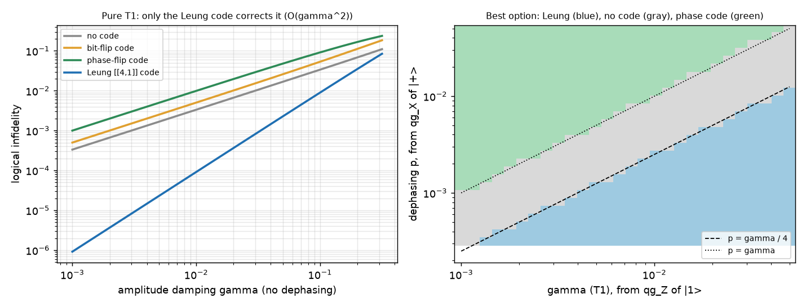

## 33. The syndrome as a continuous qg witness: tracking drift and switching code (`examples/qec_syndrome_drift_tracking_qg.py`)

§32 gave a rule on T2/T1: use the Leung code if T2 > T1, no code if
0.4 T1 < T2 < T1, and the phase code if T2 < 0.4 T1. On real qubits T2
fluctuates as two-level defects switch T_φ, so a choice made at
calibration goes stale. Each syndrome ancilla returns a stabilizer
expectation, qg_Z(ancilla) = ⟨S⟩, so the running code is itself a
witness.

**Closed forms** (exact against the Kraus computation). Every stabilizer
expectation is a power of the §27 single-qubit witness
qg_X = √(1 − γ)(1 − 2p):

    Leung:  ⟨Z0Z1⟩ = 1 − 2γ(1 − γ),   ⟨XXXX⟩ = qg_X⁴
    phase:  ⟨X1X2⟩ = qg_X²

The ancilla qg_Z therefore inverts in one line to γ and p. From one
window of 1000 QEC rounds the Leung syndromes give γ to ±23 % and p to
±28 % at T2/T1 = 0.6, enough to separate the three regimes (> 80 %
correct).

**Drift.** Code capacity, as in §27 and §32, with γ ≈ 0.01 per round.
T2/T1 follows a random telegraph between 1.6, 0.6 and 0.3 (one level
per regime), with a mean dwell of 20 windows. T1 is stable, so all
γ information is pooled. Averages over 400 windows × 5 seeds:

| strategy | regret vs oracle | extra probe shots / window |
|---|---|---|
| probe every window (§27 witness, 2000 shots) | +6.6 % | 2000 |
| **hybrid: syndromes, probes only when uncoded** | **+7.2 %** | **481** |
| **syndrome tracking only** | **+13.1 %** | **5** |
| probe every 10 windows | +20.4 % | 200 |
| fixed no code | +25.9 % | 0 |
| fixed phase code | +46.0 % | 0 |
| calibrate once at t = 0 | +57.7 % | 5 |
| fixed Leung code | +129.5 % | 0 |

* **The syndromes are free information.** Tracking by syndrome alone
  beats recalibrating every 10 windows without any probe shots. The
  hybrid comes within 0.6 points of probing every window with 4× fewer
  probe shots.
* **A one-time calibration is worse than never coding** once the noise
  drifts (+58 % vs +26 %).
* **What limits it.** Each switch lags by one window, and without a code
  there are no syndromes, so the tracker must explore (one Leung window
  every 5) or probe (the hybrid). Smoothing the p counts over past
  windows made it worse (+18.5 % and +27.6 % with forgetting 0.5 and 0.8),
  because this drift is abrupt. Pooling γ matters: without it (±30 % from
  each 1000-shot probe) the hybrid stayed in the phase code near the
  T2 = 0.4 T1 boundary (+11.3 %).

**Honest scope.** This is code capacity with perfect syndrome extraction
and a synthetic drift model. On hardware the ancillas have their own
readout error, which §31 calibrates, and extraction adds noise. The loop
§31 → §32 → §33 (measure T1/T2, choose the code, watch the syndromes) is
the adaptive protocol to run on a device.

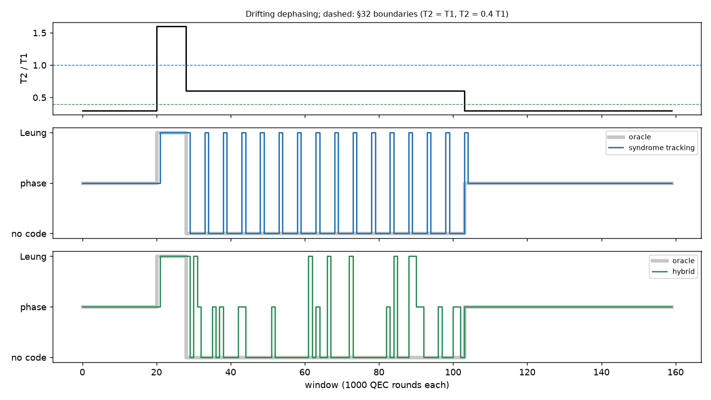

## 34. Is the §25 entropy gap a coherence witness? Transverse-field Ising (`examples/ising_coherence_witness_qg.py`)

§25 found that the Z-basis entropy written in qg,
Σ qg_S,i − qg_correlation, equals the thermal entropy of a 6-qubit Ising
ring only without a transverse field. **That gap is a known quantity:**
the relative entropy of coherence in the Z basis (Baumgratz, Cramer and
Plenio, PRL 113, 140401, 2014), C(ρ) = H(diag ρ) − S(ρ) ≥ 0, which is 0
iff ρ is diagonal. It is exact but needs S(ρ), which Z counts cannot
give. We test three measurable lower bounds on thermal states of
H = −J ΣZZ − h ΣZ − g ΣX (6-qubit ring, J = h = 1):

* **single-qubit (qg):** partial trace is incoherent, so C(ρ) ≥ C(ρᵢ) =
  qg_S(qg_Z) − qg_S(|r|), with |r| = √(qg_X² + qg_Y² + qg_Z²);
* **sum (qg):** C is superadditive over qubits, because
  C(ρ) − Σᵢ C(ρᵢ) = T(ρ) − qg_correlation ≥ 0 (T is the quantum total
  correlation, and local dephasing cannot raise it). So
  **C ≥ Σᵢ [qg_S(qg_Z,i) − qg_S(|rᵢ|)]**, still from two single-qubit qg
  values per site;
* **basis:** S(ρ) ≤ H in any basis, so C ≥ H_Z − H_X (joint entropies of
  2⁶ outcomes).

| β \ g | 0.25 | 0.5 | 1.0 | 1.5 | 2.0 |
|---|---|---|---|---|---|
| 0.25 | 0.015 / 96 % | 0.061 / 96 % | 0.241 / 97 % | 0.523 / 97 % | 0.889 / 97 % |
| 0.5 | 0.044 / 92 % | 0.174 / 93 % | 0.657 / 93 % | 1.352 / 94 % | 2.146 / 95 % |
| 1.5 | 0.107 / 100 % | 0.356 / 99 % | 1.117 / 98 % | 2.085 / 96 % | 3.086 / 95 % |
| 3.0 | 0.111 / 100 % | 0.361 / 99 % | 1.126 / 98 % | 2.097 / 96 % | 3.098 / 95 % |

(exact C in bits / fraction captured by the qg sum bound)

* **The qg sum bound captures 92–100 % of the coherence.** The missing
  part is T − qg_correlation, the correlation the Z basis does not see.
  The single-qubit bound alone gets ~16 % (1/n of the sum, by
  translation invariance).
* **The basis-entropy bound is useless here.** It is negative almost
  everywhere, down to −6 bits, because the X-basis outcomes are nearly
  uniform. It turns positive only for g > ~2.1.
* **Few shots are enough.** The sum bound reads 0.26 ± 0.11, 0.32 ± 0.04 and
  0.35 ± 0.02 bits at 100, 1000 and 10,000 shots (exact 0.354, β = 1.5,
  g = 0.5). At g = 0 it reads ~0.001 bits, and a 3σ test on |qg_X| fires
  in 0.3–0.5 % of runs, the nominal rate.
* **Where it fails.** On a ring cluster (graph) state every reduced qubit
  is I/2, so the qg bounds are 0 while C = 6 bits. This is the Z-basis
  blind spot of the first preprint. The tightness is a property of
  these thermal states, not a general law.

**Honest summary.** The gap is a known coherence measure, and its
superadditivity is known in the coherence literature. The qg reading
adds a cheap, tight bound for these states (two single-qubit qg values
per site, few shots), with the §25 decomposition naming exactly the
term it misses.

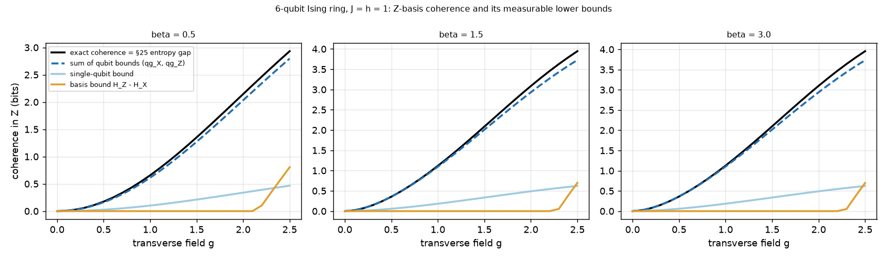

## 35. Few-shot single-qubit tomography (`examples/few_shot_tomography_qg.py`)

The Bloch vector is (qg_X, qg_Y, qg_Z). With N shots per axis we compare
six estimators: linear inversion (LI), LI projected onto the ball, MLE,
the per-axis Haar posterior mean (uniform in each qg, §15.3:
r_a = (2k_a − N)/(N + 2), then projected), the per-axis Jeffreys mean
(control asked for by §25), and the full Bloch-ball Bayes mean under the
prior that matches the test ensemble. Mean squared Bloch error, 2000
states, 10 shots per axis:

| ensemble | LI | LI+proj | MLE | **qg-Haar** | Jeffreys | Bayes (matched) |
|---|---|---|---|---|---|---|
| Haar pure | 0.203 | 0.157 | 0.150 | 0.165 | 0.159 | 0.143 |
| uniform mixed | 0.247 | 0.211 | 0.210 | **0.185** | 0.196 | 0.171 |
| pure near pole | 0.199 | 0.159 | 0.109 | 0.163 | 0.159 | 0.036 |
| strongly mixed (\|r\| < 0.3) | 0.298 | 0.293 | 0.293 | **0.208** | 0.245 | 0.046 |

* **LI is unphysical** in 52–88 % of runs on pure states.
* **On mixed states qg-Haar is the best closed form.** It is 12 % below MLE
  on uniform mixed states and 29 % below on strongly mixed ones, and
  6–15 % below Jeffreys. It shrinks towards the centre.
* **On pure states that shrinkage is wrong:** qg-Haar is 10 % worse than
  MLE (Haar pure) and 50 % worse near a pole. The per-axis prior is the
  Haar *marginal*; the joint Haar prior lives on the sphere, and the
  full-sphere Bayes estimator that uses it is the best on pure states.
* **By 100 shots** the estimators agree within ~10 %, except near a pole,
  where MLE stays 25 % ahead (15 % at 1000). A mismatched prior is
  costly: a sphere prior on strongly mixed states gives 0.591 (matched
  0.046).
* **Verdict (as §15.3 and §25):** the prior does the work, not the qg
  coordinates. qg-Haar is a good free default for expected-mixed
  (noisy) states; use MLE or a sphere prior for expected-pure ones.

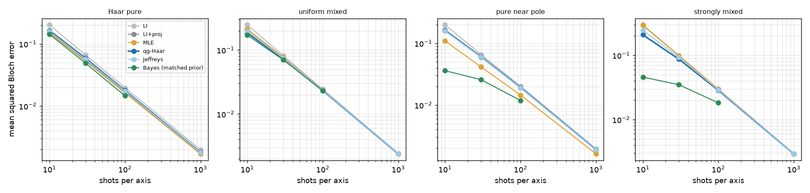

## 36. Ramsey sensing: where to operate (`examples/ramsey_qg_operating_point.py`)

Ramsey gives qg = a + bV cos(φ − α), with visibility V, operating point α
and the §31 readout map (a, b). The per-shot Fisher information is
F = b²V² sin²(φ − α)/(1 − qg²). With a = 0 and b = 1 this becomes
**F = (V² − qg²)/(1 − qg²)**. For V = 1 it is flat (F = 1 everywhere): the
1/(1 − qg²) gain at the poles is exactly cancelled by the Jacobian. For
V < 1 the optimum is the mid-fringe, qg = 0, and F → 0 at the bright
fringe.

* **Readout asymmetry moves the optimum off quadrature, but it does not
  matter.** The gain is +0.17 % with the §31 readout (optimum at
  qg* = +0.09) and +1.6 % even with e10 = 0.10.
* **Few shots**, φ ∈ [0, 0.5] rad, √N × RMSE, V = 1 (CRB 1): plug-in
  inversion gives 0.89–1.12 at both points, although 82 % of 10-shot
  runs at the pole give identical outcomes. The Bayesian posterior mean
  is ~2× better at 10 shots (0.41), because the prior range carries
  information.
* **V = 0.9:** the pole gets *worse* with more shots (plug-in 1.09 → 2.50
  from N = 10 to 1000), because small phases become invisible there. The
  mid-fringe tracks its bound (1.11–1.24, CRB 1.12).
* **Honest summary:** a clean qg form of known Ramsey practice (operate at
  mid-fringe, use a prior at few shots). It gives no gain over it.

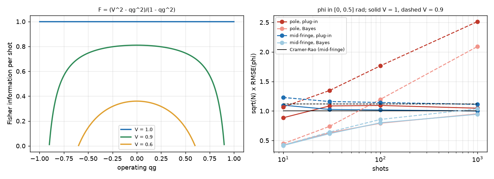

## 37. Grover amplitude estimation as Chebyshev polynomials in qg (`examples/amplitude_estimation_chebyshev_qg.py`)

With amplitude a = sin²t and the good/bad flag read as a qubit
(qg₀ = 1 − 2a), k Grover iterations give **qg_k = T_{2k+1}(qg₀)**, the
Chebyshev structure of §16. Because T_m′ = m U_{m−1} and
1 − T_m² = (1 − q²)U_{m−1}², the one-shot Fisher information is
**F_m = m²/(1 − qg₀²)**: depth m multiplies the §15.1 qg information by m²,
uniformly along the fringe. This is checked to machine precision and
against a Qiskit circuit. It is the qg form of the known 4m² for the
angle (Suzuki et al. 2020).

Maximum-likelihood amplitude estimation (MLAE; depths 0, 1, 2, 4, …, 2^j,
100 shots each) against Monte Carlo at equal oracle queries:

* **Noiseless:** the error falls as queries^(−0.93…−1.12) against
  queries^(−0.5) for Monte Carlo, 8.4–9.3× lower at 26,200 queries
  (a = 0.1, 0.3, 0.5). With depths 0 and 1 only it can lose (0.6× at
  a = 0.3), because T₃ is not one-to-one.
* **Depolarizing p = 0.01 per iteration:** MLAE that ignores the noise ends
  worse than Monte Carlo (6.8·10⁻³ vs 2.7·10⁻³). The noise-aware
  likelihood keeps a 4× advantage (6.7·10⁻⁴).
* **p = 0.05:** even noise-aware MLAE plateaus at the Monte Carlo level
  (3.2·10⁻³ vs 2.8·10⁻³). Depths beyond ~1/p carry almost no signal.
* **Honest summary:** the results are known; qg gives the Chebyshev
  picture and the m²/(1 − qg²) factor. The practical points are that the
  noise must be in the likelihood, and that the advantage ends near
  depth 1/p.

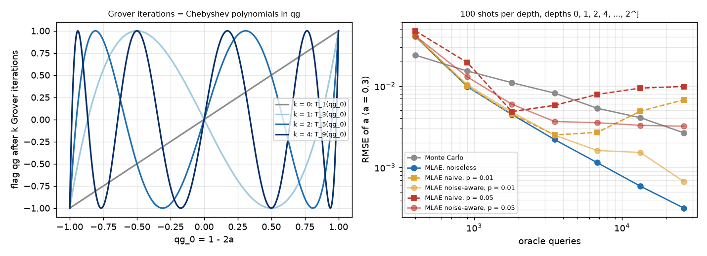

## 38. IonQ noisy simulator: Hubbard dynamics and constrained QAOA without routing (`examples/ionq_sim_hubbard_qaoa.py`)

On fake_brisbane, routing dominated §29 (56 ECR per Trotter step, and
spin leak created by routing) and §30 (134–497 ECR, XY-QAOA drowned).
IonQ devices are all-to-all, so we reran both on IonQ's cloud simulator
with the vendor noise models aria-1 and forte-1 (free, 2000 shots per
circuit; results recorded in `examples/data/ionq_sim_results.json`).
This is not hardware.

**Hubbard** (3 repetitions; |error| averaged over 1, 2, 4 and 6 steps,
double occupancy / charge imbalance):

| noise model | readout-mitigated | + N filter | + spin filters |
|---|---|---|---|
| aria-1 | 0.022 / 0.029 | 0.016 / 0.021 | **0.013 / 0.020** |
| forte-1 | 0.029 / 0.042 | 0.021 / 0.023 | **0.017 / 0.019** |

* **Without routing the spin leak is small at shallow depth**, as
  predicted: 0.1 % at one step, against 8 % on fake_brisbane. It still grows
  with depth under depolarizing-dominated noise: 8.3 % (aria-1) and 11.5 %
  (forte-1) at 6 steps. There the spin filters beat the N filter (double
  occupancy 0.032 → 0.023 and 0.044 → 0.033).
* **The witnesses behave as for unital noise.** The per-register mean qg_Z
  stays at 0 (±0.012 on average), and the kept fraction does the
  reporting (0.53 and 0.45 at 6 steps). The filters cut the time-averaged
  error by 30–55 %, in line with the generic all-to-all model of §29.

**QAOA exactly K** (5 graphs; P(opt), noisy → noisy + qg filter; random
feasible guess 0.096):

| | standard | qg budget | qg warm | **XY mixer** |
|---|---|---|---|---|
| aria-1, p = 1 | 0.047 → 0.102 | 0.062 → 0.114 | 0.163 → 0.311 | **0.155 → 0.276** |
| aria-1, p = 2 | 0.080 → 0.178 | 0.066 → 0.143 | 0.114 → 0.263 | **0.174 → 0.363** |
| forte-1, p = 1 | 0.046 → 0.106 | 0.053 → 0.098 | 0.146 → 0.299 | **0.120 → 0.256** |
| forte-1, p = 2 | 0.074 → 0.168 | 0.062 → 0.146 | 0.093 → 0.235 | **0.111 → 0.293** |

* **The filter doubles the XY-mixer success (1.8–2.6×) on both models.** This
  reproduces §30's all-to-all result. On fake_brisbane the same circuits
  fell to the random-guess level, so connectivity is what keeps the
  signal.
* **Penalty QAOA again ends at the random-feasible level**, and greedy (98.5 %
  of the optimum) still beats every variant (ratio ≤ 0.87).
* **Next:** the same scripts can target IonQ hardware only with an explicit
  cost approval. H2 (§20) remains the cheapest first hardware run.

## 39. IonQ noisy simulator: ZNE vs the qg filter on H2, and Grover amplitude estimation (`examples/ionq_sim_zne_grover.py`)

**A practical finding first.** Folding CX gates (CX → CX³) does *not*
amplify noise on IonQ. The service recompiles circuits written in the
standard gate set, so the folded pairs vanish: a Bell pair with 1, 3, 9
and 21 CX keeps P(00) + P(11) = 0.99 on aria-1. Folding has to be done in
IonQ's native gate set, where each Mølmer–Sørensen gate becomes
MS · MS(φ₀ + ½, φ₁) · MS. The service runs native circuits as written:
the same test drops to 0.94 and 0.87 with 9 and 21 MS gates, and the
H2 raw error grows 31 → 84 → 133 mHa at scales 1, 3, 5.

**H2** (the §21/§24 state, energy error vs FCI in mHa, 6 runs per model,
2000 shots per circuit, the simulator's limit; Hartree–Fock 20.3):

| noise model | readout-mitigated | **+ qg filter** | + ZNE | + ZNE + qg |
|---|---|---|---|---|
| aria-1 | 31.5 ± 7.8 | **14.7 ± 5.8** | 4.2 ± 20.3 | 5.5 ± 16.9 |
| forte-1 | 34.8 ± 6.3 | **13.9 ± 5.4** | 6.6 ± 19.0 | 3.0 ± 17.8 |

* **The qg filter halves the error in every run, at no cost.** Its mean
  sits below Hartree–Fock (RMS error 15.8 and 14.9 mHa).
* **ZNE is nearly unbiased but too noisy at this shot budget.**
  Extrapolation amplifies shot noise (± 17–20 mHa), so its RMS error (20.7
  and 20.1) is worse than the filter's. It would need ~10–15× more shots
  per noise scale to match the filter's spread. This reverses §24, where
  20,000 shots per circuit made ZNE + qg the best on fake_brisbane: which
  method to prefer depends on the shot budget.
* **The witness barely moves** (mean qg_Z +0.004, 2–3 % of shots dropped),
  as in §20. The noise is unital, but the few number-violating shots
  cost a lot of energy.

**Grover amplitude estimation** (3 qubits, a = 0.3, depths 0, 1, 2, 4,
36,000 oracle queries, 3 runs):

* **MLAE is accurate.** The error of â has RMS 0.0005–0.0015 (naive and
  noise-aware), with fitted visibility 0.965–0.985 per iteration.
* **It is 7–30× better than a realistic Monte Carlo.** Monte Carlo with
  the same queries would have a binomial error of 0.0024, but on the
  noisy device its depth-0 circuit is biased (RMS 0.011–0.019).
* **Modelling the visibility does not matter at this noise level.** It
  would at depths near 1/p (§37).

**Leung code: not run.** The IonQ noise models contain no amplitude
damping (trapped-ion T1 is effectively infinite), so by the §32 rule
(Leung only if T2 > T1) it cannot help there.

## 40. BB84: eavesdropper or natural noise? (`examples/bb84_qg_eve_vs_noise.py`)

Post-quantum cryptography (lattice schemes such as ML-KEM) is classical
and has no place for qg. Quantum key distribution does, because its
data are qg values. In BB84 each sent state gives
qg(0) = 1 − 2e(0→1), qg(1) = −1 + 2e(1→0), and likewise |±⟩ in X. Their
sum **A_Z = qg(0) + qg(1) = 2[e(1→0) − e(0→1)]** is the T1 witness of §24.
Natural relaxation of a stored qubit gives only 1→0 errors, while a naive
intercept-resend attack adds symmetric errors in both bases.

**Setting.** A matter-qubit link or an on-chip demonstration: baseline
channel γ₀ = 0.02 (T1), p₀ = 0.01 (dephasing), asymmetric detector
e01 = 0.005, e10 = 0.01. Two monitors run on windows of N compared bits,
each with 1 % false alarms on the baseline:

* **QBER monitor:** a one-sided test on the total error count.
* **qg monitor:** a generalized likelihood ratio on the four error counts,
  where "attack" (intercept fraction f > 0) must beat both "baseline" and
  "T1 drift" (γ free).

Alarm rates, QBER / qg, N = 2000 compared bits (N = 500 and 10,000 in
the script):

| scenario | QBER monitor | qg monitor |
|---|---|---|
| baseline | 0.007 | 0.006 |
| T1 drift, γ 0.02 → 0.04 | 0.478 | **0.009** |
| T1 drift, γ 0.02 → 0.06 | 0.962 | **0.006** |
| intercept-resend f = 0.02 | 0.218 | 0.271 |
| intercept-resend f = 0.05 | 0.861 | 0.823 |
| intercept-resend f = 0.10 | 1.000 | 0.994 |
| T1-mimicking attack (extra γ 0.04) | **0.962** | 0.006 |

* **Detection is equal, false alarms are not.** The qg monitor catches
  intercept-resend as well as the QBER monitor at every N and f. It stays
  quiet when the memory's T1 worsens, where the QBER monitor fires in
  48–100 % of windows. A_Z is what separates them: it grows with T1
  (0.049 → 0.128) and does not move under intercept-resend.
* **The price, by design.** An attacker who couples the qubit to her
  ancilla through an amplitude-damping interaction looks exactly like T1
  drift. The qg monitor misses her (0.6 %) and the QBER monitor does not
  (96 %). The two monitors are complementary: QBER says "something
  changed", and qg says "symmetric (attack-like)" or "T1-like (drift, or
  an attacker hiding as one)".
* **No security gain.** The Shor–Preskill secret fraction falls the same
  way in both cases (0.72 → 0.57 for T1 drift to 0.06, 0.72 → 0.59 for
  f = 0.05). A security proof must still attribute every error to Eve.

**Honest summary.** This is an operational diagnostic that tells
hardware drift from naive tampering, which the QBER total cannot. It is
not a security improvement, and it does not apply to photon-polarization
links, whose noise is mostly unital.

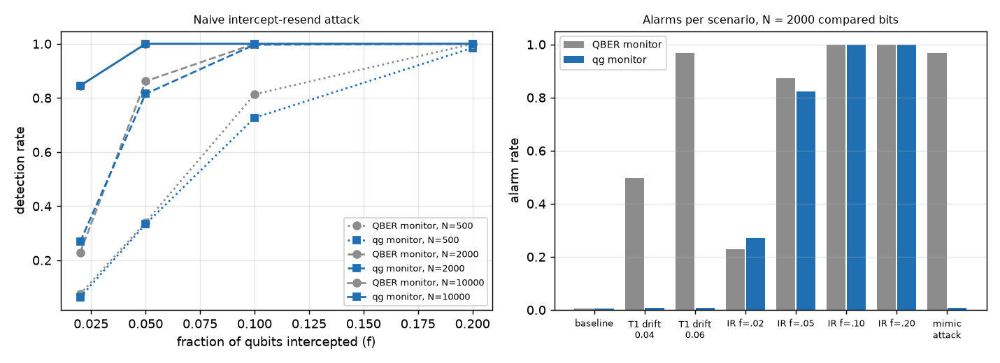

## 41. Certified quantum random numbers (`examples/qrng_qg_certified.py`)

A qubit QRNG prepares |+⟩ and measures Z. Dephasing (T2) and thermal
mixing (§31) leave the output unbiased, but the randomness then becomes
classical noise that an adversary holding the environment can know.
With a trusted measurement and an adversary holding the purification,
her two conditional states are pure with overlap r_⊥/2. By Helstrom:

    P_guess(Z|E) = (1 + √(1 − r_⊥²))/2,   H_min(Z|E) = −log₂ P_guess,
    r_⊥ = √(qg_X² + qg_Y²)

The result does not depend on qg_Z: only the coherence in the measured
basis is private. It is checked against an explicit purification and
Helstrom computation. Readout flips add no certified randomness.

Certified bits per shot, 10⁴ test rounds per setting, §31 readout
(e01 = 0.015, e10 = 0.04). Each cell gives the mean estimate and, in
parentheses, the fraction of runs above the truth (unsafe):

| scenario | truth | naive (output bias) | qg ± pairs | **qg + §31 calibration** |
|---|---|---|---|---|
| ideal \|+⟩ | 1.000 | 0.965 (0) | 0.512 (0) | 0.681 (0) |
| T2: V = 0.8 | 0.322 | 0.964 (**1.00**) | 0.245 (0) | **0.286 (0)** |
| T2: V = 0.5 | 0.100 | 0.965 (**1.00**) | 0.077 (0) | **0.087 (0)** |
| T2: V = 0.2 | 0.015 | 0.965 (**1.00**) | 0.009 (0) | **0.010 (0)** |
| thermal p = 0.05, V = 0.9 | 0.334 | 0.965 (**1.00**) | 0.254 (0) | **0.297 (0)** |
| e10 = 0.10, V = 0.95 | 0.608 | 0.876 (**1.00**) | 0.341 (0) | **0.513 (0)** |

* **The usual bias-based estimate is unsafe whenever the state is not
  pure.** At V = 0.2 it certifies 0.97 bits per shot where 0.015 are
  private.
* **The qg estimate is safe in every run** when each axis is measured with
  both rotations, because the readout offset cancels. With a single
  rotation the offset inflates r_⊥ and overestimates in 7 % of runs at
  V = 0.2.
* **The §31 calibration of b recovers 10–50 % more certified bits.**
* **Near a perfect source certification is shot-hungry.** H_min has an
  infinite slope at r_⊥ = 1, the qg pole again, so a 3σ bound gives 0.68,
  0.81 and 0.89 bits per shot with 10⁴, 10⁵ and 10⁶ test rounds.
* **Honest scope.** This is a device-dependent QRNG (trusted measurement,
  i.i.d. rounds), not device-independent randomness. The formula is
  standard; qg writes it in measured quantities and shows why §31 matters.

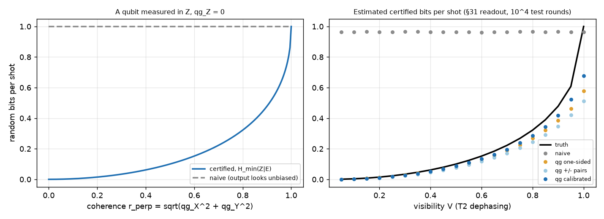

## 42. Certified random numbers on IonQ's noisy simulator (`examples/ionq_sim_qrng.py`)

§41 on a trapped-ion noise model, with a leak that the adversary really
holds. A source ion q starts in |0⟩ and its output is read in X. A second
ion e plays the environment: an MS(0, 0, θ) interaction lets e learn the
X value of q. The output stays a fair coin, but the private randomness
falls to H_min(X|E) = −log₂[(1 + √(1 − r²))/2] with r = |cos 2πθ| (the
§41 formula with X and Z exchanged). Test rounds measure ±Z and ±Y; two
circuits calibrate the readout (§31). All circuits are in IonQ's native
gates (GPI, GPI2, MS) and submitted with `gateset="native"`, so the
service cannot merge the rotations; 5 (q, e) pairs per circuit give 10⁴
samples per setting. Three repetitions per noise model, 132 jobs in all,
free simulator (nothing sent to a QPU).

Certified bits per shot, mean of 3 runs (aria-1 / forte-1 where they differ):

| θ (turns) | truth | naive | qg one-sided | **qg ± pairs** |
|---|---|---|---|---|
| 0 (no leak) | 1.000 | 0.98 | 0.69 | 0.73 |
| 0.04 | 0.680 | 0.99 | 0.53 | **0.56 / 0.55** |
| 0.08 | 0.433 | 0.98 / 0.97 | 0.37 / 0.36 | **0.38 / 0.37** |
| 0.12 | 0.248 | 0.99 | 0.22 / 0.21 | **0.22** |

* **The naive estimate is blind to the leak**: 0.97–1.00 bits per shot in
  every run, above the truth in 100 % of runs with θ > 0 (it certifies
  four times the private randomness at θ = 0.12).
* **The qg estimate is safe in all 24 run × θ cells** and captures
  82–90 % of the truth when there is a leak, 73 % without one (the pole
  at r = 1; §41).
* **Calibration adds nothing here**: the simulator's readout is almost
  perfect (b = 0.9998–1.0000, |a| < 3·10⁻⁴). The 10–50 % gain of §41
  needs hardware-like readout errors; this is a limit of the noise model,
  to be checked on a QPU.
* **Gate noise is counted as lost privacy**: the measured r (0.954, 0.866,
  0.72) is 1–1.5 % below the ideal (0.969, 0.876, 0.729), the MS error.
  The ± estimator is higher than one-sided mainly because it uses twice
  the test rounds; the offset it cancels is negligible on this model.
* **Honest scope.** Vendor noise models on a simulator, not hardware; the
  leak is a designed interaction, not an adversary's strategy search.

## 43. BB84 with finite keys: realistic block sizes and the qg diagnosis (`examples/bb84_finite_key_qg.py`)

§40 used monitoring windows and the asymptotic key rate. Real links cut
the key into finite blocks. This section uses the finite-key bound of
Tomamichel, Lim, Gisin and Renner (Nat. Commun. 3, 634, 2012) on the §40
channel (T1 γ₀ = 0.02, dephasing 0.01, asymmetric detector; Q_Z = 1.74 %,
Q_X = 2.22 %):

    ℓ = n[1 − h(Q_tol + μ)] − 1.1·n·h(Q_Z) − log₂(2/(ε_sec² ε_cor)),
    μ = √[(n+k)/(nk) · (k+1)/k · ln(2/ε_sec)],   ε = 10⁻¹⁰

The key comes from n Z bits and the test from k X bits. The protocol
aborts if the test error exceeds Q_tol. The rate is (1 − ε_rob)ℓ/M, with
M = (√n + √k)² signals. For each n, k and Q_tol are optimised.

**Where qg enters, at no key cost.** After error correction and its
check, Bob knows Alice's key bits, so he has the four error counts, which
are the four qg values of §40, over all n key bits, without disclosing
anything. Announcing an alarm bit costs at most one key bit. An aborted
block's key bits are discarded anyway, so they can be revealed.
Two nested likelihood ratios on the joint model (T1 γ and intercept-resend
f, both free) give an "attack-like" flag (symmetric error beyond any T1)
and a "drift-like" flag (T1 beyond the baseline, whatever the attack).
Each is set to 1 % false alarms on the baseline.

Finite-key rate (secret bits per signal):

| scenario | n_min | n = 10⁴ | 10⁵ | 10⁶ | 10⁷ | asymptotic |
|---|---|---|---|---|---|---|
| baseline | 1.2·10³ | 0.120 | 0.268 | 0.407 | 0.516 | 0.707 |
| T1 drift γ = 0.04 | 1.6·10³ | 0.091 | 0.223 | 0.348 | 0.446 | 0.622 |
| T1 drift γ = 0.06 | 2.0·10³ | 0.068 | 0.182 | 0.294 | 0.383 | 0.544 |
| intercept-resend f = 0.05 | 1.7·10³ | 0.079 | 0.201 | 0.318 | 0.410 | 0.575 |

Protocol tuned on the baseline at n = 10⁵ (k = 7609, Q_tol = 2.67 %),
400 blocks per scenario:

| scenario | protocol aborts | qg: attack-like | qg: drift-like |
|---|---|---|---|
| baseline | 0.010 | 0.020 | 0.015 |
| T1 drift 0.03 | 0.100 | 0.005 | **1.000** |
| T1 drift 0.04 | 0.557 | 0.005 | **1.000** |
| T1 drift 0.06 | 0.995 | 0.007 | **1.000** |
| intercept f = 0.02 | 0.495 | **1.000** | 0.043 |
| intercept f = 0.05 | 1.000 | **1.000** | 0.040 |
| drift 0.04 + intercept 0.02 | 0.995 | **1.000** | **1.000** |
| T1-mimicking attack | 0.995 | 0.013 | 1.000 |

* **Finite keys are expensive.** A block of 10⁴ key bits keeps 17 % of the
  asymptotic rate; 10⁵ keeps 38 %, 10⁶ 58 % and 10⁷ 73 %. Below about
  10³ key bits there is no key. Drift and attack cost key alike.
* **An abort does not say why; qg does.** With 10⁵ key bits the
  attribution is essentially exact. Every drifting block, aborted or not,
  is flagged as drift and not as an attack. Every intercept-resend block
  is flagged as an attack, including the half that did not abort. At
  n = 10⁴ the flags are already 0.97–1.00, and 0.81 for drift 0.03.
* **An attack hidden under drift is caught.** An intercept-resend at
  f = 0.02 on a drifting memory (γ = 0.04) raises both flags in 100 % of
  blocks (97 % at n = 10⁴). The one-parameter GLRT of §40 misses it: it
  gives 0.5 % attack flags and calls 99 % of blocks "drift". The joint
  model fixes a real weakness of §40.
* **Early warning.** At γ = 0.03 only 10 % of blocks abort, but the drift
  flag is up in every block, so the memory can be serviced before the
  link stops. A Q_Z trend would also warn; what qg adds is the
  attribution.
* **Honest scope.** The key length is the standard one: qg does not change
  it, and every error is still charged to Eve. An attacker who mimics T1
  exactly is flagged as drift, by construction. Only two error families
  are modelled, on a single-qubit simulation.

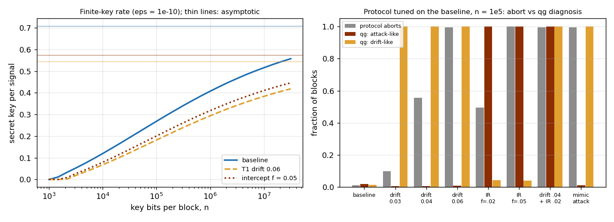

## 44. BB84 on IonQ's noisy simulator: the §43 flags with trapped-ion noise (`examples/ionq_sim_bb84.py`)

§40 and §43 used an analytic channel. Here every part of BB84 is a circuit
run on IonQ's aria-1 and forte-1 noise models (free simulator; nothing sent
to a QPU), and the model behind the flags is fitted, not given.

* **The memory** is amplitude damping built with an ancilla,
  CRY(2 asin √γ) q→m followed by CX m→q. The healthy memory has γ₀ = 0.02;
  drift raises it to 0.03–0.06.
* **Eve** measures and resends: CX q→e in Z, H·CX·H in X, never reading her
  ancilla. A fraction f of the rounds is attacked; the block draws that
  share of its shots, without replacement, from the Eve circuits.
* **The runs**: 32 circuits in native gates, 4 copies each (12 qubits),
  2000 shots, 4 repetitions per noise model, 256 jobs. Each copy is a block
  of n = k = 4000 bits.
* **The flag model** is the joint (γ, f) model of §43 plus two symmetric
  device flip rates ε_Z and ε_X. It is fitted leave-one-repetition-out on
  baseline blocks, with thresholds from a parametric bootstrap at 1 %.

The device adds a nearly symmetric 2.3–2.4 % (aria-1) and 2.8–3.1 %
(forte-1) error per bit, mostly from the two MS gates of the memory
circuit. The fit recovers the designed γ₀ (0.020–0.0225) in every fold.

Flag rates, observed / predicted by the fitted model (16 blocks each):

| scenario | aria-1 QBER | aria-1 attack | aria-1 drift | forte-1 QBER | forte-1 attack | forte-1 drift |
|---|---|---|---|---|---|---|
| baseline | 0.00/0.01 | 0.00/0.00 | 0.00/0.02 | 0.00/0.01 | 0.06/0.00 | 0.06/0.00 |
| drift 0.03 | 0.56/0.36 | 0.00/0.00 | 0.31/0.12 | 0.06/0.20 | 0.06/0.01 | 0.00/0.06 |
| drift 0.04 | 0.94/0.93 | 0.00/0.01 | 0.81/0.73 | 0.38/0.75 | 0.00/0.01 | 0.38/0.46 |
| drift 0.06 | 1.00/1.00 | 0.00/0.00 | **1.00**/1.00 | 1.00/1.00 | 0.00/0.00 | **1.00**/0.99 |
| intercept f = 0.02 | 0.62/0.58 | 0.38/0.21 | 0.00/0.02 | 0.31/0.38 | 0.25/0.15 | 0.00/0.01 |
| intercept f = 0.05 | 1.00/1.00 | **0.88**/0.96 | 0.00/0.01 | 1.00/0.99 | **0.81**/0.88 | 0.06/0.01 |
| intercept f = 0.10 | 1.00/1.00 | **1.00**/1.00 | 0.00/0.01 | 1.00/1.00 | **1.00**/1.00 | 0.06/0.01 |
| drift 0.04 + f = 0.05 | 1.00/1.00 | 0.81/0.94 | 0.81/0.57 | 1.00/1.00 | 0.75/0.84 | 0.31/0.42 |

* **The attribution transfers.** A drifting memory is never taken for an
  attack on aria-1 (0 of 48 blocks) and once in 48 on forte-1. An attack
  is taken for drift in at most 1 of 16 blocks. Large changes (drift 0.06,
  f = 0.10) are attributed in every block.
* **Small blocks, noisy device.** With 4000-bit blocks and 2–3 % device
  noise, small changes are only partly detected: 31–81 % for drift
  0.03–0.04 and 81–88 % for f = 0.05. In the mixed block the drift flag
  falls to 31–81 %. The QBER monitor sees changes as often or more often,
  but cannot say which kind.
* **The model predicts which flag rises.** Most observed rates fall within
  the ±0.12 spread of 16 blocks. The largest misses are near threshold:
  forte-1 QBER at drift 0.04 (0.38 vs 0.75) and aria-1 drift flag at drift
  0.03 (0.31 vs 0.12). Extrapolated with the fitted noise to n = 10⁵ key
  bits, the §43 regime, every scenario is attributed correctly in 99–100 %
  of blocks, with 0.3–2 % cross-flags.
* **Honest scope.** These are vendor noise models on a simulator, not
  hardware. The memory and the attack are designed circuits. The key
  rate is unchanged (§43).

## 45. §5 beyond one pure qubit: mixed states and registers (`qang.statistics`, `examples/multiqubit_error_propagation_qg.py`)

**A. Mixed qubit.** §5's cancellation, Var(θ̂) = 1/N for every θ,
relies on the outcome becoming certain at a pole. A qubit with Bloch
length r < 1 (noisy, or one qubit of an entangled register) never gives
a certain outcome, so with θ̂ = arccos(qg_Z/r):

    Var(θ̂) = (1 − r² cos²θ)/(N r² sin²θ) = [1 + (1 − r²)/(r² sin²θ)]/N

This equals the quantum Cramér–Rao bound 1/(N r²) at the equator and
diverges at the poles. It is the inverse of the Ramsey Fisher information
of §36 with V = r (`propagated_theta_variance_mixed`, `theta_qcrb_variance`).

N·Var(θ̂) with N = 10⁴: delta formula / sampled (share of trials stuck
at the pole):

| θ | r = 1 | r = 0.95 | r = 0.8 |
|---|---|---|---|
| π/2 | 1.00 / 0.99 | 1.11 / 1.10 | 1.56 / 1.55 |
| π/8 | 1.00 / 1.00 | 1.74 / 1.74 | 4.84 / 4.90 |
| π/16 | 1.00 / 1.01 | 3.84 / 3.93 | 15.8 / 19.4 (1 %) |
| π/64 | 1.00 / 1.11 | 45.9 / 18.6 (38 %) | 235 / 38 (45 %) |

With 5 % less purity, the angular error at π/16 is already twice as
large. At π/64, 38–45 % of the estimates land exactly on the pole: the
sampled variance falls below the formula only because the estimate is
biased there. **§5's "the measurement error self-regularizes" is a
pure-state statement.**

**B. Registers.** Per-qubit qg values measured from the same joint shots
are correlated:

    Cov(qg_i, qg_j) = (⟨Z_i Z_j⟩ − qg_i qg_j)/N

Any aggregate needs this covariance (`qg_covariance`,
`delta_method_variance`, `register_witness_variance`), including the
symmetry witness mean(qg_i) of §20–§30, parities and energies.
Standard deviation of the witness for 4 qubits and N = 1000 (×10⁻³):

| state | correct | naive (independent qubits) | sampled |
|---|---|---|---|
| product, θ = π/3 | 13.7 | 13.7 | 13.8 |
| GHZ | 31.6 | 15.8 | 32.1 |
| W | 0.0 | 13.7 | 0.0 |
| Dicke D(4,2) | 0.0 | 15.8 | 0.0 |
| D(4,1) + 2 % bit flips | 4.4 | 13.9 | 4.4 |

The naive error bar can be wrong in either direction. For GHZ it is n
times too small in variance. For a fixed-excitation state it is infinitely
too large: the witness has no shot noise at all.

**C. Consequence for leak detection.** On D(4,1) with 2 % bit flips, the
witness moves by 0.020. A 3σ detection takes 441 shots with the correct
error bar and 4329 with the naive one, about 10× more. If full bitstrings
are kept, counting wrong-weight shots (the kept fraction of the qg
filter) is better still: 7.6 % of shots leak, so on an ideal device the
first such shot is conclusive. The witness error bar matters when only
averages are recorded.

**Honest scope.** These are standard delta-method statistics. The
contribution is to mark where §5 stops holding and which covariance the
register witnesses need.

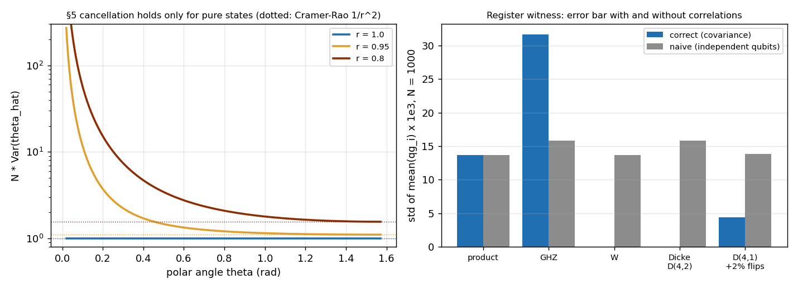

## 46. Pre-registered predictions for the Forte-1 hardware plan (`examples/ionq_hardware_plan.py`)

Frozen on 2026-09-26, before any QPU run. The plan sent with the IonQ
research-credit request has seven tracks (A1–E) on Forte-1, with no
variational loop on hardware. Each prediction below comes from IonQ's
noisy simulator with the forte-1 model. The simulator caps shots at
2000, so the plan's 5000 shots for H₂ will only narrow the spreads.
Track A2 was simulated for this section (`examples/ionq_sim_h2_stretched.py`,
3 runs); the others reuse §38, §39 and §42.

| Track | Simulator prediction (forte-1) | Holds if (hardware) | Fails if |
|---|---|---|---|
| **A1, decisive:** H₂ at 0.735 Å, qg filter, 3 days | readout-corrected 34.8 ± 6.3 → filtered 13.9 ± 5.4 mHa (HF 20.3); 2.5 % of shots discarded | filter cuts the error ≥ 40 % in each run and ends below HF | cut < 20 %: the errors conserve electron number and the witness has nothing to act on |
| A2: H₂ at 1.5 and 2.5 Å | 17.4 ± 2.2 → 9.7 ± 2.4 mHa (−44 %); 11.1 ± 2.7 → 8.8 ± 2.8 mHa (−21 %); HF 87 and 233 | filtered < readout-corrected at both bonds; gain smaller at 2.5 Å | no reduction at 1.5 Å |
| A3: A1 with debiasing | not simulable (debiasing is a hardware feature) | reported: does the filter still add after IonQ's own mitigation? | — |
| B: native-MS ZNE | raw 34.8, 89.2, 140.7 mHa at fold 1, 3, 5; ZNE 6.6 ± 19.0, ZNE + filter 3.0 ± 17.8 | error grows monotonically with the fold | no growth: folding does not amplify the real noise |
| C: XY-QAOA, 5 graphs | P(opt) 0.120 → 0.256 with the filter (×2.09–2.19 on every graph), kept 0.47; random feasible 0.096 | filtered/raw ≥ 1.5 on ≥ 4 of 5 graphs | ratio < 1.2: the XY mixer does not keep the signal on hardware |
| D: Hubbard, 1/2/4 steps | spin leak 0.1 %, 1.8 %, 6.8 %; imbalance error 0.038 → 0.013 (1 step), 0.042 → 0.027 (4 steps, spin filter) | the filters cut the error at every depth; spin leak grows with depth | no gain at 1 step |
| E: QRNG, θ = 0 and 0.08 | readout nearly perfect in the simulator (b ≈ 1); qg ± 0.73 and 0.37 bits (truth 1 and 0.433); naive ≈ 0.97–1 | qg estimates ≤ truth; calibration adds bits because real readout has b < 1 | a qg estimate above truth; or b = 1 on hardware too (then calibration is moot) |

The recorded simulator data behind every number are in
`examples/data/ionq_sim_results.json`, pinned by tests. Whatever the
hardware gives will be reported against this table, including failures.

## 47. The I–η plane of RBM quantum states is swept by the qg marginals (`examples/rbm_mutual_information_qg.py`)

The review by Singh, Bhatia, Saggi, Sajjan and Kais (*Academia Quantum*
3, 2026, doi:10.20935/AcadQuant8243, Sec. 3.2 and Fig. 4) looks at an
RBM learner through its Ising Hamiltonian H(X) = Σaᵢsᵢ + Σbⱼhⱼ + ΣWᵢⱼsᵢhⱼ
and the thermal state P(v, h) ∝ e^(−H). For each visible–hidden pair it
plots:

* η = Cov(s, h), which is read from the imaginary part of the OTOC;
* I, the mutual information between the two units.

The pair (I, η) lies between two analytic bounds, LB(η) and UB(η).
Trained RBMs on transverse-field Ising drivers sit on LB for every size
and field ratio g. The review reads this as a learning principle: the
network uses the least mutual information compatible with the
covariance.

**qg reading.** A pair of ±1 spins is fixed by three numbers: qg_v =
⟨s⟩, qg_h = ⟨h⟩ and η. Then
p(s,t) = [1 + s·qg_v + t·qg_h + st(η + qg_v qg_h)]/4 and
I = qg_S(qg_v) + qg_S(qg_h) − H(p) (§7). Checked on a grid:

* **LB(η)** is exactly the case qg_v = qg_h = 0, and it is the minimum of
  I over the marginals at fixed η.
* **UB(η)** is the locked pair with |qg_v| = |qg_h| = √(1 − η).
* **In between**, to leading order, I − LB ≈ η²(qg_v² + qg_h²)/(2 ln 2).

**The symmetry explanation, and its test.** The transverse-field Ising
driver is Z₂-symmetric, so its ground state has ⟨Z⟩ = 0. A symmetric RBM
(a = b = 0) then has zero marginals. On this reading, LB saturation is
forced by the symmetry. Prediction, which could have failed: a
longitudinal field moves the same learner off LB, by the amount the
marginals set.

Setup: real positive RBM, n = 6, α = 1, periodic chain, exact
enumeration, 3 seeds (medians):

| g | h_z | fidelity | \|qg_v\| | \|qg_h\| | mean I − LB | max I − LB |
|---|---|---|---|---|---|---|
| 1.0 | 0 | 1.0000 | 0.0001 | 0.0016 | 3·10⁻⁷ | 1·10⁻⁵ |
| 2.0 | 0 | 1.0000 | 0.0000 | 0.0034 | 7·10⁻⁷ | 2·10⁻⁵ |
| 1.0 | 0.1 | 1.0000 | 0.39 | 0.45 | 1.6·10⁻² | 0.10 |
| 1.0 | 0.3 | 1.0000 | 0.52 | 0.42 | 1.4·10⁻² | 0.17 |
| 2.0 | 0.1 | 1.0000 | 0.07 | 0.09 | 5.2·10⁻⁴ | 5·10⁻³ |
| 2.0 | 0.3 | 1.0000 | 0.18 | 0.19 | 2.7·10⁻³ | 3·10⁻² |
| 0.5 | 0 (random start) | 0.50 | 0.81 | 0.77 | 1.1·10⁻² | 0.12 |
| 0.5 | 0 (a = b = 0 start) | 1.0000 | 0.0002 | 0.0001 | 1.5·10⁻⁸ | 1·10⁻⁷ |

* **The review's observation is reproduced.** With the symmetric driver,
  trained RBMs sit on LB (gap below 2·10⁻⁵ bits) because their marginals
  vanish.
* **The prediction holds.** A longitudinal field moves the same learner
  off LB, in step with the marginals. The small-bias formula matches the
  gap at g = 2: 5.3·10⁻⁴ vs 5.2·10⁻⁴, and 2.6·10⁻³ vs 2.7·10⁻³.
* **Same physics, two positions.** In the ordered phase the same target
  admits two RBMs:
  - from a random start, training breaks the symmetry (fidelity 0.50,
    marginals 0.8) and the points leave LB;
  - from a = b = 0, it finds the symmetric ground state exactly and the
    points sit on LB.

  The position in the I–η plane is set by the marginals, not by a
  minimum-information principle.
* **Honest scope.** Small n with exact enumeration. The review's
  stochastic reconfiguration and Monte Carlo sampling at larger N are not
  reproduced. The claim is limited: LB saturation is what zero marginals
  imply, and breaking the symmetry (by a field or by the learner) removes
  it by the amount the marginals predict.

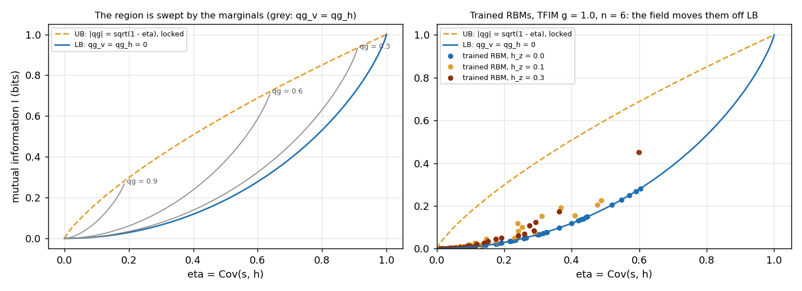

Written up as a short comment: `manuscript/rbm_comment/main.tex`
(PDF `manuscript/qang_rbm_comment.pdf`).

## 48. Coherent MS over-rotation and drift: what survives for the filter and for ZNE (`examples/coherent_drift_filter_zne.py`)

IonQ's cloud noise models are stochastic and gate-level (§42). Real
trapped-ion gates also over- or under-rotate the Mølmer–Sørensen angle by
a small fraction ε, and ε drifts between calibrations. This is what we
told IonQ the simulator cannot test.

**Setup.** Exact density-matrix simulation of the plan's own native
circuits (GPI, GPI2, MS), with:

* every MS angle θ → θ(1 + ε);
* drift: ε drawn per circuit (per job), ε̄ + σN(0, 1);
* stochastic noise: 2-qubit depolarizing 0.005 per MS, 1-qubit 3·10⁻⁴;
* symmetric readout error 0.5 %, corrected with calibration circuits.

Predictions made before running:

* **Folding cannot amplify a coherent angle error.** MS(φ₀+½) is the exact
  inverse of MS(φ₀) for the same over-rotated angle, so MS·MS⁻¹·MS = MS
  (checked to 10⁻¹⁶). ZNE should extrapolate to the coherent-only error,
  not to zero.
* **The filter should catch the number-breaking part.** The H₂ ansatz
  and the XY mixer conserve particle number only if every CX is exact.

H₂ at equilibrium, error vs FCI in mHa (HF 20.3), infinite shots:

| ε | readout-corrected | qg filter | ZNE | ZNE + filter | coherent error alone (raw / filtered) |
|---|---|---|---|---|---|
| 0 | 13.54 | 5.59 | 3.21 | 1.62 | 0 / 0 |
| 1 % | 13.66 | 5.60 | 3.33 | 1.63 | 0.12 / 0.01 |
| 2 % | 14.01 | 5.63 | 3.68 | 1.65 | 0.48 / 0.03 |
| 5 % | 16.47 | 5.80 | **6.17** | 1.81 | 2.97 / **0.19** |

* **ZNE passes the coherent error through.** At ε = 5 % its result moves
  by +2.96 mHa, which is the coherent-only error (2.97). The folds grow
  with the stochastic part alone: the same slope, shifted.
* **The filter removes 94 % of the coherent error.** An over-rotated CX
  leaks weight out of the two-electron sector to first order. The error
  that stays in the sector is second order, because the ansatz sits at
  its energy minimum.
* **ZNE + filter is the most robust combination:** 1.6–1.8 mHa across the
  whole range.
* **Drift** (ε ~ 2 % + 2 % N) leaves the filter at 5.7 mHa and widens ZNE
  (RMS 3.2 → 4.8 mHa). With 5000 shots per circuit, ZNE's RMS is 10.3 mHa
  against 6.6 for the filter, dominated by extrapolated shot noise as in
  §39.
* **XY-QAOA (graph 0, 8 qubits, 150 MS).** P(opt) goes from 0.125 to
  0.238 with the filter at ε = 0, and from 0.075 to 0.197 at ε = 5 %. The
  doubling survives and grows to 2.6×, because the over-rotation breaks
  the mixer's number conservation and the filter removes most of what it
  breaks.

**For the hardware plan (§46).** Coherent MS errors and drift do not
threaten the decisive prediction (A1). They bias ZNE (track B) by the
coherent error, so B must be read against the filter, not alone. IonQ's
debiasing (A3) randomises gate frames and should turn part of the
coherent error into stochastic error, which ZNE can then extrapolate.
This adds a second, qualitative prediction to A3.

**Honest scope.** A model, not a device:

* one type of coherent error (the MS angle) and Gaussian drift;
* stochastic noise below IonQ's forte-1 model (raw 13.5 vs 34.8 mHa), so
  the absolute numbers are not predictions.

The claim is qualitative and follows from the structure: ZNE by folding
is blind to coherent angle errors, and the qg filter removes their
number-breaking part.

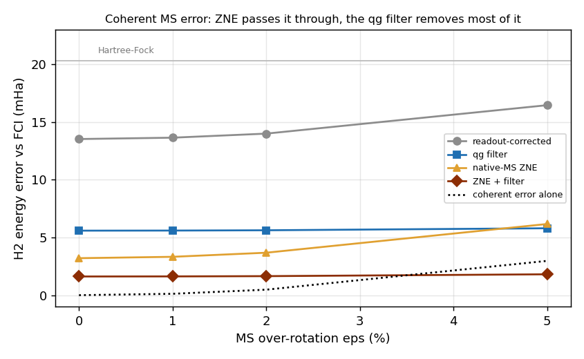

## 49. BB84 beyond intercept-resend: partial cloning, one-basis attacks and T2 drift (`examples/bb84_attacks_beyond_ir_qg.py`)

The §43 flags know two error families: T1 drift and intercept-resend in
both bases. From Bob's side, any individual attack is a Pauli channel
(p_x, p_y, p_z). Z-basis errors come from p_x + p_y, and X-basis errors
from p_z + p_y:

| attack | (p_x, p_y, p_z) | same counts as |
|---|---|---|
| intercept-resend, both bases, fraction f | (f/4, 0, f/4) | — |
| optimal phase-covariant cloner, disturbance D | (0, D, 0) | intercept-resend with f = 4D |
| Z-only intercept, fraction f | (0, 0, f/2) | **T2 drift** (1−2p′) = (1−2p₀)(1−f) |
| X-only intercept, fraction f | (f/2, 0, 0) | no natural noise |

These identities hold to 10⁻¹⁶. Setup as §43: n = 10⁵, k = 7609, 400
blocks per scenario. The model is extended with a dephasing family and
three one-sided nested flags: attack-like, T1-like (γ > γ₀) and T2-like
(p > p₀).

| scenario | attack | T1 | T2 | §43 model: attack |
|---|---|---|---|---|
| baseline | 0.020 | 0.005 | 0.033 | 0.020 |
| T1 drift 0.04 | 0.018 | **1.00** | 0.033 | 0.015 |
| T2 drift p = 0.02 / 0.03 | 0.007 / 0.020 | 0.01 | **1.00** | **0.075 / 0.268** |
| intercept-resend f = 0.05 | **1.00** | 0.055 | 0.028 | 1.00 |
| cloner D = 0.0125 / 0.025 | **1.00** | 0.055 | 0.02–0.04 | 1.00 |
| Z-only intercept f = 0.02 / 0.04 | 0.013 | 0.02–0.03 | **1.00** | 0.06 / 0.27 |
| X-only intercept f = 0.04 | **1.00** | 0.048 | 0.000 | 1.00 |
| T2 drift + cloner | **1.00** | 0.043 | **0.995** | 1.00 |

* **Partial cloning is caught.** The optimal cloner is flagged in every
  block, exactly like intercept-resend with f = 4D. What no error
  statistic can show is that the cloner gives Eve more information per
  error; the key rate already charges every error to Eve.
* **§43 had a false alarm, now fixed.** Without a dephasing family, T2
  drift raised the attack flag in 7.5 % and 27 % of blocks. With the
  family, the false alarm drops to 0.7–2 % and the verdict is T2-like in
  every block.
* **A second blind spot, by construction.** A Z-only intercept produces
  exactly the counts of T2 drift. It is flagged T2-like and not as an
  attack. This is the twin of the T1-mimicking attack of §40: an attacker
  who hides inside an error type the hardware makes naturally. An X-only
  intercept has no natural twin and is caught every time.
* **Mixtures are resolved:** T2 drift plus a cloner raises both flags.
* **Honest scope.** Only individual attacks, modelled as Pauli channels;
  collective and detector attacks are not modelled. This is diagnosis, not
  security.

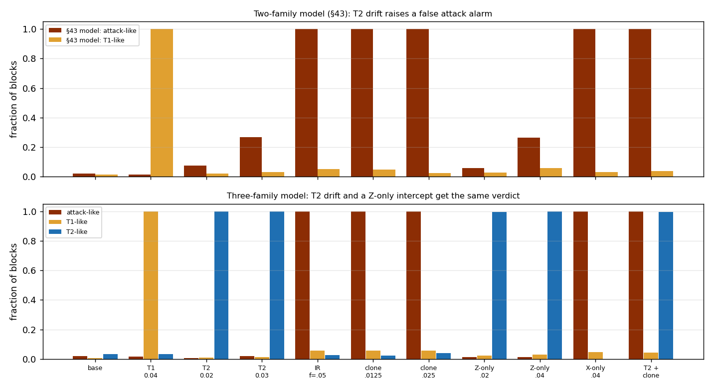

## 50. Why the filter helps H2 and not LiH: reach, not routing (`examples/filter_scaling_lih_qg.py`)

§21 found the electron-number filter cutting the H₂ error 3× and doing
nothing for 6-qubit LiH. It read the witness as "unital scrambling from 60
routed gates". Here that explanation is split into parts that can each be
measured:

* **reach:** the filter acts on Z-basis shots only;
* **routing:** all-to-all vs heavy-hex;
* **depth:** 1, 2 or 3 ansatz layers.

All errors are against the noiseless energy of the same circuit, with
readout correction everywhere and 200,000 shots.

| case | 2q gates | groups | kept | Z group raw → filtered | X/Y groups raw | total raw → +filter | ceiling (Z exact) |
|---|---|---|---|---|---|---|---|
| H₂ all-to-all | 3 | 5 | 0.991 | 13.0 → 4.9 | 0.9 | 13.9 → 5.9 | 0.9 |
| H₂ brisbane | 6 | 5 | 0.973 | 20.6 → 2.8 | 2.4 | 23.0 → 5.2 | 2.4 |
| LiH all-to-all L1 | 20 | 17 | 0.910 | −2.2 → −1.9 | 26.2 | 24.0 → 24.3 | 26.2 |
| LiH all-to-all L3 | 60 | 17 | 0.766 | −20.8 → −12.4 | 97.4 | 76.6 → 85.0 | 97.4 |
| LiH brisbane L2 | 40 | 17 | 0.686 | 14.4 → −2.0 | 71.9 | 86.3 → 69.8 | 71.9 |
| LiH brisbane L3 | 60 | 17 | 0.585 | −30.5 → −18.0 | 165.8 | 135.3 → 147.9 | 165.8 |

* **Reach is the main reason.**
  - In H₂ the hardware error sits in the Z group (13.0 of 13.9 mHa), where
    the filter can act.
  - In LiH it sits in the 16 X/Y groups (26–166 mHa). Even a perfect
    Z-basis filter would leave the "ceiling" column.
* **Routing is not the reason.** The LiH ansatz is nearest-neighbour, so
  it needs the same 20/40/60 two-qubit gates on an all-to-all device.
  The "60 routed gates" of §21 were not routing. The all-to-all model
  cuts the error by about 40 % without changing the picture.
* **Scrambling is real but secondary.** The kept fraction falls from 0.91
  to 0.59 with depth, and the filter does fix the Z group. But that group
  carries a small part of the LiH error.
* **The qg remedy for the X/Y groups fails.**
  - The idea: rescale them by the depolarizing strength read from the
    kept fraction, 1 − δ = (K − c)/(1 − c).
  - The result: it overcorrects by 2–3×, e.g. +97 → −124 mHa.
  - The reason: the actual shrink of the X/Y groups is 0.72–0.95, while K
    implies 0.46–0.88, and the ratio between them is not constant (0.34–0.53
    for LiH, above 1 for H₂). Reading the witness as global depolarizing
    is wrong for local gate noise.
* **Scaling.** For larger molecules the X/Y groups grow in number (about
  n⁴ terms) and carry most of the correlation energy. A Z-basis number
  filter therefore reaches a shrinking share of the error. qg symmetry
  checks would have to act inside the rotated bases, for example through
  the electron-number parity, which commutes with every number-conserving
  term. That needs an ancilla or an entangled basis and is not tested
  here.

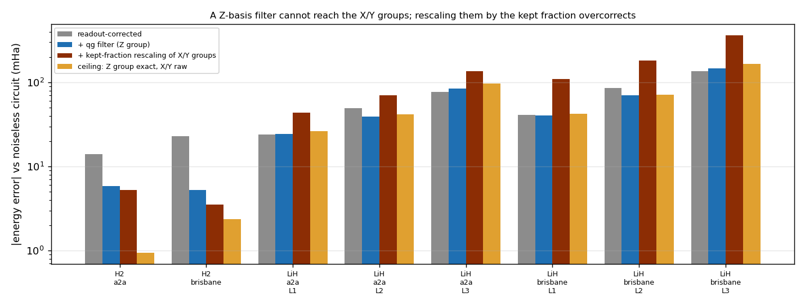

## 51. Error bars for qg_S from finite shots (`qang.statistics.qg_s_estimate`, `examples/qg_s_error_bars.py`)

§10.2 fixed the **bias** of the qg_S estimator with Miller–Madow. What was
still missing is an honest **error bar**. Shannon entropy is flat at its
maximum, so the delta method gives a zero standard error exactly where
qg_S ≈ 1 (an equatorial qubit, a scrambled register).

**The qg-native fix for one qubit.** Use the §7 identity
qg_S = H((1 + qg_Z)/2): take the Wilson interval for qg_Z (§15) and map it
through H. H is unimodal with its maximum at qg_Z = 0, so the image is
[min H(ends), 1] when the qg_Z interval contains 0. Its coverage is at
least that of the qg_Z interval.

Coverage of 95 % intervals over 2000 trials (Wald = delta method; boot =
bootstrap percentile; Bayes = Haar prior, equal-tailed; qg-Wilson =
Wilson interval for qg_Z mapped through H):

| qg_Z | qg_S | N = 20: Wald / boot / Bayes / **qg-Wilson** | N = 100 | N = 1000 |
|---|---|---|---|---|
| 0 | 1.000 | 1.00* / .93 / .00 / **.95** | 1.00* / .85 / .00 / **.93** | 1.00* / .20 / .00 / **.95** |
| 0.3 | 0.934 | .92 / .96 / .98 / **.99** | .91 / .95 / .95 / **.95** | .94 / .96 / .95 / **.96** |
| 0.9 | 0.286 | .62 / .64 / .93 / **.92** | .95 / .95 / .96 / **.96** | .94 / .94 / .94 / **.94** |
| 0.99 | 0.045 | .09 / .10 / .90 / **.90** | .39 / .39 / .91 / **.91** | .95 / .95 / .96 / **.96** |

\* The Wald interval is clipped at the boundary; its width there is 0.003
at N = 1000, so this is not a real interval.

* **The mapped Wilson interval is the only one that never fails**
  (0.90–0.99).
  - Wald and the bootstrap collapse near a pole when shots are few.
  - The bootstrap also fails at the maximum (20 % coverage at N = 1000).
  - An equal-tailed Bayesian interval can never contain qg_S = 1.
* **Best point estimate: Miller–Madow**, with bias of at most 0.02.

**4-qubit register (normalized qg_S; Porter–Thomas distribution mixed
with uniform at weight λ).** Coverage is given at N = 100 / 1000:

| λ | qg_S | Wald around Miller–Madow | bootstrap | Bayes, Haar prior Dirichlet(1) |
|---|---|---|---|---|
| 0 | 0.858 | .91 / .95 | .81 / .93 | **.97** / .95 |
| 0.5 | 0.964 | .94 / .95 | .73 / .92 | .41 / .89 |
| 0.9 | 0.998 | .97 / .97 | .55 / .77 | .00 / .00 |
| 0.99 | 1.000 | .97 / .99 | .50 / .63 | .00 / .00 |

* **For the register the delta method around Miller–Madow works.** With
  16 outcomes the sample distribution is never flat enough for the
  variance to vanish.
* **The bootstrap fails as the register is depolarized**, because
  resampling doubles the downward bias of the entropy.
* **The Haar prior only helps when the state is Haar-like.** For a
  Haar-random state the outcome distribution is exactly Dirichlet(1).
  There this prior is the best choice (0.97 coverage, bias −0.001 at 100
  shots, against −0.028 for the plug-in). Near uniform it is the worst
  (0 %).

**Recommendation, now in the library:**

* single qubit: `qg_s_estimate(k0, n)`, which gives the Miller–Madow
  point estimate with the mapped Wilson interval;
* register: Miller–Madow with the delta-method interval;
* never the bootstrap or a Haar-prior credible interval near the maximum.

**Honest scope.** The estimators are standard. The contribution is the
single-qubit interval built on the qg_Z ↔ qg_S identity, and the map of
where each method fails.

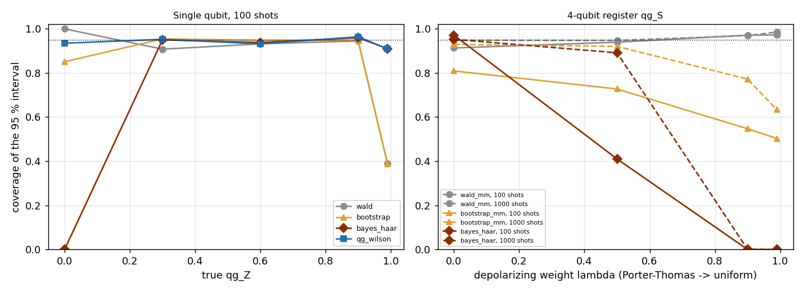

## 52. LiH: symmetry checks that reach every measurement group (`examples/lih_parity_verification_qg.py`)

§50 found that the LiH error sits in the 16 X/Y measurement groups, where
a Z-basis filter never looks. Two checks reach every group, because both
commute with every number-conserving term:

* **Parity.** The electron-number parity P = Z₀⋯Z₅, measured on one
  ancilla with 6 CNOTs before the basis rotation.
* **N mod 4.** A Hadamard test of U = e^{iπN/2} = S₀⋯S₅ on a second
  ancilla, using 6 controlled phases. On the even sector U = ±1, so it
  reads N mod 4 and also rejects the errors that change N by 2.

**A. Ideal projections, exact density matrix.** Error vs the noiseless
circuit in mHa, kept fraction in brackets:

| | no check | parity | N mod 4 | N = 2 (ceiling) |
|---|---|---|---|---|
| all-to-all L1 | 23.7 | 15.3 (0.93) | 0.3 (0.91) | 0.2 (0.91) |
| all-to-all L3 | 76.1 | 49.4 (0.83) | 6.9 (0.77) | 6.2 (0.77) |
| brisbane L1 | 41.0 | 25.5 (0.86) | 0.7 (0.82) | 0.4 (0.82) |
| brisbane L3 | 135.6 | 98.4 (0.69) | 17.3 (0.59) | 13.3 (0.59) |

**B. With ancillas.** All-to-all noise, 200,000 shots. "Raw" includes the
noise the ancilla gates add to the system:

| | raw | checked | kept | extra CX |
|---|---|---|---|---|
| L1 parity | 25.2 | 15.9 | 0.92 | 6 |
| L1 parity + mod 4 | 30.1 | **3.8** | 0.86 | 18 |
| L3 parity | 79.2 | 52.1 | 0.81 | 6 |
| L3 parity + mod 4 | 83.9 | **13.4** | 0.72 | 18 |

* **Symmetry verification works for LiH once it reaches every group.**
  The full number projection cuts the error 10–100×, so the failure in
  §21 and §50 was reach, not a limit of the method.
* **Parity alone recovers about a third.** Most of the remaining errors
  change N by 2 (a two-qubit error that flips both qubits of a pair).
  The N mod 4 check catches those and lands within 10–30 % of the ceiling.
* **The ancilla version keeps most of the ideal gain,** despite 6–18
  extra noisy gates. Parity + mod 4 cuts the LiH error 6–8×; at L3 it
  goes from 83.9 to 13.4 mHa, where §50's best was 76.6.
* **First LiH case in the repository to beat Hartree–Fock.** The
  noiseless L3 circuit is 0.66 mHa above FCI, so 13.4 mHa here is about
  14 mHa above FCI, just below Hartree–Fock (16.3). That holds on this
  noise model only.
* **Cost:** one or two ancillas coupled to every qubit (natural on
  trapped ions, SWAP-heavy on heavy-hex), and 14–28 % of shots discarded.
* **Honest scope.** Parity checks with an ancilla are standard symmetry
  verification (Bonet-Monroig et al. 2018), and N mod 4 is the obvious
  extension. The qg content is the diagnosis that led here (§50) and the
  witness reading of the kept fraction. The heavy-hex numbers are ideal
  projections only; the ancilla circuits were not routed.

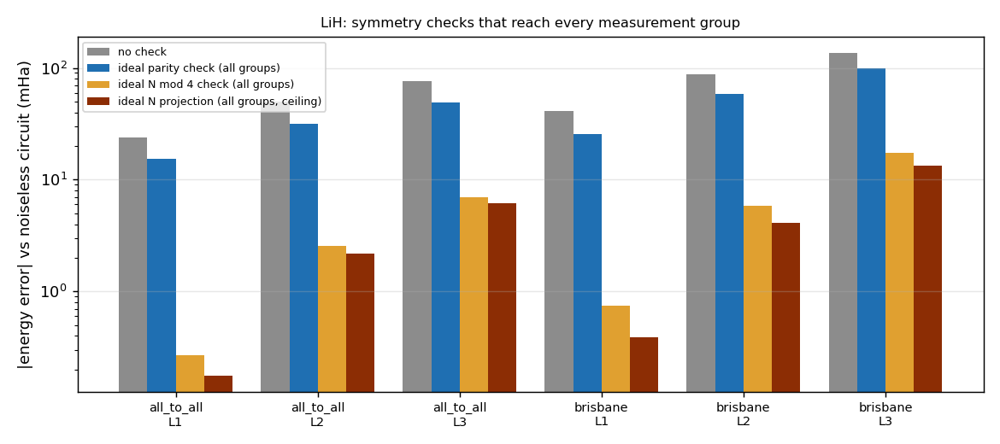

## 53. LiH with the mod-4 check on IonQ's forte-1 noise model (`examples/ionq_sim_lih_mod4.py`)

§52 run on IonQ's free noisy simulator, as a candidate hardware track
recorded before any QPU run. The circuits: the 3-layer LiH ansatz, a
parity ancilla and an N mod 4 ancilla (8 qubits, 17 measurement groups
plus 2 calibration circuits), 2000 shots per circuit, 5 runs. All
numbers are the error in mHa against the noiseless circuit:

| | forte-1 (5 runs) | generic all-to-all (§52) |
|---|---|---|
| raw | 145.5 ± 10.1 | 83.9 |
| parity (kept 0.70) | 116.3 ± 11.6 | 52.1 |
| parity + mod 4 (kept 0.56) | **38.6 ± 8.7** | **13.4** |

* **The mod-4 check survives the vendor noise model.** It cuts the error
  3.8×; parity alone cuts it only 1.25×.
* **The "beats Hartree–Fock" result of §52 does not carry over.** forte-1
  is noisier than the generic model, so the checked estimate (about 39 mHa
  above FCI) stays above Hartree–Fock (16.3).
* **Pre-registered criterion for a hardware run:**
  - it holds if parity + mod 4 cuts the error at least 2.5× in each run,
    while parity alone gives less than 1.5×;
  - it fails if the cut is below 1.5×.
* **Cost** (public estimator, rough): about $110–120 per circuit at 1000
  shots, so about $2,200 for the 19 circuits, or about $1,100 at 500
  shots. That does not fit in the current request without dropping other
  tracks.

## 54. Do the electron-number checks scale beyond LiH? (`examples/symmetry_checks_scaling_qg.py`)

The §52 checks (parity and N mod 4, on ancillas) applied to larger,
strongly correlated molecules:

* **Hamiltonians:** STO-3G, Jordan–Wigner, built with PySCF and
  OpenFermion.
* **Ansatz:** the number-conserving brick, 3 layers, optimized
  classically, with spin-orbitals ordered spin-blocked (the interleaved
  order traps the brick at Hartree–Fock).
* **Noise and metric:** the all-to-all noise model; error against the
  noiseless circuit.

Ideal projections (mHa, kept fraction in brackets):

| | CX | no check | parity | N mod 4 | N (ceiling) |
|---|---|---|---|---|---|
| LiH 6 q, N=2 (§52) | 60 | 76.1 | 49.4 (0.83) | 6.9 (0.77) | 6.2 (0.77) |
| H₄ 8 q, N=4 | 84 | 238.5 | 146.4 (0.77) | 72.2 (0.72) | 70.5 (0.72) |
| H₂O 8 q, N=4 (4e, 4o) | 84 | 292.2 | 187.5 (0.77) | 48.8 (0.71) | 44.0 (0.71) |
| H₆ 12 q, N=6 | 132 | 407.6 | 279.9 (0.69) | 143.8 (0.60) | 135.2 (0.59) |

With ancillas (exact noisy 10-qubit circuits): H₄ goes 272.8 → 100.0 mHa
(2.7×) and H₂O goes 324.5 → 77.0 (4.2×), against 6× for LiH.

* **The checks keep working, with a smaller factor.**
  - N mod 4 comes within 2–10 % of the full number projection in every
    case, so two ancillas suffice up to 12 qubits.
  - Parity alone recovers 35–40 %.
* **What shrinks is the ceiling itself.**
  - The share of the error that changes N falls from 92 % (LiH, 60 CX) to
    70–85 % (84 CX) and to 67 % (H₆, 132 CX).
  - The rest is number-conserving (two-qubit errors on a hopping pair,
    dephasing), which no number check can see.
* **Against Hartree–Fock**, stretched hydrogen chains are where mean
  field fails:
  - The noiseless H₄ circuit is 50.8 mHa above exact (HF 167.0).
  - With checks the noisy estimate is about 123 mHa above exact (ideal
    projections) or about 151 (with ancillas), both below HF.
  - H₆: about 232 vs HF 245, with ideal projections only.
  - H₂O at equilibrium (HF only 7.4 above exact) is far from HF in every
    case.
* **Scaling reading.** Number checks do not stop working as molecules
  grow, but they catch a shrinking share of the error. Beyond about 100
  two-qubit gates they need a partner for in-sector errors: ZNE (§48), or
  other symmetries such as S_z and S².
* **Honest scope.** One noise model and one ansatz family. The 12-qubit
  case uses ideal projections only. The checks are standard symmetry
  verification; the contribution is how their reach and ceiling scale.

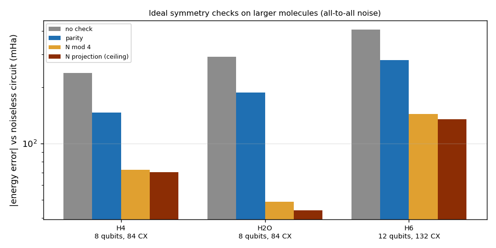

## 55. Spin-resolved checks: N_up and N_down separately (`examples/spin_checks_qg.py`)

§54 found that the share of the error a total-number check can remove
shrinks with circuit size. The Hamiltonian conserves more than N: it
conserves N_up and N_down separately. In qg terms the witness splits into
one register mean per spin block, as the spin filters of §28 did for
Hubbard.

**Setup.**

* **Ansatz:** XX+YY rotations and controlled phases inside each spin
  block, plus an up–down controlled phase on each spatial orbital. It
  keeps the ideal state entirely in the (N_up, N_down) sector (weight
  1.000000).
* **Noise:** the all-to-all model; errors are against the noiseless
  circuit.
* **With ancillas:** a parity ancilla and an N mod 4 ancilla per spin
  block (4 ancillas), against the total checks of §54 (2 ancillas). Both
  add the same 24 two-qubit gates.

Ideal projections (mHa, kept fraction in brackets):

| | CX | no check | N (ceiling of §54) | spin parities | N_up and N_down |
|---|---|---|---|---|---|
| H₄ 8 q | 96 | 285.9 | 75.7 (0.68) | 135.1 (0.71) | **66.8** (0.67) |
| H₂O 8 q | 96 | 366.4 | 57.8 (0.67) | 173.1 (0.71) | **46.2** (0.66) |
| H₆ 12 q | 156 | 404.3 | 113.9 (0.54) | 222.8 (0.60) | **90.4** (0.51) |

With ancillas: H₄ goes from 106.4 (total) to **89.3** (spin), and H₂O
from 95.4 to **67.5**.

* **Checking N_up and N_down separately removes a further 12–21 %** of
  the error beyond the total-number ceiling with ideal projections, and
  16–29 % with real ancillas.
  - The two-qubit-gate cost is the same; the checks need two more
    ancillas and discard 1–2 points more shots.
  - On H₆ the removable share rises from 72 % to 78 %.
* **The gain is real but modest.** Most of the residual error conserves
  both number and spin (ZZ-type two-qubit errors, for example), and no
  check of these symmetries sees it.
* **Parities alone are weak** (135–223 mHa). The per-spin mod-4 ancillas
  carry the benefit.
* **Honest scope.**
  - The ansatz differs from §54's, because it must conserve spin, so
    the numbers are not directly comparable.
  - H₆ uses ideal projections only.
  - This is standard symmetry verification; the contribution is how
    much a second conserved quantity adds.

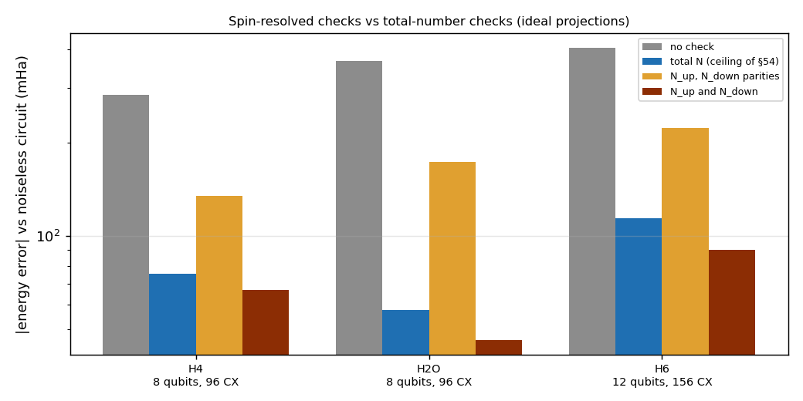

## 56. Qubit quantum batteries in qg: storage, certification and locked charge (`examples/battery_ergotropy_qg.py`)

A qubit with H = ω|1⟩⟨1| and Bloch vector (qg_X, qg_Y, qg_Z), of length r,
stores energy ω(1 − qg_Z)/2. Its ergotropy, the work a unitary can
extract, is

    W = (ω/2)(r − qg_Z) = W_inc + W_coh,
    W_inc = ω·max(0, −qg_Z),     W_coh = (ω/2)(r − |qg_Z|)

These match the general eigenvalue formula to 3·10⁻¹⁶ on 200 random
states, and the storage formula matches an integrated Lindblad equation.

**Storage under T1 and T2.** A battery charged at polar angle θ ages as
qg_Z(t) = 1 − (1 − cos θ)e^{−t/T1} and r⊥(t) = sin θ·e^{−t/T2}. Best angle
and ergotropy (best / fully inverted / equator, in units of ω):

| T2/T1 | crossover t_c | t = 0.5 T1 | t = T1 | t = 2 T1 |
|---|---|---|---|---|
| 2 | 0.288 T1 = ln(4/3) | 0.70π: .297 / .213 / .240 | 0.58π: .129 / 0 / .122 | .038 / 0 / .038 |
| 1 | 0.405 T1 = ln(3/2) | 0.78π: .234 / .213 / .165 | 0.59π: .054 / 0 / .050 | .005 / 0 / .005 |
| 0.5 | 0.618 T1 | π: .213 / .213 / .073 | 0.60π: .008 / 0 / .007 | ≈ 0 |
| 0.2 | 0.692 T1 | π: .213 / .213 / .004 | ≈ 0 | ≈ 0 |

* **Charging rule.** Charge fully (θ = π) if the battery will be used
  before t_c. Otherwise tilt it, to about 0.6π at t = T1.
  - t_c solves x^{2T1/T2 − 1} = 2(2x − 1), with x = e^{−t/T1}. This comes
    from a small-tilt analysis and equals the numerical optimum to 10⁻⁶.
  - As T2 shrinks, t_c tends to T1 ln 2, the moment the inverted battery
    stops storing anything.
* **Coherence buys storage time only when T2 is comparable to T1.** At
  t = T1, a tilted battery stores 0.13ω (T2 = 2T1) or 0.05ω (T2 = T1),
  where the inverted one stores nothing. At T2 = 0.2 T1 it buys nothing.
  Trapped ions (no T1) should always charge fully.
* **Certification from shots.**
  - The plug-in estimate overestimates in more than half of the runs, and
    it reports positive ergotropy for a passive state in every run: the
    three-axis shot noise inflates r.
  - A 3σ lower bound is never unsafe, but it is expensive. With 1000
    shots per axis it certifies 0.086 of 0.213ω, and nothing for a nearly
    discharged battery.
* **Locked charge in registers** (n = 4, two excitations, T2 = T1). The
  Dicke state D(4,2) stores 2ω, all globally extractable, but every qubit
  alone is passive (qg_Z = 0, no coherence).
  - The sum of local ergotropies is 0 for Dicke, against 2ω for a product
    battery with the same energy.
  - The register mean qg_Z is identical for both, so it cannot tell them
    apart; the local sum can.
  - The locked charge is also more fragile under local noise: 0.71 vs
    1.05ω at 0.3 T1, and 0.05 vs 0.41ω at 0.7 T1.
* **Honest scope.** The formulas are standard single-qubit ergotropy
  written in qg. Coherence-assisted storage and locally passive, globally
  charged batteries are known in the literature. The contributions are
  the T2/T1 charging rule with its closed-form crossover, the
  certification cost, and the qg reading of which charge is locally
  extractable.

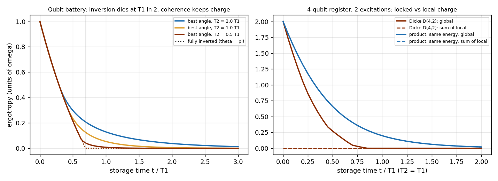

## 57. Bell pairs in a quantum network, read in qg (`examples/bell_pairs_network_qg.py`)

A shared pair meant to be |Φ+⟩ is described by three two-qubit
correlations and two single-qubit polar biases: c_x = ⟨XX⟩, c_y = ⟨YY⟩,
c_z = ⟨ZZ⟩, m_A = ⟨Z_A⟩ and m_B = ⟨Z_B⟩. Three measurement settings
give all five. From them:

* the fidelity, exact for any state: F = (1 + c_x − c_y + c_z)/4;
* the Bell-diagonal weights, which say which error dominates: Φ− is a
  phase flip, Ψ+ a bit flip, Ψ− both;
* a T1 witness from m_A and m_B.

**A. Noise signatures** (p = 0.1 on each half):

| noise | c_x | c_y | c_z | m_A = m_B | F | largest error |
|---|---|---|---|---|---|---|
| dephasing | +0.64 | −0.64 | **+1.00** | 0 | 0.820 | Φ− |
| bit flip | **+1.00** | −0.64 | +0.64 | 0 | 0.820 | Ψ+ |
| Y flip | +0.64 | **−1.00** | +0.64 | 0 | 0.820 | Ψ− |
| depolarizing | +0.81 | −0.81 | +0.81 | 0 | 0.858 | all equal |
| amplitude damping | +0.90 | −0.90 | +0.82 | **+0.10** | 0.905 | Ψ+ |

Each Pauli noise leaves one correlation at its ideal value. Only memory
T1 moves the local polar biases.

**B. Which distillation.** DEJMPS combines the Φ+ weight with the error
sitting in one slot (B), and local rotations choose which error goes
there. Output fidelity of one round (success probability in brackets):

| input | F_in | textbook slot (Ψ−) | best slot | qg rule, 200 shots per setting |
|---|---|---|---|---|
| dephasing 0.1 | 0.820 | 0.954 (0.705) | 0.954 | 0.954 (right slot 100 %) |
| Y flip 0.1 | 0.820 | **0.705** (1.000) | 0.954 | 0.954 (100 %) |
| amplitude damping 0.2 | 0.820 | 0.828 (0.820) | 0.920 | 0.915 (94 %) |

* **The textbook order can make things worse.** For Y-flip noise one
  round lowers the fidelity, and for amplitude damping it gains almost
  nothing.
* **The rule "smallest estimated error in slot B" fixes it.** Read from
  the three qg correlations with 200 shots per setting, it reaches the
  best output.

**C. Memory cutoff for BBM92.** The aged correlations have closed forms:

    c_x = −c_y = e^{−2t/T2},   c_z = 1 − 2g + 2g²,   m = g,   g = 1 − e^{−t/T1}

Latest storage time with a positive secret fraction (units of T1):

| T2/T1 | 2 | 1 | 0.5 | 0.2 |
|---|---|---|---|---|
| no distillation | 0.184 | 0.129 | 0.088 | 0.051 |
| one DEJMPS round | 0.395 | 0.232 | 0.144 | 0.076 |
| distil only after | 0.085 | 0.083 | 0.056 | 0.032 |

* **Distillation roughly doubles the usable storage time** when T1
  limits it.
* **It costs half the pairs,** so it pays only after the crossover time
  in the last row.
* **Honest scope.**
  - The fidelity formula, the Bell-diagonal reading, DEJMPS with local
    rotations and memory cutoffs are all known.
  - What is contributed: the qg signatures (including the T1 witness on a
    shared pair), the slot rule applied from finite-shot data, and the
    closed-form cutoff and crossover.
  - Assumptions: the twirled state is used for distillation, and local
    gates are perfect.

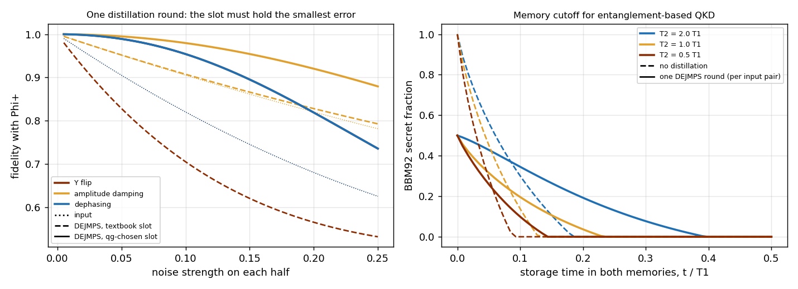

## 58. GHZ metrology in qg: when entanglement beats N independent qubits (`examples/ghz_metrology_qg.py`)

Sensing a frequency ω with N qubits for a time t. Product: each qubit is
a Ramsey qubit with qg_X = V₁ cos(ωt), V₁ = e^{−t/T2}(1 − 2e). GHZ: the
parity X₁⋯X_N is one qg of the whole register, qg_P = V_N cos(Nωt),
V_N = e^{−Nt/T2}(1 − 2e)^N, with e the readout error per qubit. At
mid-fringe (the §36 operating point) the Fisher information per shot is
V², so per unit time:

    product  N t e^{−2t/T2} (1 − 2e)²
    GHZ      N² t e^{−2Nt/T2} (1 − 2e)^{2N}

Exact N = 3, 4 density-matrix checks reproduce the parity
cos(Nφ)(1 − 2p)^N(1 − γ)^{N/2}(1 − 2e)^N to 6 digits with dephasing,
amplitude damping and readout error.

Fisher-rate gain GHZ / product, interrogation time optimised:

| N | Markov e=0 | e=0.002 | e=0.01 | Gauss e=0 | e=0.002 | e=0.01 |
|---|---|---|---|---|---|---|
| 2 | 1.000 | 0.992 | 0.960 | 1.414 | 1.403 | 1.358 |
| 10 | 1.000 | 0.930 | 0.695 | 3.162 | 2.942 | 2.198 |
| 30 | 1.000 | 0.793 | 0.310 | 5.477 | 4.341 | 1.697 |
| 100 | 1.000 | 0.452 | 0.018 | 10.00 | 4.522 | 0.183 |
| 300 | 1.000 | 0.091 | 0.000 | 17.32 | 1.576 | 0.000 |

* **Markovian dephasing:** no gain for any N (Huelga et al. 1997). With
  readout error, N independent qubits are strictly better.
* **Gaussian (slow) dephasing:** gain √N, the N^{−3/4} Zeno-limit scaling
  (Matsuzaki et al. 2011; Chin, Huelga, Plenio 2012).
* **Readout caps it.** The parity carries (1 − 2e)^N, the §31 readout
  gain to the N-th power. The best GHZ size is
  N* = 3/(4|ln(1 − 2e)|): 187, 75, 37, 18 for e = 0.002, 0.005, 0.01,
  0.02, equal to the grid optimum. The gain there is only 3.1, 2.0, 1.4
  and 1.06. At e ≈ 0.005 a GHZ sensor is worth at most about 2× in Fisher
  rate (1.4× in sensitivity), at N ≈ 75.
* **Fixed short window** (t ≤ 0.01 T2): gain 1.96, 8.4, 16.8 at N = 2,
  10, 30, then flat at 1/(2e_E·0.0098) = 18.8 once T2/(2N) < t_max.
  Readout cuts it to 13.3 (e = 0.002) and 5.2 (e = 0.01) at N = 30.
* **T1 witness.** T1 and dephasing both shrink the parity fringe, and the
  parity cannot tell them apart. The register-mean qg_Z is γ under T1
  and 0 under dephasing, the §20 witness on a sensor.
* **Honest scope.**
  - The Markovian, Gaussian and short-window results are textbook.
  - Contributed: the closed-form readout cap N* and the small gain it
    leaves, and the T1/dephasing separation from mean qg_Z.
  - Limits: independent noise only (no correlated dephasing), no GHZ
    preparation errors (these would lower every GHZ number), parity read
    as a product of N single-qubit readouts.

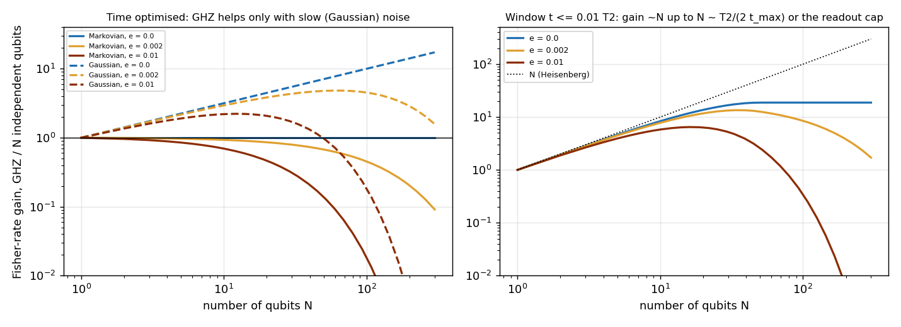

## 59. The d = 3 surface code read in qg (`examples/surface_code_d3_qg.py`)

Rotated d = 3 code, 9 data qubits. Z stabilizers {0,1,3,4}, {4,5,7,8}
(weight 4) and {2,5}, {3,6} (weight 2); Z_L = Z₀Z₁Z₂. A Z-memory: prepare
|0_L⟩ or |1_L⟩, let noise act, read the data in Z, rebuild the syndrome,
decode. Each stabilizer average is a qg of a parity, and
qg_L = 1 − 2p_L.

**A. Code capacity, exact over 512 patterns.** p_L = 1.79·10⁻⁵,
1.73·10⁻³, 1.44·10⁻² at p = 0.001, 0.01, 0.03 (p_L → 18p²: eighteen
weight-2 patterns defeat the decoder). Minimum weight equals maximum
likelihood here. Pseudo-threshold p_L = p at p = 0.0753.

**B. Two weights separate data errors from ancilla readout.** A weight-w
stabilizer reads qg_w = b(1 − 2p)^w, with b = 1 − 2q the §31 readout
gain. The ratio qg₄/qg₂ gives p, and qg₂²/qg₄ gives b.

| p | q | p from qg₄ alone | two-weight p | b | 2000 shots: p |
|---|---|---|---|---|---|
| 0.01 | 0 | 0.0100 | 0.0100 | 1.000 | 0.0099 ± 0.0020 |
| 0.01 | 0.02 | **0.0150** | 0.0100 | 0.960 | 0.0098 ± 0.0025 |
| 0.03 | 0.02 | 0.0348 | 0.0300 | 0.960 | 0.0298 ± 0.0036 |
| 0.03 | 0.05 | **0.0422** | 0.0300 | 0.900 | 0.0302 ± 0.0050 |

**C. T1 on the data.** The 9-qubit density matrix confirms ⟨Z_i⟩ = γ on
every qubit and the classical decay model (to 4·10⁻¹⁷).

* **The syndromes are practically blind to T1.** A weight-w syndrome
  reads qg_w = (1 − γ)^w + γ^w exactly, against (1 − γ)^w for the Pauli
  twirl (bit flip p = γ/2). At γ = 0.01 and w = 2 that is 0.98020 vs
  0.98010, a γ^w difference that needs about 10⁸ shots.
* **Mean qg_Z sees it.** It is γ under T1 and 0 for any symmetric flip,
  and it comes from the same bits as the syndrome.
* **Decoding.** Logical error averaged over |0_L⟩ and |1_L⟩:

| γ | twirl, MW | T1, MW | T1, MW on bits read 0 | T1, ML |
|---|---|---|---|---|
| 0.01 | 4.41·10⁻⁴ | 4.90·10⁻⁴ | 1.99·10⁻⁴ | 1.99·10⁻⁴ |
| 0.03 | 3.82·10⁻³ | 4.22·10⁻³ | 1.77·10⁻³ | 1.77·10⁻³ |
| 0.1 | 3.69·10⁻² | 4.03·10⁻² | 1.89·10⁻² | 1.89·10⁻² |
| 0.3 | 0.217 | 0.231 | 0.144 | 0.144 |

  - The twirl underestimates the minimum-weight p_L by 6–11 %.
  - A decoder that puts errors only on bits read 0 (a decay leaves a 0)
    cuts p_L 2.1–2.5× for γ ≤ 0.1, and equals maximum likelihood.

**D. The limit of C.** Add symmetric flips p on top of the decay:

| γ | p | MW | MW on bits read 0 | ML (γ, p from qg) |
|---|---|---|---|---|
| 0.03 | 0 | 4.22·10⁻³ | 1.77·10⁻³ | 1.77·10⁻³ |
| 0.03 | 0.003 | 5.77·10⁻³ | **1.05·10⁻²** | 5.73·10⁻³ |
| 0.03 | 0.01 | 1.03·10⁻² | **3.03·10⁻²** | 1.03·10⁻² |
| 0.1 | 0.01 | 5.26·10⁻² | 4.83·10⁻² | 4.49·10⁻² |
| 0.1 | 0.05 | 0.112 | **0.154** | 0.112 |

* The hard "bits read 0" rule breaks as soon as p ≈ γ/10: it is 1.8×
  worse than minimum weight.
* The maximum-likelihood decoder with γ and p estimated from
  mean qg_Z = γ(1 − 2p) and qg₄ ≈ ((1 − γ)(1 − 2p))⁴ (recovered to 4
  digits) never loses. Its gain shrinks fast: 2.4× at p = 0, 1 % at
  p = γ/10, 17 % at γ = 0.1, p = 0.01.
* The qg readout says which decoder to use. The benefit is large only
  when T1 dominates the data-qubit noise.
* **Honest scope.**
  - Syndrome-based noise estimation and asymmetric-channel decoding are
    known ideas.
  - Contributed: the two-weight separation of p and b, the exact
    (1 − γ)^w + γ^w syndrome showing the syndromes are blind to T1 while
    mean qg_Z is not, and the exact d = 3 numbers with the robustness
    limit.
  - Limits: code capacity only (one round, perfect extraction apart from
    b in B), Z-memory only (an X-memory reads in X and gets no qg_Z),
    no circuit-level noise, leakage or repeated rounds, d = 3 only.

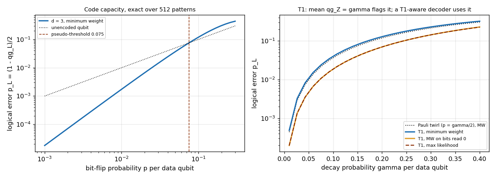

## 60. XXZ Trotter dynamics: where the filter reaches everything, and what compilation does to it (`examples/xxz_trotter_filter_qg.py`)

An open XXZ chain, H = Σ J(X_iX_{i+1} + Y_iY_{i+1}) + Δ Z_iZ_{i+1}, conserves
the number N of 1s. Start from the Néel state (N = n/2) and follow the
imbalance I(t) = (1/n) Σ (−1)^i qg_Z,i. Every quantity is read in Z, so
the qg filter (keep shots with register mean qg = 0, §20) checks every
shot. In LiH (§50) the error sat where the filter could not reach; here
nothing is out of reach. Setup:

* n = 6 and 8, dt = 0.25, J = Δ = 1, 1–8 Trotter steps.
* Noise on every two-qubit gate (depolarizing p2, amplitude damping γ on
  both qubits), readout error e; exact density matrices (qiskit-aer).
* Two compilations of each bond, both exact to 10⁻¹⁵:
  - three CNOTs;
  - two number-conserving gates (an XY interaction and a ZZ interaction),
    with the per-gate noise scaled by 3/2 so the budget per bond is equal.
* Errors are |I − I_noiseless Trotter|.

**A. One noise at a time (4 steps): share of the error the filter removes**

| noise | 3 CNOT | number-conserving |
|---|---|---|
| 2q depolarizing p2 = 0.01 | 41 % (n = 8: 36 %) | 41 % (36 %) |
| readout e = 0.02 | 94 % | — |
| Z dephasing | 2 % | 0 % |
| amplitude damping γ = 0.01 | **49 % (38 %)** | **99.5 % (99.4 %)** |

* Depolarizing: the Paulis that keep N pass the filter.
* **T1 leaks through a CNOT compilation.** Every decay lowers N, and the
  no-jump part is uniform inside a fixed-N sector: with decay applied
  between Trotter steps the filter removes it to 10⁻¹⁵. Inside a 3-CNOT
  bond, however, the intermediate states are not in the sector, so a
  decay mid-gate can be rotated back to N = n/2 and pass. About half of
  the T1 error gets through. Gates that keep N at every point close the
  leak.

**B. Mixed noise, 3 CNOT** (p2 = 0.01, γ = 0.005, e = 0.01), error at 1/2/4/6/8 steps:

| method | 1 | 2 | 4 | 6 | 8 |
|---|---|---|---|---|---|
| raw | 0.036 | 0.031 | 0.048 | 0.224 | 0.112 |
| filter | 0.015 | 0.016 | 0.030 | 0.146 | 0.090 |
| ZNE (1×, 3×) | 0.011 | 0.008 | 0.029 | 0.168 | 0.091 |
| filter + ZNE | **0.001** | **0.003** | **0.006** | 0.059 | 0.058 |

Filter + ZNE is 2.6–8× below the best single method up to 4 steps.

**C. Same T1-dominated budget** (p2 = 0.002, γ = 0.02, e = 0.01), filter alone:

| compilation | 1 | 2 | 4 | 6 | 8 |
|---|---|---|---|---|---|
| 3 CNOT | 0.031 | 0.025 | 0.050 | 0.207 | 0.116 |
| number-conserving | 0.005 | 0.005 | 0.012 | 0.081 | 0.052 |

* Against raw, the filter cuts the error 2.3–9× with number-conserving
  gates and 1.1–1.9× with CNOTs.
* With filter + ZNE the number-conserving circuit reaches 0.026 and 0.006
  at 6 and 8 steps, against 0.135 and 0.094 for CNOTs.

**D. The price.** The kept fraction is itself a qg noise meter.

* For the number-conserving circuit it is 0.70, 0.52, 0.30, 0.17, 0.11
  over 1–8 steps (0.61 to 0.05 at n = 8). It is lower than with CNOTs
  because more decays are now caught.
* With 2000 shots per circuit at 4 steps, the RMSE (bias and shot noise)
  of the number-conserving circuit is: raw 0.050, filter 0.028, ZNE 0.035,
  filter + ZNE 0.048. Once the filter has removed the bias, ZNE only adds
  variance.
* With CNOTs, filter + ZNE is the best (RMSE 0.028 and 0.041 for the two
  noise cases).

**E. Trapped-ion compilations: the prediction was only half right.** The
first version of this section predicted that MS gates would leak like
CNOTs. The test (share of the T1 error removed, 4 steps, γ = 0.01):

| dt | 3 CNOT | number-conserving | MS: XX, YY, ZZ rotations | MS, ZZ by Ry basis change |
|---|---|---|---|---|
| 0.10 | 85 % | 98 % | 99.6 % | 22 % |
| 0.25 | 49 % | 99.5 % | 96.7 % | 70 % |
| 0.50 | 61 % | 99.9 % | 90 % | 69 % |
| 0.75 | 54 % | 100 % | 83 % | 80 % |

* Small-angle XX and YY rotations leave the fixed-N sector only by an
  amplitude of order sin θ. Native MS rotations therefore leak little, and
  more as dt grows (99.6 % → 83 %).
* What leaks is a basis change around a two-qubit gate: the CNOT
  compilation, and a ZZ built as Ry(π/2)·MS·Ry(−π/2). In the rotated frame
  a decay no longer changes N. A Z error there does change it, so the
  filter removes 22 % of the dephasing error (kept 0.69).
* **Rule for an IonQ run:** use a native ZZ interaction if the device
  offers one, or the XY model (Δ = 0, no ZZ term), rather than a ZZ built
  by basis change.
  - With the basis-change ZZ, filter + ZNE still reaches 0.002 at 4 steps.
  - The filter alone reaches only 0.027 there, against 0.012–0.015 for
    the leak-free compilations.

**Honest scope.**

* Symmetry verification by post-selection is known (Bonet-Monroig et al.
  2018; McArdle et al. 2019). Google's Fermi-Hubbard experiment (Arute et
  al. 2020) used it with number-conserving fSim gates.
* Contributed:
  - the per-noise reach of the qg filter on a problem where every
    observable is in Z (the contrast with LiH, §50);
  - the measured leak of mid-gate decay under a CNOT compilation (about
    half of the T1 error), and its closure with number-conserving gates;
  - the combination with ZNE at a finite shot budget.
* Limits: small chains; gate-attached noise models; the number-conserving
  gates are ideal unitaries with an equal error budget, with no model of
  how a device implements them; open boundaries; one initial state and
  one observable.
* Trapped ions: see E. Native MS rotations barely leak; a ZZ built by a
  basis change does.

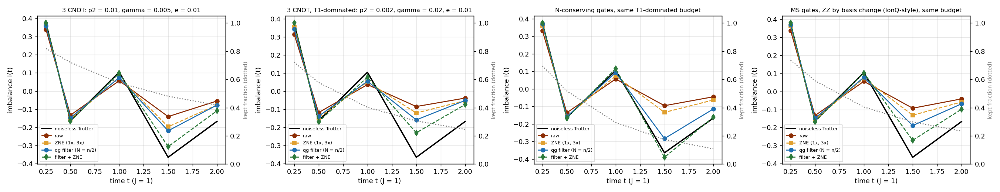

## 61. The §60 chain on IonQ's forte-1 noise model (`examples/ionq_sim_xxz_filter.py`)

The §60 E rule (avoid basis changes around two-qubit gates) was tested in
IonQ's native gates on the free noisy simulator.

* IonQ rejects circuits that mix MS and ZZ gates (preflight error). The
  test therefore uses the XY model (Δ = 0), which each gate family can
  express alone:
  - `xy_ms`: MS rotations, small angles, no basis change;
  - `xy_zz`: native ZZ wrapped in GPI2 basis changes;
  - `xxz_basis`: the XXZ chain in MS only, with the ZZ term by basis change.
* n = 6, dt = 0.25, 1–6 steps; 5 runs × 12 circuits × 2000 shots.
* The prediction was written before the run: if the vendor model is
  depolarizing-type, the share of the error the filter removes should be
  the same for both XY compilations (ratio within 0.8–1.25). A ratio
  above 1.5 would mean T1-like errors. The local stand-in gives 1.4 with
  T1 γ = 0.005, and 1.0 without T1.

| compilation | raw bias, 4 / 6 steps | filtered bias | kept |
|---|---|---|---|
| xy_ms | −0.070 / +0.073 | −0.043 / +0.036 | 0.72 / 0.61 |
| xy_zz | −0.066 / +0.078 | −0.034 / +0.033 | 0.70 / 0.59 |
| xxz_basis | −0.037 / +0.229 | −0.011 / +0.161 | 0.61 / 0.52 |

Pooled share removed over 4 and 6 steps: xy_ms 0.45 ± 0.08, xy_zz
0.55 ± 0.12, ratio 0.82.

* **The prediction holds.** The ratio is inside the band, and on the side
  opposite to a T1 effect. The raw errors are equal, so the extra GPI2
  gates cost nothing visible.
* **The filter removes about half of the error on forte-1** in both XY
  compilations, as the depolarizing stand-in predicts (49–57 %).
* **Consequence.** On trapped ions the MS-vs-ZZ choice does not matter
  for the filter. The §60 leak is a T1 effect and belongs to platforms
  with T1, such as superconducting qubits. The simulator cannot test it;
  on hardware the prediction is the same ratio band unless the gates
  carry T1-like errors.
* **Honest scope.** A vendor noise model is not hardware. The ratio sits
  at the edge of its band, and the per-run spread (0.08–0.12) is
  comparable to the difference.

## 62. Classical shadows vs direct measurement for the qg quantities (`examples/shadows_vs_direct_qg.py`)

This section answers the cost question a referee could ask of every qg
result: with the same number of shots, would randomized Pauli
measurements (classical shadows, Huang, Kueng, Preskill 2020) estimate a
register's qg better than measuring the bases directly?

**Method.** Every number is an exact per-shot variance, computed by
enumerating all 3⁶ local Pauli settings on the density matrix. The
figure of merit is R, the shots shadows need divided by the shots direct
measurement needs for the same error, taken at the worst target. One
Monte Carlo check: sampled 3.17 against the exact 3.01. The states
(n = 6):

* the noisy XXZ state of §60 (4 steps);
* the noisy 3-layer LiH state of §50.

| task | XXZ | LiH | direct scheme |
|---|---|---|---|
| T1 all qg_Z | 3.0 | 4.3 | one Z setting |
| T2 register-mean qg_Z (§20 witness) | 5.8 | 8.1 | one Z setting |
| T3 all ZZ | 9.0 | 12.6 | one Z setting |
| T4 all 3n single-qubit qg | 1.0 | 1.0 | 3 settings |
| T5 all 9·C(n,2) two-qubit correlators | 1.0 | 1.0 | 18 settings (L18 orthogonal array) |
| T6 filtered imbalance (§60) | **41** | — | post-selection, kept 0.60 |
| T7 LiH energy (62 terms) | — | 4.0 | 21 qubit-wise-commuting groups |

**What qang measures in Z costs 3–41× more with shadows.**

* For weight-k Z strings, direct measurement wins by 3^k. It wins by more
  when the values are near ±1, as for LiH's occupied orbitals.
* The register-mean witness gains more than 3× (5.8–8.1×). Measured
  directly, the conserved quantity anti-correlates the qubits, so its
  per-shot variance is small. Shadows lose that.
* The shot-level filter does not exist for shadows: only 3⁻⁶ = 0.14 % of
  random-basis shots have every qubit in Z. The shadow estimate of the
  filtered value is unbiased, but it needs 41× the shots.

**When all local Paulis of a weight are wanted, it is a tie.**

* Three settings (X…, Y…, Z…) for weight 1, or the 18-run L18
  orthogonal array for weight 2, give each Pauli the same hit rate
  (1/3 or 1/9) as random bases.
* Per target, direct measurement is never worse:
  (1 − q²)/share ≤ 3^k − q².
* The tie needs a balanced design. A greedy covering array (15 settings,
  unequal coverage) loses to shadows, with R = 0.60.

**Hamiltonians.** Grouping with optimal shot allocation needs 4× fewer
shots than plain shadows. Derandomized and locally biased shadows close
part of that gap (Huang, Kueng, Preskill 2021; Hadfield et al. 2022).

**Honest scope.**

* Shadows keep their real advantages, none of which is tested here:
  - estimating observables chosen after the measurement;
  - many observables on large n without designing settings;
  - nonlinear quantities such as purities.
* The numbers are for n = 6 and two states. The 3^k and 3⁻ⁿ factors are
  general.

## 63. Grover search with noise: the qg reading loses to the histogram (`examples/grover_noise_qg.py`)

**Setup.**

* Grover search on n = 4, 5, 6 qubits, one marked item.
* Each multi-controlled Z is compiled to 14, 36 and 84 CNOTs, and there
  are two per iteration.
* Exact density matrices, with depolarizing p2 on every CNOT, optionally
  T1.
* Cost is the number of oracle calls per verified success, (k + 1)/P_k.
  Classical search needs about N/2.

**The qg idea tested.** If the unmarked outcomes are uniform, each
qubit's polar bias is

    qg_Z,i = ± (NP − 1)/(N − 1).

The sign would then give each bit of the answer, and the magnitude would
give the success probability P without knowing the answer.

**A. Noise moves the best iteration earlier and eats the speed-up.**

| n | noiseless best k, cost | with noise |
|---|---|---|
| 4 | 2, 3.3 | p2 = 0.02 → k = 1, 6.5 |
| 5 | 3, 4.5 | p2 = 0.002 / 0.005 / 0.01 → k = 2 / 2 / 1, cost 6.3 / 8.9 / 13.3 (classical 16) |
| 6 | 4, 6.1 | p2 = 0.001 / 0.002 / 0.005 → k = 3 / 2 / 1, cost 10.2 / 15.0 / 27.6 (classical 32) |

This behaviour is known; the numbers are ours.

**B. The qg formula fails under gate noise.**

* Depolarizing noise on the gates is not uniform after the diffusion
  operator. The formula is off by up to 0.015 (n = 4) and 0.067 (n = 5).
* The label-free estimate of P from qg magnitudes is worse than the
  frequency of the most common outcome in every case: RMSE 0.037–0.074
  against 0.015–0.045.
* With 500 shots per k, the k it picks costs 0.5–9 % extra, against
  0.6–2.4 % for the mode.

**C. Reading the answer: per-qubit signs lose.**

* At n = 5 (P = 0.12), 100 shots find the marked item 66 % of the time
  with qg signs and 91 % with the most common bitstring.
* At n = 6 (P = 0.085), the same comparison gives 40 % and 87 %.
* The reason is structural:
  - the qg margin per qubit is about P with unit per-shot variance, so
    the sign test needs about 1/P² shots;
  - the marked bitstring stands out after a few/P shots.
* Marginals throw away the joint information that Grover concentrates in
  one bitstring.

**D. T1.** It moves the register-mean qg_Z up (+0.039 at γ = 0.02), which
is the §20 witness. By then, however, P is near 1/N, and the qg reading
has already failed.

**Verdict (negative).** For algorithms whose answer is one bitstring,
qg adds nothing measurable: use the histogram. qg is the right readout
when the answer is a set of expectation values, as in VQE or dynamics
(§60).

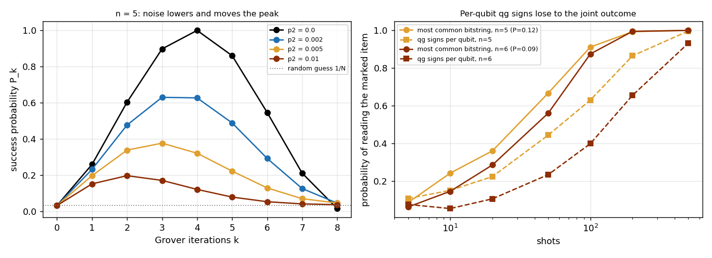

## 64. The T1-aware decoder under circuit-level noise (`examples/surface_code_circuit_t1_qg.py`)

This tests whether the §59 gain survives the full syndrome-extraction
circuit and repeated rounds.

**Setup.**

* A rotated surface code of distance d = 3 and 5, running as a Z-memory.
* Z-type ancillas, four CNOT layers, and R = d rounds, followed by a final
  data readout.
* Noise: depolarizing p2 on every CNOT, decay γ on both CNOT qubits and
  on idle qubits, decay 2γ before each readout, and readout or reset
  flips q.
* The simulation is exact without density matrices. Only X errors matter
  in a Z-memory, decay keeps the state diagonal in Z, and the Z-basis
  populations then evolve as a Markov chain on bits.
* The X-stabilizer circuits are left out; this is the main approximation.
* Decoders: minimum-weight matching (pymatching) on the detector graph,
  built by enumerating every single fault.
  - The standard decoder uses average weights.
  - The T1-aware decoder reweights each data qubit's decay faults by its
    final readout: a qubit read 1 almost never decayed, and a qubit read 0
    gets twice the average weight. Depolarizing and measurement faults
    keep their weights.

Logical error after d rounds (100 000 shots at d = 3, 20 000 at d = 5).
"Paired z" compares the two decoders on the same shots (McNemar test).

| noise (p2, γ, q) | d | standard | T1-aware | ratio | paired z |
|---|---|---|---|---|---|
| pure T1 (0, 0.003, 0.001) | 3 | 0.0131 | 0.0060 | **2.19** | +25 |
| | 5 | 0.0065 | 0.0019 | **3.33** | +9 |
| T1-dominated (0.0005, 0.003, 0.002) | 3 | 0.0149 | 0.0091 | 1.63 | +17 |
| | 5 | 0.0080 | 0.0040 | 2.04 | +7 |
| mixed (0.002, 0.002, 0.002) | 3 | 0.0095 | 0.0084 | 1.14 | +5.5 |
| | 5 | 0.0050 | 0.0027 | 1.91 | +5.7 |
| depolarizing-dominated (0.004, 0.0005, 0.002) | 3 | 0.0030 | 0.0034 | 0.87 | −4.3 |
| | 5 | 0.0011 | 0.0011 | 0.96 | −0.4 |

* **The gain survives and grows with distance.**
  - Pure T1: 2.2× at d = 3 (the §59 code-capacity value was 2.1–2.5×) and
    3.3× at d = 5.
  - T1-dominated: 1.6× and 2.0×. Mixed noise: 1.1× and 1.9×.
* **It is not free.** When depolarizing noise dominates, the reweighting
  costs 15 % at d = 3 (significant) and nothing measurable at d = 5.
* **The qg witness chooses the decoder without labels.**
  - The ratio is the register-mean qg_Z of the final data readout divided
    by the detector firing rate, measured on a separate calibration
    batch.
  - It is 1.3–2.6 where the T1-aware decoder wins, and 0.34–0.54 where it
    loses.
  - The rule "T1-aware if the ratio exceeds 1" picks the better decoder in
    all eight cases. The threshold was chosen after seeing these cases.
* **Checks.** Noiseless circuits produce no detector events. Halving
  every rate lowers p_L 3.7× at d = 3, the expected quadratic scaling.
* **Honest scope.**
  - Bias-, erasure- and leakage-aware decoding are known ideas.
  - Contributed:
    - a reweighting that needs only the final data readout;
    - its circuit-level numbers with paired statistics;
    - its cost when T1 does not dominate;
    - the qg switch.
  - Limits:
    - the X-stabilizer circuits are left out;
    - no leakage or correlated errors;
    - the multipliers are a simple Bayes approximation;
    - hyperedges (faults touching more than two detectors) are dropped.
  - Needs pymatching.

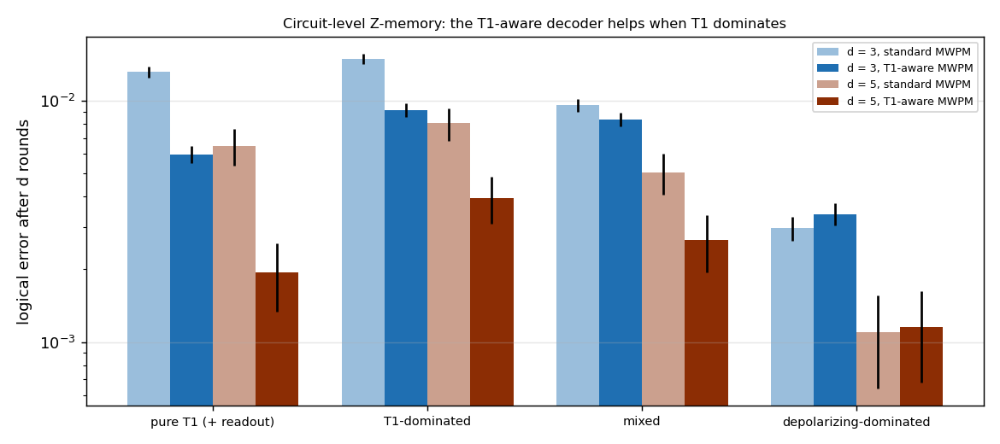

## 65. The arccos range limit removed by a branch sign (`examples/signed_qg_range_qg.py`, `qang.gradients.signed_qg_step`, `signed_natural_qg_step`)

**The limit.** qg_Z = cos θ is two-to-one, so a qg-space update mapped back
through arccos only reaches [0, π] (§8.2). On H₂ the optimum sits at
θ ≈ −0.22, and every unsigned qg update stops at Hartree–Fock.

**The fix.** The pair (qg_Z, s), with s = sign(qg_X) = sign(sin θ), is
one-to-one on the whole circle, and s is measurable. Two library updates
keep s:

* `signed_qg_step`: the clipped step, reflected through a pole with a sign
  flip.
* `signed_natural_qg_step`: the quantum-natural-gradient step
  dq = lr · dE/dθ · sin θ, with the same reflection.

**Predictions, written before the run.**

* P1: both signed steps reach the H₂ FCI energy from Hartree–Fock.
* P2: the natural step behaves like θ-space descent.
* P3: the clipped step is unstable at learning rates that θ-space descent
  handles.

**Results.**

| H₂ from Hartree–Fock, lr | θ | unsigned qg | signed qg | signed natural | pole-damped |
|---|---|---|---|---|---|
| 0.03 | FCI, 52 | HF, never | FCI, 8 | FCI, 54 | 9e-3, never |
| 0.1 | FCI, 15 | HF, never | FCI, 8 | FCI, 17 | FCI, 183 |
| 0.3 | FCI, 5 | HF, never | 0.11, never | FCI, 6 | FCI, 61 |
| 1.0 | FCI, 1 | HF, never | 0.08, never | FCI, 1 | FCI, 19 |

(Entries: final energy, and the step after which the error stays below
chemical accuracy.)

| random near-pole landscapes, lr | θ | unsigned qg | signed qg | signed natural | pole-damped |
|---|---|---|---|---|---|
| 0.1 | 1.00 | 0.20 | 0.84 | 1.00 | 0.91 |
| 0.5 | 1.00 | 0.02 | 0.49 | 1.00 | 1.00 |
| 1.0 | 0.79 | 0.01 | 0.27 | **0.68** | 1.00 |
| 2.0 | 0.18 | 0.01 | 0.09 | 0.16 | 0.51 |

On LiH (4 parameters) the signed natural step converges at lr = 0.3
(21 steps against 17 for θ), but not at lr = 1.0, where θ converges.

* **P1 holds.** The branch sign removes the trap: 1e-9 Ha instead of the
  Hartree–Fock 2.0e-2 Ha. The range limit is an artefact of using qg_Z
  alone, not a property of qg.
* **P3 holds.** The Euclidean (clipped) qg step is 2–7× faster than θ at a
  small learning rate on H₂, and unstable from lr = 0.3.
* **P2 holds at small and moderate learning rates, and fails at
  lr = 1.0.**
  - The pole reflection is exact only to first order in the step.
  - At lr = 1.0: 0.68 against 0.79 on the landscapes, and no convergence
    on LiH.
* **Verdict.** The documented limit (paper, limitation ii) is removed, but
  qg-space optimization gains nothing over θ-space. The natural metric in
  qg reduces to θ, and pole-damped θ descent remains the robust choice at
  aggressive learning rates.

## 66. Gauss-law witnesses and filters in a lattice gauge theory (`examples/lattice_gauge_gauss_qg.py`)

**Model.** A 1D Z₂ lattice gauge theory with staggered fermions:

* 4 matter sites and 3 links, 7 qubits in total;
* hopping X Xₗ X + Y Xₗ Y, a staggered mass, and an electric term in Z.

**Symmetries.** The Gauss law G_j = Zₗ,left · Zₗ,right · Z_j is local and
diagonal in Z. It commutes with H exactly, as does the fermion number N.
Each G_j is the qg of a weight-2 or weight-3 parity, so the Z shots of
the observable already give:

* L local Gauss witnesses ⟨G_j⟩;
* the global number witness;
* three filters: N, Gauss, and both.

**Run.** The observable is the particle density starting from the bare
vacuum. Each Trotter step costs 54 CNOTs. Simulation with exact density
matrices.

**Predictions, written before the run.**

* P1: Gauss removes more than N.
* P2: Gauss + N removes the most.
* P3: T1 leaks through the CNOT-compiled gates (§60).

Share of the density error removed; last column is the kept fraction
for N / Gauss / both:

| noise, 2 steps | N | Gauss | both | kept |
|---|---|---|---|---|
| depolarizing 0.01 | 64 % | 80 % | 90 % | 0.66 / 0.52 / 0.51 |
| amplitude damping 0.01 | 30 % | 58 % | 65 % | 0.64 / 0.50 / 0.49 |
| readout 0.02 | 96 % | 100 % | 100 % | 0.92 / 0.87 / 0.87 |
| **6 steps**, depolarizing | 10 % | 27 % | 33 % | 0.43 / 0.19 / 0.17 |

* **P1 and P2 hold.** Errors on the gauge qubits change G_j but not N.
  Under mixed noise at 1 step, the Gauss filter leaves an error of 0.019
  against 0.034 for the N filter.
* **P3 holds.** Under T1 the filters remove 58–65 %, not all of it.
* **The local witnesses do not locate errors in this homogeneous model.**
  |⟨G_j⟩| is lower in the bulk (weight-3 checks, 0.61) than at the ends
  (0.80 and 0.74). That is a weight effect, not a location.
* **Limits.**
  - At 6 steps (324 CNOTs) the filters remove only 22–33 % and keep
    16–19 % of the shots.
  - At 4 steps the ideal density (0.49) sits near the noisy fixed point,
    so the raw error is small by accident and filtering does not help.
* **Honest scope.**
  - Gauss-law post-selection is known in lattice-gauge quantum simulation.
  - Contributed: reading the Gauss checks as qg of parities from the same
    shots, the per-noise comparison with the number filter, and the
    compilation leak.

## 67. Filter or ZNE by shot budget, and a pilot-based switch that fails (`examples/shot_budget_adaptive_zne_qg.py`)

**Setup.** The §60 XXZ chain: 6 qubits, 3-CNOT bonds, p2 = 0.01, γ = 0.005,
e = 0.01, at 2, 4 and 6 Trotter steps. For a total shot budget S:

* **filter:** all S shots on the 1× circuit.
* **ZNE:** S/2 shots each on the 1× and 3× folded circuits.
* **filter + ZNE:** the same split, applied to the filtered estimates.

**Pre-registered switch.** A 10 % pilot on each circuit estimates the
filter's bias and each strategy's variance, and the remaining shots go to
the strategy with the smallest estimated error.

**Prediction:** the switch stays within 1.25× of the best fixed strategy
in every cell.

RMSE of the imbalance (400 repetitions per cell):

| depth, S | filter | ZNE | filter + ZNE | switch |
|---|---|---|---|---|
| 2, 500 | **0.030** | 0.048 | 0.061 | 0.031 |
| 2, 2000 | **0.020** | 0.024 | 0.028 | 0.021 |
| 2, 10⁴ | 0.016 | 0.014 | **0.013** | 0.017 |
| 2, 5·10⁴ | 0.016 | 0.009 | **0.007** | 0.012 |
| 4, 2000 | **0.034** | 0.041 | 0.042 | 0.035 |
| 4, 5·10⁴ | 0.031 | 0.029 | **0.010** | 0.023 |
| 6, 2000 | 0.148 | 0.170 | **0.073** | 0.135 |
| 6, 5·10⁴ | 0.146 | 0.168 | **0.059** | 0.059 |

Worst ratio to the best fixed strategy over the 12 cells:

* filter 3.07, ZNE 2.93, filter + ZNE 2.02;
* the pre-registered switch 2.29;
* a post-hoc variant 1.49.

**Findings.**

* **The crossover has a clear shape.**
  - Shallow circuits: the filter wins up to about 2000 shots, with 1.7–2.0×
    lower RMSE at 500 shots.
  - From about 10⁴ shots, filter + ZNE wins, by up to 3.1×.
  - Deep circuits (6 steps): filter + ZNE wins at every budget.
  - ZNE alone is never the best.
* **The prediction fails.** The switch is 2.29× worse than the best in the
  worst cell, worse than simply always using filter + ZNE. A 10 % pilot
  cannot resolve a bias of about 0.02 under its own noise.
* **The post-hoc variant is exploratory only.** It uses a 20 % pilot and no
  noise subtraction, and reaches 1.49×, but it was tuned on these same
  data.
* **Practical rule (a heuristic).** Use the filter alone only for shallow
  circuits and a few thousand shots; otherwise use filter + ZNE. Never use
  ZNE alone when a filter is available.
* **Honest scope.**
  - One model; linear Richardson extrapolation with 1× and 3× folding only.
  - Bias–variance trade-offs in error mitigation are known.
  - Contributed: the measured crossover for the qg filter, and the
    negative result on a simple pilot switch.

## 68. A noise-free screen for how much T1 the filter lets through (`qang.sectors`, `examples/sector_exposure_qg.py`), and a signed qg gate

**Library additions.**

* `qang.sectors.filter_distribution` applies the qg filter as an operation
  on a distribution or on counts.
* `qang.sectors.sector_exposure` computes, on a noiseless statevector, the
  population outside the conserved Hamming-weight sector right after each
  two-qubit gate.
* `qang.qiskit_gate.SignedRQangGate` applies RY(s · arccos qg_Z), the gate
  form of §65. It prepares the same state as `FullRQangGate` with φ = 0
  or π.

**The idea.** A decay that happens while part of the state is outside the
sector can be rotated back in and pass the filter (§60). The exposure,
computed before any noisy run, should therefore rank compilations by
their T1 leak.

**Prediction, written before the run.** Across 16 XXZ points (4
compilations × 4 values of dt), the Spearman rank correlation between
exposure and T1 leak is at least 0.8. Every zero-exposure circuit removes
at least 95 % of the T1 error.

| compilation | exposure (dt 0.1 / 0.25 / 0.5 / 0.75) | T1 leak |
|---|---|---|
| 3 CNOT | 0.42 at every dt | 16 / 52 / 39 / 46 % |
| MS, ZZ by basis change | 0.16 / 0.17 / 0.22 / 0.24 | 78 / 30 / 31 / 20 % |
| MS rotations | 0.0006 / 0.005 / 0.026 / 0.047 | 0.4 / 3.3 / 9.9 / 17 % |
| number-conserving | 0 | 2.0 / 0.5 / 0.1 / 0.0 % |

* **The prediction holds, at its threshold.** The rank correlation is 0.80,
  and the zero-exposure circuits remove at least 98 % of the T1 error.
* **It ranks compilations, not time steps.**
  - Within MS rotations, exposure and leak grow together with dt.
  - Within 3 CNOT, the exposure is constant while the leak moves between
    16 and 52 %: the raw error is small at small dt, so the ratio is
    noisy.
* **It works as a coarse screen.**
  - Exposure near 0: the filter catches T1.
  - Exposure above about 0.2: half or more of the T1 error passes.
  - The Z₂ gauge circuit (§66) sits at 0.65, and it is the case where
    post-selection made T1 worse.
* **Honest scope.**
  - This is a rank prediction only, from 6–7 qubits and one noise type,
    and 0.8 is met with no margin.
  - The mechanism follows from §60. The contribution is a number that can
    be computed at compile time.

## 69. Total spin S² after the Z-diagonal checks (`examples/spin_squared_check_qg.py`)

**Why.** H₂O and H₄ have singlet ground states, S² = 0, and S² is not
diagonal in Z. Noise that keeps N_up and N_down but mixes spin multiplets
passes every qg check.

**Setup.**

* The §55 ansatz, under the §29 noise model, with exact 8-qubit density
  matrices.
* Ideal projections, in order: N, then N_up and N_down, then S² = 0.
* Since [H, P] = 0, the S² projection can be done in post-processing, by
  measuring P and PH.

**Prediction, written before the run.** The S² projection removes at
least a further 10 % of the error, and needs at least 10× more Pauli
strings than H.

Error against the noiseless circuit (mHa); kept fraction in brackets:

| molecule | raw | N | N_up, N_down | + S² = 0 | further share |
|---|---|---|---|---|---|
| H₂O | 363.9 | 54.6 (0.67) | 43.3 (0.66) | 26.7 (0.64) | 38 % |
| H₄ | 287.5 | 79.9 (0.69) | 70.5 (0.67) | 44.7 (0.58) | 37 % |

Pauli strings to measure: H₂O 105 for H, against 640 for P and 2064 for
PH; H₄ 185, against 640 and 3456.

* **The prediction holds.** The singlet projection removes a further
  37–38 % of the error, the largest gain of any check since §52. The noisy
  ⟨S²⟩ is 0.40 (H₂O) and 0.60 (H₄), where the ideal state has 0.
* **The price is measurement, not shots.** The kept fraction barely drops
  (0.66 → 0.64), but post-processing needs about 20× more Pauli strings.
* **H₂O is the clean case**: its ideal state is a singlet to 3·10⁻⁶.
  - The H₄ ansatz is itself spin-contaminated (singlet weight 0.91,
    34 mHa above the exact ground state).
  - Part of the H₄ gain therefore corrects the ansatz: projecting even the
    noiseless state lowers it by 13.7 mHa.
* **Reproducibility.** The optimisation runs single-threaded. With
  threaded BLAS the H₄ optimum changed between runs.
* **Honest scope.**
  - S² verification by post-processing is known (Bonet-Monroig 2018).
  - Contributed: its gain on top of the qg checks, and its measurement
    cost.
  - Limits: ideal projections, the Pauli count is an upper bound (no
    grouping), and there is no ancilla-based S² circuit. Needs pyscf.

## 70. The qutrit test: does a three-level readout give qang an advantage? (`examples/qutrit_leakage_qg.py`)

**Why.** Before extending qang beyond qubits: transmons leak to |2⟩, and a
three-level readout can see it. Seeing leakage is known to help decoding,
so that alone is not a qang result. The question is whether qang's own
tools gain something on top of standard leakage handling. Agreed before
the run: qang is extended only if there is an advantage.

**Setup.**

* The §64 circuit-level Z-memory (d = 3, 3 rounds), plus data-qubit
  leakage: after a CNOT a data qubit in |1⟩ leaks with probability ℓ; a
  leaked control kicks its ancilla at random; it seeps back to |1⟩ with
  probability r per layer; the final readout reads |2⟩ as 1 and flags it.
* Decoders (MWPM on the §64 graph): standard (leakage ignored);
  leakage-aware (edges of flagged qubits erased, p = 1/2); qg
  (leakage-aware + the §64 T1 reweighting, switched on by the §64 witness).

**Criterion, written before the run.** qg beats leakage-aware by ≥ 1.3×
with paired z ≥ 3 in at least one regime and is never significantly worse.

Logical error, 60 000 shots per regime (same shots for every decoder):

| regime (witness) | standard | leakage-aware | qg | qg, no flags |
|---|---|---|---|---|
| leakage + T1-dominated (1.68) | 0.0156 | 0.0165 | 0.0100 | 0.0093 |
| leakage + mixed (1.27) | 0.0099 | 0.0106 | 0.0089 | 0.0084 |
| leakage + depolarizing (0.34) | 0.0032 | 0.0036 | 0.0036 | 0.0032 |
| strong leakage, depolarizing (0.46) | 0.0021 | 0.0032 | 0.0032 | 0.0021 |

* **As written, the criterion passes** (1.65×, z = +14.8, T1-dominated),
  **but the pass is an artefact and is not taken as a qutrit advantage.**
  - The pre-registered leakage-aware baseline is worse than ignoring
    leakage in every regime (z = −3.8 to −6.0).
  - All of the gain is the §64 T1 reweighting, a qubit tool: qg without
    any leakage flag beats standard 1.68× (z = +14.7). Adding the |2⟩
    flags to it makes it worse (z = −4.7, −3.0, −2.8, −4.9).
* **Deviation, added after the first run.** Erasing only the final-readout
  layer of a flagged qubit is less harmful but still worse than standard
  (z = −2.8 to −4.9). In this model a qubit leaks only from |1⟩ and seeps
  back to |1⟩, so reading |2⟩ as 1 is usually right; declaring it erased
  discards that. And a flag at the end of the run is too late to locate
  the randomised syndromes of earlier rounds.
* **Verdict: no qutrit advantage. qang stays a qubit construction**;
  recorded as a negative result. By-product: the §64 T1 reweighting keeps
  its full gain with leakage present.
* **Honest scope.**
  - Leakage-aware and erasure decoding are known (Suchara et al. 2015;
    Wu et al. 2022); stronger handling uses leakage-reduction units or
    per-round leakage detection, not modelled here.
  - Contributed: the test itself, with the answer no.
  - Limits: d = 3, a simple leakage model, flags only at the final
    readout, erasure weights not tuned. Needs pymatching.

## 70b. The qutrit test, second round: pre-registered, with leakage that scrambles the qubit (`examples/qutrit_leakage_rounds_qg.py`)

**Why.** In §70 the |2⟩ flag carried no information because a leaked qubit
kept its value. An exploratory rerun with a scrambling leak showed the flag
helping. Here the model and the criterion were fixed and committed
(3fa4d63) before the reported run.

**Setup.** The §64 Z-memory (d = 3, 3 rounds) with leakage from |1⟩ (ℓ)
and from |0⟩ (ℓ/2), return to a random bit, per-round leakage flags with
efficiency h = 0.8, and a final three-level readout. Decoders: standard;
final flags (erasure of the last layer); round flags (erasure around the
flagged rounds); qg without flags (§64 reweighting); qg + round flags.

**Criterion, written before the run.** (A) qg + round flags beats the best
known leakage-aware decoder by ≥ 1.3× with z ≥ 3 in some regime and is
never worse with z ≤ −3; (B) the flags add to qg (z ≥ 3) in every regime.

Logical error, seed 70, 60 000 shots per regime:

| regime (witness) | standard | final flags | round flags | qg, no flags | qg + round flags |
|---|---|---|---|---|---|
| leakage + T1-dominated (1.68) | 0.0189 | 0.0178 | 0.0177 | 0.0130 | **0.0106** |
| leakage + mixed (1.27) | 0.0127 | 0.0114 | 0.0114 | 0.0100 | **0.0089** |
| leakage + depolarizing (0.34) | 0.0052 | 0.0043 | 0.0044 | 0.0052 | 0.0044 |
| strong leakage, depolarizing (0.46) | 0.0075 | 0.0047 | 0.0046 | 0.0075 | 0.0046 |

* **Both criteria pass.**
  - (A): 1.68× (z = +15.3) and 1.28× (z = +8.0); ties where the witness
    switches the reweighting off.
  - (B): the flags add to qg in every regime (z = +8.8, +5.3, +4.0, +8.9).
* **The combination beats both parts.** In the T1-dominated regime flags
  alone give 1.07× over standard, the reweighting alone 1.45×, together
  1.78×, more than the product (1.55×). The reweighting trusts the final
  data bits and a leaked qubit's final bit is random; erasing it removes a
  misleading input, so the flag helps qg more (z = +8.8) than standard
  decoding (z = +4.2).
* **Replication (seed 71):** 1.43× (z = +11.3) and 1.20× (z = +6.2).
* **Per-round detection adds almost nothing at d = 3.** With h = 0 (only
  the final three-level readout) the gain is 1.39× instead of 1.43×.
* **Verdict.** With leakage that scrambles the qubit, qang gains from a
  three-level readout. The qg quantities stay qubit quantities; the qutrit
  enters as an input to the qg decoder, not as a new qg. §70 and §70b
  together: the flag is useless when a leaked qubit keeps its value and
  useful when it does not.
* **Honest scope.** Erasure decoding of leakage is known; contributed: its
  combination with the qg reweighting, super-additive here. Limits: d = 3,
  one leakage model (leak ratio 1:2, random return) chosen after §70's
  exploratory rerun, erasure weights not tuned, no leakage-reduction units.

## 71. A rule for the |2⟩ flag: the Bayesian weight, and the qutrit gain at d = 5 (`examples/qutrit_bayes_weight_qg.py`)

**Why.** §70 and §70b gave opposite answers for the same flag, because both
erased it (p = 1/2) whatever the leak's origin. If a qubit leaks from |1⟩
with probability ℓ and from |0⟩ with a·ℓ (a measurable by calibration), a
qubit seen in |2⟩ had pre-leak value 1 with posterior 1/(1 + a). The rule:
report it as 1 with flip probability p_flag = max(a/(1 + a), q), and
neutral T1 weight. a = 0 gives no erasure; a = 1 gives plain erasure; §70
is the case a = 0.

**Setup.** The §64 Z-memory with leakage; models M0 (the §70 model) and
M(a), a ∈ {0, 0.25, 0.5, 1}, with random return and random |2⟩ readout
(M(0.5) is §70b). T1-dominated and depolarizing regimes at d = 3; d = 5
(5 rounds) for four models in the T1-dominated regime. Decoders: standard,
erasure, bayes, qg (§64), qg + erasure, qg + bayes. 60 000 shots per point,
seed 711; the predictions were committed (daf0b6f) before the results.

**Predictions.** P1 bayes never worse than standard (z > −3). P2 bayes
beats erasure (z ≥ 3) for a ≤ 0.25 at d = 3 in both regimes, and ties at
a = 1. P3 qg + bayes never worse than qg + erasure. P4 qg + bayes beats the
best flag decoder by ≥ 1.3× (z ≥ 3) in M(0.5), at d = 3 and at d = 5.

Logical error, T1-dominated regime:

| d | model | p_flag | standard | erasure | bayes | qg | qg + erasure | qg + bayes |
|---|---|---|---|---|---|---|---|---|
| 3 | M0 | 0.002 | 0.0154 | 0.0163 | 0.0153 | 0.0091 | 0.0097 | 0.0093 |
| 3 | M(0) | 0.002 | 0.0177 | 0.0171 | 0.0161 | 0.0104 | 0.0105 | 0.0099 |
| 3 | M(0.25) | 0.200 | 0.0182 | 0.0175 | 0.0170 | 0.0119 | 0.0112 | 0.0110 |
| 3 | M(0.5) | 0.333 | 0.0189 | 0.0181 | 0.0180 | 0.0137 | 0.0122 | 0.0121 |
| 3 | M(1) | 0.500 | 0.0202 | 0.0192 | 0.0192 | 0.0171 | 0.0140 | 0.0140 |
| 5 | M0 | 0.002 | 0.0100 | 0.0103 | 0.0100 | 0.0045 | 0.0049 | 0.0047 |
| 5 | M(0) | 0.002 | 0.0118 | 0.0112 | 0.0109 | 0.0055 | 0.0053 | 0.0052 |
| 5 | M(0.5) | 0.333 | 0.0141 | 0.0131 | 0.0131 | 0.0085 | 0.0073 | 0.0074 |
| 5 | M(1) | 0.500 | 0.0170 | 0.0153 | 0.0153 | 0.0125 | 0.0098 | 0.0098 |

Depolarizing regime, d = 3 (standard / erasure / bayes): M0 0.0034 /
0.0037 / 0.0034; M(0) 0.0041 / 0.0037 / 0.0032; M(0.25) 0.0045 / 0.0038 /
0.0039; M(0.5) 0.0048 / 0.0040 / 0.0042; M(1) 0.0056 / 0.0046 / 0.0046.

* **P1, P3, P4 pass; P2 fails.** As pre-registered, the rule is not
  confirmed as a whole.
* **P1: the contradiction between §70 and §70b is resolved.** The Bayesian
  weight is never worse than standard (z from 0.0 to +9.0). In M0 it
  reduces to standard, where erasure hurts (z = −5.7, −2.9, and −2.1 at
  d = 5). The flag must be weighted by where the leak came from.
* **P2 fails.** Bayes beats erasure clearly in the T1-dominated regime for
  a ≤ 0.25 (z = +6.1, +7.0, +3.9) and in M(0) depolarizing (+5.2), but not
  in M0 depolarizing (+2.9) nor M(0.25) depolarizing (−0.4); at a = 0.5
  depolarizing erasure is slightly better (z = −2.2). The posterior on the
  pre-leak bit is not the whole story: a leaked qubit also scrambles its
  ancillas for several rounds. The differences are 5 % or less.
* **P4: the qutrit + qg gain grows with distance.** In M(0.5), 1.48×
  (z = +12.5) at d = 3 and 1.77× (z = +13.6) at d = 5; 1.55–2.11× over the
  four d = 5 models. As in §64, the growing part is the T1 reweighting
  (witness 1.68 → 2.30).
* **Verdict.** The Bayesian weight is the right default for a |2⟩ flag: it
  contains §70 as a limit and never hurts. It is not uniformly better than
  erasure, so it stands as a partly confirmed rule, not a law.
* **Honest scope.** Limits: a assumed known from calibration, uniform
  prior on the pre-leak bit, leakage after CNOTs only, d ≤ 5, one seed.

## 72. Where a real transmon sits on the §71 map: a coherent three-level CZ (`examples/transmon_leakage_channel_qg.py`)

**Why.** §70–§71 used leakage models with free parameters (leak asymmetry
a, where a leaked qubit returns, how it kicks its ancilla). Here they are
derived from a coherent simulation instead of chosen.

**Setup.**

* Part A: two transmons truncated at three levels (α = −2π·0.3 GHz,
  g = 2π·10 MHz), a diabatic flux-pulse CZ through the |11⟩ ↔ |20⟩
  resonance, hold time optimised for CZ fidelity after virtual-Z
  corrections. From the 9 × 9 unitary: leakage per input, a_eff, and the
  ancilla kick κ = sin²(θ₂/2) of a leaked data qubit in a CNOT.
* Physics inputs, not simulated: |2⟩ → |1⟩ at twice the T1 rate; |2⟩ read
  as 1; partner kicked at the leak event.
* Part B: the §71 memory with this channel, both regimes at d = 3, and
  T1-dominated at d = 5; ℓ = 0.002 per CNOT, 60 000 shots, seed 72.

**Predictions, committed before any run (092580f).** Q1 a_eff < 0.05.
Q2 the flag is nearly useless: bayes never worse than standard and < 1.1×
better. Q3 erasure worse than standard (z ≤ −3), T1-dominated, d = 3.
Q4 qg ≥ 1.3× over standard (z ≥ 3), T1-dominated, d = 3 and 5.

**Part A.** CZ fidelity 0.99967 (hold 31.75 ns + two 4 ns ramps), mean
leakage 1.3·10⁻⁴; leakage only from |11⟩ (5.4·10⁻⁴), exactly 0 from the
other inputs; a_eff = 0; leaked-qubit ancilla phase 0.89π, κ = 0.97.

**Part B.** Logical error:

| d | regime (witness) | standard | erasure | bayes | qg | qg + erasure | qg + bayes |
|---|---|---|---|---|---|---|---|
| 3 | T1-dominated (1.68) | 0.0153 | 0.0163 | 0.0153 | 0.0084 | 0.0092 | 0.0087 |
| 3 | depolarizing (0.34) | 0.0031 | 0.0035 | 0.0030 | 0.0031 | 0.0035 | 0.0030 |
| 5 | T1-dominated (2.30) | 0.0079 | 0.0084 | 0.0079 | 0.0039 | 0.0043 | 0.0041 |

* **All four predictions pass.**
* **Q1 is structural.** The exchange coupling conserves the number of
  excitations, so only |11⟩ can reach |20⟩. Leakage from |0⟩ would need
  another mechanism (drive-induced, heating), not modelled.
* **A leaked transmon is almost invisible and keeps its value.** In |2⟩ it
  still flips its ancilla with probability 0.97, nearly as if it were |1⟩,
  and it decays back to |1⟩. This is the §70 / M0 corner of the §71 map.
* **Q2, Q3.** The flag is useless (bayes vs standard 1.001×, 1.011×,
  0.998×; |z| ≤ 1.4) and erasure hurts (z = −7.2, −4.9, −5.7).
* **Q4.** The qg gain is a qubit gain: 1.81× (z = +15.3) at d = 3 and 2.02×
  (z = +12.4) at d = 5. Adding the flag to qg costs a little, because a
  flagged qubit's T1 weight is set to neutral although its bit is right.
* **Verdict.** For flux-tuned transmons with a diabatic CZ, qang needs no
  qutrit readout, and erasure-style leakage handling hurts. The §70b/§71
  gain applies where leakage scrambles the qubit value. §70–§72 together:
  whether a three-level readout helps is decided by the leak asymmetry a
  and by whether a leaked qubit keeps its value.
* **Honest scope.** Limits: one pulse and parameter set (κ depends on the
  |21⟩ phase, i.e. on the design), three-level truncation, Part B leak
  rate 4× the coherent value for statistics, partner kick and |2⟩ readout
  assumed. Needs scipy and pymatching.

## 73. Erasure qubits: does heralding make the qg T1 decoder obsolete? (`examples/erasure_qubits_qg.py`)

**Why.** The §64 decoder uses the bias T1 leaves in the final readout.
Erasure qubits (dual-rail transmons, atoms with erasure conversion) herald
decays as they happen, with their location. If heralding were perfect,
the readout bias would carry nothing extra.

**Setup.** The §64 memory, T1-dominated regime, d = 3 and 5. Each data
decay 1 → 0 is heralded with probability h ∈ {0, 0.5, 0.9, 0.99}, with its
exact circuit location; ancilla decays are not. Decoders: standard,
erasure (heralded edges at p = 1/2), qg (§64), qg + erasure. 60 000 shots,
seed 73; predictions committed before the run (e877a72).

**Predictions.** E1 at h = 0, qg + erasure ≥ 1.5× over erasure (z ≥ 3),
d = 3. E2 the gain falls monotonically with h. E3 below 1.1× at h = 0.99.
E4 qg + erasure never worse than erasure (z > −3).

| d | h | standard | erasure | qg | qg + erasure | gain (z) |
|---|---|---|---|---|---|---|
| 3 | 0 | 0.0149 | 0.0149 | 0.0094 | 0.0094 | 1.59× (+13.4) |
| 3 | 0.5 | 0.0143 | 0.0067 | 0.0091 | 0.0054 | 1.24× (+4.2) |
| 3 | 0.9 | 0.0143 | 0.0021 | 0.0091 | 0.0030 | 0.68× (−4.3) |
| 3 | 0.99 | 0.0143 | 0.0011 | 0.0091 | 0.0025 | 0.46× (−6.7) |
| 5 | 0 | 0.0075 | 0.0075 | 0.0037 | 0.0037 | 2.04× (+12.4) |
| 5 | 0.5 | 0.0077 | 0.0021 | 0.0037 | 0.0014 | 1.45× (+3.5) |
| 5 | 0.9 | 0.0077 | 0.0003 | 0.0037 | 0.0004 | 0.62× (−1.9) |
| 5 | 0.99 | 0.0077 | 0.0001 | 0.0037 | 0.0003 | 0.22× (−3.7) |

* **E1, E2, E3 pass; E4 fails.** The failure is the finding.
* **Naive combination hurts.** With good heralding, qg + erasure is worse
  than erasure alone (0.46×, z = −6.7 at d = 3). The §64 reweighting
  assumes every decay is unheralded; with heralds, a 0 at the final
  readout is mostly explained already, and the reweighting double-counts
  it.
* **The witness does not catch it.** The readout bias is still there
  (1.68 and 2.30 at every h), so the witness keeps qg on.
* **Exploratory fix (after the run, seed 74).** Scale the unheralded decay
  priors by (1 − h) in both decoders. Then qg + erasure over calibrated
  erasure: 1.46× (z = +9.6), 1.13×, 1.02× at d = 3 for h = 0.5, 0.9, 0.99;
  1.73× (z = +6.1), 1.33×, 1.00× at d = 5. Never worse; calibration also
  helps erasure alone (0.0012 → 0.0008 at d = 3, h = 0.99).
* **Verdict.** Near-perfect heralding makes qg redundant, and a naive
  combination harmful. With imperfect heralding (h ≈ 0.5) qg still adds
  about 1.5×, if the decoder knows h. Rule: on erasure qubits, scale the
  decay priors by (1 − h); the §64 witness alone is not a sufficient
  switch.
* **Honest scope.** Erasure conversion and its decoding are known (Wu et
  al. 2022; Kubica et al. 2023). Contributed: how the qg decoder must be
  combined with heralds. Limits: data-qubit heralds only, exact location,
  h known, one regime, d ≤ 5; the fix is exploratory until
  pre-registered.

## 74. The (1 − h) rule for qg on erasure qubits, pre-registered (`examples/erasure_calibrated_qg.py`)

**Why.** §73's exploratory fix (scale the prior of unheralded decays by
1 − h) was found after the run, on one seed. Here it gets its own test:
new seeds, a second regime, a finer grid of h, and a misestimated h.

**Setup.** The §73 memory; T1-dominated and mixed regimes (qg on by the
witness in both); d = 3 and 5; h ∈ {0.25, 0.5, 0.75, 0.9, 0.99}.
Decoders: erasure (§73), erasure calibrated, qg + erasure calibrated.
60 000 shots, seed 740 (741 for the misestimation runs); predictions
committed before the run (68d8d00).

**Predictions.** F1 qg + erasure calibrated never worse than erasure
calibrated (z > −3). F2 at h = 0.5, T1-dominated, ≥ 1.3× with z ≥ 3 at
d = 3 and 5. F3 calibrated erasure never worse than naive. F4 with h
misestimated by about 0.1, still never worse.

Gain of qg + erasure calibrated over erasure calibrated (z):

| regime | d | h = 0.25 | 0.5 | 0.75 | 0.9 | 0.99 |
|---|---|---|---|---|---|---|
| T1-dominated | 3 | 1.50 (+11.1) | 1.41 (+9.0) | 1.25 (+4.2) | 1.09 (+1.2) | 0.92 (−0.8) |
| T1-dominated | 5 | 1.93 (+9.0) | 1.68 (+5.4) | 1.39 (+2.8) | 1.45 (+2.2) | 1.00 (0.0) |
| mixed | 3 | 1.19 (+4.9) | 1.18 (+4.1) | 1.16 (+2.6) | 1.07 (+1.2) | 1.12 (+1.8) |
| mixed | 5 | 1.47 (+5.2) | 1.30 (+2.7) | 1.03 (+0.3) | 0.79 (−2.0) | 1.00 (0.0) |

Misestimated h (d = 3, T1-dominated): true 0.5, assumed 0.4 / 0.6: 1.47×
/ 1.42×; true 0.9, assumed 0.8 / 0.97: 1.09× / 1.16×.

* **All four predictions pass.**
* **The §73 failure is gone.** At d = 3, h = 0.99, the naive combination
  lost 0.46×; with the rule, 0.92× (z = −0.8). The closest call is mixed,
  d = 5, h = 0.9 (0.79×, z = −2.0): inside the bound, but the rule is near
  its limit at high h.
* **qg still pays with partial heralding**: 1.41× (d = 3) and 1.68×
  (d = 5) at h = 0.5; 1.50× and 1.93× at h = 0.25. It fades to about 1 at
  h = 0.99.
* **Calibration also helps erasure alone** at high h (d = 3,
  T1-dominated, h = 0.99: 0.00103 → 0.00057).
* **Verdict.** The (1 − h) rule is confirmed. On erasure qubits, keep the
  qg reweighting with the unheralded decay priors scaled by (1 − h). In
  practice, use qg while the witness exceeds 1 and h ≲ 0.9.
* **Honest scope.** Limits: data-qubit heralds with exact location, two
  regimes, d ≤ 5, h known to about 0.1.

## 75. Quantum neural network classifiers with and without qang (`examples/qnn_classifier_qg.py`)

**Why.** Two questions, reported separately: (a) does the same QNN do
better with qg tools; (b) does any QNN beat classical models on the same
data.

**Setup.**

* Four real binary datasets with 4 features: iris (versicolor vs
  virginica), breast cancer (PCA 4), wine (0 vs 1, PCA 4), digits (3 vs 8,
  PCA 4). Five stratified 70/30 splits, preprocessing fitted on training
  data only.
* Quantum models, 4 qubits:
  - A: standard (angle encoding, Ry/Rz + CZ ring, 3 layers, readout ⟨Z₀⟩);
  - B: A with arccos encoding (qg_Z of qubit i = x_i);
  - C: B with register-mean qg readout;
  - D: weight-conserving (unary amplitude encoding, Givens/RBS layers),
    which admits the qg filter.
* Classical: logistic regression, RBF-SVM, MLP, and Chebyshev features +
  logistic (classical twin of B).
* Evaluation of noiselessly trained models: exact, 200 shots, T1 (γ = 0.03
  per qubit per two-qubit sublayer), depolarizing (p = 0.01).

**Predictions, committed before the run (1a516b4).** P1 B never worse than
A by more than 2 points and B ≥ A on average. P2 best classical ≥ best QNN
− 1 point on every dataset. P3 under T1, D + filter loses ≤ 2 points, less
than D unfiltered and than A. P4 at 200 shots, C loses no more than B.

Mean test accuracy (5 splits, seed 75):

| dataset | logistic | RBF-SVM | MLP | Cheb + log | A | B | C | D |
|---|---|---|---|---|---|---|---|---|
| iris | 0.940 | 0.947 | 0.947 | 0.933 | 0.933 | 0.913 | 0.947 | 0.647 |
| cancer | 0.950 | 0.950 | 0.957 | 0.953 | 0.953 | 0.957 | 0.950 | 0.863 |
| wine | 0.959 | 0.995 | 0.985 | 0.974 | 0.985 | 0.990 | 0.979 | 0.708 |
| digits | 0.923 | 0.963 | 0.930 | 0.927 | 0.933 | 0.927 | 0.927 | 0.840 |
| mean | 0.943 | 0.964 | 0.955 | 0.947 | 0.951 | 0.947 | 0.951 | 0.765 |

Robustness (means): 200 shots A 0.942, B 0.938, C 0.943; T1 A 0.941,
B 0.922, C 0.936, D 0.733, D + filter 0.765; depolarizing D 0.760,
D + filter 0.761.

* **P2 passes: no quantum advantage.** The best classical model ties the
  best QNN on iris and cancer and beats it on wine and digits (RBF-SVM
  0.963 vs 0.933 on digits). The Chebyshev classical twin ties B (0.947).
* **P1 fails: the arccos encoding does not improve accuracy** (B 2.0 points
  below A on iris, 0.4 below on average).
* **P3 passes clearly.** Under T1, D loses 3.1 points without the filter and
  none with it: decay takes a weight-1 state to weight 0 and damps the
  weight-1 amplitudes uniformly, so the filtered state is exact. Under
  depolarizing noise the filter changes nothing (§24 rule).
* **P4 passes, inside the noise** (0.8 vs 0.9 points). C is also more
  robust to T1 than B (1.5 vs 2.5 points lost).
* **The price of the filter is the model.** D is the weakest classifier
  (0.765): unary amplitude encoding drops the norm of x, and D has half the
  parameters.
* **Verdict.** A 4-qubit QNN reaches classical accuracy here but does not
  beat it, and qang does not make it more accurate. What qang adds is
  robustness: the register-mean readout under shots and T1, and the qg
  filter, which removes the T1 loss completely for a weight-conserving QNN.
  Next: a weight-conserving QNN that keeps the norm, so the protection
  comes without the accuracy cost.
* **Honest scope.** Test sets of 30–60 samples (one sample = 2–3 points),
  4 qubits, noise only at evaluation, one strength per noise type. Unary
  QNNs with RBS gates are known (Landman et al. 2022). Needs scikit-learn.

## 76. A weight-conserving QNN that keeps the norm (`examples/qnn_unary_norm_qg.py`)

**Why.** In §75 the only QNN that admits the qg filter (D) was fully
protected against T1 but was the weakest classifier (0.765), because unary
amplitude encoding drops the norm of x and the readout was one ⟨Z₀⟩.

**Model E (5 qubits).** Unary amplitudes (x₁, x₂, x₃, x₄, 1)/norm, so the
constant fifth component keeps |x|; 3 layers of Givens (RBS) rotations
(15 parameters); readout z = Σᵢ cᵢ qg_Z⁽ⁱ⁾ + b with trainable cᵢ. The filter
and the Hamming weights come from the library (`qang.sectors`).

**Two facts stated before the run.**
* F1, T1 exactness: every weight-1 basis state has one excitation, so
  amplitude damping either leaves weight 1 or damps all weight-1
  amplitudes by the same factor. The filtered distribution is exactly the
  noiseless one, for any damping strength.
* F2, classical simulability: in the weight-1 sector the network is a 5 × 5
  orthogonal matrix O; with u = O v, z = Σcᵢ − 2 vᵀOᵀdiag(c)Ov + b, a
  quadratic classifier on v, computable in O(n²). No quantum advantage is
  possible.

**Predictions, committed before the run (8d32f92).** Q1 E ≥ A − 2 points
(mean). Q2 E + filter under T1 within 0.5 points of exact, and ≥ A under
T1. Q3 E ≤ its classical quadratic twin + 1 point on every dataset, and the
best classical ≥ E − 1. Q4 the filter improves E by ≤ 1 point under
depolarizing noise.

Mean test accuracy (5 splits, seed 76):

| dataset | RBF-SVM | MLP | quad. twin | A | D | E |
|---|---|---|---|---|---|---|
| iris | 0.913 | 0.920 | 0.900 | 0.907 | 0.647 | 0.913 |
| cancer | 0.967 | 0.973 | 0.957 | 0.980 | 0.910 | 0.983 |
| wine | 0.979 | 0.990 | 0.969 | 0.964 | 0.795 | 0.985 |
| digits | 0.967 | 0.960 | 0.943 | 0.957 | 0.813 | 0.960 |
| mean | 0.957 | 0.961 | 0.942 | 0.952 | 0.791 | 0.960 |

Under T1: A 0.949, D 0.776, E 0.956, E + filter 0.960 (= exact). Under
depolarizing noise: E 0.959 with and without the filter.

* **Q1, Q2, Q4 pass; Q3 fails.**
* **The gap is closed.** Keeping the norm and reading all qg_Z lifts the
  weight-conserving QNN from 0.791 to 0.960, at the level of the standard
  QNN and the classical models.
* **Exact T1 immunity.** With the filter, E keeps its noiseless accuracy
  under T1, as F1 says; the filtered readout equals the noiseless one to
  machine precision.
* **Q3 fails because of the baseline, not because of an advantage.** The
  twin used scikit-learn's default L2 penalty (C = 1). Exploratory rerun
  after the result, same splits, C = 100: iris 0.907, cancer 0.980, wine
  0.969, digits 0.960, within 0.3–1.6 points of E. F2 is a theorem, checked
  to machine precision by `tests/test_qnn_unary_norm_qg.py`.
* **Verdict.** The filter's protection now comes without an accuracy cost.
  The same construction makes the QNN classically simulable: this is a
  robustness result for small QNNs on noisy hardware, not a quantum
  advantage.
* **Honest scope.** 5 qubits, small test sets (one sample = 2–3 points),
  noise only at evaluation, the twin's regularization checked post hoc on
  one setting. Unary/orthogonal QNNs are known (Landman et al. 2022); the
  contribution is the qg-filter exactness under T1 and its measured cost.

## 77. Training under T1: noise-aware training or the qg filter? (`examples/qnn_noise_aware_qg.py`)

**Why.** §76 evaluated E under noise but trained it noiselessly. The usual
remedy for hardware noise in QNNs is noise-aware training. Here both are
compared at a stronger damping, γ = 0.08 per qubit per sublayer.

**A fact stated before the run.** F3: with the filter, the T1-noisy readout
equals the noiseless one for every parameter value (F1), so the loss and
every gradient are identical, and training under T1 with the filter gives
exactly the parameters of noiseless training.

**Method.** Same models, data and splits as §75/§76 (seed 77, 5 splits, 120
epochs, same initializations). Training under T1 uses an exact block
simulator for E: the weight-1 block (5 × 5) plus the |00000⟩ population,
equal to the full 32 × 32 density matrix to machine precision (tested) and
about 100 times faster.

**Predictions, committed before the run (1450374).** R1 F3 holds
numerically (parameters within 1e-6, same accuracy). R2 noise-aware
training helps A (A noisy ≥ A clean under T1). R3 E filter ≥ A noisy and ≥
E noisy. R4 at 200 shots, E filter ≥ A noisy − 1 point.

Mean test accuracy under T1 (γ = 0.08):

| dataset | A exact | A clean | A noisy | E exact | E clean | E noisy | E filter |
|---|---|---|---|---|---|---|---|
| iris | 0.907 | 0.713 | 0.927 | 0.940 | 0.933 | 0.940 | 0.940 |
| cancer | 0.943 | 0.773 | 0.943 | 0.960 | 0.957 | 0.950 | 0.960 |
| wine | 0.959 | 0.779 | 0.954 | 0.938 | 0.841 | 0.938 | 0.938 |
| digits | 0.957 | 0.817 | 0.953 | 0.957 | 0.950 | 0.960 | 0.957 |
| mean | 0.941 | 0.771 | 0.944 | 0.949 | 0.920 | 0.947 | 0.949 |

At 200 shots: A noisy 0.937, E filter 0.943; the filter keeps 47.2% of the
shots.

* **All four pass.**
* **R1 (F3).** Training under T1 with the filter reproduces noiseless
  training: parameters within 5e-9 (rounding accumulated over 120 Adam
  steps), identical accuracies.
* **R2.** Trained noiselessly, the standard QNN collapses under this damping
  (0.771). Trained under T1, it recovers fully (0.944).
* **R3, by less than one test sample.** E filter 0.949 against A noisy
  0.944 and E noisy 0.947. Noise-aware training works too. The filter does
  not beat it on accuracy; it reaches the same accuracy without training
  under noise: no noise model and no noisy training runs. A noisy is ahead
  on wine, where E is weaker even noiselessly.
* **R4.** At 200 shots E filter is still ahead (0.943 vs 0.937), even though
  it discards 53% of the shots.
* **Not predicted: the shot cost is known in advance.** The kept fraction
  is 0.472 on every dataset and split, and it is exactly (1 − γ)⁹. Every
  qubit is damped after each of the 9 sublayers. A weight-1 state has its
  single excitation on some qubit, so the weight-1 population decays by
  (1 − γ) per sublayer, whatever the data and parameters. The filter's
  discard is therefore 1 − (1 − γ)^depth, fixed by the circuit depth and the
  calibrated T1 (tested).
* **Verdict.** With the qg filter the noisy training problem is the
  noiseless one, so a weight-conserving QNN can be trained on a simulator
  and deployed on T1-limited hardware without a noise model. The standard
  QNN needs noise-aware training to survive the same damping, and with it
  reaches the same accuracy. The filter's advantage is procedural: no noise
  model and no noisy training, paid with a predictable discard of shots. No
  quantum advantage: E remains classically simulable (§76 F2).
* **Honest scope.** Simulated T1 only (the filter does not correct
  dephasing), one damping value, small test sets (one sample = 2–3 points).
  Run with OMP_NUM_THREADS=1, because batched 16 × 16 products were about 10
  times faster single-threaded here; results are unchanged.

## 78. The filter under realistic noise: unequal T1 and dephasing (`examples/qnn_realistic_noise_qg.py`)

**Why.** The exactness used in §76–§77 assumes the same damping on every
qubit. Real devices have a spread of T1 across qubits, and dephasing, which
conserves weight and so cannot be filtered.

**A fact stated before the run (F4).** With equal damping, the filter is
exact in any fixed-weight sector: the no-jump operator multiplies every
weight-k basis state by (1 − γ)^(k/2), and every jump leaves the sector.
The kept fraction is (1 − γ)^(k·depth). With unequal γ_q the no-jump operator
is not uniform, so the filtered state is distorted.

**Conditions.**
* H: unequal T1, with γ_q = 0.08(1 + 0.5 s_q) and s_q in [−1, 1] (0.04–0.12).
* D: equal T1 0.08 plus a phase flip with probability 0.03 per qubit per
  sublayer.

Both simulators are exact (block simulator for E, full density matrix for
A) and are checked against the full density matrix.

**Predictions, committed before the run (e999d7f).**
* S1: F4 holds numerically.
* S2: under H, E filter ≥ E exact − 1 point.
* S3: noise-aware training with the filter gives E noisy+f ≥ E filter, under
  both H and D.
* S4: under D, E filter ≤ E exact − 1 point.
* S5: under D, E noisy+f ≥ A noisy − 1 point.

Mean test accuracy (seed 78, 5 splits, 120 epochs):

| dataset | E exact | H: E filter | H: E noisy+f | H: A noisy | D: E filter | D: E noisy+f | D: A noisy |
|---|---|---|---|---|---|---|---|
| iris | 0.947 | 0.927 | 0.940 | 0.940 | 0.913 | 0.953 | 0.953 |
| cancer | 0.947 | 0.923 | 0.947 | 0.920 | 0.897 | 0.940 | 0.930 |
| wine | 0.990 | 0.969 | 0.990 | 0.964 | 0.949 | 0.985 | 0.969 |
| digits | 0.977 | 0.980 | 0.980 | 0.953 | 0.977 | 0.973 | 0.953 |
| mean | 0.965 | 0.950 | 0.964 | 0.944 | 0.934 | 0.963 | 0.952 |

Kept fraction: under H, 0.451–0.459 (it now depends on the data); under D,
0.472 = (1 − 0.08)⁹.

* **S1, S3, S4 and S5 pass; S2 fails.**
* **S1 (F4).** Exact to 3e-16 in the weight-1 to weight-4 sectors.
* **S2 fails.** A ±50% spread of T1 costs the filter 1.5 points (2.1–2.4
  on cancer and wine). The §76–§77 exactness depends on equal damping.
* **S3.** Noise-aware training with the filter recovers the loss
  completely: 0.964 (H) and 0.963 (D), against 0.965 exact.
* **S4.** Dephasing, invisible to the filter, costs 3.1 points when the
  model is trained without noise.
* **S5.** Trained under noise, E with the filter is at or above the
  noise-aware standard QNN: 0.963 vs 0.952 (D) and 0.964 vs 0.944 (H). It
  is ahead on 6 of the 8 dataset–condition pairs and tied on 2, with margins
  of at most about one test sample per dataset.
* **Verdict.** The §77 recipe, "train on a simulator, deploy without a
  noise model", holds only for equal damping. On real hardware the filtered
  QNN must be trained under the calibrated noise, and then it recovers its
  noiseless accuracy. The filter still removes T1 jumps exactly in every
  weight sector (F4), including the weight ≥ 2 sectors that are not
  classically trivial, but it does not replace a noise model.
* **Honest scope.** One spread and one dephasing rate, simulated noise,
  small test sets.

## 79. A weight-2 QNN, with and without qang (`examples/qnn_weight2_qg.py`)

**Why.** §78 F4 says the filter is exact in every fixed-weight sector under
equal T1. A weight-2 model has a larger sector than E (C(5,2) = 10 instead of
5), and its output is quartic rather than quadratic in the input. From this
section on, every reading is reported with qang (filtered readout,
`qang.sectors.filter_distribution`) and without qang (raw readout), with
their difference.

**Model W.** The amplitude on the state with qubits i < j excited is
v_i v_j, normalized, with v = (x, 1)/norm as in §76. It uses the same RBS
layers and readout as E. Simulation is exact: one block per Hamming weight,
checked against the full density matrix.

**Predictions, committed before the run (00520dc).**
* P1: F4 at weight 2. Under T1, the clean-trained W with qang equals its
  exact accuracy on every split.
* P2: the gain from qang is at least 1 point for E, and at least as large
  for W.
* P3: W exact ≥ E exact − 1 point.
* P4: trained under the noise, W with qang ≥ W without, under T1, H and D.
* P5: at 200 shots under T1, W with qang ≥ W without − 1 point.

Mean test accuracy (seed 79, 5 splits, 120 epochs). "Diff" is the
difference with qang minus without qang.

| condition | model | trained clean: qang | without | diff | trained under noise: qang | without | diff |
|---|---|---|---|---|---|---|---|
| T1 | E | 0.951 | 0.929 | +0.021 | 0.951 | 0.947 | +0.004 |
| T1 | W | 0.914 | 0.780 | +0.134 | 0.914 | 0.920 | −0.006 |
| H | E | 0.949 | 0.911 | +0.039 | 0.952 | 0.947 | +0.005 |
| H | W | 0.915 | 0.750 | +0.164 | 0.921 | 0.918 | +0.003 |
| D | E | 0.911 | 0.796 | +0.115 | 0.945 | 0.948 | −0.003 |
| D | W | 0.870 | 0.664 | +0.206 | 0.915 | 0.908 | +0.007 |

Exact accuracy is E 0.951 and W 0.914. With 200 shots, trained under the
noise, the difference is between −0.006 and 0.000 everywhere. The kept
fraction is 0.223 for W, which is (1 − 0.08)¹⁸.

* **P1, P2 and P5 pass; P3 and P4 fail.**
* **P1.** W with qang keeps exactly its noiseless accuracy on all 20
  splits.
* **P2.** The effect of qang grows with the weight. For E it is +2.1
  points; for W it is +13.4 (T1), +16.4 (H) and +20.6 (D). Without qang,
  W falls to 0.66–0.78, because 78% of its shots have decayed.
* **P3 fails.** Weight 2 costs 3.7 points (wine 5.7). The pair-product
  encoding with a sum-of-⟨Z⟩ readout does not use the larger sector well.
* **P4 fails, narrowly.** Trained under the noise, the model without qang
  learns the decay and catches up: −0.6 points under T1, +0.3 under H and
  +0.7 under D, all under one test sample.
* **P5.** At 200 shots the filter costs 0.5 points while keeping 22% of
  the shots.
* **Not predicted.**
  * Under unequal T1, W trained clean with qang is within 0.6 points of
    noise-aware training.
  * The §78 S2 loss, 1.5 points from a different seed, is therefore not
    stable across runs.
  * Dephasing still requires noise-aware training (0.870 vs 0.915).
* **Verdict.** The difference qang makes depends on how the model is
  trained.
  * Trained on a simulator and run under noise, qang is decisive, and more
    so at higher weight (+13 to +21 points for W).
  * Trained under the calibrated noise, it makes no measurable difference
    (±0.7 points).
  * Its value is that noise-free training stays valid under T1, at a shot
  cost of 1 − (1 − γ)^(k·depth).
  * No quantum advantage: W is less accurate than E here and is still
    classically simulable (C(n,2)).
* **Honest scope.** One weight-2 encoding and readout, 5 qubits, simulated
  noise, small test sets.

## 80. The QNN results over 5 seeds, with and without qang (`examples/qnn_seeds_qg.py`)

**Why.** Each of §75–§79 used one seed. One test sample is worth 2–3
points, and §78 and §79 disagreed on the size of one effect. Before writing
up, the key comparisons were repeated over 5 seeds × 3 splits × 4 datasets,
which gives 60 runs per model. Uncertainty is reported as 95% intervals
across the 5 seeds.

**Predictions, committed before the run (77700bd).**
* T1: the gain from qang when training without noise is above 0 for E
  and W, and larger for W.
* T2: with noise-aware training, |qang − without| < 1 point.
* T3: the loss from unequal T1 is < 1 point.
* T4: dephasing needs noise-aware training (CI above 0).
* T5: weight 2 costs accuracy (CI below 0).

Mean accuracy over 60 runs, with and without qang:

| reading | E: qang | E: without | W: qang | W: without |
|---|---|---|---|---|
| exact (no noise) | 0.952 | | 0.922 | |
| T1, trained clean | 0.952 | 0.928 | 0.922 | 0.757 |
| T1, trained under the noise | 0.952 | 0.951 | 0.922 | 0.924 |
| unequal T1, trained clean | 0.947 | 0.921 | 0.916 | 0.732 |
| dephasing, trained clean | 0.918 | 0.792 | 0.882 | 0.656 |
| dephasing, trained under the noise | 0.950 | | 0.926 | |

Paired differences (mean and 95% CI across seeds):

| quantity | E | W |
|---|---|---|
| gain from qang, trained clean, T1 | +0.025 [+0.008, +0.041] | +0.165 [+0.118, +0.212] |
| qang − without, noise-aware training | +0.001 [−0.006, +0.009] | −0.001 [−0.008, +0.005] |
| loss from unequal T1 (exact − qang) | +0.005 [−0.002, +0.012] | +0.007 [−0.000, +0.013] |
| dephasing: noise-aware − clean (qang) | +0.032 [+0.011, +0.053] | +0.045 [+0.034, +0.056] |
| gain from qang, trained clean, dephasing | +0.126 [+0.091, +0.162] | +0.226 [+0.191, +0.262] |

* **All five predictions pass.**
* **T1.** The weight effect is W − E = +0.140 [+0.083, +0.197]. With qang the
  model is ahead or tied in 50 of 60 runs (E) and 56 of 60 (W).
* **T2.** Trained under the noise, with and without qang are equal.
* **T3.** The unequal-T1 loss is 0.5–0.7 points. The 1.5 points of §78 were
  at the top of the spread.
* **T4.** Dephasing needs noise-aware training: +3.2 (E) and +4.5 (W).
* **T5.** Weight 2 costs 3.0 points [2.0, 4.0] (§79 P3 replicated).
* **Not predicted.** Under dephasing, a model trained without noise still
  gains 12.6 (E) and 22.6 (W) points from qang. The filter does not correct
  dephasing, but it removes the T1 part of the combined noise.
* **Verdict.** With 60 runs per model the conclusions of §77–§79 hold:
  * qang makes noise-free training valid under T1, exactly, with a gain
    that grows with the weight;
  * with noise-aware training qang adds nothing measurable;
  * it does not replace a noise model for dephasing;
  * weight 2 is less accurate than weight 1.
  No quantum advantage is claimed.
* **Honest scope.** Simulated noise, one architecture per weight, small
  datasets.

## 81. A weight-2 QNN with qg_ZZ readout, with and without qang (`examples/qnn_zz_readout_qg.py`)

**Why.** W (weight 2) was 3.0 points below E (§80). Its qg_Z readout sees only
5 linear functions of the 10 sector probabilities. Adding qg_ZZ = ⟨ZᵢZⱼ⟩
makes the readout a linear function of the whole sector distribution (rank
10). At weight 1 it adds nothing (rank 5 = 5). Both ranks are tested. Library:
`qang.qml.WeightQNN(readout="zz")`.

**Predictions, committed before the run (1f2da5c).**
* U1: F4 holds for qg_ZZ.
* U2: WZZ > W, with the CI above 0.
* U3: WZZ ≥ E − 1 point.
* U4: the gain from qang when training without noise is ≥ 10 points.
* U5: with noise-aware training, |qang − without| < 1 point.

Results over 60 runs (seeds 810–814; 95% CI across seeds):

| quantity | value |
|---|---|
| E / W / WZZ exact | 0.965 / 0.931 / 0.925 |
| WZZ − W | −0.6 [−1.5, +0.4] points |
| WZZ − E | −4.0 [−5.8, −2.2] |
| gain from qang, trained without noise, T1 (0.925 vs 0.776) | +14.9 [+9.9, +19.9] |
| qang − without, trained under T1 (0.925 vs 0.937) | **−1.2 [−2.0, −0.4]** |

* **U1 and U4 pass; U2, U3 and U5 fail.**
* **The correlations do not close the gap.** The weight-2 limit is the
  encoding and the circuit, not the readout. The rank argument was right
  about the readout and wrong about the cause.
* **New limit of the filter (U5 fails, against qang).** Trained under the
  calibrated noise with 15 readout weights, the model without qang is 1.2
  points better, and the CI excludes 0. The decayed shots (weight 0 and 1)
  still carry information about where the excitations were, and the raw
  model learns to use it; the filter discards it. With 5 readout weights
  (§80) the two were equal.
* **Verdict.** qang stays decisive for training without noise (+14.9) and
  exact under equal T1. With noise-aware training and a rich readout,
  discarding shots can cost accuracy.

## 82. How much T1 spread across qubits the filter tolerates (`examples/qnn_t1_spread_qg.py`)

γ_q = 0.08(1 + s·u_q), where u_q is spread evenly over [−1, 1] and assigned at
random to the qubits. s is the relative spread of the decay rates 1/T1, and
runs over 0, 0.1, 0.2, 0.3, 0.5, 0.75 and 1. Models E and W are trained
without noise. Results cover 60 runs per model (seeds 820–824).

**Predictions, committed before the run (1f4f8ac).**
* V1: exact at s = 0.
* V2: loss < 1 point at s = 0.5.
* V3: loss < 2 points at s = 1.
* V4: the gain from qang has a CI above 0 at every s.
* V5: W loses at least as much as E for s ≥ 0.3.

| s | E: loss | E: qang gain | W: loss | W: qang gain |
|---|---|---|---|---|
| 0 | 0 | +2.4 | 0 | +15.5 |
| 0.5 | +0.3 | +3.1 | +0.2 | +15.2 |
| 0.75 | +0.9 | +3.4 | +0.7 | +15.1 |
| 1 | +1.4 | +3.5 | +1.3 | +15.1 |

* **V1, V2 and V3 pass; V4 and V5 fail.**
* **V4 fails, narrowly.** The gain from qang is positive at every s, but for
  E at s = 0.3 its CI reaches −0.1.
* **V5 fails.** W is not more sensitive than E: its loss is smaller for
  s ≥ 0.2.
* **Practical rule.** A network trained on a simulator can be run with the
  filter alone, losing less than 1 point, as long as the qubits' 1/T1
  differ by up to about ±80% around their mean. With a larger spread, train
  under the calibrated noise.

## 83. Polarized light in qg units (`qang.polarization`)

The Poincaré sphere is the Bloch sphere. With |H⟩ = |0⟩ and |V⟩ = |1⟩, the
normalized Stokes parameters are qg values:
* qg_Z = S₁/S₀ (H − V);
* qg_X = S₂/S₀ (D − A);
* qg_Y = S₃/S₀ (R − L), with R ≡ (|H⟩ + i|V⟩)/√2 (`circular_sign=-1` for the
  other convention).

The degree of polarization is the length of the qg vector, and the purity is
(1 + P²)/2. A Mueller matrix is the Pauli transfer matrix in the order
(I, Z, X, Y). For a lossless element (a unitary Jones matrix) it is exactly
the qang gate rule qg'_P = qg_{U†PU} (`qang.formulation.apply_gate`).

Malus's law in qg units, for any input state:
I = I₀(1 + qg_Z cos 2θ + qg_X sin 2θ)/2.

`qg_from_counts` turns analyser counts (H, V, D, A, R, L) into qg values with
intervals from `qang.statistics.qg_estimate`. The physics is standard optics.
All the identities are checked numerically (`tests/test_polarization.py`,
12 tests): basis states; round trip against `qang.formulation`; Mueller =
gate rule for wave plates and rotators; Malus; a half-wave plate rotates by
2θ; depolarizer and purity.

## 84. Geometric phase and Stokes' theorem in qg units (`qang.geometric`)

A qubit taken around a closed loop on the Bloch sphere picks up
γ = −Ω/2, where Ω is the enclosed solid angle. This is Stokes' theorem: the
line integral of the Berry connection equals the flux of the Berry
curvature, a monopole of strength 1/2. For a loop at constant qg_Z around
the Z axis, Ω = 2π(1 − qg_Z), so in qg_Φ turns:

    φ = (qg_Z − 1)/2  (mod 1)

The geometric phase of a cone loop is fixed by qg_Z alone. The module
computes the phase three ways and checks that they agree
(`tests/test_geometric.py`, 14 tests):
* the gauge-invariant overlap product (Pancharatnam), equal to −½ the solid
  angle of the geodesic polygon to 10⁻¹⁰;
* the signed solid angle (Van Oosterom–Strackee);
* the numerical curvature flux through the cap, which equals the line
  integral to 10⁻⁵ (Stokes).

It is also gauge invariant, it changes sign when the loop is reversed, and
for polarized light the loop H → D → R gives Pancharatnam's −π/4 (an octant
of the Poincaré sphere). The result is returned as a `qang.phase.QangPhi`
value.

## 85. The qg-filtered QNN on IBM and IonQ backends (`examples/qnn_hardware_qg.py`)

Model E is trained on a simulator (`qang.qml`) and compiled to Qiskit. A
cascade of 4 RBS gates loads the signed unary amplitudes, followed by the 15
trained RBS gates. The circuit is checked against `WeightQNN.probs` to
10⁻¹⁶ before anything is submitted. Each input is read from the same shots
with qang and without it. The setting is iris, 30 test inputs, 1000 shots.

**Predictions, committed before any backend run (d0191cb).**
* K1: accuracy with qang ≥ without.
* K2: accuracy with qang within 5 points of noiseless.
* K3: the qg_Z error is smaller with qang.

Fake IBM backends (calibration-based noise models simulated by Aer, not
hardware), 62 two-qubit gates per circuit:

| backend | accuracy, qang / without | qg_Z error, qang / without | kept |
|---|---|---|---|
| fake_brisbane | 0.933 / 0.933 | 0.065 / 0.187 | 0.69 |
| fake_sherbrooke | 0.933 / 0.933 | 0.043 / 0.155 | 0.72 |
| fake_torino | 0.933 / 0.933 | 0.040 / 0.138 | 0.74 |

* **K1–K3 pass on all three.** K1 and K2 pass by equality: the margins are
  wide and no decision changes.
* **IonQ cloud simulator with device noise (free).** With aria-1 noise the
  qg_Z error is 0.056 with qang and 0.176 without (kept 0.73); with forte-1
  noise it is 0.072 and 0.206 (kept 0.70). Accuracy is 0.933 in both cases,
  with 38 two-qubit gates per circuit. K1–K3 pass on both. The Aria QPUs are
  retired (3 October 2026), so the QPU run uses qpu.forte-1.
* **The filter cuts the qg_Z error by 2.9–3.6×.** It keeps 69–74% of the
  shots, because gate errors and readout add to T1.
* **Pending: real devices.** These commands print their size first and need
  an explicit flag:
  * `--mode ibm --yes-i-run-on-hardware`;
  * `--mode ionq_sim` (free);
  * `--mode ionq_qpu` (costs money; `--yes-i-accept-qpu-cost`).

## 86. The §31 heralded characterization as IBM circuits (`examples/hardware_characterization_ibm.py`)

The §31 sweep is built as Qiskit circuits on one qubit: measure (herald),
I / X / Ry(π/2), delay, rotate back, measure. It uses 16 + 16 circuits with a
mid-circuit measurement and is fitted with the §31 functions.

**Predictions, committed before any run (5239ad3).**
* On fake backends:
  * C1: T1 and T2 within 25%.
  * C2: both readout errors within 0.01.
  * C3: qg_eq ≥ 0.98.
* On a real device:
  * C1′: T1 within 25%.
  * C4: the standard e01 is larger than the qg e01.

Fake backends (2000 shots):

| backend (qubit) | reported T1 / T2 / e01 / e10 | qg fit | standard |
|---|---|---|---|
| brisbane (112) | 204 / 30.0 / 0.0073 / 0.0039 | 204 / 29.2 / 0.0055 / 0.0046 | 201 / 28.7 / 0.0035 / 0.0090 |
| sherbrooke (74) | 181 / 137 / 0.0034 / 0.0024 | 179 / 136 / 0.0029 / 0.0014 | 177 / 150 / 0.0005 / 0.0045 |
| torino (51) | 186 / 161 / 0.0024 / 0.0078 | 184 / 162 / 0.0047 / 0.0029 | 183 / 176 / 0.0025 / 0.0085 |

* **C1–C3 pass on all three.** The circuits, bit order and fits work end to
  end, including the herald.
* **The qg T2 is closer to the reported value** than the standard T2, which
  is 10% high on sherbrooke and torino.
* **What a fake backend cannot test** is thermal population (Aer has none),
  which is the point of §31 (C4).
* **Pending: the real run.** Use `--mode ibm --yes-i-run-on-hardware`
  (32 one-qubit circuits). §33 (syndrome tracking) needs repeated code rounds
  with mid-circuit measurement and is left for later.

## 87. Where weight 2 loses accuracy: encoding against circuit (`examples/qnn_weight2_encoding_qg.py`)

**Models.** E (weight 1); W-pairs (weight 2, v_i v_j normalized, §79);
W-ring (weight 2, v_k on the state with qubits k and k+1 excited: the
weight-1 data on 5 of the 10 states; `qang.qml.WeightQNN(encoding="ring")`).

**Encoding ceiling.** Logistic regression (C = 100) on all products of the
encoded amplitudes, i.e. the best unconstrained quadratic form, which bounds
any ⟨Zᵢ⟩ readout.

**Protocol.** 60 runs (seeds 870–874), with readings with and without qang.

**Predictions, committed before the run (1f33029).**
* X1: ceiling(W-pairs) ≥ ceiling(E) − 1.
* X2: W-ring ≥ E − 1.
* X3: W-ring > W-pairs, CI above 0.
* X4: W-ring is exact with qang on all runs and gains ≥ 10 points.

| model | exact | T1: qang / without | ceiling |
|---|---|---|---|
| E | 0.953 | 0.953 / 0.913 | 0.952 |
| W-pairs | 0.920 | 0.920 / 0.750 | 0.928 |
| W-ring | 0.943 | 0.943 / 0.704 | (= E) |

Differences in points, 95% CI across seeds:
* ceiling W-pairs − E: −2.4 [−3.0, −1.7]
* W-ring − E: −1.0 [−1.7, −0.2]
* W-ring − W-pairs: +2.3 [+0.7, +3.9]

Gain of qang under T1: E +3.9, W-pairs +17.0, W-ring +23.9.

* **X1 fails, and that is the answer.** The pair-product encoding is a limit:
  its information ceiling is 2.4 points lower.
* **X2 passes at the threshold** (−0.97 against −1). The weight-2 circuit
  costs about a point.
* **X3 and X4 pass.**
* **Verdict.** The weight-2 deficit of §79–§81 comes mainly from the
  encoding, not from the readout (§81). The circuit accounts for about 1
  point. With the ring encoding, the gain of qang under T1 is the largest
  seen (+23.9).
* **Still open.** The ring uses only 5 of the 10 states, so a better use of
  the sector remains to be found. (The seed-1 debug printed a ceiling
  difference of −2.5 before the commit; X1 was not changed.)

## 88. Leung-code syndromes as a T1/dephasing witness on IBM backends (`examples/qec_syndrome_hardware_qg.py`)

§33 on circuits:
* 4 data qubits in the Leung code (|0_L⟩, |1_L⟩, half the shots each);
* an idle delay t;
* one round of syndrome extraction (Z0Z1, Z2Z3, XXXX) with 3 ancillas, 7
  qubits in total.

Flip rates invert in one line to the damping γ and the dephasing p. The floor
from encoding and extraction (t = 0) is removed by composing independent
flips. The results are compared with the calibration of the 4 data qubits.

**Predictions, committed before any run (0b266fe).** At t = 40 and 80 µs:
* D1: γ within 40%.
* D2: p within a factor 2.
* D3: both rates increase with t.

| fake backend | floor ZZ / XXXX | γ 40 µs: syndrome / calibration | γ 80 µs | p 40 µs | p 80 µs | D1 D2 D3 |
|---|---|---|---|---|---|---|
| brisbane | 0.082 / 0.202 | 0.194 / 0.177 | 0.308 / 0.309 | 0.055 / 0.078 | 0.103 / 0.132 | ✓ ✓ ✓ |
| sherbrooke | 0.093 / 0.180 | 0.067 / 0.127 | 0.162 / 0.237 | 0.017 / 0.024 | 0.044 / 0.047 | ✗ ✓ ✗ |
| torino | 0.048 / 0.127 | 0.191 / 0.193 | 0.345 / 0.348 | 0.147 / 0.190 | 0.193 / 0.282 | ✓ ✓ ✓ |

* **Brisbane and torino.** The syndromes read the damping within 1–10%.
* **Sherbrooke fails D1 and D3.** Its T1 is about 300 µs, so the damping is
  small against a 9% floor of ZZ flips. The ZZ rate at 10 µs is even below
  the floor, and the floor correction, which assumes independent flips, is
  biased (γ 32–47% low).
* **The dephasing reads at 0.68–0.94** of the calibration on all three.
* **Pending: a real device.** Run
  `python examples/qec_syndrome_hardware_qg.py --mode ibm --yes-i-run-on-hardware`
  (14 circuits). IonQ is not a meaningful target: trapped ions have T1 of
  seconds, and the simulator has no idle noise.

## 89. Notes and article updates

* **QML article** (`manuscript/qang_qml[_es]`), updated with §81, §82, §85
  (device noise models) and §87. It now counts 44 pre-registered
  predictions: 33 passed and 11 failed.
* **New short note** (`manuscript/qang_optics[_es]`, PDF and Word):
  "Polarized light and geometric phase in qg units" (§83–§84).
* **Correction.** The filter's reduction of the qg_Z error on the IBM fake
  backends is 2.9–3.6× (sherbrooke 3.6×), not 2.9–3.6× as written in §85.

## 90. The whole weight-2 sector without distortion (`examples/qnn_weight2_full_sector_qg.py`)

**Encoding.** W-dual puts v = (x, 1)/norm on the ring of pairs (k, k+1) and
u = (x², 1)/norm on the chords (k, k+2), each half with weight 1/√2. That
covers all 10 weight-2 states (`qang.qml.WeightQNN(encoding="dual")`).
W-dual-zz is the same model with the qg_ZZ readout.

**Protocol.** 60 runs (seeds 900–904).

**Predictions, committed before the run (14fab61).**
* Y1: ceiling(dual) ≥ ceiling(E).
* Y2: W-dual ≥ W-ring.
* Y3: W-dual ≥ E − 1.
* Y4: exact with qang under T1 on all runs, and a gain ≥ 10.
* Y5: W-dual-zz ≥ W-dual.

| model | exact | T1: qang / without | ceiling |
|---|---|---|---|
| E | 0.947 | 0.947 / 0.918 | 0.948 |
| W-ring | 0.939 | 0.939 / 0.735 | |
| W-dual | 0.937 | 0.937 / 0.742 | 0.951 |
| W-dual-zz | **0.947** | 0.947 / 0.807 | |

Differences in points, 95% CI across seeds:
* ceiling dual − E: +0.4 [+0.1, +0.6]
* W-dual − W-ring: −0.2 [−0.7, +0.3]
* W-dual − E: −1.0 [−1.8, −0.2]
* W-dual-zz − W-dual: +1.0 [−0.4, +2.4]

Gain of qang under T1: E +2.9, W-ring +20.4, W-dual +19.5, W-dual-zz +14.1.

* **Y1, Y3, Y4 and Y5 pass; Y2 fails.** Y3 passes at the threshold (−0.99).
* **The full sector alone does not help with the qg_Z readout.** Five qg_Z
  values see only 5 of the 10 directions (§81).
* **With the full sector and the full-rank qg_ZZ readout, weight 2 reaches
  weight 1** (0.947 = 0.947).
* **Verdict.** The weight-2 gap is closed. It needed an encoding that does
  not distort the data and a readout that sees the whole sector; neither
  alone was enough (§81, §87).
* **No advantage over weight 1.** Weight 2 reaches parity, not more, and
  stays classically simulable. Its gain from qang under T1 is 14–20 points,
  against 3 at weight 1.

## 91. The filtered QNN on the IonQ simulator, Forte-1 noise, four datasets (`examples/qnn_ionq_datasets_qg.py`)

The §85 pipeline was run on 189 test inputs (iris, cancer, wine, digits),
1000 shots each, on the free IonQ simulator with the Forte-1 noise model.

**Predictions, committed before the run (d292c7e).**
* N1: pooled accuracy with qang ≥ without.
* N2: within 3 points of noiseless.
* N3: the qg_Z error without qang is ≥ 2× the error with qang on every
  dataset.

| dataset | inputs | accuracy qang / without (noiseless) | qg_Z error qang / without |
|---|---|---|---|
| iris | 30 | 0.933 / 0.900 (0.967) | 0.064 / 0.176 |
| cancer | 60 | 0.983 / 0.983 (0.983) | 0.065 / 0.182 |
| wine | 39 | 0.974 / 0.949 (0.974) | 0.065 / 0.191 |
| digits | 60 | 0.967 / 0.967 (0.983) | 0.060 / 0.171 |
| pooled | 189 | 0.968 / 0.958 (0.979) | |

* **N1–N3 pass.**
* **Accuracy.** qang is 1.1 points ahead (two inputs) and 1.1 below the
  noiseless accuracy.
* **qg_Z error.** It is 2.7–2.9× smaller with qang, keeping 70–72% of the
  shots.
* **Correction.** The IonQ API returns the measured frequencies, but
  qiskit-ionq's `get_counts` resamples them at random on each call. The
  retrieval now uses the frequencies directly, so results are deterministic.
  Re-read this way, the §85 IonQ runs give qg_Z errors of 0.052 / 0.172
  (Aria-1) and 0.069 / 0.207 (Forte-1), against 0.056 / 0.176 and
  0.072 / 0.206 reported before. K1–K3 still pass.

## 92. Joint fit of the Leung syndromes (`examples/qec_syndrome_jointfit_qg.py`)

A four-parameter maximum-likelihood fit over all delays: the floors, T1 and
T_φ. On synthetic counts it is exact to 10⁻⁸.

**Predictions, committed before the run (7a3bdad).**
* J1: γ within 30%.
* J2: p within a factor 2.
* J3: better than the floor subtraction on sherbrooke.

* **J1, J2 and J3 all fail.** γ is 1.6–1.7× high on brisbane, p is 3× high
  on torino and 0.3–0.5× low on sherbrooke.
* **The §88 failure on sherbrooke does not reproduce**, because the
  transpiler chose other qubits.
* **Diagnosis (after the run).** The encoder and the XXXX ancilla need
  vertices of degree 3–4, which heavy-hex lattices lack. The transpiler
  inserts SWAPs, so the data idle on qubits other than the ones compared
  (§88 and §92 read the calibration from the final layout), and the SWAPs
  add errors of their own. This also weakens the §88 comparison.

## 93. Leung syndromes without ancillas or SWAPs (`examples/qec_syndrome_destructive_qg.py`)

With one round per shot the stabilizers are read destructively:
* the encoder is a line (H, CX 0→1, 1→2, 2→3), placed on the best 4-qubit
  path of the device;
* half the shots measure Z, giving Z0Z1 and Z2Z3 from parities;
* half the shots measure X, giving XXXX from the parity of all four.

The data are fitted jointly as in §92 and compared with the calibration of
the four qubits.

**Predictions, committed before the run (52d5cb1).**
* M1: no routing.
* M2: γ within 30% at 40, 80 and 160 µs.
* M3: p within a factor 2.
* M4: ZZ floor below the §88 floor.

| fake backend | path | floor ZZ | γ 40/80/160 µs: calibration / syndromes | p: calibration / syndromes |
|---|---|---|---|---|
| brisbane | 112-126-125-124 | 0.030 | 0.155/0.286/0.489 / 0.149/0.275/0.474 | 0.131/0.193/0.265 / 0.165/0.276/0.399 |
| sherbrooke | 122-123-124-125 | 0.022 | 0.135/0.252/0.440 / 0.132/0.246/0.432 | 0.074/0.125/0.189 / 0.087/0.159/0.267 |
| torino | 99-92-80-81 | 0.028 | 0.194/0.349/0.574 / 0.191/0.346/0.572 | 0.152/0.227/0.311 / 0.184/0.301/0.420 |

* **M1–M4 pass on all three.**
* **Damping.** The syndromes read the damping of the four data qubits to
  1–4% of the calibration (§88: 1–47%). The floor drops to 2.2–3.0% (§88:
  4.8–9.3%).
* **Dephasing reads 1.17–1.51× high.** That is within the factor 2 but
  biased. Resolved in §99: the syndrome reads the product mean over the four
  qubits, and against it the fit agrees to 0.99–1.04.
* **This replaces §88 as the hardware test of §33.** Pending: a real IBM
  device, `python examples/qec_syndrome_destructive_qg.py --mode ibm --yes-i-run-on-hardware`
  (24 four-qubit circuits).

## 94. How the qg filter scales with qubits, weight, depth and shots (`examples/qg_filter_scaling_qg.py`)

The filter removes the T1 bias of the qg_Z readout, but it keeps only
K = (1 − γ)^(k·d) of the shots. The setting is random weight-conserving
circuits with n = 4, 6, 8 qubits, weight k = 1..n/2, depth d = 3–24,
S = 100 / 1000 / 10000 shots and equal T1 γ = 0.02. Each case compares the
mean squared error of the qg_Z vector with and without qang. That makes 108
configurations, with 10 circuits × 20 repetitions each. Library:
`qang.qml.WeightQNN`, which now simulates any weight.

**Rule stated before the run.**
* With qang, MSE ≈ (1 − z²)/(K·S).
* Without qang, MSE = bias² + (1 − r²)/S.

**Predictions, committed before the run (ebd795b).**
* G1: K is exact.
* G2: the MSE with qang is within 25% of the rule.
* G3: the rule picks the winner in ≥ 90% of configurations.
* G4: at S = 1000 the filter wins whenever K ≥ 0.3.

| shots | filter wins | MSE without / with qang |
|---|---|---|
| 100 | 34 of 36 | 0.99–14.5 |
| 1000 | 36 of 36 | 2.1–112 |
| 10000 | 36 of 36 | 14–1175 |

* **G1–G4 pass.** K is exact to 2·10⁻¹⁵ (down to 0.14). The measured MSE is
  0.86–1.20 of the rule. The rule picks the winner in 99% of
  configurations; the one miss is a near-tie at 100 shots.
* **Break-even shots from the rule: S\* = 3–110 over the whole grid.** S\*
  falls with depth, because the T1 bias of the raw readout grows faster than
  the cost of the discarded shots.
* **Verdict.** Under equal T1, the shot cost of the filter does not decide
  anything in this range. Above about 110 shots it wins everywhere up to 8
  qubits, weight 4 and depth 24, with up to 1000× lower MSE. The closed-form
  rule predicts the winner before running.
* **Limits.** Equal T1 only: unequal T1 and dephasing are not corrected
  (§78, §82). The very-low-K regime (K < 0.1) was not reached.

## 95. A two-channel qg readout: filtered and raw features together (`examples/qnn_two_channel_qg.py`)

§81 found the one case where qang lost: trained under the calibrated T1
noise with a 15-weight readout, the model without the filter was 1.2 points
better, because decayed shots still say where the excitations were. The
two-channel readout (`qang.qml`, `qang="both"`) gives the classifier the
filtered and the raw features together (2 × 15 weights), so it can use either.

Models trained and evaluated under equal T1 (γ = 0.08): W (weight 2, dual
encoding, qg_ZZ readout) and E (weight 1, qg_Z). Each with the filter, without
it, and with both channels; 5 seeds × 3 splits × 4 datasets = 60 runs.

**Predictions, committed before the run (505943d).**
* B1: for W, both channels are at least as good as either.
* B2: for W, both − raw > 0 with the CI above 0.
* B3: the §81 effect replicates with the dual encoding (raw ≥ filter).
* B4: for E, both ≥ best single readout − 0.5 points.

| model | noiseless | filter (qang) | raw (no qang) | both channels |
|---|---|---|---|---|
| W, weight 2, dual, qg_ZZ | 0.953 | 0.953 | 0.950 | 0.950 |
| E, weight 1, qg_Z | 0.954 | 0.954 | 0.952 | 0.955 |

Paired differences (points, 95% CI across seeds): W both − raw −0.0
[−0.6, +0.6]; W both − filter −0.3 [−0.8, +0.2]; W raw − filter −0.3
[−0.8, +0.2]; E both − best +0.0 [−0.4, +0.4].

* **B4 passes; B1, B2, B3 fail.**
* **B3 fails, and that is the main finding.** With the dual encoding the
  §81 effect does not replicate: trained under the noise, the filtered model
  equals the noiseless one (F3) and is level with or ahead of the raw one.
  The §81 gap came with the pair-product encoding, which distorts the data.
* **B1, B2 fail** because there is nothing to recover: the two channels equal
  the raw readout to 0.01 points. The extra weights did not hurt either.
* **Verdict.** The two-channel readout is safe but not useful here. With a
  faithful encoding, the filter alone under equal T1 is as good as any readout
  trained under the noise, and it is the only one that equals the noiseless
  model exactly. `qang="both"` stays as an option for cases where decayed
  shots do carry information.

## 96. The qg filter at low kept fraction and under unequal T1 and dephasing (`examples/qg_filter_scaling_lowk_qg.py`)

§94 left two gaps: very small kept fractions, and the noise the filter does
not correct. Grid: n = 4, 6; k = 1..n/2; d = 12, 24, 48; γ = 0.02, 0.05,
0.10; equal T1, unequal T1 (γ_q spread over [0, 2γ]) and equal T1 plus
dephasing 0.01; S = 100, 1000, 10000; 8 circuits × 12 repetitions. That
makes 405 configurations, with K from 0.81 down to 2.6·10⁻⁷.

**Generalized rule, stated before the run.** With f the exact filtered
expectation (biased when T1 is unequal or there is dephasing) and r the raw
one: MSE with qang ≈ mean[(f − z)² + (1 − f²)/(K·S)], MSE without qang =
mean[(r − z)² + (1 − r²)/S].

**Predictions, committed before the run (5648765).**
* H1: the rule picks the winner in ≥ 90% of configurations with K·S ≥ 5.
* H2: the filter loses in every configuration with K·S < 1.
* H3: under equal T1 the filter wins whenever K·S ≥ 20.
* H4: with dephasing it still wins in ≥ 80% of configurations with K·S ≥ 20.

| configurations | filter wins | MSE without / with qang |
|---|---|---|
| K·S ≥ 20, equal T1 | 94 of 94 | 2.7–1871 |
| K·S ≥ 20, unequal T1 | 94 of 94 | 2.1–94 |
| K·S ≥ 20, dephasing 0.01 | 94 of 94 | 1.8–58 |
| 1 ≤ K·S < 20 | 66 of 66 | |
| K·S < 1 | 51 of 57 | |
| all | 399 of 405 | |

* **H1, H3, H4 pass; H2 fails.** The rule picks the winner in 342 of 342
  configurations with K·S ≥ 5, including the biased cases.
* **Why H2 fails.** With less than one kept shot on average, the filtered
  estimate usually falls back to 0 (no information). That still beats the
  raw readout in 51 of 57 cases, because the raw state has collapsed towards
  |0…0⟩ (qg_Z → +1), a worse guess than 0. Both readouts are useless there
  (MSE 0.4–1.4).
* **Verdict, with §94 (513 configurations).** The filter has the lower
  readout error whenever a few shots are kept, also under unequal T1 and
  dephasing, and the generalized rule predicts the winner every time it
  applies. The regime where the shot cost decides against the filter was not
  found: when too few shots survive, the raw readout has lost the
  information too.

## 97. The local radius: the surface of the sphere in qg units (`qang.formulation`)

Proposal (V. Monteverde): add to the basic qg theory the sphere on which
each qubit lives. Its squared radius is

    r_q² = qg_X² + qg_Y² + qg_Z² = 2 Tr ρ_q² − 1,

the area 4π r_q² and the surface deficit 4π(1 − r_q²). The radius carries
the same information as the area and is linear in the purity, so the
library works with r² and gives the area as `sphere_area`.

**What is known.** For a pure global state, 1 − r_q² = 4 det ρ_q is the
one-tangle of qubit q with the rest (for two qubits, the squared
concurrence; Coffman, Kundu and Wootters 2000), and its mean over qubits is
the Meyer–Wallach global entanglement Q (2002; Brennen 2003). For a mixed
global state the deficit mixes entanglement and noise and cannot separate
them. Reading r² needs three measurement settings for the whole register
(all-X, all-Y, all-Z), not three per qubit. The plug-in estimate q̂² is
biased upwards by (1 − q²)/N; (N q̂² − 1)/(N − 1) is exactly unbiased.

**Library.** `qang.formulation`: `radius2`, `radius_profile`,
`radius_deficit`, `sphere_area`, `meyer_wallach`, `gate_radius_class`,
`hadamard_test_radius`, `weight_sector_radius`, `algorithm_radii`;
`qang.statistics`: `qg2_unbiased`, `radius2_estimate`.

**The 15 gates.** A one-qubit gate rotates the sphere: every radius is
preserved, also for mixed qubits (X, Y, Z, H, S, T, Rx, Ry, Rz, P). SWAP
exchanges radii. CNOT, CZ, iSWAP, Toffoli and Fredkin can take a product
input to r = 0 on some qubit (maximal deficit 1, from |+0⟩, |++⟩ or
|1+0⟩-type inputs) and can also restore it. On basis states none of them
creates a deficit: they act as classical permutations.

**The 14 algorithms** (readout qubits, standard instances):

| algorithm | r² of the readout qubits | reading |
|---|---|---|
| Bernstein–Vazirani, QFT of a basis state, Deutsch–Jozsa constant | 1 on every qubit | product output: local qg_Z (or qg_X, qg_Y) is the whole answer |
| Deutsch–Jozsa balanced (non-linear f, n = 4) | 0.25 | any deficit certifies "balanced" (a linear balanced f still gives r = 1) |
| Simon (s = 110) | 0 on every qubit | the answer is entirely in the correlations with the oracle register |
| Shor, r = 4 / r = 6 (m = 6) | (0, 0, 1, 1, 1, 1) / ≤ 0.11 | pure qubits carry no information about r; for r = 6 every qubit is near the centre |
| Grover (n = 5) | 1 → 0.82 → 0.66 → 0.84 → 0.998 over k = 0..4 | entangles and disentangles; the radius returns to 1 at the optimum |
| phase kickback / estimation | 1 for an eigenstate; |⟨ψ|U|ψ⟩|² otherwise (0.81 for φ = 0.9 on |+⟩) | the radius tests the eigenstate assumption |
| HHL (2×2) | 0.32 (ancilla) | the ancilla is entangled with the solution |
| VQE | 0 (singlet), 0.8 (two-site Ising, h = 1) | bounds the local part of the energy, |Σ c·q| ≤ ‖c‖ r |
| QAOA ring of 4, p = 1 | 0.25 | the cost lives in ZZ |
| counting (N = 16, M = 3) | (1 − 2M/N)² = 0.39 | radius and qg_X coincide; deficit 4(M/N)(1 − M/N) |
| quantum walk (n = 5, t = 2) | 0.02–0.87 | definite weight: r = |qg_Z|, deficit 4p(1 − p) |
| Q-SVM / Q-PCA product encodings | 1 | k(x, x) = Π(1 + r_q²)/2 measures the radii under noise |

**Link to the filter.** In a state of definite Hamming weight every local
qg_X and qg_Y vanishes, so r_q = |qg_Z| and the deficit 1 − qg_Z² is read
from Z-basis shots alone. Under equal T1 the filtered state is the noiseless
pure state, so the filtered deficit is an entanglement measure. That is the
§98 test. Pinned by `tests/test_formulation.py` and `tests/test_statistics.py`.

## 98. The radius deficit as an entanglement measure under T1, with and without qang (`examples/qg_radius_witness_qg.py`)

Weight-conserving RBS circuits (`qang.qml.WeightQNN`): n = 4, 6; k =
1..n/2; d = 12, 24, 48; γ = 0.02; equal T1, unequal T1 and dephasing 0.01;
S = 1000, 10000; 8 circuits × 20 repetitions. Truth: the noiseless deficit
1 − qg_Z² of each qubit. Estimator: 1 − (N q̂² − 1)/(N − 1), with qang on
the kept shots and without qang on all shots. Product family: basis inputs
and idle circuits (truth 0).

**Predictions, committed before the run (4c11ff3).**
* E1: under equal T1 the exact filtered deficit equals the noiseless tangle.
* E2: the raw deficit errs by > 0.05 for k < n/2, and less at half filling.
* E3: no false entanglement with qang on product states; raw > 0.5.
* E4: filter MSE lower in ≥ 90% (equal T1, K·S ≥ 20).
* E5: the unbiased estimator shows no bias in ≥ 90%.
* E6: under unequal T1 and dephasing the filtered exact error is lower in ≥ 80%.

| noise | exact error of the deficit, with qang | without qang | filter MSE lower | MSE without / with |
|---|---|---|---|---|
| equal T1 | < 3·10⁻¹⁵ | 0.061–0.370 | 30 of 30 | 7.6–1005 |
| unequal T1 | 0.013–0.045 | 0.070–0.342 | 30 of 30 | 6.8–55 |
| dephasing 0.01 | 0.031–0.307 | 0.080–0.352 | 24 of 30 | 0.8–4.1 |

* **E1, E3, E4, E5, E6 pass; E2 fails.**
* **Under equal T1 the filtered radius is the tangle**, to 3·10⁻¹⁵, at every
  depth and filling.
* **False entanglement.** On product states the filtered deficit is exactly 0
  under all three noise models; the raw readout reports 0.60–0.95 on every
  excited qubit under equal T1, from decay alone.
* **Why E2 fails.** The raw error is above 0.05 for k < n/2 as predicted,
  but it is larger, not smaller, at half filling (0.177 against 0.074 at
  n = 4, d = 12): the first-order cancellation holds only at exactly
  p = 1/2, occupations spread across qubits, and more excitations decay.
* **Verdict.** The surface metric measures entanglement only when the
  global state is pure. In weight-conserving circuits under equal T1 the qg
  filter makes it so exactly, from Z-basis shots alone. Under unequal T1 the
  residue is at most 0.045; under dephasing it is not small.

## 99. Why §93 read dephasing high: the yardstick, not the syndromes (`examples/qec_syndrome_dephasing_target_qg.py`)

Post-hoc diagnosis, not pre-registered. §93 read the damping of four data
qubits to 1–4% of the calibration, but the dephasing came out 1.17–1.51×
above it, more at longer delays.

* **Aer follows the model.** The measured XXXX decay (200 000 shots) equals
  Π_i exp(−t/T2_i) over the four qubits (0.1434 against 0.1450 on brisbane,
  0.3625 against 0.3622 on sherbrooke, 0.1013 against 0.1021 on torino, at
  40 µs).
* **The yardstick was wrong.** XXXX is the coherence of |0000⟩ + |1111⟩, a
  product over the qubits, so the fitted p is the product mean,
  (1 − 2p_eff)⁴(1 − γ)² = Π_i √(1 − γ_i)(1 − 2p_i). §93 compared it with the
  arithmetic mean of the p_i. Every path has one short-T2 qubit (30, 63 and
  28 µs against 110–332 µs), and then the two means differ.

| backend | worst T2 | fit / arithmetic mean | fit / product mean |
|---|---|---|---|
| brisbane | 30 µs | 1.26 / 1.43 / 1.51 | 1.00 / 1.00 / 1.00 |
| sherbrooke | 63 µs | 1.17 / 1.27 / 1.41 | 1.04 / 1.04 / 1.03 |
| torino | 28 µs | 1.21 / 1.33 / 1.35 | 0.99 / 1.00 / 1.00 |

(at 40 / 80 / 160 µs)

* **Verdict.** The syndromes were right. With a spread of T2 the XXXX
  syndrome reads the product mean, which is what limits the logical
  coherence, so it is the relevant number. §93's M3 stands; a real-device
  comparison should use the product mean.

## 100. The radius deficit on device noise models (`examples/qg_radius_hardware_qg.py`)

§98 under simulated T1 only; here the §85 circuits (5 qubits, weight 1,
compiled RBS gates) on three IBM fake backends and the IonQ simulator with
the aria-1 and forte-1 noise models, 1000 shots. Trained: the 30 iris
inputs (true mean deficit 0.37). Echo: an excited basis state, the 15 RBS
gates and their inverse (truth 0, every gate noisy).

**Predictions, committed before any noisy run (517902b).**
* R1: trained, deficit error lower with qang on every backend.
* R2: trained, with qang that error ≤ 0.10.
* R3: echo, the false deficit of the excited qubit with qang < ½ of raw.
* R4: echo, raw false deficit > 0.2.

| backend | deficit error, trained: qang / raw | kept | echo false deficit: qang / raw | 2q gates |
|---|---|---|---|---|
| fake brisbane | 0.079 / 0.257 (3.2×) | 0.69 | 0.66 / 0.77 | 62 / 108 |
| fake sherbrooke | 0.055 / 0.221 (4.0×) | 0.72 | 0.49 / 0.67 | 62 / 108 |
| fake torino | 0.051 / 0.197 (3.8×) | 0.74 | 0.37 / 0.56 | 62 / 108 |
| IonQ aria-1 | 0.074 / 0.245 (3.3×) | 0.74 | 0.48 / 0.62 | 38 / 60 |
| IonQ forte-1 | 0.082 / 0.272 (3.3×) | 0.70 | 0.54 / 0.71 | 38 / 60 |

* **R1, R2, R4 pass on all five; R3 fails on all five.**
* **Where the deficit is large** (entangled qubits) the filter cuts its error
  3.2–4.0×: the §98 result survives device noise as an error reduction, not
  as exactness.
* **Why R3 fails.** The filter removes only 15–33% of the false deficit of a
  product state. What remains is error inside the sector: gate errors and
  decays inside the compiled RBS gates that move the excitation (§85),
  10–21% of the kept shots. Near a pole the deficit amplifies it,
  1 − qg_Z² = 4ε(1 − ε), so 10% misplaced shots already read 0.36.
* **Verdict.** On device noise the filtered radius is a good estimate of a
  large deficit, but not a reliable test of "no entanglement": in-sector
  errors make product states look entangled. A small deficit needs an echo
  calibration like the one used here.

## 101. When do the decayed shots help? Distorting against faithful encoding (`examples/qnn_distorting_encoding_qg.py`)

§81 found the one case where qang lost (pair-product encoding, qg_ZZ
readout, trained under T1: raw +1.2 points); §95 found no such effect with
the dual encoding and suggested that the distortion was the cause. This
study tests that in one design with new seeds (1010–1014, 60 runs per
model), all models weight 2 and trained and evaluated under equal T1
(γ = 0.08).

**Predictions, committed before the run (d4fcbaa).**
* D1: pairs + qg_ZZ, raw − filter > 0 with the CI above 0 (§81 replicates).
* D2: dual + qg_ZZ, raw − filter ≤ +0.5 points.
* D3: the interaction (pairs minus dual) > 0 with the CI above 0.
* D4: pairs + qg_ZZ, both channels ≥ raw − 0.5 points.
* D5: pairs + qg_Z, |raw − filter| < 0.5 points.

| model | filter (qang) | raw (no qang) | both |
|---|---|---|---|
| pairs, qg_ZZ (the §81 case) | 0.925 | 0.930 | 0.927 |
| pairs, qg_Z | 0.934 | 0.928 | |
| dual, qg_ZZ (the §95 case) | 0.955 | 0.951 | |

Paired differences (points, 95% CI across seeds): pairs + qg_ZZ raw − filter
+0.5 [−0.7, +1.6]; pairs + qg_Z −0.6 [−1.0, −0.1]; dual + qg_ZZ −0.4
[−1.2, +0.4]; interaction +0.9 [−0.6, +2.4]; both − raw −0.3 [−1.0, +0.4].

* **D2 and D4 pass; D1, D3 and D5 fail.**
* **D1 fails:** with new seeds the §81 effect is +0.5 points, not +1.2, and
  its CI includes 0.
* **D3 fails:** the direction agrees with the §95 explanation (+0.5 with
  pairs, −0.4 with dual), but the interaction is not significant.
* **D5 fails the other way:** with the qg_Z readout the filter is better by
  0.6 [0.1, 1.0] points.
* **Verdict.** The one case where qang lost does not hold up as a
  significant effect. Over 60 new runs no readout trained under T1 beats the
  filter significantly, in any encoding, and with the simple readout the
  filter is significantly better. The dual encoding with the filter remains
  the best weight-2 model (0.955).

## 102. The polar angle in radians, separated from the radius (`examples/qg_direction_radians_qg.py`)

qg_Z = r cos θ mixes the direction of the Bloch vector (θ, in radians) with
its length. The usual reading θ = arccos(qg_Z) moves towards π/2 whenever
noise shortens the vector. With the radius of §97 the two separate:
θ = atan2(√(qg_X² + qg_Y²), qg_Z) = arccos(qg_Z / r)
(`qang.formulation.direction_from_qg`, `qang.statistics.direction_estimate`).

Readouts at equal total shots (3000 per angle): with qang, θ from the three
qg values (1000 shots per basis); without qang, arccos(qg_Z) from 3000 Z shots.

**Predictions, committed before the run (6c0a1d7).**
* A1: depolarizing, exact: the qang angle is exact; without qang it errs > 0.05 rad.
* A2: dephasing, exact: without qang exact; with qang > 0.05 rad at factor 0.7.
* A3: amplitude damping: lower error with qang for every γ.
* A4: shots, depolarizing 0.2: lower RMSE with qang.
* A5: shots, no noise: lower RMSE without qang (the cost of three bases).
* A6: device noise models: lower error with qang on all five backends.

| channel (simulation, 31 angles) | exact error with qang | without qang |
|---|---|---|
| depolarizing 0.1 / 0.2 / 0.3 | 0 / 0 / 0 | 0.122 / 0.213 / 0.294 |
| dephasing 0.9 / 0.8 / 0.7 | 0.035 / 0.073 / 0.116 | 0 / 0 / 0 |
| amplitude damping 0.1 / 0.2 / 0.3 | 0.072 / 0.159 / 0.270 | 0.150 / 0.270 / 0.382 |

RMSE with shots: depolarizing 0.2, 0.037 with qang against 0.216 without;
no noise, 0.028 against 0.018.

| backend (11 angles, Ry + 16 CX) | error with qang | without qang |
|---|---|---|
| fake brisbane | 0.053 | 0.267 |
| fake sherbrooke | 0.029 | 0.207 |
| fake torino | 0.041 | 0.374 |
| IonQ aria-1 | 0.026 | 0.012 |
| IonQ forte-1 | 0.019 | 0.009 |

* **A1–A5 pass; A6 fails** (passes on the three IBM backends, fails on both
  IonQ noise models).
* **Depolarizing:** the qang angle is exact; arccos(qg_Z) errs up to 0.70 rad
  near the poles. With shots, 5.8× lower RMSE.
* **Dephasing is where qang loses:** arccos(qg_Z) is exact, the qang angle is
  pulled towards the poles by 0.03–0.12 rad.
* **Amplitude damping:** neither is exact; the qang angle errs 29–52% less on
  average and its worst case is 2.3–4.5× smaller.
* **No noise:** three bases cost 1.6× in RMSE.
* **Devices.** On the IBM noise models the vector shrinks almost uniformly
  and the qang angle is 5–9× more accurate. On the IonQ noise models
  arccos(qg_Z) errs only 0.01 rad, at its shot noise, so the extra Z shots win
  (2.1–2.2×). Whether IonQ's compiler removed the identity CX pairs (barriers
  are not sent) was not checked.
* **Rule.** If the measured radius is close to 1, use arccos(qg_Z) with all
  shots in Z; if it is clearly below 1 and the noise is not pure dephasing,
  use the radius-separated angle.

## Suggested next steps

* **First hardware data point (IonQ).** H2 with the qg filter (§20/§21), 7
  small circuits; then native-MS ZNE (§39) and XY-QAOA with the filter (§38).
  Research credits have been requested; nothing is submitted without an
  explicit cost approval (`--yes-i-accept-qpu-cost`).
* **IBM run of the adaptive loop.** §31 (heralded characterization) and §33
  (syndrome tracking) need mid-circuit measurement, which IBM devices offer
  on the free plan; `examples/nisq_hardware_validation.py --mode ibm` is
  also ready (compare with §10.5).
* **Publishing.** Package the preprints for arXiv and the library for
  PyPI; optionally a Spanish version of the cryptography note (§40–§44).

## Appendix A. Functional-analysis foundation: Riesz–Fréchet

This appendix is conceptual. It adds no new result. It records why qg_Z
is the canonical linear readout of a quantum state, and why qg_S cannot
be one.

**Setting.** For n qubits, operators on `C^{2^n}` form a finite-dimensional
Hilbert space under the Hilbert–Schmidt inner product
`<A, B> = Tr(A† B)`. Density matrices live in it.

**Riesz–Fréchet representation** [@riesz1907; @frechet1907]. Every
continuous linear functional `f` on a Hilbert space `H` has the form
`f(x) = <y_f, x>` for a unique `y_f ∈ H`. In finite dimension continuity
is automatic, and the theorem reduces to basic linear algebra. That is why
this is a foundation, not a result.

**Application.** The map `ρ ↦ qg_Z(ρ) = Tr(ρ σ_z)` is linear in ρ, so it
has a unique Hilbert–Schmidt representative, `σ_z` (on one qubit; on
qubit i of a register, `σ_z^{(i)} ⊗ I`). Every linear readout of a state
(an expectation value, a population, a per-shot average such as linear
XEB) is of this form. qg_Z is the one whose representative is the
Z observable.

**What does not have a representative.** `qg_S(ρ) = H(<0|ρ|0>)` is
strictly concave in ρ, not linear, so no operator represents it. This is
the same structural fact behind:

* §10.3 B: linear functionals have unbiased sample-mean estimators, and
  entropy does not (Jensen's inequality).
* §7.1: the identity `qg_S = H((1 + qg_Z)/2)` expresses the non-linear
  metric as a fixed scalar function of the linear one. qg_S carries no
  information about the state beyond what qg_Z's representative already
  extracts.

**On Riesz's lemma (1918), for the record.** The almost-orthogonal-vector
lemma is used to show that the closed unit ball of an infinite-dimensional
normed space is not compact. In the finite dimensions used here it is
trivial, since an exactly orthogonal vector always exists. It plays no
role in qang and should not be cited as if it did.
